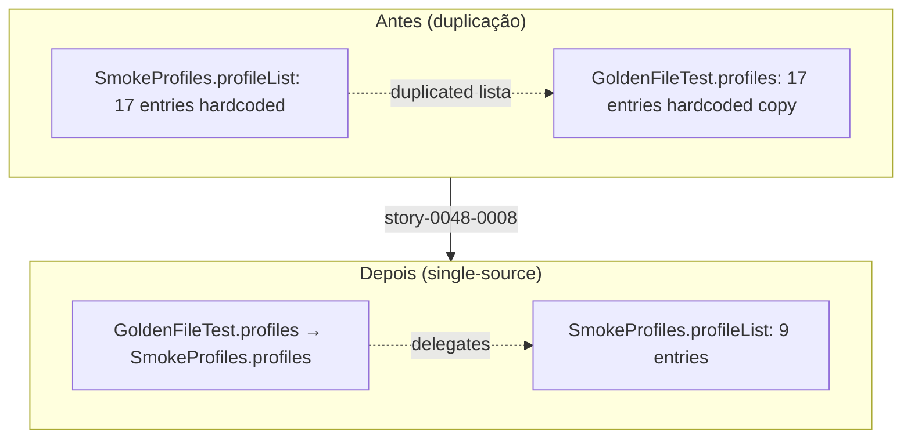

# História: Atualizar testes parametrizados (SmokeProfiles 17→9, GoldenFileTest delega, expected-artifacts.json regenerado)

**ID:** story-0048-0008
**Chave Jira:** —
**Status:** Pendente

## 1. Dependências

| Blocked By | Blocks |
| :--- | :--- |
| story-0048-0007 | story-0048-0009 |

## 2. Regras Transversais Aplicáveis

| ID | Título |
| :--- | :--- |
| RULE-048-01 | Java-Only Scope |
| RULE-048-03 | Golden Byte-for-Byte Parity (9 Java Profiles) |
| RULE-048-07 | Atomic, Reversible Commits |
| RULE-048-10 | JaCoCo Coverage Mantido |

## 3. Descrição

Como **Maintainer do gerador `ia-dev-env`**, eu quero atualizar todos os testes parametrizados sobre `SmokeProfiles` (17 perfis) para operar sobre apenas 9 perfis Java, eliminando a duplicação entre `GoldenFileTest.profiles()` e `SmokeProfiles.profileList()` (delegar ao invés de re-listar), regenerando `expected-artifacts.json` via `ExpectedArtifactsGenerator`, e restaurando `mvn verify` para verde após a janela RED inaugurada em STORY-0048-0007.

Esta é a fase GREEN do ciclo RED-GREEN inter-stories iniciado em 0007. Após 0007 ter deletado YAMLs + goldens + reduzido STACK_KEYS, os testes parametrizados ficaram RED porque ainda iteram sobre 17 entradas. Esta story reduz TODAS as matrizes parametrizadas ao subset Java (9 perfis) e, como bonus DRY, refatora `GoldenFileTest.profiles()` para delegar a `SmokeProfiles.profiles()` — eliminando uma duplicação de lista de perfis que existia desde EPIC-0027 e violava single-source-of-truth.

Os principais arquivos afetados são: (a) `SmokeProfiles.java` — lista canônica reduzida a 9 entradas; (b) `GoldenFileTest.java` — `profiles()` passa a retornar `SmokeProfiles.profiles()`; (c) `GoldenFileCoverageTest.java` — `PENDING_SMOKE_PROFILES` atualizado (remove pending refs a perfis deletados); (d) `ProfileRegistrationIntegrityTest.java` — simetria bidirecional agora sobre 9 perfis; (e) `ConfigProfilesTest.java` — parametrização reduzida; (f) `expected-artifacts.json` — regenerado via `ExpectedArtifactsGenerator`. Adicionalmente, ~20 smoke tests parametrizados em `java/src/test/java/dev/iadev/smoke/{ContentIntegrity,Pipeline,Frontmatter,AssemblerRegression,CrossProfileConsistency,etc}SmokeTest.java` precisam de ajuste mecânico (confiam na lista de `SmokeProfiles`, portanto mudança é transitiva).

A story respeita RULE-048-03: os 9 goldens Java não sofrem mutação byte-a-byte aqui; apenas código de teste e `expected-artifacts.json` (que não é golden) são alterados. Ao final, `mvn verify` volta a verde com cobertura ≥ 95% line / ≥ 90% branch — condição obrigatória para desbloquear STORY-0048-0009 (Bug A fix).

### 3.1 Trim de `SmokeProfiles`

- Lista canônica (`SmokeProfiles.profileList()` ou equivalente) reduzida de 17 para 9 entradas: `java-quarkus`, `java-spring`, `java-spring-clickhouse`, `java-spring-cqrs-es`, `java-spring-elasticsearch`, `java-spring-event-driven`, `java-spring-fintech-pci`, `java-spring-hexagonal`, `java-spring-neo4j`.
- Nenhum `@Disabled` novo introduzido.
- Método `profiles()` (MethodSource para `@ParameterizedTest`) retorna `Stream<Arguments>` com 9 entradas.

### 3.2 Refatoração de `GoldenFileTest.profiles()` → delega

- `GoldenFileTest.profiles()` hoje tem lista hardcoded com mesmo conteúdo de `SmokeProfiles.profileList()` (débito identificado pelo épico).
- Refatorar para `return SmokeProfiles.profiles();` (single-source-of-truth).
- Verificar via grep que é a única duplicação desta lista.

### 3.3 Atualização de `PENDING_SMOKE_PROFILES`

- `GoldenFileCoverageTest.PENDING_SMOKE_PROFILES` (se existir como set de pendências) é sincronizado: remove entradas para perfis deletados; o set final deve refletir somente cobertura genuína pendente em perfis Java.

### 3.4 Ajuste de `ProfileRegistrationIntegrityTest`

- A simetria bidirecional `YAML ↔ STACK_KEYS ↔ SmokeProfiles` agora sobre 9 perfis.
- Testes de borda: "YAML órfão", "STACK_KEYS órfão", "SmokeProfiles órfão" continuam passando no novo subset.

### 3.5 Trim de `ConfigProfilesTest`

- `ConfigProfilesTest` hoje parametrizado sobre 17 YAMLs — reduzido a 9.
- Asserts que referenciavam conteúdo específico de perfis não-Java (ex: "fastapi config has python version key") removidos.

### 3.6 Regeneração de `expected-artifacts.json`

- `ExpectedArtifactsGenerator` é re-executado para produzir novo `expected-artifacts.json` refletindo apenas os 9 perfis Java + seus artefatos esperados.
- Diff esperado no arquivo: remoção de ~8 blocos de perfis não-Java.

### 3.7 Ajuste transitivo dos ~20 smoke tests parametrizados

- `ContentIntegritySmokeTest`, `PipelineSmokeTest`, `FrontmatterSmokeTest`, `AssemblerRegressionSmokeTest`, `CrossProfileConsistencySmokeTest` etc.: todos dependem indiretamente de `SmokeProfiles.profiles()` como `@MethodSource` — mudança é transitiva, asserts específicas a conteúdo não-Java (se houver) são removidas.
- Testes `@Disabled` órfãos ou "skipped profile" markers existentes são reavaliados; se órfãos após 0007, são deletados.

## 3.5 Entrega de Valor

- **Redução de débito técnico:** elimina duplicação entre `GoldenFileTest.profiles()` e `SmokeProfiles.profileList()` (single-source-of-truth restaurado); sincroniza `expected-artifacts.json` com realidade; remove PENDING markers órfãos.
- **Redução de custo de manutenção:** toda adição futura de perfil Java passa a tocar 1 arquivo (`SmokeProfiles`), não 2+; `mvn verify` volta a ser autoritativo sem @Disabled ou skipped markers que mascaravam estado real.
- **Redução de tempo de build:** `mvn test` executa smoke suite parametrizada 9× por cenário ao invés de 17× — redução direta de ~47% em tempo de smoke tests, maior contribuição para meta épica de −30%.

## 4. Definições de Qualidade Locais

### DoR Local (Definition of Ready)

- [ ] STORY-0048-0007 mergeada em `develop`
- [ ] Inventário canônico de STORY-0048-0001 confirma localização exata de `ExpectedArtifactsGenerator` e formato de `expected-artifacts.json`
- [ ] Listagem dos ~20 smoke tests parametrizados catalogada (confirmado via grep `@MethodSource.*SmokeProfiles.profiles`)
- [ ] Branch `feature/story-0048-0008-trim-parameterized-tests` criada

### DoD Local (Definition of Done)

- [ ] `SmokeProfiles.profileList().size() == 9`
- [ ] `GoldenFileTest.profiles()` retorna `SmokeProfiles.profiles()` (sem lista hardcoded)
- [ ] `GoldenFileCoverageTest.PENDING_SMOKE_PROFILES` não contém perfis deletados
- [ ] `ProfileRegistrationIntegrityTest` verde sobre 9 perfis
- [ ] `ConfigProfilesTest` parametrizado sobre 9 perfis
- [ ] `expected-artifacts.json` regenerado e consistente com os 9 perfis Java
- [ ] ~20 smoke tests parametrizados passam verdes (matriz de 9×N)
- [ ] `mvn verify` verde com coverage ≥ 95% line / ≥ 90% branch
- [ ] `grep -rn "@Disabled" java/src/test` retorna 0 hits novos
- [ ] Commits atômicos por task (RULE-048-07) com escopos `refactor(task-0048-0008-NNN):` ou `test(…)`

### Global Definition of Done (DoD)

- **Cobertura:** ≥ 95% Line / ≥ 90% Branch (RULE-048-10)
- **Testes Automatizados:** nenhum teste novo; ajuste em ~25 testes existentes (5 principais + ~20 transitivos)
- **Golden Parity:** 9 goldens Java intactos byte-a-byte (RULE-048-03)
- **Documentação:** PR body descreve a mudança de delegação `GoldenFileTest.profiles()` → `SmokeProfiles.profiles()`

## 5. Contratos de Dados (Data Contract)

### 5.1 Inputs (estado anterior à story — RED window)

| Artefato | Estado |
| :--- | :--- |
| `SmokeProfiles.profileList()` | 17 entradas (RED — 8 referenciam YAMLs/goldens deletados em 0007) |
| `GoldenFileTest.profiles()` | lista hardcoded 17 entradas (duplicação) |
| `ConfigProfilesTest` | parametrizado sobre 17 YAMLs (RED) |
| `ProfileRegistrationIntegrityTest` | passa (simetria preservada em 0007) |
| `expected-artifacts.json` | 17 perfis (stale) |
| ~20 smoke tests | RED transitivos |

### 5.2 Outputs (estado após a story — GREEN)

| Artefato | Estado |
| :--- | :--- |
| `SmokeProfiles.profileList()` | 9 entradas Java |
| `GoldenFileTest.profiles()` | `return SmokeProfiles.profiles();` (delegação) |
| `ConfigProfilesTest` | parametrizado sobre 9 YAMLs Java |
| `ProfileRegistrationIntegrityTest` | verde sobre 9 perfis |
| `expected-artifacts.json` | 9 perfis Java (regenerado) |
| ~20 smoke tests | GREEN (matriz 9×N) |
| `PENDING_SMOKE_PROFILES` | sanitizado (sem refs a perfis deletados) |

### 5.3 Lista exata de arquivos modificados

| Path | Tipo de mudança |
| :--- | :--- |
| `java/src/test/java/dev/iadev/smoke/SmokeProfiles.java` | trim 17→9 |
| `java/src/test/java/dev/iadev/golden/GoldenFileTest.java` | refactor profiles() → delegate |
| `java/src/test/java/dev/iadev/smoke/GoldenFileCoverageTest.java` | atualizar PENDING_SMOKE_PROFILES |
| `java/src/test/java/dev/iadev/smoke/ProfileRegistrationIntegrityTest.java` | ajustar asserts |
| `java/src/test/java/dev/iadev/config/ConfigProfilesTest.java` | trim param source |
| `java/src/test/resources/expected-artifacts.json` | regenerado |
| `java/src/test/java/dev/iadev/smoke/{ContentIntegrity,Pipeline,Frontmatter,AssemblerRegression,CrossProfileConsistency,etc}SmokeTest.java` | ajuste transitivo |

## 6. Diagramas

### 6.1 Delegação GoldenFileTest → SmokeProfiles (antes × depois)



## 7. Critérios de Aceite (Gherkin)

```gherkin
Cenario: estado degenerado (RED) — testes param ainda falham após 0007
  DADO que STORY-0048-0007 foi mergeada
  E SmokeProfiles.profileList ainda retorna 17 entradas
  QUANDO mvn test -Dtest=GoldenFileTest roda
  ENTAO o teste falha apontando 8 perfis sem goldens (confirmação da janela RED)

Cenario: happy path — SmokeProfiles trimado + delegação GoldenFileTest
  DADO que SmokeProfiles.profileList foi reduzida a 9 entradas Java
  E GoldenFileTest.profiles() passou a delegar a SmokeProfiles.profiles()
  E expected-artifacts.json foi regenerado
  QUANDO mvn verify roda
  ENTAO build verde
  E coverage ≥ 95% line / ≥ 90% branch
  E GoldenFileTest executa exatamente 9 perfis

Cenario: erro — delegação quebra se SmokeProfiles.profiles() não existir
  DADO que GoldenFileTest.profiles() retorna SmokeProfiles.profiles()
  E SmokeProfiles.profiles() está ausente ou retorna Stream vazio
  QUANDO mvn test -Dtest=GoldenFileTest roda
  ENTAO o teste falha com mensagem clara apontando SmokeProfiles
  E nunca NPE silencioso

Cenario: boundary — nenhum @Disabled novo, PENDING_SMOKE_PROFILES sanitizado
  DADO que a story foi concluída
  QUANDO grep -rn "@Disabled" java/src/test roda
  ENTAO retorna 0 hits novos (só hits pré-existentes aceitáveis)
  E PENDING_SMOKE_PROFILES não referencia perfis deletados em 0007
```

### 7.1 Scenario Ordering (TPP)

> Degenerate (RED window) → happy (trim+delegate GREEN) → error (delegação malformada) → boundary (@Disabled invariant).

### 7.2 Mandatory Scenario Categories

- [x] Degenerate cases (RED window from 0007)
- [x] Happy path (GREEN após trim + delegate)
- [x] Error paths (delegation malformed)
- [x] Boundary values (zero @Disabled, PENDING sanitizado)

### 7.3 TDD Implementation Notes

- **Outer loop (AT)**: `mvn verify` é o acceptance — quando volta a verde, a story está GREEN.
- **Inner loop (TPP)**: trim `SmokeProfiles` primeiro (mais básico), depois `GoldenFileTest` delega, depois ajustes transitivos, finalmente regen `expected-artifacts.json`.
- Refactoring `GoldenFileTest.profiles()` → delegação é refactor legítimo (não muda comportamento observável dos tests, apenas elimina duplicação).

## 8. Tasks

### TASK-0048-0008-001: Reduzir SmokeProfiles de 17 para 9 entradas Java

- **Layer:** Test
- **Test Type:** Unit
- **Size:** S
- **Dependencies:** —
- **Branch:** `refactor/task-0048-0008-001-smoke-profiles-trim`
- **Testability:** Domain + UnitTest
- **Files:**
  - `java/src/test/java/dev/iadev/smoke/SmokeProfiles.java`
- **Acceptance Criteria:**
  - [ ] `SmokeProfiles.profileList().size() == 9` (todas `java-*`)
  - [ ] Lista bate byte-a-byte com RULE-048-03 (9 perfis listados)
  - [ ] `mvn test -Dtest=SmokeProfilesTest` verde (se existir teste sobre SmokeProfiles próprio)

### TASK-0048-0008-002: Refatorar GoldenFileTest.profiles() para delegar a SmokeProfiles.profiles()

- **Layer:** Test
- **Test Type:** Unit
- **Size:** S
- **Dependencies:** TASK-0048-0008-001
- **Branch:** `refactor/task-0048-0008-002-golden-file-test-delegate`
- **Testability:** Domain + UnitTest
- **Files:**
  - `java/src/test/java/dev/iadev/golden/GoldenFileTest.java`
- **Acceptance Criteria:**
  - [ ] `GoldenFileTest.profiles()` contém 1 linha: `return SmokeProfiles.profiles();`
  - [ ] Nenhuma lista hardcoded de perfis remanesce em `GoldenFileTest.java`
  - [ ] `mvn test -Dtest=GoldenFileTest` verde com 9 execuções parametrizadas
  - [ ] Golden parity preservada byte-a-byte (RULE-048-03)

### TASK-0048-0008-003: Trim ConfigProfilesTest

- **Layer:** Test
- **Test Type:** Unit
- **Size:** S
- **Dependencies:** TASK-0048-0008-001
- **Branch:** `refactor/task-0048-0008-003-config-profiles-test-trim`
- **Testability:** Domain + UnitTest
- **Files:**
  - `java/src/test/java/dev/iadev/config/ConfigProfilesTest.java`
- **Acceptance Criteria:**
  - [ ] Parametrização reduzida a 9 YAMLs Java
  - [ ] Asserts específicas a perfis não-Java removidas
  - [ ] `mvn test -Dtest=ConfigProfilesTest` verde

### TASK-0048-0008-004: Atualizar simetria — PENDING_SMOKE_PROFILES + ProfileRegistrationIntegrityTest + smoke tests transitivos

- **Layer:** Test
- **Test Type:** Unit + Smoke
- **Size:** M
- **Dependencies:** TASK-0048-0008-001, TASK-0048-0008-002, TASK-0048-0008-003
- **Branch:** `test/task-0048-0008-004-symmetry-smoke-trim`
- **Testability:** Domain + UnitTest
- **Files:**
  - `java/src/test/java/dev/iadev/smoke/GoldenFileCoverageTest.java`
  - `java/src/test/java/dev/iadev/smoke/ProfileRegistrationIntegrityTest.java`
  - `java/src/test/java/dev/iadev/smoke/ContentIntegritySmokeTest.java`
  - `java/src/test/java/dev/iadev/smoke/PipelineSmokeTest.java`
  - `java/src/test/java/dev/iadev/smoke/FrontmatterSmokeTest.java`
  - `java/src/test/java/dev/iadev/smoke/AssemblerRegressionSmokeTest.java`
  - `java/src/test/java/dev/iadev/smoke/CrossProfileConsistencySmokeTest.java`
  - (demais smoke tests parametrizados conforme inventário)
- **Acceptance Criteria:**
  - [ ] `PENDING_SMOKE_PROFILES` sanitizado (sem refs a perfis deletados)
  - [ ] `ProfileRegistrationIntegrityTest` verde sobre 9 perfis
  - [ ] ~20 smoke tests parametrizados verdes (matriz 9×N)
  - [ ] Nenhum `@Disabled` órfão novo introduzido

### TASK-0048-0008-005: Regenerar expected-artifacts.json via ExpectedArtifactsGenerator

- **Layer:** Test
- **Test Type:** Verification
- **Size:** S
- **Dependencies:** TASK-0048-0008-004
- **Branch:** `chore/task-0048-0008-005-regen-expected-artifacts`
- **Testability:** Config + VerificationTest
- **Files:**
  - `java/src/test/resources/expected-artifacts.json`
- **Acceptance Criteria:**
  - [ ] `ExpectedArtifactsGenerator` executado; diff mostra apenas remoção dos 8 blocos não-Java
  - [ ] JSON válido (parseável); apenas 9 perfis Java presentes
  - [ ] `mvn verify` verde globalmente com coverage ≥ 95% line / ≥ 90% branch (RULE-048-10)
  - [ ] Commit conventional `chore(task-0048-0008-005): regenerate expected-artifacts.json for 9 java profiles`
