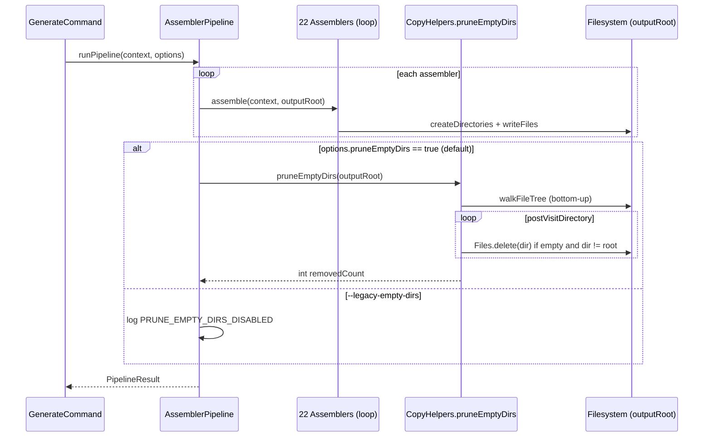

# História: Bug A — OutputDirectoryIntegrityTest (RED) + fix estrutural em CopyHelpers/AssemblerPipeline (GREEN) + regenerar 9 goldens Java

**ID:** story-0048-0009
**Chave Jira:** —
**Status:** Concluída

## 1. Dependências

| Blocked By | Blocks |
| :--- | :--- |
| story-0048-0008 | story-0048-0012 |

## 2. Regras Transversais Aplicáveis

> Referência às regras definidas no Épico (seção 4). Listar apenas as regras que impactam esta história.

| ID | Título |
| :--- | :--- |
| RULE-048-03 | Golden Byte-for-Byte Parity (9 Java Profiles) |
| RULE-048-04 | Zero Empty Directories |
| RULE-048-07 | Atomic, Reversible Commits |
| RULE-048-09 | TDD Red-Green-Refactor |
| RULE-048-10 | JaCoCo Coverage Mantido |

## 3. Descrição

Como **Desenvolvedor** do gerador `ia-dev-env`, eu quero fechar o **Bug A (pastas vazias no output real da CLI)** via fix estrutural em `CopyHelpers` + hook `pruneEmptyDirs` pós-assembly em `AssemblerPipeline`, garantindo que nenhum perfil gerado (qualquer plataforma, qualquer framework Java) produza diretórios vazios no output final — enforcement via invariante `OutputDirectoryIntegrityTest` parametrizado nos 9 perfis Java.

O Bug A foi confirmado em STORY-0048-0001 pelo autor: `ia-dev-env generate` cria diretórios como `.github/`, `.codex/`, `.cursor/` vazios no projeto gerado. A raiz provável está em `CopyHelpers.copyDirectory#preVisitDirectory` (e adjacentes em `CopyTreeWalker`) que chama `Files.createDirectories(dest)` antes de saber se haverá conteúdo útil no destino — quando o filtro de plataforma ou a lógica de skip descarta todos os arquivos do diretório, a casca permanece. A consequência é um output "sujo" que polui a raiz do projeto gerado e quebra o contrato tácito "um gerador determinístico só cria o que é útil".

Esta é uma **história de bug fix sob RULE-048-09 (TDD RED-first)**. A ordem dos commits é obrigatória e visível no git log: (1) commit de teste `OutputDirectoryIntegrityTest` que FALHA no estado atual (RED — prova do bug); (2) commit de teste unit `CopyHelpersPruneEmptyDirsTest` cobrindo o helper novo em isolamento (TPP); (3) commit do fix estrutural + chamada em `AssemblerPipeline.runPipeline` que torna os testes GREEN; (4) commit de chore que regenera os 9 goldens Java (único diff esperado: remoção de entradas de dirs vazios — se colaterais aparecerem, investigar se o fix está estreito demais ou abrangente demais ANTES de aceitar). Opção B (post-process prune via `Files.walkFileTree` + `postVisitDirectory` + `Files.delete` quando vazio) é preferida sobre Opção A (2-pass walk), por ser modular, idempotente e isolável em um único helper testável; Opção A fica documentada como alternativa no PR body.

### 3.1 Teste invariante RED-first (outer loop)

- Novo arquivo `java/src/test/java/dev/iadev/pipeline/OutputDirectoryIntegrityTest.java` parametrizado via `@MethodSource` nos 9 perfis Java (delegando a `SmokeProfiles.profileList()` — não duplicar lista).
- Para cada perfil: executa o pipeline em `@TempDir`, depois faz bottom-up walk via `Files.walkFileTree` e afirma que **nenhum** diretório é vazio (definição RULE-048-04: sem arquivos regulares próprios E sem descendentes contendo arquivos regulares).
- Mensagem de falha DEVE listar todos os diretórios vazios encontrados (não apenas o primeiro) para facilitar diagnóstico.
- Commitado ANTES do fix (commit com tag `[RED]` no body, ref RULE-048-09).

### 3.2 Helper `pruneEmptyDirs` em CopyHelpers (inner loop)

- Novo método estático `public static int pruneEmptyDirs(Path root) throws IOException`; retorna quantidade de dirs removidos (útil para log + assert em unit test).
- Implementação: `Files.walkFileTree` com `SimpleFileVisitor` sobrescrevendo apenas `postVisitDirectory(dir, exc)` — se `exc != null`, rethrow; senão testar `try (DirectoryStream ds = Files.newDirectoryStream(dir)) { empty = !ds.iterator().hasNext(); }` e, se vazio E `dir != root`, chamar `Files.delete(dir)` e incrementar contador.
- Invariante: `root` (o `outputRoot` do pipeline) **nunca** é removido, mesmo vazio.
- Idempotente: chamar 2 vezes em sequência → segunda chamada retorna 0.
- Teste unit `CopyHelpersPruneEmptyDirsTest` cobre (TPP): degenerate (dir só com root, já vazio na raiz), happy (1 dir vazio removido), edge (dirs vazios aninhados removidos bottom-up), boundary (root nunca removido), idempotency (2 chamadas).

### 3.3 Hook `pruneEmptyDirs` em AssemblerPipeline

- Em `AssemblerPipeline.runPipeline(...)`, após todos os assemblers rodarem e antes do retorno, chamar `CopyHelpers.pruneEmptyDirs(outputRoot)`.
- Opt-out via `PipelineOptions.pruneEmptyDirs(boolean)` (default `true`) — feature flag de rollback documentada na spec §9. CLI flag `--legacy-empty-dirs` mapeia para `pruneEmptyDirs(false)`.
- Quando `pruneEmptyDirs == false`, pular completamente (log `PRUNE_EMPTY_DIRS_DISABLED` em nível INFO com correlation id).

### 3.4 Regeneração dos 9 goldens Java

- Pré-condição: commits de RED (teste falhando) + GREEN (fix + unit test) já mergeados localmente; baseline verde em `mvn test`.
- Executar `GoldenFileRegenerator` para os 9 perfis Java via `mvn process-resources` + comando documentado no memory (ref: `reference_golden_regen_command.md`).
- Inspecionar `git diff --stat` e `git diff --summary` dos goldens: diff esperado = apenas **remoção** de diretórios vazios (sem modificação de arquivos existentes, sem adição de arquivos).
- Se diff contiver mudanças inesperadas (ex: remoção de arquivo sinalizador tipo `.gitkeep` — mapear no PR body com justificativa) OU se algum golden ficar inalterado (sinal de que não havia dir vazio naquele golden — OK, documentar no PR body), investigar ANTES de commitar.
- Commit separado (`chore(task-0048-0009-004): regenerate 9 Java goldens post Bug A fix`) para rollback granular.

## 3.5 Entrega de Valor

- **Valor Principal:** invariante "zero empty directories" ativada no pipeline; output de qualquer projeto Java gerado fica limpo; contrato do gerador reforçado e verificável via teste automatizado em cada PR futuro.
- **Métrica de Sucesso:** `OutputDirectoryIntegrityTest` verde nos 9 perfis; `CopyHelpersPruneEmptyDirsTest` verde com ≥95% line / ≥90% branch (RULE-048-10); git log mostra ordem RED → GREEN → REFACTOR; `find <output> -type d -empty` = 0 em `Epic0048EndToEndTest` (STORY-0048-0012).
- **Impacto no Negócio:** fecha Bug A confirmado pelo autor; desbloqueia STORY-0048-0012 (E2E smoke final valida A+B juntos); elimina ruído visual no output que afetava percepção de qualidade do gerador.

## 4. Definições de Qualidade Locais

### DoR Local (Definition of Ready)

- [ ] STORY-0048-0008 mergeada em `develop` (matrizes de teste já reduzidas a 9 perfis)
- [ ] `repro-bug-a.sh` de STORY-0048-0001 disponível e confirmado reproduzindo o bug no workspace atual
- [ ] Decisão Opção B (post-process prune) confirmada no PR body da task RED (Opção A como alternativa documentada)
- [ ] Baseline verde em `develop`: `mvn clean verify` passa com coverage ≥95%/90%

### DoD Local (Definition of Done)

- [ ] `OutputDirectoryIntegrityTest` criado e commitado como RED (teste falha no estado pré-fix, visível no git log)
- [ ] `CopyHelpersPruneEmptyDirsTest` verde com ≥95% line / ≥90% branch
- [ ] `CopyHelpers.pruneEmptyDirs` implementado; idempotente; nunca deleta `root`
- [ ] `AssemblerPipeline.runPipeline` chama `pruneEmptyDirs` pós-assembly; opt-out via `PipelineOptions.pruneEmptyDirs(false)`
- [ ] `OutputDirectoryIntegrityTest` verde nos 9 perfis Java após fix
- [ ] 9 goldens Java regenerados; diff = apenas remoção de dirs vazios (ou zero mudança, documentado no PR body)
- [ ] `mvn verify` verde ao final
- [ ] Pelo menos 1 teste automatizado (unit + integration) validando o critério de aceite principal — já coberto por `OutputDirectoryIntegrityTest` + `CopyHelpersPruneEmptyDirsTest`
- [ ] Smoke test passando (`mvn verify` em todos os 9 perfis)
- [ ] 4 commits atômicos em ordem RED → unit → GREEN(fix+hook) → chore(regen), um commit por task (RULE-048-07)

### Global Definition of Done (DoD)

> Copiar do Épico. Mantido aqui para referência rápida durante code review.

- **Cobertura:** ≥95% line / ≥90% branch (JaCoCo) — novo `pruneEmptyDirs` e testes novos NÃO podem reduzir o global.
- **Testes Automatizados:** unit (`CopyHelpersPruneEmptyDirsTest`) + integration (`OutputDirectoryIntegrityTest` parametrizado 9 perfis).
- **Relatório de Cobertura:** JaCoCo HTML em `java/target/site/jacoco/`.
- **Documentação:** PR body lista diff esperado dos goldens; feature flag `--legacy-empty-dirs` documentada em `PipelineOptions` javadoc.
- **Persistência:** N/A.
- **Performance:** `mvn test` não regride > 5% (prune adiciona 1 walk O(N) nos 9 perfis).

## 5. Contratos de Dados (Data Contract)

Esta story NÃO introduz request/response de API — é mudança interna de pipeline. Contrato de I/O é no nível de filesystem e código Java.

### 5.1 INPUTS (arquivos lidos / pré-condições)

| Artefato | Tipo | Uso |
| :--- | :--- | :--- |
| `java/src/main/java/dev/iadev/application/assembler/CopyHelpers.java` | Source file | Adicionar `pruneEmptyDirs` |
| `java/src/main/java/dev/iadev/application/assembler/AssemblerPipeline.java` | Source file | Adicionar hook pós-assembly |
| `java/src/test/resources/golden/java-*/` | 9 golden dirs | Comparação byte-a-byte pós-regen |
| `java/src/test/java/dev/iadev/smoke/SmokeProfiles.java` | Source file | Fonte de lista de perfis parametrizada (delegada, não duplicada) |

### 5.2 OUTPUTS (artefatos produzidos / pós-condições verificáveis)

| Artefato | Tipo | Verificação |
| :--- | :--- | :--- |
| `CopyHelpers.java` modificado com `pruneEmptyDirs` | Source | `grep -q 'pruneEmptyDirs' CopyHelpers.java` retorna 0 |
| `AssemblerPipeline.java` modificado com chamada pós-assembly | Source | `grep -q 'pruneEmptyDirs' AssemblerPipeline.java` retorna 0 |
| `java/src/test/java/dev/iadev/pipeline/OutputDirectoryIntegrityTest.java` | Test | `mvn test -Dtest=OutputDirectoryIntegrityTest` exit 0 |
| `java/src/test/java/dev/iadev/application/assembler/CopyHelpersPruneEmptyDirsTest.java` | Test | `mvn test -Dtest=CopyHelpersPruneEmptyDirsTest` exit 0 |
| 9 goldens Java regenerados | Resources | `git diff --stat` mostra apenas remoção de dirs vazios |

### 5.3 Error Codes Mapeados

| Condição | Exceção / Código | Mensagem |
| :--- | :--- | :--- |
| IO error durante prune | `UncheckedIOException` | `"Failed to prune empty dirs under: <root>"` (inclui path) |
| `root` inválido (não existe) | `IllegalArgumentException` | `"pruneEmptyDirs: root does not exist or is not a directory: <root>"` |

### 5.4 Event Schema

N/A — não event-driven.

## 6. Diagramas

### 6.1 Fluxo do pipeline com pruneEmptyDirs pós-assembly



## 7. Critérios de Aceite (Gherkin)

```gherkin
Cenario: REPRO RED — pipeline atual gera output com diretório vazio (pré-fix)
  DADO que estou no commit imediatamente anterior ao fix de Bug A
  QUANDO executo o AssemblerPipeline em um @TempDir para o perfil java-spring
  ENTÃO pelo menos 1 diretório sob outputRoot é vazio
  E OutputDirectoryIntegrityTest falha listando os diretórios vazios encontrados

Cenario: HAPPY — após o fix, output não contém nenhum diretório vazio
  DADO que o commit do fix (pruneEmptyDirs + hook AssemblerPipeline) está aplicado
  QUANDO executo o AssemblerPipeline em um @TempDir para qualquer um dos 9 perfis Java
  ENTÃO OutputDirectoryIntegrityTest passa
  E Files.walk(outputRoot) não encontra diretório vazio

Cenario: EDGE — diretórios vazios aninhados são removidos bottom-up
  DADO um outputRoot contendo a/b/c/ onde c, b e a não têm arquivos regulares
  QUANDO CopyHelpers.pruneEmptyDirs(outputRoot) é chamado
  ENTÃO c, b e a são removidos
  E outputRoot permanece

Cenario: BOUNDARY — outputRoot vazio nunca é deletado
  DADO um outputRoot que é vazio (nenhum arquivo, nenhum subdir)
  QUANDO CopyHelpers.pruneEmptyDirs(outputRoot) é chamado
  ENTÃO outputRoot continua existindo
  E o contador de dirs removidos é 0

Cenario: REGRESSION — 9 goldens Java mantêm parity byte-for-byte (exceto remoção de dirs vazios)
  DADO que os 9 goldens Java foram regenerados via GoldenFileRegenerator
  QUANDO comparo git diff entre HEAD~1 e HEAD nos paths golden/java-*/
  ENTÃO o diff contém exclusivamente remoção de entradas de diretórios vazios
  E nenhum arquivo existente tem seu conteúdo modificado
  E nenhum arquivo novo é adicionado
```

### 7.1 Scenario Ordering (TPP)

> Ordem: degenerate (REPRO RED) → happy (fix aplicado) → edge (aninhamento) → boundary (root preservado) → regression (goldens).

### 7.2 Mandatory Scenario Categories

- [x] Degenerate cases (REPRO RED — teste falha no estado atual do código)
- [x] Happy path (fix aplicado, 9 perfis passam)
- [x] Error paths (EDGE com aninhamento; BOUNDARY com root vazio)
- [x] Boundary values (outputRoot vazio nunca deletado)

### 7.3 TDD Implementation Notes

- **Double-Loop TDD**: `OutputDirectoryIntegrityTest` (cenário REPRO RED + HAPPY) é o outer loop. `CopyHelpersPruneEmptyDirsTest` (EDGE + BOUNDARY + idempotency) é o inner loop, dirigido por TPP.
- **RULE-048-09 explícita**: o commit do teste RED DEVE preceder o commit do fix no git log. Reviewer valida via `git log --oneline plans/epic-0048/story-0048-0009.md` no PR.
- **TPP**: degenerate (dir vazio único) → happy (dir vazio removido) → edge (aninhado) → boundary (root).

## 8. Tasks

### TASK-0048-0009-001: OutputDirectoryIntegrityTest RED (parametrized 9 perfis Java)

- **Layer:** Test
- **Test Type:** Integration
- **Size:** S
- **Dependencies:** —
- **Branch:** `feat/task-0048-0009-001-output-dir-integrity-test-red`
- **Testability:** Migration + Smoke (acceptance test outer loop)
- **Files:**
  - `java/src/test/java/dev/iadev/pipeline/OutputDirectoryIntegrityTest.java`
- **Acceptance Criteria:**
  - [ ] Teste parametrizado nos 9 perfis Java via `SmokeProfiles.profileList()` (delegado, não duplicado)
  - [ ] Commit falha `mvn test -Dtest=OutputDirectoryIntegrityTest` (RED — visível no git log)
  - [ ] Mensagem de falha lista TODOS os dirs vazios encontrados (não apenas o primeiro)
  - [ ] Commit body inclui tag `[RED]` e referência a RULE-048-09

### TASK-0048-0009-002: CopyHelpersPruneEmptyDirsTest (unit, TPP)

- **Layer:** Test
- **Test Type:** Unit
- **Size:** S
- **Dependencies:** TASK-0048-0009-001
- **Branch:** `feat/task-0048-0009-002-copy-helpers-prune-empty-dirs-test`
- **Testability:** Domain + UnitTest
- **Files:**
  - `java/src/test/java/dev/iadev/application/assembler/CopyHelpersPruneEmptyDirsTest.java`
- **Acceptance Criteria:**
  - [ ] 5 cenários TPP: degenerate (root vazio), happy (1 dir vazio), edge (aninhamento), boundary (root nunca removido), idempotency (2 chamadas)
  - [ ] Asserts específicos (não `isNotNull` sozinho): contador de dirs removidos, existência/ausência de paths específicos
  - [ ] Ainda RED (pruneEmptyDirs não existe); teste falha a compilar ou a executar

### TASK-0048-0009-003: Fix CopyHelpers.pruneEmptyDirs + hook em AssemblerPipeline

- **Layer:** Domain (util) + Application (pipeline)
- **Test Type:** Unit (já coberto pela 002) + Integration (já coberto pela 001)
- **Size:** M
- **Dependencies:** TASK-0048-0009-001, TASK-0048-0009-002
- **Branch:** `feat/task-0048-0009-003-prune-empty-dirs-fix`
- **Testability:** Domain + UnitTest (refactor produtivo, sem adicionar teste)
- **Files:**
  - `java/src/main/java/dev/iadev/application/assembler/CopyHelpers.java`
  - `java/src/main/java/dev/iadev/application/assembler/AssemblerPipeline.java`
  - `java/src/main/java/dev/iadev/application/assembler/PipelineOptions.java` (nova flag `pruneEmptyDirs` default true)
- **Acceptance Criteria:**
  - [ ] `CopyHelpers.pruneEmptyDirs(Path root)` implementado via `Files.walkFileTree` + `postVisitDirectory`
  - [ ] `AssemblerPipeline.runPipeline` chama `pruneEmptyDirs(outputRoot)` após loop de assemblers quando `options.pruneEmptyDirs()`
  - [ ] `OutputDirectoryIntegrityTest` e `CopyHelpersPruneEmptyDirsTest` ambos verdes (GREEN)
  - [ ] Commit body inclui tag `[GREEN]`

### TASK-0048-0009-004: Regenerar 9 goldens Java + validar diff

- **Layer:** Test (resources)
- **Test Type:** Smoke
- **Size:** M
- **Dependencies:** TASK-0048-0009-003
- **Branch:** `chore/task-0048-0009-004-regenerate-java-goldens-bug-a`
- **Testability:** Migration + Smoke
- **Files:**
  - `java/src/test/resources/golden/java-quarkus/**` (apenas remoções esperadas)
  - `java/src/test/resources/golden/java-spring/**`
  - `java/src/test/resources/golden/java-spring-clickhouse/**`
  - `java/src/test/resources/golden/java-spring-cqrs-es/**`
  - `java/src/test/resources/golden/java-spring-elasticsearch/**`
  - `java/src/test/resources/golden/java-spring-event-driven/**`
  - `java/src/test/resources/golden/java-spring-fintech-pci/**`
  - `java/src/test/resources/golden/java-spring-hexagonal/**`
  - `java/src/test/resources/golden/java-spring-neo4j/**`
- **Acceptance Criteria:**
  - [ ] `mvn process-resources` executado antes do `GoldenFileRegenerator`
  - [ ] `git diff --summary` nos goldens contém apenas entradas de tipo "delete" de dirs vazios
  - [ ] `mvn verify` verde (GoldenFileTest passa byte-for-byte nos 9)
  - [ ] PR body lista perfis afetados (quantos dirs removidos por perfil) — se algum golden inalterado, justificar

### TASK-0048-0009-005: Feature flag `--legacy-empty-dirs` (rollback opt-out)

- **Layer:** Config (CLI)
- **Test Type:** Verification
- **Size:** S
- **Dependencies:** TASK-0048-0009-003
- **Branch:** `feat/task-0048-0009-005-legacy-empty-dirs-flag`
- **Testability:** Config + VerificationTest
- **Files:**
  - `java/src/main/java/dev/iadev/cli/GenerateCommand.java`
  - `java/src/test/java/dev/iadev/cli/GenerateCommandLegacyEmptyDirsTest.java`
- **Acceptance Criteria:**
  - [ ] Flag picocli `--legacy-empty-dirs` mapeia para `PipelineOptions.pruneEmptyDirs(false)`
  - [ ] Default comportamental é `pruneEmptyDirs(true)` (backward compat novo)
  - [ ] Teste verifica que com `--legacy-empty-dirs`, dirs vazios NÃO são removidos (volta ao comportamento v3.x)
  - [ ] Log `PRUNE_EMPTY_DIRS_DISABLED` em nível INFO quando flag ativa
