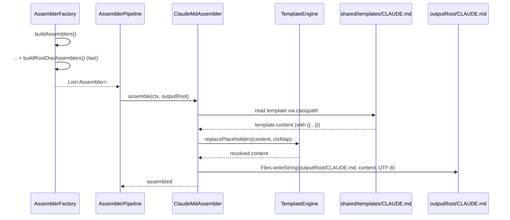

# História: Bug B — ClaudeMdAssembler novo + registrar em AssemblerFactory (grupo buildRootDocAssemblers) + atualizar 9 goldens Java com CLAUDE.md

**ID:** story-0048-0011
**Chave Jira:** —
**Status:** Concluída

## 1. Dependências

| Blocked By | Blocks |
| :--- | :--- |
| story-0048-0010, story-0048-0008 | story-0048-0012 |

## 2. Regras Transversais Aplicáveis

> Referência às regras definidas no Épico (seção 4). Listar apenas as regras que impactam esta história.

| ID | Título |
| :--- | :--- |
| RULE-048-03 | Golden Byte-for-Byte Parity (9 Java Profiles) |
| RULE-048-05 | CLAUDE.md é Root-File Obrigatório |
| RULE-048-07 | Atomic, Reversible Commits |
| RULE-048-09 | TDD Red-Green-Refactor |
| RULE-048-10 | JaCoCo Coverage Mantido |

## 3. Descrição

Como **Desenvolvedor** do gerador `ia-dev-env`, eu quero fechar o **Bug B (CLAUDE.md raiz não é gerado)** criando um novo `ClaudeMdAssembler` dedicado (single-responsibility per ADR-0048-B) que consome o template Pebble `shared/templates/CLAUDE.md` (criado em STORY-0048-0010) e o registra em `AssemblerFactory` como novo grupo `buildRootDocAssemblers` (posição: último grupo, após `buildCicdAssemblers`), garantindo que todo projeto Claude-Code Java gerado contenha `CLAUDE.md` na raiz com placeholders resolvidos.

O Bug B foi confirmado em STORY-0048-0001: `FileCategorizer.isRootFile` (`java/src/main/java/dev/iadev/cli/FileCategorizer.java:88`) reconhece `CLAUDE.md` como root-file, mas nenhum assembler produz o arquivo. Como consequência, projetos gerados ficam sem o sumário executivo auto-loaded que é contrato padrão de projetos Claude-Code (ref: CLAUDE.md raiz deste próprio repo, linhas 13-14: "The `CLAUDE.md` file at the project root provides an executive summary loaded automatically in EVERY conversation"). A decisão arquitetural em ADR-0048-B (STORY-0048-0002) confirmou: assembler dedicado, NÃO extensão de `ReadmeAssembler` (que escreve em `AssemblerTarget.CLAUDE` para `.claude/README.md` — alvo diferente).

Esta é uma **história de bug fix sob RULE-048-09 (TDD RED-first)**. Ordem de commits visível no git log: (1) `ClaudeMdRootPresenceTest` parametrizado 9 perfis falha por `CLAUDE.md` ausente (RED — prova do bug); (2) `ClaudeMdAssemblerTest` unit cobre o assembler em isolamento (TPP); (3) implementação do `ClaudeMdAssembler` + registro em `AssemblerFactory.buildRootDocAssemblers()` novo método, chamado por último em `buildAssemblers()` (torna os testes GREEN); (4) regeneração dos 9 goldens Java — diff esperado é **exclusivamente adição** de `CLAUDE.md` em cada golden (1 arquivo novo por perfil; se algum arquivo existente mudar, investigar). Commitar em 3 PRs menores (3 goldens por PR) para rollback granular.

### 3.1 Teste de presença RED-first (outer loop)

- Novo arquivo `java/src/test/java/dev/iadev/application/assembler/ClaudeMdRootPresenceTest.java` parametrizado 9 perfis Java via `SmokeProfiles.profileList()` (sem duplicação).
- Para cada perfil: executa o pipeline em `@TempDir`, afirma que `outputRoot/CLAUDE.md` existe, é um arquivo regular, tem tamanho > 100 bytes (sanity), e não contém placeholders não-resolvidos (`{{` não presente no conteúdo).
- Commit com tag `[RED]`, precede a implementação do assembler (visível no git log).

### 3.2 ClaudeMdAssembler (Domain/Application — implementa Assembler port)

- Novo arquivo `java/src/main/java/dev/iadev/application/assembler/ClaudeMdAssembler.java`.
- Assinatura: `public final class ClaudeMdAssembler implements Assembler`.
- Propriedades:
  - `target()` retorna `AssemblerTarget.ROOT` (escreve em `outputRoot`, não em `outputRoot/.claude/`)
  - `platforms()` retorna `Set.of(Platform.CLAUDE_CODE)` — outros platforms (se existirem no futuro) não recebem CLAUDE.md
- Comportamento: `assemble(GenerationContext ctx, Path outputRoot)`:
  1. Lê template de `shared/templates/CLAUDE.md` via classpath
  2. Constrói Map<String,Object> com placeholders: `PROJECT_NAME`, `LANGUAGE`, `FRAMEWORK`, `ARCHITECTURE`, `DATABASES`, `INTERFACE_TYPES`, `BUILD_COMMAND`, `TEST_COMMAND`
  3. Invoca `TemplateEngine.replacePlaceholders(content, context)`
  4. Escreve em `outputRoot/CLAUDE.md` via `Files.writeString` UTF-8
- Erros: contexto com campos nulos obrigatórios → `IllegalArgumentException` com mensagem clara (nunca NPE).
- Teste unit `ClaudeMdAssemblerTest` cobre TPP: degenerate (context vazio → erro claro), happy (contexto Spring → conteúdo com placeholders resolvidos), edge (contexto Quarkus → build/test commands refletem gradle/mvn corretamente), boundary (platform=CLAUDE_CODE selecionada; se diferente, skip), error (template ausente → UncheckedIOException com path).

### 3.3 Registro em AssemblerFactory.buildRootDocAssemblers

- Modificar `java/src/main/java/dev/iadev/application/assembler/AssemblerFactory.java`.
- Adicionar método `private static List<Assembler> buildRootDocAssemblers()` retornando `List.of(new ClaudeMdAssembler(...))`.
- Em `buildAssemblers()` (o factory principal), adicionar chamada a `buildRootDocAssemblers()` como **último** bloco (após `buildCicdAssemblers()` ou o último grupo atual) — posição é importante porque o prune de dirs vazios (STORY-0048-0009) roda APÓS todos os assemblers, e CLAUDE.md adiciona arquivo na raiz (não cria dir vazio, mas marca a raiz como "not empty").
- Feature flag opt-out: `PipelineOptions.generateClaudeMd(boolean)` default `true`; CLI flag `--no-claude-md` mapeia para `false`. Quando `false`, `buildRootDocAssemblers()` retorna `List.of()`.

### 3.4 Regeneração controlada dos 9 goldens Java

- Após GREEN dos testes, executar `GoldenFileRegenerator` para 9 perfis Java.
- Diff esperado: **exclusivamente adição** de `CLAUDE.md` (1 arquivo novo por golden). NENHUM arquivo existente modificado, NENHUM arquivo removido.
- Se qualquer arquivo existente sofrer mudança → investigar se o placeholder `PROJECT_NAME` ou similar está vazando em outro assembler (scope creep); reverter e ajustar o escopo do `ClaudeMdAssembler` ANTES de commitar.
- Commitar em **3 PRs pequenos** (3 goldens por PR) para rollback granular (spring/spring-clickhouse/spring-cqrs-es / spring-elasticsearch/spring-event-driven/spring-fintech-pci / spring-hexagonal/spring-neo4j/quarkus).

## 3.5 Entrega de Valor

- **Valor Principal:** todo projeto Java gerado passa a ter `CLAUDE.md` na raiz — contrato Claude-Code cumprido; sumário executivo auto-loaded disponível para todas as conversas do Claude Code no projeto gerado.
- **Métrica de Sucesso:** `ClaudeMdRootPresenceTest` verde nos 9 perfis; `ClaudeMdAssemblerTest` verde com ≥95% line / ≥90% branch; git log mostra ordem RED → GREEN; 9 goldens contêm `CLAUDE.md` com placeholders resolvidos; `Epic0048EndToEndTest` (STORY-0048-0012) valida no CLI real.
- **Impacto no Negócio:** fecha Bug B confirmado pelo autor; eleva qualidade do gerador ao contrato padrão de projetos Claude-Code; desbloqueia STORY-0048-0012 (E2E smoke final valida A+B juntos) e STORY-0048-0013 (release v4.0.0 pode listar "CLAUDE.md generation" em CHANGELOG Added).

## 4. Definições de Qualidade Locais

### DoR Local (Definition of Ready)

- [ ] STORY-0048-0010 mergeada (template Pebble `shared/templates/CLAUDE.md` existe e é parseável via `ClaudeMdTemplateSyntaxTest`)
- [ ] STORY-0048-0008 mergeada (matrizes de teste reduzidas a 9 perfis; `SmokeProfiles.profileList()` canônico)
- [ ] ADR-0048-B mergeada em `develop` (decisão: assembler dedicado, não extensão de `ReadmeAssembler`)
- [ ] `AssemblerFactory` inspecionado: identificar o último grupo atual (`buildCicdAssemblers` ou equivalente) para inserir `buildRootDocAssemblers` logo após
- [ ] Baseline verde em `develop`: `mvn clean verify` passa

### DoD Local (Definition of Done)

- [ ] `ClaudeMdRootPresenceTest` criado e commitado como RED (teste falha no estado pré-implementação; visível no git log)
- [ ] `ClaudeMdAssemblerTest` verde com ≥95% line / ≥90% branch
- [ ] `ClaudeMdAssembler` implementado: target=ROOT, platforms={CLAUDE_CODE}, consome Pebble template, resolve 8 placeholders
- [ ] `AssemblerFactory.buildRootDocAssemblers` adicionado como último grupo em `buildAssemblers()`
- [ ] `ClaudeMdRootPresenceTest` verde nos 9 perfis Java após implementação
- [ ] 9 goldens Java atualizados; diff = apenas adição de CLAUDE.md (1 arquivo novo por golden); nenhum arquivo existente modificado
- [ ] Goldens commitados em 3 PRs menores (3 goldens cada) para rollback granular
- [ ] `mvn verify` verde ao final
- [ ] Pelo menos 1 teste automatizado (unit + integration) validando critério de aceite principal — `ClaudeMdAssemblerTest` + `ClaudeMdRootPresenceTest`
- [ ] Smoke test passando (`mvn verify` em todos os 9 perfis; `GoldenFileTest` byte-for-byte verde)
- [ ] 5 commits atômicos em ordem RED → unit → GREEN(impl+register) → chore(regen 3+3+3), um commit por task (RULE-048-07)

### Global Definition of Done (DoD)

- **Cobertura:** ≥95% line / ≥90% branch (JaCoCo) — nova classe `ClaudeMdAssembler` nasce acima do threshold.
- **Testes Automatizados:** unit (`ClaudeMdAssemblerTest`) + integration (`ClaudeMdRootPresenceTest` parametrizado 9 perfis).
- **Relatório de Cobertura:** JaCoCo HTML em `java/target/site/jacoco/`.
- **Documentação:** PR body lista perfis afetados (9 goldens com CLAUDE.md adicional); feature flag `--no-claude-md` documentada.
- **Persistência:** N/A.
- **Performance:** `mvn test` não regride > 5% (1 assembler adicional + 1 template render por perfil).

## 5. Contratos de Dados (Data Contract)

### 5.1 INPUTS (pré-condições)

| Artefato | Tipo | Uso |
| :--- | :--- | :--- |
| `java/src/main/resources/shared/templates/CLAUDE.md` | Pebble template | Lido pelo assembler a cada geração (criado em STORY-0048-0010) |
| `java/src/main/java/dev/iadev/application/assembler/AssemblerFactory.java` | Source | Modificado para registrar novo grupo `buildRootDocAssemblers` |
| `java/src/main/java/dev/iadev/application/assembler/Assembler.java` | Port/interface | Implementado pelo novo assembler |
| `java/src/main/java/dev/iadev/template/TemplateEngine.java` | Service | Invocado para resolver placeholders |

### 5.2 OUTPUTS (pós-condições verificáveis)

| Artefato | Tipo | Verificação |
| :--- | :--- | :--- |
| `java/src/main/java/dev/iadev/application/assembler/ClaudeMdAssembler.java` | Source (novo) | `grep -r 'class ClaudeMdAssembler' java/src/main/java` retorna 1+ match |
| `java/src/test/java/dev/iadev/application/assembler/ClaudeMdAssemblerTest.java` | Test (novo) | `mvn test -Dtest=ClaudeMdAssemblerTest` exit 0 |
| `java/src/test/java/dev/iadev/application/assembler/ClaudeMdRootPresenceTest.java` | Test (novo) | `mvn test -Dtest=ClaudeMdRootPresenceTest` exit 0 |
| `AssemblerFactory.java` modificado com `buildRootDocAssemblers()` | Source | `grep -q 'buildRootDocAssemblers' AssemblerFactory.java` |
| 9 goldens com `CLAUDE.md` adicional | Resources | `test -f java/src/test/resources/golden/java-*/CLAUDE.md` retorna 0 nos 9 |

### 5.3 Error Codes Mapeados

| Condição | Exceção | Mensagem |
| :--- | :--- | :--- |
| Template ausente no classpath | `UncheckedIOException` | `"CLAUDE.md template not found: shared/templates/CLAUDE.md"` |
| Contexto com campo obrigatório nulo | `IllegalArgumentException` | `"ClaudeMdAssembler: required field '<fieldName>' is null in GenerationContext"` |
| Placeholder não-resolvido no output | detectado por `ClaudeMdRootPresenceTest` | falha asserção `content.contains("{{")` |

### 5.4 Placeholders Pebble do template

| Placeholder | Tipo | Origem no GenerationContext | Exemplo |
| :--- | :--- | :--- | :--- |
| `{{PROJECT_NAME}}` | String | `ctx.projectName()` | `"my-payment-service"` |
| `{{LANGUAGE}}` | String | `ctx.language()` | `"java"` |
| `{{FRAMEWORK}}` | String | `ctx.framework()` | `"spring"` ou `"quarkus"` |
| `{{ARCHITECTURE}}` | String | `ctx.architecture()` | `"hexagonal"` |
| `{{DATABASES}}` | String (CSV) | `ctx.databases()` | `"PostgreSQL, Redis"` |
| `{{INTERFACE_TYPES}}` | String (CSV) | `ctx.interfaceTypes()` | `"REST, event-consumer"` |
| `{{BUILD_COMMAND}}` | String | `StackMapping.buildCommand(ctx)` | `"mvn clean package"` |
| `{{TEST_COMMAND}}` | String | `StackMapping.testCommand(ctx)` | `"mvn test"` |

### 5.5 Event Schema

N/A — não event-driven.

## 6. Diagramas

### 6.1 Fluxo de registro e execução do ClaudeMdAssembler



## 7. Critérios de Aceite (Gherkin)

```gherkin
Cenario: REPRO RED — pipeline atual NÃO gera CLAUDE.md na raiz (pré-fix)
  DADO que estou no commit imediatamente anterior à implementação do ClaudeMdAssembler
  QUANDO executo o AssemblerPipeline em @TempDir para o perfil java-spring
  ENTÃO o arquivo outputRoot/CLAUDE.md NÃO existe
  E ClaudeMdRootPresenceTest falha com mensagem "CLAUDE.md missing in outputRoot for profile java-spring"

Cenario: HAPPY — após implementação, CLAUDE.md existe e tem placeholders resolvidos
  DADO que o ClaudeMdAssembler está registrado em AssemblerFactory.buildRootDocAssemblers
  QUANDO executo o AssemblerPipeline em @TempDir para qualquer um dos 9 perfis Java
  ENTÃO outputRoot/CLAUDE.md existe
  E o arquivo tem tamanho > 100 bytes
  E o conteúdo NÃO contém a sequência "{{" (todos os placeholders resolvidos)

Cenario: EDGE — contexto com campo obrigatório nulo produz erro claro (não NPE)
  DADO um GenerationContext com projectName == null
  QUANDO ClaudeMdAssembler.assemble(ctx, outputRoot) é chamado
  ENTÃO uma IllegalArgumentException é lançada
  E a mensagem contém "ClaudeMdAssembler: required field 'projectName' is null"

Cenario: BOUNDARY — perfil quarkus produz conteúdo refletindo framework correto
  DADO um GenerationContext com framework="quarkus"
  QUANDO ClaudeMdAssembler.assemble(ctx, outputRoot) é chamado
  ENTÃO outputRoot/CLAUDE.md contém "quarkus" na seção Stack Summary
  E NÃO contém "spring"

Cenario: REGRESSION — 9 goldens Java mantêm parity (exceto adição de CLAUDE.md)
  DADO que os 9 goldens Java foram regenerados após implementação
  QUANDO comparo git diff entre HEAD~1 e HEAD nos paths golden/java-*/
  ENTÃO o diff contém exclusivamente adição do arquivo CLAUDE.md (1 por golden)
  E nenhum arquivo existente tem seu conteúdo modificado
  E nenhum arquivo existente é removido
```

### 7.1 Scenario Ordering (TPP)

> Ordem: degenerate (REPRO RED) → happy (implementação GREEN) → edge (contexto nulo) → boundary (framework variant) → regression (goldens).

### 7.2 Mandatory Scenario Categories

- [x] Degenerate cases (REPRO RED — ausência do arquivo no estado atual)
- [x] Happy path (implementação, 9 perfis passam)
- [x] Error paths (EDGE — contexto nulo → IllegalArgumentException com mensagem clara)
- [x] Boundary values (quarkus vs spring framework-aware)

### 7.3 TDD Implementation Notes

- **Double-Loop TDD**: `ClaudeMdRootPresenceTest` (REPRO + HAPPY + REGRESSION) = outer loop. `ClaudeMdAssemblerTest` (EDGE + BOUNDARY + template error) = inner loop TPP.
- **RULE-048-09 explícita**: commit do `ClaudeMdRootPresenceTest` RED precede commit da implementação. Reviewer valida via `git log` no PR.
- **TPP**: degenerate (arquivo ausente) → happy (arquivo presente) → edge (erro de contexto) → boundary (framework diferente).

## 8. Tasks

### TASK-0048-0011-001: ClaudeMdRootPresenceTest RED (parametrized 9 perfis Java)

- **Layer:** Test
- **Test Type:** Integration
- **Size:** S
- **Dependencies:** —
- **Branch:** `feat/task-0048-0011-001-claude-md-root-presence-test-red`
- **Testability:** Migration + Smoke (acceptance outer loop)
- **Files:**
  - `java/src/test/java/dev/iadev/application/assembler/ClaudeMdRootPresenceTest.java`
- **Acceptance Criteria:**
  - [ ] Parametrizado nos 9 perfis via `SmokeProfiles.profileList()` (delegado)
  - [ ] Commit falha `mvn test -Dtest=ClaudeMdRootPresenceTest` (RED — estado atual)
  - [ ] Asserts: arquivo existe, tamanho > 100 bytes, não contém `{{`
  - [ ] Commit body inclui tag `[RED]` e referência a RULE-048-09

### TASK-0048-0011-002: ClaudeMdAssemblerTest (unit, TPP)

- **Layer:** Test
- **Test Type:** Unit
- **Size:** S
- **Dependencies:** TASK-0048-0011-001
- **Branch:** `feat/task-0048-0011-002-claude-md-assembler-test`
- **Testability:** Domain + UnitTest
- **Files:**
  - `java/src/test/java/dev/iadev/application/assembler/ClaudeMdAssemblerTest.java`
- **Acceptance Criteria:**
  - [ ] 5 cenários TPP: degenerate (context nulo → IAE), happy (spring), edge (template ausente → UIOE), boundary (quarkus variant), placeholder resolution exhaustive (todos 8 placeholders)
  - [ ] Asserts específicos (conteúdo contém strings esperadas; nunca só `isNotNull`)
  - [ ] Ainda RED (ClaudeMdAssembler não existe); teste não compila

### TASK-0048-0011-003: ClaudeMdAssembler + register em AssemblerFactory

- **Layer:** Domain + Adapter
- **Test Type:** Unit (já coberto pela 002) + Integration (já coberto pela 001)
- **Size:** M
- **Dependencies:** TASK-0048-0011-001, TASK-0048-0011-002
- **Branch:** `feat/task-0048-0011-003-claude-md-assembler-impl`
- **Testability:** Domain + UnitTest
- **Files:**
  - `java/src/main/java/dev/iadev/application/assembler/ClaudeMdAssembler.java`
  - `java/src/main/java/dev/iadev/application/assembler/AssemblerFactory.java`
  - `java/src/main/java/dev/iadev/application/assembler/PipelineOptions.java` (nova flag `generateClaudeMd` default true)
- **Acceptance Criteria:**
  - [ ] `ClaudeMdAssembler` implementa `Assembler`, target=ROOT, platforms={CLAUDE_CODE}
  - [ ] Consome `shared/templates/CLAUDE.md`, resolve 8 placeholders via `TemplateEngine`, escreve UTF-8
  - [ ] `AssemblerFactory.buildRootDocAssemblers()` adicionado; chamado como último grupo em `buildAssemblers()`
  - [ ] `ClaudeMdRootPresenceTest` e `ClaudeMdAssemblerTest` ambos verdes (GREEN)
  - [ ] Commit body inclui tag `[GREEN]`

### TASK-0048-0011-004: Regenerar 9 goldens Java com CLAUDE.md (3 PRs de 3 goldens)

- **Layer:** Test (resources)
- **Test Type:** Smoke
- **Size:** M
- **Dependencies:** TASK-0048-0011-003
- **Branch:** `chore/task-0048-0011-004-regenerate-java-goldens-claude-md` (mas dividido em 3 PRs no push)
- **Testability:** Migration + Smoke
- **Files:**
  - PR1: `golden/java-spring/CLAUDE.md`, `golden/java-spring-clickhouse/CLAUDE.md`, `golden/java-spring-cqrs-es/CLAUDE.md`
  - PR2: `golden/java-spring-elasticsearch/CLAUDE.md`, `golden/java-spring-event-driven/CLAUDE.md`, `golden/java-spring-fintech-pci/CLAUDE.md`
  - PR3: `golden/java-spring-hexagonal/CLAUDE.md`, `golden/java-spring-neo4j/CLAUDE.md`, `golden/java-quarkus/CLAUDE.md`
- **Acceptance Criteria:**
  - [ ] `mvn process-resources` antes de `GoldenFileRegenerator`
  - [ ] `git diff --summary` nos goldens contém exclusivamente entradas tipo "create" de CLAUDE.md
  - [ ] `GoldenFileTest` verde em cada PR
  - [ ] PR body de cada um dos 3 PRs lista os 3 perfis afetados + tamanho do CLAUDE.md gerado

### TASK-0048-0011-005: Feature flag `--no-claude-md` (rollback opt-out)

- **Layer:** Config (CLI)
- **Test Type:** Verification
- **Size:** S
- **Dependencies:** TASK-0048-0011-003
- **Branch:** `feat/task-0048-0011-005-no-claude-md-flag`
- **Testability:** Config + VerificationTest
- **Files:**
  - `java/src/main/java/dev/iadev/cli/GenerateCommand.java`
  - `java/src/test/java/dev/iadev/cli/GenerateCommandNoClaudeMdTest.java`
- **Acceptance Criteria:**
  - [ ] Flag picocli `--no-claude-md` mapeia para `PipelineOptions.generateClaudeMd(false)`
  - [ ] Default é `generateClaudeMd(true)`
  - [ ] Quando flag ativa, `buildRootDocAssemblers()` retorna lista vazia; CLAUDE.md NÃO é gerado
  - [ ] Log `CLAUDE_MD_GENERATION_DISABLED` em nível INFO quando flag ativa
