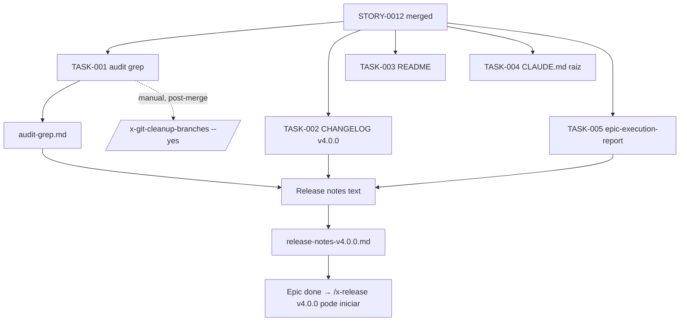

# História: Audit grep + README + CHANGELOG v4.0.0 + release notes + cleanup worktrees

**ID:** story-0048-0013
**Chave Jira:** —
**Status:** Pendente

## 1. Dependências

| Blocked By | Blocks |
| :--- | :--- |
| story-0048-0012 | — |

## 2. Regras Transversais Aplicáveis

> Referência às regras definidas no Épico (seção 4). Listar apenas as regras que impactam esta história.

| ID | Título |
| :--- | :--- |
| RULE-048-01 | Java-Only Scope (validação final) |

## 3. Descrição

Como **Maintainer** do gerador `ia-dev-env`, eu quero fechar o épico EPIC-0048 com entregáveis user-facing finais: (i) auditoria grep exaustiva confirmando que nenhum token de linguagem removida permanece em caminho executável; (ii) `README.md` raiz atualizado refletindo suporte Java-only; (iii) `CLAUDE.md` raiz do próprio repositório (não confundir com o CLAUDE.md gerado por projetos) atualizado; (iv) `CHANGELOG.md` com entrada completa para v4.0.0 seguindo Keep a Changelog + Rule 08; (v) relatório de execução do épico com métricas baseline vs final; (vi) comando documentado de cleanup de worktrees stale (executado por humano após review, não pela skill).

Esta é a story "release-ready" — não introduz código de produção, apenas consolida e documenta. O audit grep é a prova numérica de que RULE-048-01 (Java-Only Scope) foi cumprida: o comando canônico é `grep -rn "python\|kotlin\|typescript\|rust\|golang\|\"go\"\|csharp\|dotnet" java/src/main/java | grep -v "// " | grep -v "CHANGELOG"` e DEVE retornar apenas hits em mensagens de erro explicativas (e.g. `UnsupportedLanguageException` mensagem) OU em comentários histórico-explicativos OU zero hits. Qualquer hit em caminho executável (classe, método, constante efetivamente usada) é bloqueante e requer retorno a uma das stories de remoção.

O CHANGELOG v4.0.0 segue estrutura Keep a Changelog com seções obrigatórias Added / Changed / Removed / Fixed / Breaking. Added lista artefatos novos (ClaudeMdAssembler, pruneEmptyDirs, OutputDirectoryIntegrityTest, ADR-0048-A, ADR-0048-B, `shared/templates/CLAUDE.md`, `CliLanguageValidator`, `UnsupportedLanguageException`, feature flags `--legacy-empty-dirs` e `--no-claude-md`). Removed enumera o que saiu (linguagens python/go/kotlin/typescript/rust/csharp; 8 perfis smoke; ~2.835 arquivos golden; 8 YAMLs setup-config; 17+ templates agents/hooks/settings; skills/rules anti-patterns não-Java). Fixed cita Bug A e Bug B. Breaking sinaliza `--language != java` rejeitado (com migration path: pin v3.x ou branch `legacy/v3`). Essa entrada alimenta também as release notes GitHub (STORY-0048-0013 produz texto reaproveitável).

O epic-execution-report.md (em `plans/epic-0048/reports/`) publica métricas quantitativas comparando baseline (capturado em STORY-0048-0001) com estado final pós-épico: LOC removidas, tempo `mvn test` antes/depois, coverage line/branch antes/depois, contagem de arquivos em `golden/`, contagem de perfis em `SmokeProfiles`, presença de CLAUDE.md nos 9 goldens (0 → 9), dirs vazios detectados no output CLI (≥1 → 0). Métrica alvo de performance do épico é `-30% no tempo de mvn test` (DoD global) — reportar delta real.

### 3.1 Audit grep

- Comando canônico: `grep -RInE "python|kotlin|typescript|rust|golang|\"go\"|csharp|dotnet" java/src/main/java` (usa `-E` para alternação POSIX-portátil; `-R` recursivo; `-I` ignora binários; `-n` numera linhas).
- Filtros permitidos no resultado final:
  - Mensagens de erro "not supported" (e.g. na `UnsupportedLanguageException` lista supported values para UX)
  - Comentários histórico-explicativos (prefixo `//` ou `/* ... */` explicando remoção)
  - Strings em testes (`java/src/test/**` — fora do scope do grep)
- Qualquer hit em caminho executável (código efetivo, não comentário, não string de mensagem de erro) é BLOQUEANTE.
- Complementar com: `grep -RInE "go|kotlin|typescript|rust|csharp|dotnet" java/src/main/resources/targets/claude/` — espera-se 0 hits (templates foram removidos em STORY-0048-0005/0006/0007).
- Task 001 produz `plans/epic-0048/reports/audit-grep.md` com os comandos executados, os hits encontrados, e classificação (aceitável vs bloqueante).

### 3.2 README.md raiz — seção "Supported Stacks"

- Modificar `README.md` na raiz do repositório.
- Seção "Supported Stacks" (ou equivalente) reescrita para refletir apenas Java.
- Tabela ou bullet list final: `Java 21 + Spring Boot 3.x`, `Java 21 + Quarkus 3.x`, padrões suportados (hexagonal, CQRS/ES, event-driven, etc.), bancos suportados (PostgreSQL, MySQL, ClickHouse, Elasticsearch, Neo4j, TimescaleDB), interface types (REST/gRPC/GraphQL/WebSocket/CLI/event), compliance frameworks (PCI/HIPAA/LGPD/SOX).
- Nota visível no topo: "v4.0.0 removes support for python, go, kotlin, typescript, rust, csharp. For those languages, pin v3.x or use branch `legacy/v3`."

### 3.3 CLAUDE.md raiz do repositório — atualização

- Modificar `CLAUDE.md` na raiz do repositório.
- Refletir escopo java-only em eventuais seções "Supported Stacks" ou "Languages" dentro do próprio CLAUDE.md executivo.
- NÃO confundir com CLAUDE.md GERADO por projetos (esse é gerado pelo `ClaudeMdAssembler` de STORY-0048-0011 e mora no output de cada projeto criado). Aqui é o CLAUDE.md do próprio repo-raiz que é loaded em cada conversa Claude sobre ESTE projeto.

### 3.4 CHANGELOG.md v4.0.0

- Modificar `CHANGELOG.md` na raiz do repositório.
- Seguir Keep a Changelog + Rule 08 (Semantic Versioning).
- Estrutura obrigatória da entrada `## [4.0.0] - <data-do-release>`:
  - `### Added` — assembler novo, pruneEmptyDirs helper, novos testes de invariante (Output/ClaudeMd/Epic0048E2E), ADRs 0048-A/B, feature flags `--legacy-empty-dirs` / `--no-claude-md`, template `shared/templates/CLAUDE.md`, `CliLanguageValidator` + `UnsupportedLanguageException`
  - `### Removed` — 6 linguagens (+ csharp leftover), 8 perfis smoke, ~2.835 arquivos golden (números exatos vindos do epic-execution-report), 8 YAMLs, 17+ templates agents/hooks/settings, skills/rules não-Java
  - `### Fixed` — Bug A (dirs vazios no output CLI), Bug B (CLAUDE.md raiz não gerado)
  - `### Changed` — nada major (dimensões ortogonais preservadas por RULE-048-02); mencionar redução de ~30%+ em tempo de `mvn test` como consequência
  - `### Breaking` — `--language <x>` com `x ∉ {"java"}` agora rejeita com RULE-048-06 mensagem; projetos legados devem pinar `3.x` ou usar branch `legacy/v3`
- Entrada na seção `## [Unreleased]` → realocada para `## [4.0.0]` com data do merge no `main`.

### 3.5 Release notes GitHub (texto reaproveitável)

- Produzir `plans/epic-0048/reports/release-notes-v4.0.0.md`.
- Formato markdown otimizado para copy-paste em GitHub Release.
- Inclui: sumário executivo (2-3 parágrafos), migration guide (como pinar v3.x / usar `legacy/v3`), link para ADR-0048-A e ADR-0048-B, link para CHANGELOG, seção "Who is affected" (projetos java-only → zero impacto; multi-language → ação requerida).

### 3.6 Epic execution report — métricas baseline vs final

- Produzir `plans/epic-0048/reports/epic-execution-report.md`.
- Tabela com colunas Métrica / Baseline (STORY-0048-0001) / Final / Delta. Métricas da spec §10:
  - Arquivos em `golden/`
  - Perfis em `SmokeProfiles`
  - Tempo `mvn test` (média 3 runs)
  - Coverage line/branch
  - LANGUAGE_COMMANDS entries em `StackMapping`
  - LOC removidas (via `git diff --stat` ou `git log --shortstat`)
  - Empty dirs no output CLI (baseline ≥1 / final 0)
  - CLAUDE.md no output CLI (baseline ausente / final 9 perfis)

### 3.7 Cleanup worktrees — comando documentado (NÃO executar nesta skill)

- Documentar na story: o comando `/x-git-cleanup-branches` é a ferramenta oficial para limpar branches e worktrees stale após o épico.
- Comando (REFERÊNCIA — NÃO EXECUTAR AUTOMATICAMENTE):
  ```
  /x-git-cleanup-branches --yes
  ```
- Pré-condição: todos os PRs das stories 0001-0012 mergeados em `develop`; épico em estado "entregável para release cut".
- Executor: maintainer humano, após revisar `git worktree list` e `git branch -a`. NÃO executar via subagent dentro desta story (RULE SCOPE LOCK: sem git mutating commands).

## 3.5 Entrega de Valor

- **Valor Principal:** épico fechado e entregável — usuário que clona `main` no estado pós-EPIC-0048 encontra README/CHANGELOG/CLAUDE.md atualizados; release v4.0.0 pode ser cortado via `/x-release` sem blockers; migration path documentado para quem depende de linguagens removidas.
- **Métrica de Sucesso:** `audit-grep.md` com 0 bloqueantes; CHANGELOG v4.0.0 contém todas as 5 sections obrigatórias; `epic-execution-report.md` publica delta ≥30% de tempo de teste (DoD global); release notes prontas para copy-paste em GitHub.
- **Impacto no Negócio:** release v4.0.0 desbloqueada; comunicação pública com stakeholders/usuários alinhada (breaking change claro + migration path); confiança operacional para continuar roadmap (EPIC futuras constroem sobre base java-only limpa).

## 4. Definições de Qualidade Locais

### DoR Local (Definition of Ready)

- [ ] STORY-0048-0012 mergeada (`Epic0048EndToEndTest` verde; @Disabled órfãos removidos)
- [ ] Métricas baseline coletadas em STORY-0048-0001 disponíveis em `plans/epic-0048/reports/baseline-metrics.md`
- [ ] `mvn clean verify` verde no HEAD atual de `feature/epic-0048-java-only-generator` (ou branch equivalente)
- [ ] ADR-0048-A e ADR-0048-B mergeadas em `main`/`develop` (para linkar do CHANGELOG / release notes)

### DoD Local (Definition of Done)

- [ ] `plans/epic-0048/reports/audit-grep.md` publicado com comandos + hits + classificação — 0 bloqueantes
- [ ] `README.md` atualizado, seção "Supported Stacks" reflete apenas Java + nota de v4.0.0
- [ ] `CLAUDE.md` (raiz do repo) atualizado para java-only
- [ ] `CHANGELOG.md` contém entrada `## [4.0.0]` com 5 sections (Added/Removed/Fixed/Changed/Breaking)
- [ ] `plans/epic-0048/reports/release-notes-v4.0.0.md` publicado (copy-paste-ready)
- [ ] `plans/epic-0048/reports/epic-execution-report.md` publica métricas baseline vs final; delta de tempo de `mvn test` ≥30%
- [ ] Comando `/x-git-cleanup-branches --yes` documentado nas notas finais do épico (NÃO executado aqui)
- [ ] Pelo menos 1 teste automatizado — reutilizado: `Epic0048EndToEndTest` de STORY-0048-0012 valida os invariantes continuam passando pós-docs (sem regressão)
- [ ] Smoke test passando (`mvn verify` verde)
- [ ] Commits atômicos por task (RULE-048-07)

### Global Definition of Done (DoD)

- **Cobertura:** ≥95% line / ≥90% branch mantido (esta story não toca código de produção).
- **Testes Automatizados:** sem novos testes; reutiliza `Epic0048EndToEndTest` como regressão.
- **Relatório de Cobertura:** JaCoCo HTML.
- **Documentação:** README, CLAUDE.md raiz, CHANGELOG, release notes, epic-execution-report — todos produzidos.
- **Persistência:** N/A.
- **Performance:** delta `mvn test` ≥30% reportado (ou justificado se menor — DoD negociada no PR de release).

## 5. Contratos de Dados (Data Contract)

### 5.1 INPUTS (pré-condições)

| Artefato | Tipo | Uso |
| :--- | :--- | :--- |
| `plans/epic-0048/reports/baseline-metrics.md` | Doc (de STORY-0001) | Fonte das métricas baseline |
| Git log do épico | History | Para `git log --shortstat` → LOC removidas |
| ADRs 0048-A/B | Doc | Linkados no CHANGELOG e release notes |
| CHANGELOG.md atual | Doc | Editado para adicionar entrada v4.0.0 |
| README.md atual | Doc | Editado seção "Supported Stacks" |
| CLAUDE.md raiz atual | Doc | Editado para java-only |

### 5.2 OUTPUTS (pós-condições verificáveis)

| Artefato | Tipo | Verificação |
| :--- | :--- | :--- |
| `plans/epic-0048/reports/audit-grep.md` | Doc | `test -f` retorna 0; contém seções "Commands", "Hits", "Classification" |
| `README.md` editado | Doc | `grep -q "v4.0.0" README.md` retorna 0; `grep -q "java" README.md` retorna 0 |
| `CLAUDE.md` editado | Doc | `grep -q "java-only\|Java-only" CLAUDE.md` retorna 0 |
| `CHANGELOG.md` com `## [4.0.0]` | Doc | `grep -q "## \[4.0.0\]" CHANGELOG.md` retorna 0; 5 sections presentes |
| `plans/epic-0048/reports/release-notes-v4.0.0.md` | Doc | `test -f` retorna 0 |
| `plans/epic-0048/reports/epic-execution-report.md` | Doc | `test -f` retorna 0; contém tabela Métrica/Baseline/Final/Delta |

### 5.3 Error Codes Mapeados

N/A — story é documentação/audit.

### 5.4 Event Schema

N/A.

## 6. Diagramas

### 6.1 Produção final de entregáveis



## 7. Critérios de Aceite (Gherkin)

```gherkin
Cenario: audit grep confirma Java-Only Scope
  DADO que todas as stories 0048-0003 a 0048-0012 estão mergeadas em develop
  QUANDO executo 'grep -rn "python\|kotlin\|typescript\|rust\|golang\|\"go\"\|csharp\|dotnet" java/src/main/java'
  ENTÃO os hits resultantes estão todos em mensagens de erro "not supported" OU comentários histórico-explicativos
  E zero hits em caminho executável (classe/método/constante efetivamente usada)
  E audit-grep.md registra comandos + classificação

Cenario: CHANGELOG v4.0.0 contém sections completas
  DADO que CHANGELOG.md foi editado
  QUANDO inspeciono a entrada "## [4.0.0]"
  ENTÃO há sections "### Added", "### Removed", "### Fixed", "### Changed", "### Breaking"
  E Added lista ClaudeMdAssembler, pruneEmptyDirs, OutputDirectoryIntegrityTest, ADR-0048-A, ADR-0048-B
  E Removed lista as 6 linguagens + números de arquivos deletados
  E Fixed lista Bug A e Bug B
  E Breaking explica "--language != java" rejeição + migration path

Cenario: README e CLAUDE.md raiz refletem java-only
  DADO que README.md e CLAUDE.md raiz foram editados
  QUANDO inspeciono as seções de stacks suportadas
  ENTÃO apenas Java é listado
  E uma nota indica "v4.0.0 removes X languages; pin v3.x for legacy support"

Cenario: epic-execution-report publica métricas completas
  DADO que o report foi gerado
  QUANDO abro plans/epic-0048/reports/epic-execution-report.md
  ENTÃO há uma tabela com colunas Métrica / Baseline / Final / Delta
  E métricas incluem: arquivos golden, perfis SmokeProfiles, tempo mvn test, coverage line/branch, LOC removidas, empty dirs, CLAUDE.md presence
  E delta de tempo de mvn test mostra redução >= 30%
```

### 7.1 Scenario Ordering (TPP)

> Ordem: audit (validação) → CHANGELOG (core docs) → README/CLAUDE.md (user-facing) → epic-execution-report (meta).

### 7.2 Mandatory Scenario Categories

- [x] Degenerate cases (audit grep = 0 bloqueantes validado)
- [x] Happy path (CHANGELOG completo, README atualizado, metrics publicados)
- [x] Error paths (qualquer hit bloqueante no audit → story retorna a 0003-0008 — documentado no audit-grep.md)
- [x] Boundary values (delta de tempo de teste no limiar de 30% — explicitamente validado)

### 7.3 TDD Implementation Notes

- Story é majoritariamente de documentação; não há TDD code-level. Validação é por inspeção + audit grep + regressão via `Epic0048EndToEndTest` reutilizado.
- Reviewer humano é o "teste" final: PR aprovado = CHANGELOG/README/release-notes aceitáveis para publicação.

## 8. Tasks

### TASK-0048-0013-001: Audit grep + audit-grep.md report

- **Layer:** Test (meta-audit)
- **Test Type:** Verification
- **Size:** S
- **Dependencies:** —
- **Branch:** `chore/task-0048-0013-001-audit-grep-java-only`
- **Testability:** Config + VerificationTest
- **Files:**
  - `plans/epic-0048/reports/audit-grep.md`
- **Acceptance Criteria:**
  - [ ] Comando canônico documentado e executado
  - [ ] Hits classificados em "aceitável" (mensagens/comentários) vs "bloqueante" (caminho executável)
  - [ ] Zero hits bloqueantes; se houver, story retorna para fix antes de prosseguir
  - [ ] Comando secundário em `java/src/main/resources/targets/claude/` documentado, zero hits esperados

### TASK-0048-0013-002: CHANGELOG.md v4.0.0 entry

- **Layer:** Doc
- **Test Type:** Verification
- **Size:** S
- **Dependencies:** TASK-0048-0013-001
- **Branch:** `docs/task-0048-0013-002-changelog-v4-0-0`
- **Testability:** Config + VerificationTest
- **Files:**
  - `CHANGELOG.md`
- **Acceptance Criteria:**
  - [ ] Entrada `## [4.0.0] - <data>` adicionada com 5 sections (Added/Removed/Fixed/Changed/Breaking)
  - [ ] Links para ADR-0048-A, ADR-0048-B, e issues/PRs relevantes
  - [ ] Números exatos de arquivos removidos (de TASK-001 e epic-execution-report)
  - [ ] Migration path (pin v3.x) documentado na section Breaking

### TASK-0048-0013-003: README.md raiz — seção Supported Stacks

- **Layer:** Doc
- **Test Type:** Verification
- **Size:** S
- **Dependencies:** TASK-0048-0013-002
- **Branch:** `docs/task-0048-0013-003-readme-java-only`
- **Testability:** Config + VerificationTest
- **Files:**
  - `README.md`
- **Acceptance Criteria:**
  - [ ] Seção "Supported Stacks" (ou equivalente) reescrita para apenas Java
  - [ ] Nota visível "v4.0.0 removes X languages; pin v3.x for legacy"
  - [ ] Link para CHANGELOG e ADR-0048-A
  - [ ] Nenhuma referência residual a python/go/kotlin/typescript/rust/csharp

### TASK-0048-0013-004: CLAUDE.md raiz do repositório — update

- **Layer:** Doc
- **Test Type:** Verification
- **Size:** S
- **Dependencies:** TASK-0048-0013-002
- **Branch:** `docs/task-0048-0013-004-root-claude-md-java-only`
- **Testability:** Config + VerificationTest
- **Files:**
  - `CLAUDE.md`
- **Acceptance Criteria:**
  - [ ] Seções "Supported Languages/Stacks" (se existirem) refletem java-only
  - [ ] NÃO confundir com CLAUDE.md gerado por projetos (este é o do repo-raiz)
  - [ ] Sem referências residuais a linguagens removidas

### TASK-0048-0013-005: Epic execution report — métricas baseline vs final

- **Layer:** Doc
- **Test Type:** Verification
- **Size:** M
- **Dependencies:** TASK-0048-0013-001
- **Branch:** `docs/task-0048-0013-005-epic-execution-report`
- **Testability:** Config + VerificationTest
- **Files:**
  - `plans/epic-0048/reports/epic-execution-report.md`
  - `plans/epic-0048/reports/release-notes-v4.0.0.md`
- **Acceptance Criteria:**
  - [ ] Tabela Métrica / Baseline / Final / Delta com 8+ métricas da spec §10
  - [ ] Delta de tempo de `mvn test` reportado (alvo ≥30%); se abaixo, justificativa
  - [ ] `release-notes-v4.0.0.md` pronto para copy-paste em GitHub Release
  - [ ] Comando `/x-git-cleanup-branches --yes` documentado como passo pós-release (para humano)
