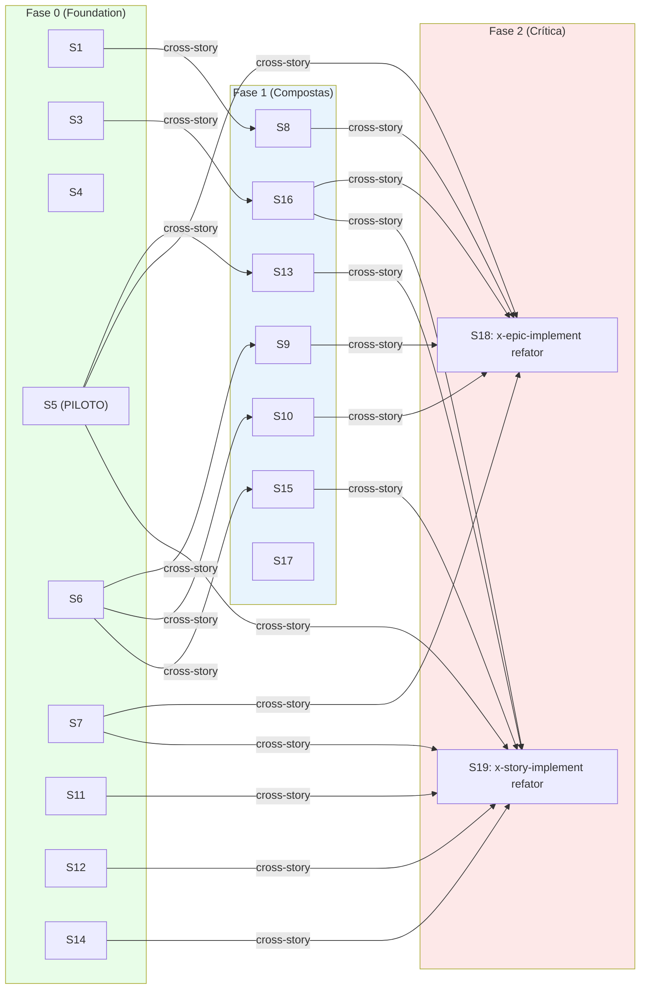

# Mapa de Implementação — EPIC-0049: Refatoração do Fluxo de Épico

**Gerado a partir das dependências BlockedBy/Blocks de cada história do epic-0049.**

---

## 1. Matriz de Dependências

| Story | Título | Chave Jira | Blocked By | Blocks | Status |
| :--- | :--- | :--- | :--- | :--- | :--- |
| story-0049-0001 | x-git-branch | — | — | story-0049-0008 | Concluída |
| story-0049-0002 | x-git-merge | — | — | story-0049-0018 | Concluída |
| story-0049-0003 | x-pr-merge | — | — | story-0049-0016, story-0049-0018 | Concluída |
| story-0049-0004 | x-planning-commit | — | — | story-0049-0021, story-0049-0022 | Concluída |
| story-0049-0005 | x-internal-status-update (PILOTO da convenção) | — | — | story-0049-0013, story-0049-0018, story-0049-0019 | Concluída |
| story-0049-0006 | x-internal-report-write | — | — | story-0049-0009, story-0049-0010, story-0049-0015 | Concluída |
| story-0049-0007 | x-internal-args-normalize | — | — | story-0049-0018, story-0049-0019 | Concluída |
| story-0049-0008 | x-internal-epic-branch-ensure | — | story-0049-0001 | story-0049-0018, story-0049-0021, story-0049-0022 | Concluída |
| story-0049-0009 | x-internal-epic-build-plan | — | story-0049-0006 | story-0049-0018 | Concluída |
| story-0049-0010 | x-internal-epic-integrity-gate | — | story-0049-0006 | story-0049-0018 | Concluída |
| story-0049-0011 | x-internal-story-load-context | — | — | story-0049-0019 | Concluída |
| story-0049-0012 | x-internal-story-build-plan | — | — | story-0049-0019 | Concluída |
| story-0049-0013 | x-internal-story-resume | — | story-0049-0005 | story-0049-0019 | Concluída |
| story-0049-0014 | x-internal-story-verify | — | — | story-0049-0019 | Concluída |
| story-0049-0015 | x-internal-story-report | — | story-0049-0006 | story-0049-0019 | Concluída |
| story-0049-0016 | Extensão x-pr-create | — | story-0049-0003 | story-0049-0018, story-0049-0019 | Concluída |
| story-0049-0017 | Extensão x-task-plan (--no-commit) | — | — | story-0049-0022 | Concluída |
| story-0049-0018 | Refator x-epic-implement (CRÍTICA) | — | story-0049-0005, story-0049-0007, story-0049-0008, story-0049-0009, story-0049-0010, story-0049-0016 | — | Concluída |
| story-0049-0019 | Refator x-story-implement (CRÍTICA) | — | story-0049-0005, story-0049-0007, story-0049-0011, story-0049-0012, story-0049-0013, story-0049-0014, story-0049-0015, story-0049-0016 | — | Concluída |
| story-0049-0020 | Atualizar Rules 09/14/19 + criar Rules 21/22 | — | — | — | Concluída |
| story-0049-0021 | Versionamento x-epic-create / -decompose / -map | — | story-0049-0004, story-0049-0008 | — | Concluída |
| story-0049-0022 | Versionamento x-epic-orchestrate / -story-create / -story-plan / -task-plan | — | story-0049-0004, story-0049-0008, story-0049-0017 | — | Concluída |

> **Valores de Status:** `Pendente` (padrão) · `Em Andamento` · `Concluída` · `Falha` · `Bloqueada` · `Parcial`

> **Nota:** Todas as 22 stories são de plataforma (sem dependências de domínio externo). Story-0049-0020 (rules) pode rodar em qualquer momento — não é blocker de nada e nada a bloqueia.

---

## 2. Fases de Implementação

> As histórias são agrupadas em fases. Dentro de cada fase, as histórias podem ser implementadas **em paralelo** (sujeito ao default sequencial do novo `x-epic-implement`). Uma fase só pode iniciar quando todas as dependências das fases anteriores estiverem concluídas.

```
╔══════════════════════════════════════════════════════════════════════════╗
║              FASE 0 — Primitivas Git/PR + Internas Standalone           ║
║                              (10 paralelas)                            ║
║                                                                        ║
║   ┌────────────┐ ┌────────────┐ ┌────────────┐ ┌────────────┐         ║
║   │ S1 git-    │ │ S2 git-    │ │ S3 pr-     │ │ S4 plan-   │         ║
║   │ branch     │ │ merge      │ │ merge      │ │ commit     │         ║
║   └────────────┘ └────────────┘ └────────────┘ └────────────┘         ║
║   ┌────────────┐ ┌────────────┐ ┌────────────┐ ┌────────────┐         ║
║   │ S5 status- │ │ S6 report- │ │ S7 args-   │ │ S11 story- │         ║
║   │ update🔒   │ │ write🔒    │ │ normalize🔒│ │ load-ctx🔒 │         ║
║   └────────────┘ └────────────┘ └────────────┘ └────────────┘         ║
║   ┌────────────┐ ┌────────────┐                                       ║
║   │ S12 story- │ │ S14 story- │                                       ║
║   │ build-plan🔒│ │ verify🔒  │                                       ║
║   └────────────┘ └────────────┘                                       ║
╚════════════╪═════════════════════════════════════════════════════════════╝
             │
             ▼
╔══════════════════════════════════════════════════════════════════════════╗
║         FASE 1 — Internas Compostas + Estensões + Rules                ║
║                              (8 paralelas)                              ║
║                                                                        ║
║   ┌────────────┐ ┌────────────┐ ┌────────────┐ ┌────────────┐         ║
║   │ S8 epic-   │ │ S9 epic-   │ │ S10 epic-  │ │ S13 story- │         ║
║   │ branch-    │ │ build-     │ │ integrity- │ │ resume🔒   │         ║
║   │ ensure🔒   │ │ plan🔒     │ │ gate🔒     │ │            │         ║
║   └────────────┘ └────────────┘ └────────────┘ └────────────┘         ║
║   ┌────────────┐ ┌────────────┐ ┌────────────┐ ┌────────────┐         ║
║   │ S15 story- │ │ S16 pr-    │ │ S17 task-  │ │ S20 Rules  │         ║
║   │ report🔒   │ │ create ext │ │ plan ext   │ │ 09/14/19/  │         ║
║   │            │ │            │ │            │ │ 20/21      │         ║
║   └────────────┘ └────────────┘ └────────────┘ └────────────┘         ║
╚════════════╪═════════════════════════════════════════════════════════════╝
             │
             ▼
╔══════════════════════════════════════════════════════════════════════════╗
║              FASE 2 — Refators Críticos dos Orquestradores             ║
║                              (2 paralelas)                              ║
║                                                                        ║
║   ┌──────────────────────────┐  ┌──────────────────────────┐          ║
║   │ S18 Refator              │  │ S19 Refator              │          ║
║   │ x-epic-implement         │  │ x-story-implement        │          ║
║   │ (CRÍTICA — 8 deps)       │  │ (CRÍTICA — 8 deps)       │          ║
║   │ ~460 linhas SKILL.md     │  │ ~320 linhas SKILL.md     │          ║
║   └──────────────────────────┘  └──────────────────────────┘          ║
╚════════════╪═════════════════════════════════════════════════════════════╝
             │
             ▼
╔══════════════════════════════════════════════════════════════════════════╗
║         FASE 3 — Versionamento das Skills de Planejamento              ║
║                              (2 paralelas)                              ║
║                                                                        ║
║   ┌──────────────────────────┐  ┌──────────────────────────┐          ║
║   │ S21 Versionamento de     │  │ S22 Versionamento de     │          ║
║   │ x-epic-create/decompose/ │  │ x-epic-orchestrate/      │          ║
║   │ x-epic-map               │  │ story-create/plan/task   │          ║
║   └──────────────────────────┘  └──────────────────────────┘          ║
╚══════════════════════════════════════════════════════════════════════════╝
```

---

## 3. Caminho Crítico

> O caminho crítico (a sequência mais longa de dependências) determina o tempo mínimo de implementação do projeto.

```
S6 (report-write) ──┐
                    ├──→ S9 (epic-build-plan) ──┐
                    │                           ├──→ S18 (refator x-epic-implement) ──→ FIM
                    └──→ S10 (epic-integrity)  ──┘
                                                 │
S3 (pr-merge) ──────→ S16 (pr-create ext) ──────┘

S5 (status-update) ──┐
S7 (args-normalize) ──┤
S11 (load-context) ───┤
S12 (build-plan) ─────┤
S14 (verify) ─────────┼──→ S19 (refator x-story-implement) ──→ FIM
S13 (resume) ─────────┤    (depende de S5)
S15 (story-report) ───┤    (depende de S6)
S16 (pr-create ext) ──┘
```

**4 fases no caminho crítico, 4 histórias na cadeia mais longa (ex: S6 → S9 → S18 → FIM).**

Atrasos em S18 ou S19 atrasam o épico inteiro — são os 2 gargalos. S18 depende de 6 stories upstream (S5/S7/S8/S9/S10/S16), S19 depende de 8 (S5/S7/S11/S12/S13/S14/S15/S16). Mitigação: S20 (rules) pode ser paralelizada com S18/S19 sem impacto.

---

## 4. Grafo de Dependências (Mermaid)

```mermaid
graph TD
    %% Fase 0 — primitivas e standalone internas
    S1["story-0049-0001<br/>x-git-branch"]
    S2["story-0049-0002<br/>x-git-merge"]
    S3["story-0049-0003<br/>x-pr-merge"]
    S4["story-0049-0004<br/>x-planning-commit"]
    S5["story-0049-0005<br/>🔒 status-update (PILOTO)"]
    S6["story-0049-0006<br/>🔒 report-write"]
    S7["story-0049-0007<br/>🔒 args-normalize"]
    S11["story-0049-0011<br/>🔒 story-load-context"]
    S12["story-0049-0012<br/>🔒 story-build-plan"]
    S14["story-0049-0014<br/>🔒 story-verify"]

    %% Fase 1 — compostas/estensões
    S8["story-0049-0008<br/>🔒 epic-branch-ensure"]
    S9["story-0049-0009<br/>🔒 epic-build-plan"]
    S10["story-0049-0010<br/>🔒 epic-integrity-gate"]
    S13["story-0049-0013<br/>🔒 story-resume"]
    S15["story-0049-0015<br/>🔒 story-report"]
    S16["story-0049-0016<br/>x-pr-create extension"]
    S17["story-0049-0017<br/>x-task-plan --no-commit"]
    S20["story-0049-0020<br/>Rules 09/14/19/20/21"]

    %% Fase 2 — refators críticos
    S18["story-0049-0018<br/>⚠️ Refator x-epic-implement"]
    S19["story-0049-0019<br/>⚠️ Refator x-story-implement"]

    %% Fase 3 — versionamento
    S21["story-0049-0021<br/>VCS: epic-create/decompose/map"]
    S22["story-0049-0022<br/>VCS: orchestrate/story-create/plan/task-plan"]

    %% Edges Fase 0 → Fase 1
    S1 --> S8
    S6 --> S9
    S6 --> S10
    S5 --> S13
    S6 --> S15
    S3 --> S16

    %% Edges Fase 0+1 → Fase 2
    S5 --> S18
    S7 --> S18
    S8 --> S18
    S9 --> S18
    S10 --> S18
    S16 --> S18

    S5 --> S19
    S7 --> S19
    S11 --> S19
    S12 --> S19
    S13 --> S19
    S14 --> S19
    S15 --> S19
    S16 --> S19

    %% Edges Fase 0+1 → Fase 3
    S4 --> S21
    S8 --> S21
    S4 --> S22
    S8 --> S22
    S17 --> S22

    %% Estilos por fase
    classDef fase0 fill:#1a1a2e,stroke:#e94560,color:#fff
    classDef fase1 fill:#16213e,stroke:#0f3460,color:#fff
    classDef fase2 fill:#e94560,stroke:#fff,color:#fff
    classDef fase3 fill:#0d7377,stroke:#14ffec,color:#fff

    class S1,S2,S3,S4,S5,S6,S7,S11,S12,S14 fase0
    class S8,S9,S10,S13,S15,S16,S17,S20 fase1
    class S18,S19 fase2
    class S21,S22 fase3
```



---

## 5. Resumo por Fase

| Fase | Histórias | Camada | Paralelismo | Pré-requisito |
| :--- | :--- | :--- | :--- | :--- |
| 0 | S1, S2, S3, S4, S5, S6, S7, S11, S12, S14 | Foundation (skills standalone) | 10 paralelas | — |
| 1 | S8, S9, S10, S13, S15, S16, S17, S20 | Compostas/extensões | 8 paralelas | Fase 0 (parcial: S1,S3,S4,S5,S6) |
| 2 | S18, S19 | Refator dos orquestradores | 2 paralelas | Fase 0 + 1 |
| 3 | S21, S22 | Versionamento de planejamento | 2 paralelas | S4, S8, S17 |

**Total: 22 histórias em 4 fases.**

> **Nota:** S20 (Rules) pode ser executada em qualquer momento — não tem deps nem é dep de nada. Posicionada na Fase 1 por conveniência (rules referenciam conceitos das Fases 0/1).

---

## 6. Detalhamento por Fase

### Fase 0 — Foundation (10 stories paralelas)

| Story | Escopo Principal | Artefatos Chave |
| :--- | :--- | :--- |
| story-0049-0001 | Skill pública `x-git-branch` | `git/x-git-branch/SKILL.md` |
| story-0049-0002 | Skill pública `x-git-merge` | `git/x-git-merge/SKILL.md` |
| story-0049-0003 | Skill pública `x-pr-merge` | `pr/x-pr-merge/SKILL.md` |
| story-0049-0004 | Skill pública `x-planning-commit` | `git/x-planning-commit/SKILL.md` |
| story-0049-0005 | 🔒 PILOTO: `x-internal-status-update` | `internal/ops/x-internal-status-update/SKILL.md` |
| story-0049-0006 | 🔒 `x-internal-report-write` | `internal/ops/x-internal-report-write/SKILL.md` |
| story-0049-0007 | 🔒 `x-internal-args-normalize` | `internal/lib/x-internal-args-normalize/SKILL.md` |
| story-0049-0011 | 🔒 `x-internal-story-load-context` | `internal/plan/x-internal-story-load-context/SKILL.md` |
| story-0049-0012 | 🔒 `x-internal-story-build-plan` | `internal/plan/x-internal-story-build-plan/SKILL.md` |
| story-0049-0014 | 🔒 `x-internal-story-verify` | `internal/plan/x-internal-story-verify/SKILL.md` |

**Entregas da Fase 0:**

- 4 skills públicas novas (Git/PR primitives)
- 6 skills internas novas (estabelecem convenção `x-internal-*` via S5 piloto)
- Goldens regenerados para os 17 stacks
- Audit Rule 22 retorna 0 violações para as 6 internas

### Fase 1 — Compostas + Extensões + Rules (8 stories paralelas)

| Story | Escopo Principal | Artefatos Chave |
| :--- | :--- | :--- |
| story-0049-0008 | 🔒 `x-internal-epic-branch-ensure` (depende S1) | `internal/git/x-internal-epic-branch-ensure/SKILL.md` |
| story-0049-0009 | 🔒 `x-internal-epic-build-plan` (depende S6) | `internal/plan/x-internal-epic-build-plan/SKILL.md` |
| story-0049-0010 | 🔒 `x-internal-epic-integrity-gate` (depende S6) | `internal/plan/x-internal-epic-integrity-gate/SKILL.md` |
| story-0049-0013 | 🔒 `x-internal-story-resume` (depende S5) | `internal/plan/x-internal-story-resume/SKILL.md` |
| story-0049-0015 | 🔒 `x-internal-story-report` (depende S6) | `internal/plan/x-internal-story-report/SKILL.md` |
| story-0049-0016 | Extensão `x-pr-create` (depende S3) | `pr/x-pr-create/SKILL.md` (modificada) |
| story-0049-0017 | Extensão `x-task-plan --no-commit` | `plan/x-task-plan/SKILL.md` (modificada) |
| story-0049-0020 | Rules 09/14/19 + 21/22 | `rules/21-epic-branch-model.md`, `rules/22-skill-visibility.md`, atualizações |

**Entregas da Fase 1:**

- 5 skills internas compostas
- 2 estensões de skills públicas (`x-pr-create`, `x-task-plan`)
- 2 novas Rules + 3 atualizações
- Audit scripts no CI

### Fase 2 — Refators Críticos (2 stories paralelas)

| Story | Escopo Principal | Artefatos Chave |
| :--- | :--- | :--- |
| story-0049-0018 | ⚠️ Refator `x-epic-implement` (1.997 → ~460 linhas) | `dev/x-epic-implement/SKILL.md` (refator agressivo) |
| story-0049-0019 | ⚠️ Refator `x-story-implement` (queda ~50%) | `dev/x-story-implement/SKILL.md` (refator) |

**Entregas da Fase 2:**

- `x-epic-implement` thin orchestrator: defaults sequencial + auto-merge em `epic/XXXX`
- `x-story-implement` thin: aceita `--target-branch`, `--auto-merge`, `--epic-id`
- Backward compat via `--legacy-flow` + `flowVersion`
- Smoke test EPIC-9999 e2e em 3 cenários (default, --parallel, --legacy-flow)

### Fase 3 — Versionamento de Planejamento (2 stories paralelas)

| Story | Escopo Principal | Artefatos Chave |
| :--- | :--- | :--- |
| story-0049-0021 | Versionamento de `x-epic-create`, `x-epic-decompose`, `x-epic-map` | 3 SKILL.md modificados |
| story-0049-0022 | Versionamento de `x-epic-orchestrate`, `x-story-create`, `x-story-plan`, `x-task-plan` | 4 SKILL.md modificados |

**Entregas da Fase 3:**

- 7 skills de planejamento ganham versionamento Git automático
- Working tree fica limpo após qualquer execução de planning skill
- Audit trail completo do nascimento e planejamento de épicos

---

## 7. Observações Estratégicas

### Gargalo Principal

**Story-0049-0018 (Refator `x-epic-implement`)** é o maior gargalo: depende de 6 stories upstream (S5, S7, S8, S9, S10, S16) e é a entrega central do épico (sem ela, o novo branch model + auto-merge em `epic/XXXX` não existe). Investir tempo em snapshot tests de qualidade (TASK-0049-0018-001) **antes** do refator agressivo paga em redução de regressão.

**Story-0049-0019 (Refator `x-story-implement`)** é o segundo gargalo: depende de 8 stories upstream. Pode rodar em paralelo com S18 já que não compartilham arquivos (S18 toca `x-epic-implement/SKILL.md`, S19 toca `x-story-implement/SKILL.md`).

### Histórias Folha (sem dependentes)

- **story-0049-0018** e **story-0049-0019** (refators críticos — folhas terminais)
- **story-0049-0020** (Rules — sem deps, sem dependentes)
- **story-0049-0021** e **story-0049-0022** (versionamento — folhas)

S20 pode ser absorvida em paralelo com qualquer fase sem impacto no critical path.

### Otimização de Tempo

- **Paralelismo máximo na Fase 0**: 10 stories paralelas. Capacidade da equipe é o limite, não dependências.
- **S20 (Rules) pode começar dia 1**: documentação não bloqueia código. Permite review da Rule 22 (visibility) antes da S5 (piloto da convenção).
- **S18 e S19 podem começar simultaneamente** assim que suas deps fecharem (ambas dependem de S5/S7/S16; S18 também precisa de S8/S9/S10; S19 também precisa de S11/S12/S13/S14/S15).
- **Fase 3 (S21/S22) pode começar antes da Fase 2 terminar**, porque suas deps (S4/S8/S17) estão na Fase 0/1.

### Dependências Cruzadas

- **S5 ↔ S13**: S13 depende de S5 (read-only mode do `x-internal-status-update`). Ponto de convergência da Fase 0 → Fase 1 lado story-internal.
- **S6 → S9, S10, S15**: `x-internal-report-write` é consumido por 3 skills. É um ponto de convergência. Sua qualidade afeta cascata.
- **S16 → S18 + S19**: estensão de `x-pr-create` é consumida pelos 2 refators. Atraso em S16 atrasa ambos.

### Marco de Validação Arquitetural

**Story-0049-0005 (`x-internal-status-update` PILOTO)** é o marco de validação arquitetural. Ela:
- Estabelece a convenção `x-internal-*` (frontmatter, body marker, subdir)
- Valida que o generator filtra skills internas do `/help`
- Define o "what good looks like" para as 10 outras internas

Sua qualidade dita a qualidade de S6, S7, S11, S12, S14 (Fase 0) e S8, S9, S10, S13, S15 (Fase 1). Investir em code review extra-rigoroso de S5 reduz drasticamente regressão downstream.

---

## 8. Dependências entre Tasks (Cross-Story)

> Esta seção lista cross-story task dependencies onde uma task de uma story depende explicitamente de uma task de outra story. EPIC-0049 tem dependências cross-story implícitas (uma story consome a saída completa da outra), mas dependências cross-story TASK-level só aparecem nos refators (S18/S19).

### 8.1 Dependências Cross-Story entre Tasks

| Task | Depends On | Story Source | Story Target | Tipo |
| :--- | :--- | :--- | :--- | :--- |
| TASK-0049-0018-002 (Phase 0 args) | TASK-0049-0007-005 (smoke completo) | story-0049-0018 | story-0049-0007 | interface |
| TASK-0049-0018-003 (Phase 1 plan) | TASK-0049-0009-006 (smoke completo) | story-0049-0018 | story-0049-0009 | interface |
| TASK-0049-0018-004 (Phase 2 branch) | TASK-0049-0008-004 (smoke completo) | story-0049-0018 | story-0049-0008 | interface |
| TASK-0049-0018-006 (Phase 4 gate) | TASK-0049-0010-005 (smoke completo) | story-0049-0018 | story-0049-0010 | interface |
| TASK-0049-0018-005 (Phase 3 loop) | TASK-0049-0016-006 (smoke completo) | story-0049-0018 | story-0049-0016 | interface |
| TASK-0049-0019-002 (Phase 0) | TASK-0049-0011-005, TASK-0049-0013-004 | story-0049-0019 | story-0049-0011, story-0049-0013 | interface |
| TASK-0049-0019-003 (Phase 1) | TASK-0049-0012-005 | story-0049-0019 | story-0049-0012 | interface |
| TASK-0049-0019-004 (Phase 2) | TASK-0049-0016-006 | story-0049-0019 | story-0049-0016 | interface |
| TASK-0049-0019-005 (Phase 3) | TASK-0049-0014-005, TASK-0049-0015-004 | story-0049-0019 | story-0049-0014, story-0049-0015 | interface |
| TASK-0049-0021-001 (epic-create vcs) | TASK-0049-0008-004 | story-0049-0021 | story-0049-0008 | interface |
| TASK-0049-0022-003 (story-plan batch) | TASK-0049-0017-003 | story-0049-0022 | story-0049-0017 | interface |

> **Validação RULE-012:** Todas as dependências cross-story TASK-level são consistentes com as dependências cross-story STORY-level. Não há orphan dependencies.

### 8.2 Ordem de Merge (Topological Sort)

Total: 100+ tasks distribuídas em 4 fases de execução (Phase 0 a Phase 3 do épico). Detalhamento granular por task ID seria gerado por `x-epic-orchestrate` ou `x-story-plan` na próxima etapa do workflow. Resumo:

| Wave | Total Tasks | Stories Cobertas |
| :--- | :--- | :--- |
| 0 | ~50 tasks | S1-S7, S11, S12, S14 |
| 1 | ~30 tasks | S8, S9, S10, S13, S15, S16, S17, S20 |
| 2 | ~15 tasks | S18, S19 |
| 3 | ~10 tasks | S21, S22 |

### 8.3 Grafo de Dependências entre Tasks (Mermaid)


