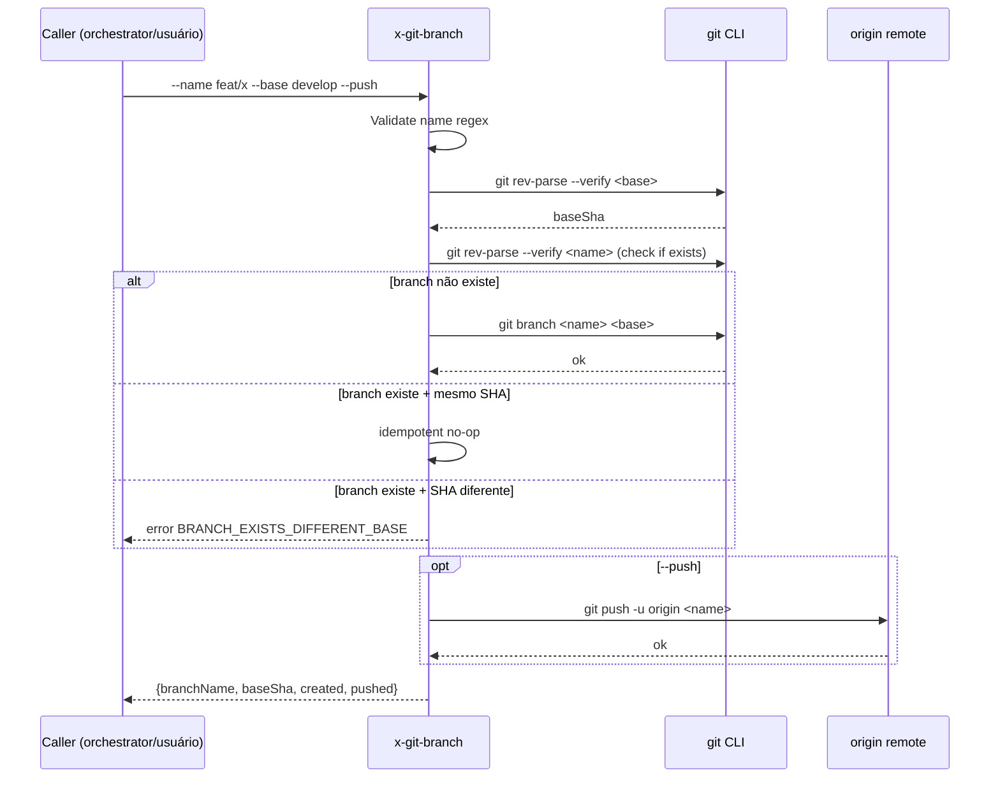

# História: Skill pública `x-git-branch` para criação de branch nua

**ID:** story-0049-0001
**Chave Jira:** —
**Status:** Concluída

## 1. Dependências

| Blocked By | Blocks |
| :--- | :--- |
| — | story-0049-0008 |

## 2. Regras Transversais Aplicáveis

| ID | Título |
| :--- | :--- |
| RULE-005 | Thin orchestrator (UseCase pattern) |
| RULE-010 | Skills internas pequenas (token budget) |

## 3. Descrição

Como **engenheiro de plataforma**, eu quero uma skill pública `x-git-branch` que cria uma branch nua (sem worktree) a partir de uma base configurável, com validação de naming e idempotência, para que orquestradores e usuários tenham um ponto único para criar branches sem replicar lógica Bash em vários SKILL.md.

Hoje, a criação de branches está espalhada em várias skills (`x-epic-implement`, `x-story-implement`, `x-pr-fix-epic`) como Bash inline (`git checkout -b ...`), sem validação consistente. Isso causa: (a) duplicação de código, (b) mensagens de erro inconsistentes quando a branch já existe, (c) impossibilidade de mockar/observar a operação. Esta story extrai a operação para uma skill reusável e idempotente.

### 3.1 Argumentos da skill

- `--name <branch>` (obrigatório) — nome da branch a criar
- `--base <branch>` (default `develop`) — branch base de onde derivar
- `--push` (default `false`) — se `true`, faz `git push -u origin <branch>` após criar
- `--dry-run` (default `false`) — preview sem executar

### 3.2 Comportamento

- Validar que `--name` segue padrão `<prefix>/<rest>` onde `prefix` ∈ {`feat`, `fix`, `hotfix`, `chore`, `docs`, `refactor`, `release`, `epic`, `planning`, `integration`}
- Verificar se a branch já existe local; se sim e aponta para o mesmo SHA do `--base`, retornar `created=false` sem erro
- Se a branch existe mas aponta para SHA diferente, abortar com erro `BRANCH_EXISTS_DIFFERENT_BASE`
- Criar branch com `git branch <name> <base>` (sem checkout — comportamento "nua")
- Se `--push`: `git push -u origin <name>`

## 3.5 Entrega de Valor

- **Valor Principal:** Habilita criação programática de branches sem worktree, base para `x-internal-epic-branch-ensure` (story-0049-0008) e ponto único de validação de naming reusável por toda a plataforma.
- **Métrica de Sucesso:** Skill consumida por pelo menos 2 outras skills (S8, S18) e zero ocorrências de `git checkout -b` direto em SKILL.md fora de `x-git-branch` e `x-git-worktree` após STORY-0049-0008 mergeada.
- **Impacto no Negócio:** Permite refatorações futuras (`x-internal-epic-branch-ensure`, branch de planning, branch de hotfix) sem nova lógica Bash em cada skill.

## 4. Definições de Qualidade Locais

### DoR Local (Definition of Ready)

- [ ] Decisão sobre naming validation patterns está alinhada com Rule 09 (Branching Model)
- [ ] Lista canônica de prefixos válidos foi consolidada em uma única referência
- [ ] Templates de SKILL.md disponíveis em `.claude/templates/`

### DoD Local (Definition of Done)

- [ ] Skill `x-git-branch` criada em `java/src/main/resources/targets/claude/skills/core/git/x-git-branch/SKILL.md`
- [ ] Frontmatter completo (name, description, allowed-tools, argument-hint)
- [ ] Suporta os 4 flags definidos na seção 3.1
- [ ] Idempotência testada: criar branch existente apontando para mesmo base SHA não falha
- [ ] Pelo menos 1 teste automatizado validando criação + idempotência + erro de base divergente
- [ ] Smoke test: criar branch `feat/test-0049-0001`, verificar que existe local, deletar
- [ ] Golden file regenerado para os 17 stacks suportados

### Global Definition of Done (DoD)

- **Cobertura:** ≥ 95% Line, ≥ 90% Branch
- **Testes Automatizados:** golden tests + smoke test bash
- **Relatório de Cobertura:** JaCoCo
- **Documentação:** SKILL.md inclui exemplos de uso em `## Examples` e `## Triggers`
- **Persistência:** N/A
- **Performance:** Execução < 2s para criação local; < 5s com `--push`

## 5. Contratos de Dados (Data Contract)

### 5.1 Request (CLI args)

| Campo | Tipo | M/O | Validações | Exemplo |
| :--- | :--- | :--- | :--- | :--- |
| `--name` | `String(100)` | M | regex `^(feat\|fix\|hotfix\|chore\|docs\|refactor\|release\|epic\|planning\|integration)/[a-z0-9-]+$` | `feat/my-branch` |
| `--base` | `String(100)` | O | branch existente local | `develop` |
| `--push` | `Boolean` | O | true/false | `true` |
| `--dry-run` | `Boolean` | O | true/false | `false` |

### 5.2 Response (structured output)

| Campo | Tipo | Sempre presente | Descrição |
| :--- | :--- | :--- | :--- |
| `branchName` | `String` | Sim | Nome da branch criada |
| `baseSha` | `String(40)` | Sim | SHA do base no momento da criação |
| `created` | `Boolean` | Sim | `true` se nova branch foi criada; `false` se já existia (idempotente) |
| `alreadyExisted` | `Boolean` | Sim | `true` se a branch já existia local |
| `pushed` | `Boolean` | Sim | `true` se foi pushada |

### 5.3 Error Codes Mapeados

| Exit Code | Error Code | Condição | Mensagem |
| :--- | :--- | :--- | :--- |
| 1 | `INVALID_NAME` | `--name` não passa no regex | "Branch name must follow <prefix>/<rest> pattern" |
| 2 | `BASE_NOT_FOUND` | `--base` não existe local | "Base branch '<name>' not found" |
| 3 | `BRANCH_EXISTS_DIFFERENT_BASE` | branch existe apontando para SHA diferente | "Branch exists with different base SHA" |
| 4 | `PUSH_FAILED` | `git push` falhou | "Push to origin failed: <stderr>" |

## 6. Diagramas

### 6.1 Fluxo de invocação



## 7. Critérios de Aceite (Gherkin)

```gherkin
Cenario: Criar branch nova a partir de develop
  DADO que estou em develop limpa
  E não existe a branch feat/test-0049-0001
  QUANDO invoco x-git-branch --name feat/test-0049-0001 --base develop
  ENTÃO a branch feat/test-0049-0001 é criada local apontando para HEAD de develop
  E o output contém created=true e alreadyExisted=false
  E a branch develop continua sendo a checked-out

Cenario: Idempotência — branch já existe apontando para mesmo base
  DADO que a branch feat/test-0049-0001 já existe apontando para HEAD de develop
  QUANDO invoco x-git-branch --name feat/test-0049-0001 --base develop
  ENTÃO o exit code é 0
  E o output contém created=false e alreadyExisted=true

Cenario: Erro — base inexistente
  DADO que não existe a branch nonexistent
  QUANDO invoco x-git-branch --name feat/test --base nonexistent
  ENTÃO o exit code é 2
  E a mensagem de erro contém "BASE_NOT_FOUND"

Cenario: Erro — naming inválido
  DADO que invoco com --name "no-prefix-branch"
  QUANDO a skill executa
  ENTÃO o exit code é 1
  E a mensagem contém "INVALID_NAME"

Cenario: Boundary — naming com prefixo válido mais curto possível
  DADO que invoco com --name feat/a
  QUANDO a skill executa
  ENTÃO a branch feat/a é criada com sucesso
```

### 7.1 Scenario Ordering (TPP)

Cenários ordenados de degenerate (idempotência sem-op) → happy path (criação) → erros → boundary.

### 7.2 Mandatory Scenario Categories

- [x] Degenerate cases (idempotência, no-op)
- [x] Happy path (criação simples)
- [x] Error paths (naming inválido, base inexistente)
- [x] Boundary values (naming mais curto possível)

## 8. Tasks

### TASK-0049-0001-001: Criar SKILL.md skeleton com frontmatter e seções básicas

- **Layer:** Doc
- **Test Type:** Verification
- **Size:** S
- **Dependencies:** —
- **Branch:** `feat/task-0049-0001-001-skill-skeleton`
- **Testability:** Config + VerificationTest
- **Files:**
  - `java/src/main/resources/targets/claude/skills/core/git/x-git-branch/SKILL.md`
- **Acceptance Criteria:**
  - [ ] Frontmatter completo (name, description, allowed-tools)
  - [ ] Body com seções `## Purpose`, `## Arguments`, `## Workflow`, `## Examples`, `## Triggers`
  - [ ] Skill aparece no `.claude/skills/` após regenerate

### TASK-0049-0001-002: Implementar parsing de args + validação de naming

- **Layer:** Domain
- **Test Type:** Unit
- **Size:** M
- **Dependencies:** TASK-0049-0001-001
- **Branch:** `feat/task-0049-0001-002-args-validation`
- **Testability:** Domain + UnitTest
- **Files:**
  - `java/src/main/resources/targets/claude/skills/core/git/x-git-branch/SKILL.md` (workflow inline)
  - `src/test/resources/golden/git/x-git-branch/...` (goldens)
- **Acceptance Criteria:**
  - [ ] Regex de naming validado contra lista de 10 prefixos válidos
  - [ ] Mensagens de erro consistentes
  - [ ] Goldens passam em todos os 17 stacks

### TASK-0049-0001-003: Implementar lógica de idempotência (existing branch detection)

- **Layer:** Domain
- **Test Type:** Unit
- **Size:** M
- **Dependencies:** TASK-0049-0001-002
- **Branch:** `feat/task-0049-0001-003-idempotency`
- **Testability:** Domain + UnitTest
- **Files:**
  - `java/src/main/resources/targets/claude/skills/core/git/x-git-branch/SKILL.md`
- **Acceptance Criteria:**
  - [ ] Detecta branch existente via `git rev-parse --verify`
  - [ ] Compara SHA da branch existente com SHA do base
  - [ ] Retorna `created=false, alreadyExisted=true` se SHAs iguais
  - [ ] Retorna error `BRANCH_EXISTS_DIFFERENT_BASE` se SHAs diferem

### TASK-0049-0001-004: Implementar suporte a --push e --dry-run

- **Layer:** Adapter
- **Test Type:** Integration
- **Size:** S
- **Dependencies:** TASK-0049-0001-003
- **Branch:** `feat/task-0049-0001-004-push-dryrun`
- **Testability:** Port + Adapter + IT
- **Files:**
  - `java/src/main/resources/targets/claude/skills/core/git/x-git-branch/SKILL.md`
- **Acceptance Criteria:**
  - [ ] `--push true` faz `git push -u origin <name>`
  - [ ] `--dry-run true` previne qualquer mudança e loga o que seria feito
  - [ ] Erro `PUSH_FAILED` quando push falha

### TASK-0049-0001-005: Smoke test end-to-end + regenerate goldens

- **Layer:** Test
- **Test Type:** Smoke
- **Size:** S
- **Dependencies:** TASK-0049-0001-004
- **Branch:** `feat/task-0049-0001-005-smoke`
- **Testability:** Migration + Smoke
- **Files:**
  - `src/test/.../GitBranchSmokeTest.java` (ou equivalente bash)
  - `src/test/resources/golden/git/x-git-branch/**`
- **Acceptance Criteria:**
  - [ ] Smoke test cria + verifica + deleta uma branch real
  - [ ] `mvn process-resources && mvn test -Dtest=GoldenFileRegenerator -Dgolden.regenerate=true` passa
  - [ ] Coverage ≥ 95% line / 90% branch para a skill
