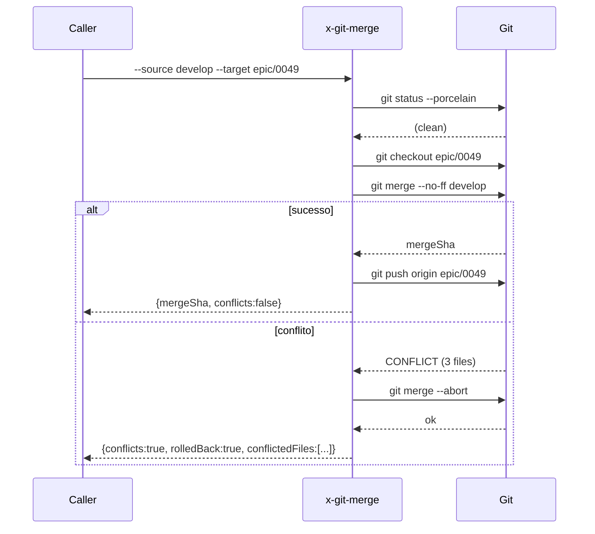

# História: Skill pública `x-git-merge` com detecção de conflito

**ID:** story-0049-0002
**Chave Jira:** —
**Status:** Concluída

## 1. Dependências

| Blocked By | Blocks |
| :--- | :--- |
| — | story-0049-0018 |

## 2. Regras Transversais Aplicáveis

| ID | Título |
| :--- | :--- |
| RULE-004 | Estratégia de merge: preserva history |
| RULE-005 | Thin orchestrator (UseCase pattern) |
| RULE-010 | Skills internas pequenas (token budget) |

## 3. Descrição

Como **orquestrador de épico**, eu quero uma skill pública `x-git-merge` que faz merge local de uma branch source em target com strategy configurável e detecção de conflito + rollback automático em falha, para que o auto-rebase entre stories paralelas e o sync `develop → epic/XXXX` virem chamadas a uma sub-skill reusável em vez de Bash inline com tratamento de erro espalhado.

Hoje `x-epic-implement` Phase 1.4e gerencia auto-rebase via subagent ad-hoc, e o conflito é tratado em ~120 linhas de prosa com instruções para Bash. Esta story extrai a operação para uma skill testável e idempotente.

### 3.1 Argumentos

- `--source <branch>` (M) — branch a ser mesclada
- `--target <branch>` (M) — branch que recebe o merge
- `--strategy <merge|squash|rebase>` (default `merge`)
- `--message <msg>` — mensagem custom (apenas para `merge`/`squash`)
- `--no-push` (default `false`) — não pusha após merge

### 3.2 Comportamento

- Pré-check: verificar `git status --porcelain` clean (working tree limpo); abortar se sujo
- Checkout do target
- Tentar merge: `git merge --no-ff <source>` (ou `--squash`, ou `git rebase`)
- Em caso de conflito: capturar lista de arquivos conflitados, executar `git merge --abort` (ou `git rebase --abort`), retornar com `conflicts=true` e `rolledBack=true`
- Em caso de sucesso: push (a menos que `--no-push`); retornar `mergeSha`
- Idempotência: se target já contém source HEAD (no-op), retornar sem erro

## 3.5 Entrega de Valor

- **Valor Principal:** Habilita merges locais idempotentes com rollback automático em conflito; substitui ~120 linhas de Bash inline em `x-epic-implement` Phase 1.4e e centraliza o tratamento de conflito.
- **Métrica de Sucesso:** Após STORY-0049-0018, zero blocos de `git merge` direto em SKILL.md fora de `x-git-merge`. Tempo médio de auto-rebase entre stories paralelas reduz em ≥ 30% (medido via timing log).
- **Impacto no Negócio:** Reduz incidência de "auto-rebase falhou silenciosamente" reportada em épicos paralelos; aumenta confiança no modo `--parallel`.

## 4. Definições de Qualidade Locais

### DoR Local

- [ ] Strategy contract definido (merge/squash/rebase mapeados para flags git nativos)
- [ ] Naming convention de mensagens de merge alinhada com Rule 08 (Conventional Commits)

### DoD Local

- [ ] Skill criada em `git/x-git-merge/SKILL.md`
- [ ] 3 strategies implementadas (merge, squash, rebase)
- [ ] Detecção de conflito + rollback testado para cada strategy
- [ ] Idempotência testada (no-op quando target já contém source)
- [ ] Pelo menos 1 teste automatizado por strategy + 1 teste de conflito
- [ ] Smoke test cria duas branches divergentes, mescla, verifica resultado

### Global DoD

- **Cobertura:** ≥ 95% / 90%
- **Testes:** Goldens + integration test com cenários de conflito
- **Documentação:** SKILL.md com exemplos de cada strategy
- **Performance:** Merge sem conflito < 3s; rollback após conflito < 5s

## 5. Contratos de Dados

### 5.1 Request (CLI args)

| Campo | Tipo | M/O | Validações | Exemplo |
| :--- | :--- | :--- | :--- | :--- |
| `--source` | `String` | M | branch existente | `develop` |
| `--target` | `String` | M | branch existente | `epic/0049` |
| `--strategy` | `Enum` | O | merge/squash/rebase | `merge` |
| `--message` | `String(255)` | O | — | `Merge develop into epic/0049` |
| `--no-push` | `Boolean` | O | — | `false` |

### 5.2 Response

| Campo | Tipo | Sempre presente | Descrição |
| :--- | :--- | :--- | :--- |
| `mergeSha` | `String(40)` | Não (apenas se sucesso) | SHA do merge commit |
| `conflicts` | `Boolean` | Sim | true se houve conflito |
| `conflictedFiles` | `List<String>` | Não (apenas se conflicts=true) | Lista de paths |
| `rolledBack` | `Boolean` | Sim | true se rollback executado |
| `noOp` | `Boolean` | Sim | true se target já continha source |

### 5.3 Error Codes

| Exit Code | Error Code | Condição | Mensagem |
| :--- | :--- | :--- | :--- |
| 1 | `WORKING_TREE_DIRTY` | `git status` não-clean | "Working tree must be clean before merge" |
| 2 | `SOURCE_NOT_FOUND` | source branch não existe | "Source branch '<name>' not found" |
| 3 | `TARGET_NOT_FOUND` | target branch não existe | "Target branch '<name>' not found" |
| 10 | `MERGE_CONFLICT_ROLLED_BACK` | conflito detectado, rollback ok | "Conflict in N files; merge aborted" |
| 11 | `ROLLBACK_FAILED` | merge --abort falhou | "Rollback failed; manual cleanup needed" |

## 6. Diagramas

### 6.1 Fluxo de merge com tratamento de conflito



## 7. Critérios de Aceite (Gherkin)

```gherkin
Cenario: No-op — target já contém source HEAD
  DADO que epic/0049 contém HEAD de develop
  QUANDO invoco x-git-merge --source develop --target epic/0049
  ENTÃO o exit code é 0
  E o output contém noOp=true

Cenario: Merge bem-sucedido com strategy merge
  DADO que develop tem 1 commit não presente em epic/0049
  E não há conflito
  QUANDO invoco x-git-merge --source develop --target epic/0049 --strategy merge
  ENTÃO um merge commit é criado em epic/0049
  E o output contém mergeSha não-vazio e conflicts=false
  E epic/0049 é pushed

Cenario: Conflito detectado e rollback automático
  DADO que develop e epic/0049 modificaram o mesmo arquivo de formas incompatíveis
  QUANDO invoco x-git-merge --source develop --target epic/0049
  ENTÃO o merge é abortado via git merge --abort
  E o working tree fica clean
  E o output contém conflicts=true, rolledBack=true, conflictedFiles=[...]

Cenario: Erro — working tree sujo
  DADO que existem arquivos modificados não-commitados
  QUANDO invoco x-git-merge --source develop --target epic/0049
  ENTÃO o exit code é 1
  E a mensagem contém "WORKING_TREE_DIRTY"

Cenario: Boundary — strategy squash com mensagem custom
  DADO que develop tem 5 commits a mesclar
  QUANDO invoco x-git-merge --source develop --target epic/0049 --strategy squash --message "squash: sync develop"
  ENTÃO um único commit é criado em epic/0049 com a mensagem custom
```

### 7.1 Scenario Ordering (TPP)

Degenerate (no-op) → happy path (merge) → error path (conflito) → error (working tree) → boundary (squash com message).

### 7.2 Mandatory Categories

- [x] Degenerate (no-op)
- [x] Happy path (merge bem-sucedido)
- [x] Error paths (conflito, working tree dirty)
- [x] Boundary (strategy squash)

## 8. Tasks

### TASK-0049-0002-001: Skeleton da skill com frontmatter

- **Layer:** Doc
- **Test Type:** Verification
- **Size:** S
- **Dependencies:** —
- **Branch:** `feat/task-0049-0002-001-skeleton`
- **Testability:** Config + VerificationTest
- **Files:**
  - `java/src/main/resources/targets/claude/skills/core/git/x-git-merge/SKILL.md`
- **Acceptance Criteria:**
  - [ ] Frontmatter + body skeleton
  - [ ] Aparece no `.claude/skills/` após regenerate

### TASK-0049-0002-002: Implementar pré-checks e parsing de args

- **Layer:** Domain
- **Test Type:** Unit
- **Size:** M
- **Dependencies:** TASK-0049-0002-001
- **Branch:** `feat/task-0049-0002-002-prechecks`
- **Testability:** Domain + UnitTest
- **Files:**
  - `git/x-git-merge/SKILL.md`
- **Acceptance Criteria:**
  - [ ] Validação de `--source` e `--target` existentes
  - [ ] Working tree clean check
  - [ ] Erro `WORKING_TREE_DIRTY` claro

### TASK-0049-0002-003: Implementar lógica de merge para strategy=merge

- **Layer:** Adapter
- **Test Type:** Integration
- **Size:** M
- **Dependencies:** TASK-0049-0002-002
- **Branch:** `feat/task-0049-0002-003-strategy-merge`
- **Testability:** Port + Adapter + IT
- **Files:**
  - `git/x-git-merge/SKILL.md`
- **Acceptance Criteria:**
  - [ ] `git merge --no-ff` invocado
  - [ ] mergeSha capturado
  - [ ] Push opcional executado

### TASK-0049-0002-004: Implementar strategies squash e rebase

- **Layer:** Adapter
- **Test Type:** Integration
- **Size:** M
- **Dependencies:** TASK-0049-0002-003
- **Branch:** `feat/task-0049-0002-004-strategies`
- **Testability:** Port + Adapter + IT
- **Files:**
  - `git/x-git-merge/SKILL.md`
- **Acceptance Criteria:**
  - [ ] Strategy squash mapeia para `git merge --squash` + commit
  - [ ] Strategy rebase mapeia para `git rebase`
  - [ ] Mensagem custom respeitada em merge/squash

### TASK-0049-0002-005: Implementar detecção de conflito + rollback

- **Layer:** Domain
- **Test Type:** Integration
- **Size:** M
- **Dependencies:** TASK-0049-0002-004
- **Branch:** `feat/task-0049-0002-005-conflict-rollback`
- **Testability:** Port + Adapter + IT
- **Files:**
  - `git/x-git-merge/SKILL.md`
- **Acceptance Criteria:**
  - [ ] Conflito capturado via exit code de git merge
  - [ ] `git merge --abort` (ou rebase --abort) executado
  - [ ] Lista de conflictedFiles capturada via `git diff --name-only --diff-filter=U`
  - [ ] Working tree limpo após rollback

### TASK-0049-0002-006: Smoke test end-to-end + golden regen

- **Layer:** Test
- **Test Type:** Smoke
- **Size:** S
- **Dependencies:** TASK-0049-0002-005
- **Branch:** `feat/task-0049-0002-006-smoke`
- **Testability:** Migration + Smoke
- **Files:**
  - `src/test/.../GitMergeSmokeTest.java`
  - `src/test/resources/golden/git/x-git-merge/**`
- **Acceptance Criteria:**
  - [ ] Smoke test simula 3 cenários (success, conflict, no-op)
  - [ ] Goldens passam nos 17 stacks
  - [ ] Coverage ≥ 95% / 90%
