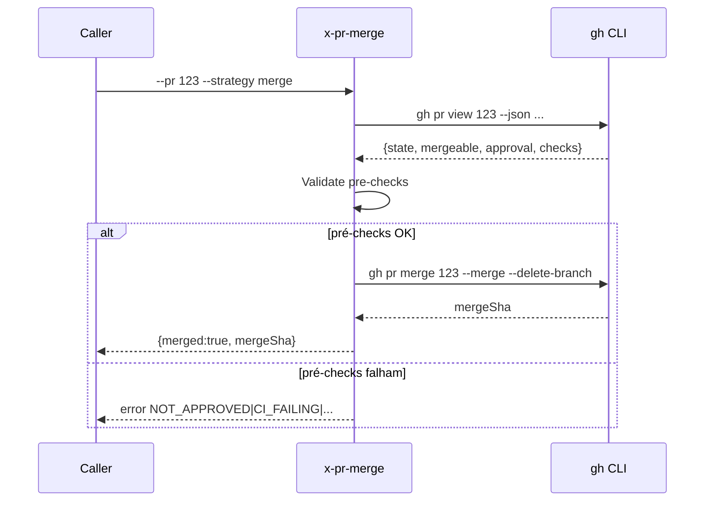
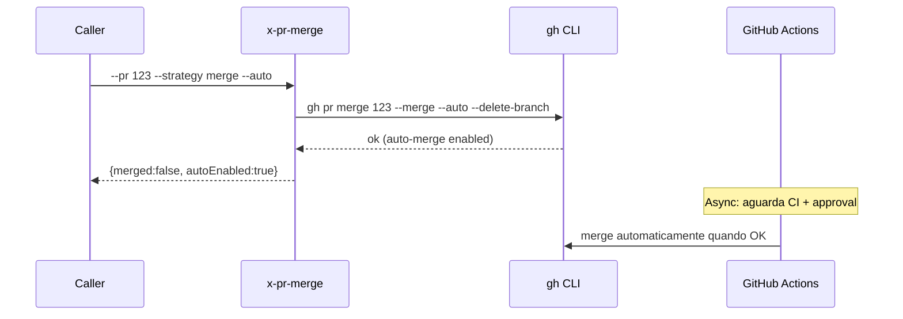

# História: Skill pública `x-pr-merge` com strategy configurável

**ID:** story-0049-0003
**Chave Jira:** —
**Status:** Concluída

## 1. Dependências

| Blocked By | Blocks |
| :--- | :--- |
| — | story-0049-0016, story-0049-0018 |

## 2. Regras Transversais Aplicáveis

| ID | Título |
| :--- | :--- |
| RULE-002 | Auto-merge default ON, target = `epic/XXXX` |
| RULE-004 | Estratégia de merge: preserva history |
| RULE-005 | Thin orchestrator (UseCase pattern) |

## 3. Descrição

Como **orquestrador de épico**, eu quero uma skill pública `x-pr-merge` que mescla uma PR via `gh pr merge` com strategy configurável (merge/squash/rebase), pré-checks de CI/approvals e suporte a auto-merge nativo do GitHub, para que `x-pr-create` possa propagar `--auto-merge <strategy>` e `x-epic-implement` possa mesclar PRs explicitamente sem replicar lógica de polling/wait.

Hoje a invocação `gh pr merge` está embutida em `x-epic-implement` Phase 1.3b (~80 linhas) com lógica ad-hoc de polling e timeout. Esta story extrai para uma skill testável e reusável.

### 3.1 Argumentos

- `--pr <number>` (M) — número da PR
- `--strategy <merge|squash|rebase>` (default `merge`)
- `--delete-branch` (default `true`) — deleta branch após merge
- `--auto` (default `false`) — habilita GitHub native auto-merge (merge quando CI + approvals OK)
- `--wait-timeout-min <N>` (default `60`) — timeout para polling em modo `--auto`

### 3.2 Comportamento

- Verificar estado da PR via `gh pr view <N> --json state,mergeable,reviewDecision,statusCheckRollup`
- Se `state == MERGED`: retornar `merged=true` (idempotente)
- Se `state == CLOSED`: erro `PR_CLOSED`
- Se `--auto`: invocar `gh pr merge <N> --<strategy> --auto --delete-branch` e retornar (GitHub processará async)
- Se sem `--auto`: validar pré-checks (mergeable, approved, CI green); falha → erro detalhado; sucesso → `gh pr merge <N> --<strategy>` síncrono

## 3.5 Entrega de Valor

- **Valor Principal:** Mescla PRs via gh CLI com strategy configurável e pré-checks; habilita auto-merge propagado via `x-pr-create --auto-merge` (chave da RULE-002).
- **Métrica de Sucesso:** Após STORY-0049-0016 e S18, zero invocações de `gh pr merge` direto em SKILL.md fora de `x-pr-merge`. PR auto-merge cycle (create → CI → merge) <= 5 min para PR trivial.
- **Impacto no Negócio:** Habilita o novo fluxo de auto-merge em `epic/XXXX` (RULE-001/002), eliminando merges manuais de cada story PR.

## 4. Definições de Qualidade Locais

### DoR Local

- [ ] Permissões `gh` configuradas no ambiente de teste (`gh auth status` ok)
- [ ] PR de teste descartável disponível para smoke

### DoD Local

- [ ] Skill criada em `pr/x-pr-merge/SKILL.md`
- [ ] 3 strategies suportadas
- [ ] `--auto` mode habilita native GitHub auto-merge
- [ ] Idempotência: PR já mergeada retorna sem erro
- [ ] Pré-checks claros com mensagens estruturadas
- [ ] Smoke test em PR de teste

### Global DoD

- **Cobertura:** ≥ 95% / 90%
- **Testes:** Mocks de `gh` em unit tests + 1 integration test contra PR real (CI gated)
- **Documentação:** Exemplos de uso para cada strategy + modo `--auto`
- **Performance:** `--auto` retorna em < 5s (GitHub processa depois); modo síncrono respeita `--wait-timeout-min`

## 5. Contratos de Dados

### 5.1 Request

| Campo | Tipo | M/O | Validações | Exemplo |
| :--- | :--- | :--- | :--- | :--- |
| `--pr` | `Integer` | M | > 0 | `123` |
| `--strategy` | `Enum` | O | merge/squash/rebase | `merge` |
| `--delete-branch` | `Boolean` | O | — | `true` |
| `--auto` | `Boolean` | O | — | `true` |
| `--wait-timeout-min` | `Integer` | O | 1-600 | `60` |

### 5.2 Response

| Campo | Tipo | Sempre presente | Descrição |
| :--- | :--- | :--- | :--- |
| `merged` | `Boolean` | Sim | true se mergeada (ou se será via auto) |
| `mergeSha` | `String(40)` | Não (apenas modo síncrono) | SHA do merge commit |
| `prState` | `Enum` | Sim | OPEN/MERGED/CLOSED |
| `waitedSec` | `Integer` | Sim | Tempo aguardado em modo síncrono |
| `autoEnabled` | `Boolean` | Sim | true se auto-merge habilitado pelo GitHub |

### 5.3 Error Codes

| Exit Code | Error Code | Condição | Mensagem |
| :--- | :--- | :--- | :--- |
| 1 | `PR_NOT_FOUND` | PR não existe | "PR #N not found" |
| 2 | `PR_CLOSED` | PR foi fechada sem merge | "PR #N is closed" |
| 3 | `NOT_APPROVED` | reviewDecision != APPROVED (modo síncrono) | "PR #N not approved" |
| 4 | `CI_FAILING` | statusCheckRollup tem failures (modo síncrono) | "PR #N has failing checks" |
| 5 | `MERGE_CONFLICT` | mergeable == CONFLICTING | "PR #N has merge conflicts" |
| 6 | `TIMEOUT` | wait timeout em modo síncrono | "Wait timeout after N min" |

## 6. Diagramas

### 6.1 Fluxo modo síncrono (sem --auto)



### 6.2 Fluxo modo auto (--auto)



## 7. Critérios de Aceite (Gherkin)

```gherkin
Cenario: Idempotência — PR já mergeada
  DADO que PR #123 já foi mergeada
  QUANDO invoco x-pr-merge --pr 123
  ENTÃO o exit code é 0
  E o output contém merged=true e prState=MERGED

Cenario: Modo síncrono — pré-checks OK e merge sucesso
  DADO que PR #123 está OPEN, approved, CI green, mergeable=MERGEABLE
  QUANDO invoco x-pr-merge --pr 123 --strategy merge
  ENTÃO gh pr merge é executado com --merge
  E o output contém merged=true, mergeSha não-vazio
  E a branch da PR é deletada

Cenario: Modo --auto — habilita native auto-merge
  DADO que PR #123 está OPEN
  QUANDO invoco x-pr-merge --pr 123 --strategy squash --auto
  ENTÃO gh pr merge é executado com --auto
  E o output contém autoEnabled=true e merged=false
  E a skill retorna em < 5s (não aguarda processo)

Cenario: Erro — PR não aprovada (modo síncrono)
  DADO que PR #123 está OPEN mas sem approvals
  QUANDO invoco x-pr-merge --pr 123 (sem --auto)
  ENTÃO o exit code é 3
  E a mensagem contém "NOT_APPROVED"

Cenario: Boundary — timeout em modo síncrono com PR pendente
  DADO que PR #123 está OPEN, mergeable=UNKNOWN
  E --wait-timeout-min é 1
  QUANDO invoco x-pr-merge --pr 123
  ENTÃO após 1 minuto sem resolução, exit code é 6
  E a mensagem contém "TIMEOUT"
```

### 7.2 Mandatory Categories

- [x] Degenerate (idempotência PR já mergeada)
- [x] Happy path (sync merge sucesso)
- [x] Error paths (NOT_APPROVED, CI_FAILING, TIMEOUT)
- [x] Boundary (timeout no menor valor)

## 8. Tasks

### TASK-0049-0003-001: Skeleton da skill

- **Layer:** Doc
- **Test Type:** Verification
- **Size:** S
- **Dependencies:** —
- **Branch:** `feat/task-0049-0003-001-skeleton`
- **Testability:** Config + VerificationTest
- **Files:**
  - `java/src/main/resources/targets/claude/skills/core/pr/x-pr-merge/SKILL.md`
- **Acceptance Criteria:**
  - [ ] Frontmatter + body skeleton

### TASK-0049-0003-002: Parse args + idempotência (PR já mergeada)

- **Layer:** Domain
- **Test Type:** Unit
- **Size:** M
- **Dependencies:** TASK-0049-0003-001
- **Branch:** `feat/task-0049-0003-002-args-idempotency`
- **Testability:** Domain + UnitTest
- **Files:**
  - `pr/x-pr-merge/SKILL.md`
- **Acceptance Criteria:**
  - [ ] gh pr view consultado uma vez
  - [ ] state==MERGED retorna sem erro

### TASK-0049-0003-003: Pré-checks (mergeable, approval, CI) modo síncrono

- **Layer:** Domain
- **Test Type:** Unit
- **Size:** M
- **Dependencies:** TASK-0049-0003-002
- **Branch:** `feat/task-0049-0003-003-prechecks`
- **Testability:** Domain + UnitTest
- **Files:**
  - `pr/x-pr-merge/SKILL.md`
- **Acceptance Criteria:**
  - [ ] reviewDecision == APPROVED check
  - [ ] statusCheckRollup sem falhas
  - [ ] mergeable == MERGEABLE
  - [ ] Erros estruturados claros

### TASK-0049-0003-004: Implementar 3 strategies + delete-branch

- **Layer:** Adapter
- **Test Type:** Integration
- **Size:** M
- **Dependencies:** TASK-0049-0003-003
- **Branch:** `feat/task-0049-0003-004-strategies`
- **Testability:** Port + Adapter + IT
- **Files:**
  - `pr/x-pr-merge/SKILL.md`
- **Acceptance Criteria:**
  - [ ] gh pr merge --merge / --squash / --rebase
  - [ ] --delete-branch propagado

### TASK-0049-0003-005: Implementar modo `--auto` + polling timeout

- **Layer:** Adapter
- **Test Type:** Integration
- **Size:** M
- **Dependencies:** TASK-0049-0003-004
- **Branch:** `feat/task-0049-0003-005-auto-mode`
- **Testability:** Port + Adapter + IT
- **Files:**
  - `pr/x-pr-merge/SKILL.md`
- **Acceptance Criteria:**
  - [ ] gh pr merge --auto invocado
  - [ ] Polling com timeout no modo síncrono opcional
  - [ ] Erro TIMEOUT após --wait-timeout-min

### TASK-0049-0003-006: Smoke test contra PR real + goldens

- **Layer:** Test
- **Test Type:** Smoke
- **Size:** S
- **Dependencies:** TASK-0049-0003-005
- **Branch:** `feat/task-0049-0003-006-smoke`
- **Testability:** Migration + Smoke
- **Files:**
  - `src/test/.../PrMergeSmokeTest.java`
  - `src/test/resources/golden/pr/x-pr-merge/**`
- **Acceptance Criteria:**
  - [ ] Smoke test gated por env var GITHUB_TOKEN
  - [ ] Goldens passam
  - [ ] Coverage ≥ 95% / 90%
