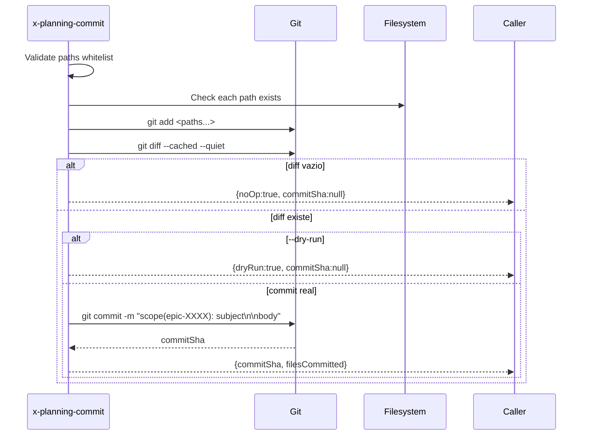

# História: Skill pública `x-planning-commit` para batch de artefatos

**ID:** story-0049-0004
**Chave Jira:** —
**Status:** Concluída

## 1. Dependências

| Blocked By | Blocks |
| :--- | :--- |
| — | story-0049-0021, story-0049-0022 |

## 2. Regras Transversais Aplicáveis

| ID | Título |
| :--- | :--- |
| RULE-007 | Skills de planejamento devem versionar |
| RULE-005 | Thin orchestrator (UseCase pattern) |

## 3. Descrição

Como **skill de planejamento** (`x-epic-create`, `x-story-plan`, etc.), eu quero uma skill pública `x-planning-commit` que commita em batch artefatos `plans/epic-XXXX/**` sem disparar pre-commit chain de código (format/lint/compile), para que cada skill de planejamento possa, no fim da sua execução, versionar seus outputs sem cerimônia.

`x-git-commit` é task-centric e dispara format → lint → compile, o que é overkill (e quebra) para commits puros de docs/markdown/json. `x-planning-commit` é uma sibling skill focada em artefatos sob `plans/`.

### 3.1 Argumentos

- `--scope <chore|docs>` (default `docs`) — tipo do conventional commit
- `--epic-id <ID>` (M) — usado em scope do commit (`docs(epic-XXXX): ...`)
- `--paths <p1,p2,...>` (M) — lista de paths a commitar (relative ao repo root)
- `--subject <msg>` (M) — subject line do commit (max 72 chars)
- `--body <multi-line>` (O) — body opcional
- `--dry-run` (default `false`)

### 3.2 Comportamento

- Pré-check: validar que cada path existe e está sob `plans/` (ou `.claude/templates/`, conforme whitelist)
- `git add` apenas dos paths declarados (nunca `git add .`)
- Detectar se `git diff --cached --quiet` retorna 0 (no diff) → no-op silencioso (`commitSha=null`)
- Construir mensagem: `<scope>(epic-XXXX): <subject>\n\n<body>`
- `git commit` SEM hooks de format/lint/compile (usa `--no-verify`? **Não** — em vez disso, configurar pre-commit hook para skipar paths sob `plans/**`. Ou: skill chama `git commit` direto via Bash sem passar pelo `x-git-commit`)
- Em `--dry-run`: imprime mensagem que seria criada, exit 0

## 3.5 Entrega de Valor

- **Valor Principal:** Permite commits em batch de artefatos de planejamento sem disparar pre-commit chain de código; prerequisito do versionamento das 7 skills de planejamento (S21, S22).
- **Métrica de Sucesso:** Após S21+S22, working tree fica clean após qualquer execução de `x-epic-decompose`, `x-epic-orchestrate`, etc. Zero `git add`/`git commit` direto nessas skills.
- **Impacto no Negócio:** Audit trail completo de quem planejou o quê e quando, hoje invisível ao Git.

## 4. Definições de Qualidade Locais

### DoR Local

- [ ] Whitelist de paths permitidos consolidada (`plans/**`, `.claude/templates/**` se aplicável)
- [ ] Decisão sobre `--no-verify` vs path-skip no hook documentada

### DoD Local

- [ ] Skill criada em `git/x-planning-commit/SKILL.md`
- [ ] Whitelist de paths enforced (rejeita paths fora de `plans/**`)
- [ ] No-op silencioso quando diff vazio
- [ ] `--dry-run` previne qualquer mudança
- [ ] Pelo menos 1 teste para cada cenário (commit normal, no-op, dry-run, path inválido)

### Global DoD

- **Cobertura:** ≥ 95% / 90%
- **Testes:** Goldens + smoke test
- **Documentação:** Exemplos de cada scope (chore vs docs)
- **Performance:** Commit < 1s para batches < 50 arquivos

## 5. Contratos de Dados

### 5.1 Request

| Campo | Tipo | M/O | Validações | Exemplo |
| :--- | :--- | :--- | :--- | :--- |
| `--scope` | `Enum` | O | chore/docs | `docs` |
| `--epic-id` | `String(4)` | M | regex `^\d{4}$` | `0049` |
| `--paths` | `List<String>` | M | cada path em whitelist | `plans/epic-0049/epic-0049.md,plans/epic-0049/IMPLEMENTATION-MAP.md` |
| `--subject` | `String(72)` | M | imperative mood | `add planning artifacts (22 stories)` |
| `--body` | `String(4096)` | O | — | `Generated by /x-epic-decompose` |
| `--dry-run` | `Boolean` | O | — | `false` |

### 5.2 Response

| Campo | Tipo | Sempre presente | Descrição |
| :--- | :--- | :--- | :--- |
| `commitSha` | `String(40)` | Não (null se no-op ou dry-run) | SHA do commit |
| `filesCommitted` | `List<String>` | Sim | Paths efetivamente commitados |
| `noOp` | `Boolean` | Sim | true se diff vazio |
| `dryRun` | `Boolean` | Sim | true se --dry-run |

### 5.3 Error Codes

| Exit Code | Error Code | Condição | Mensagem |
| :--- | :--- | :--- | :--- |
| 1 | `PATH_NOT_WHITELISTED` | path fora de plans/ ou .claude/templates/ | "Path '<p>' not in whitelist" |
| 2 | `PATH_NOT_EXISTS` | path não existe no working tree | "Path '<p>' does not exist" |
| 3 | `INVALID_EPIC_ID` | --epic-id não tem 4 dígitos | "Epic ID must be 4 digits" |
| 4 | `COMMIT_FAILED` | git commit retornou erro | "git commit failed: <stderr>" |

## 6. Diagramas

### 6.1 Fluxo de commit batch



## 7. Critérios de Aceite (Gherkin)

```gherkin
Cenario: No-op — paths sem diff
  DADO que plans/epic-0049/epic-0049.md está sem mudanças
  QUANDO invoco x-planning-commit --epic-id 0049 --paths plans/epic-0049/epic-0049.md --subject "no-op"
  ENTÃO o exit code é 0
  E o output contém noOp=true e commitSha=null

Cenario: Commit batch de múltiplos arquivos
  DADO que plans/epic-0049/epic-0049.md e plans/epic-0049/IMPLEMENTATION-MAP.md foram modificados
  QUANDO invoco x-planning-commit --epic-id 0049 --paths plans/epic-0049/epic-0049.md,plans/epic-0049/IMPLEMENTATION-MAP.md --subject "add map"
  ENTÃO um único commit é criado contendo os 2 arquivos
  E a mensagem do commit é "docs(epic-0049): add map"
  E o output contém commitSha não-vazio

Cenario: Erro — path fora da whitelist
  DADO que invoco com --paths src/main/java/Foo.java
  QUANDO a skill executa
  ENTÃO o exit code é 1
  E a mensagem contém "PATH_NOT_WHITELISTED"

Cenario: Erro — epic-id mal formado
  DADO que invoco com --epic-id 49
  QUANDO a skill executa
  ENTÃO o exit code é 3
  E a mensagem contém "INVALID_EPIC_ID"

Cenario: Boundary — dry-run com paths válidos e diff existente
  DADO que plans/epic-0049/epic-0049.md foi modificado
  QUANDO invoco x-planning-commit --epic-id 0049 --paths plans/epic-0049/epic-0049.md --subject "preview" --dry-run true
  ENTÃO o exit code é 0
  E o output contém dryRun=true
  E NENHUM commit é criado no log
```

### 7.2 Mandatory Categories

- [x] Degenerate (no-op)
- [x] Happy path (commit batch)
- [x] Error paths (path inválido, epic-id inválido)
- [x] Boundary (dry-run com diff)

## 8. Tasks

### TASK-0049-0004-001: Skeleton da skill

- **Layer:** Doc
- **Test Type:** Verification
- **Size:** S
- **Dependencies:** —
- **Branch:** `feat/task-0049-0004-001-skeleton`
- **Testability:** Config + VerificationTest
- **Files:**
  - `java/src/main/resources/targets/claude/skills/core/git/x-planning-commit/SKILL.md`
- **Acceptance Criteria:**
  - [ ] Frontmatter + body skeleton

### TASK-0049-0004-002: Validação de whitelist + parse de args

- **Layer:** Domain
- **Test Type:** Unit
- **Size:** M
- **Dependencies:** TASK-0049-0004-001
- **Branch:** `feat/task-0049-0004-002-whitelist`
- **Testability:** Domain + UnitTest
- **Files:**
  - `git/x-planning-commit/SKILL.md`
- **Acceptance Criteria:**
  - [ ] Whitelist enforced
  - [ ] Erros estruturados

### TASK-0049-0004-003: Detecção de no-op (diff vazio) + dry-run

- **Layer:** Domain
- **Test Type:** Unit
- **Size:** M
- **Dependencies:** TASK-0049-0004-002
- **Branch:** `feat/task-0049-0004-003-noop-dryrun`
- **Testability:** Domain + UnitTest
- **Files:**
  - `git/x-planning-commit/SKILL.md`
- **Acceptance Criteria:**
  - [ ] git diff --cached --quiet check
  - [ ] no-op retorna sem erro
  - [ ] dry-run não altera nada

### TASK-0049-0004-004: Implementar git commit (sem pre-commit chain)

- **Layer:** Adapter
- **Test Type:** Integration
- **Size:** M
- **Dependencies:** TASK-0049-0004-003
- **Branch:** `feat/task-0049-0004-004-commit`
- **Testability:** Port + Adapter + IT
- **Files:**
  - `git/x-planning-commit/SKILL.md`
- **Acceptance Criteria:**
  - [ ] git add <paths> sem `git add .`
  - [ ] git commit sem disparar format/lint/compile
  - [ ] commitSha capturado
  - [ ] Mensagem segue Conventional Commits

### TASK-0049-0004-005: Smoke test + goldens

- **Layer:** Test
- **Test Type:** Smoke
- **Size:** S
- **Dependencies:** TASK-0049-0004-004
- **Branch:** `feat/task-0049-0004-005-smoke`
- **Testability:** Migration + Smoke
- **Files:**
  - `src/test/.../PlanningCommitSmokeTest.java`
  - `src/test/resources/golden/git/x-planning-commit/**`
- **Acceptance Criteria:**
  - [ ] Smoke commit + revert via fixture branch
  - [ ] Goldens passam
  - [ ] Coverage ≥ 95% / 90%
