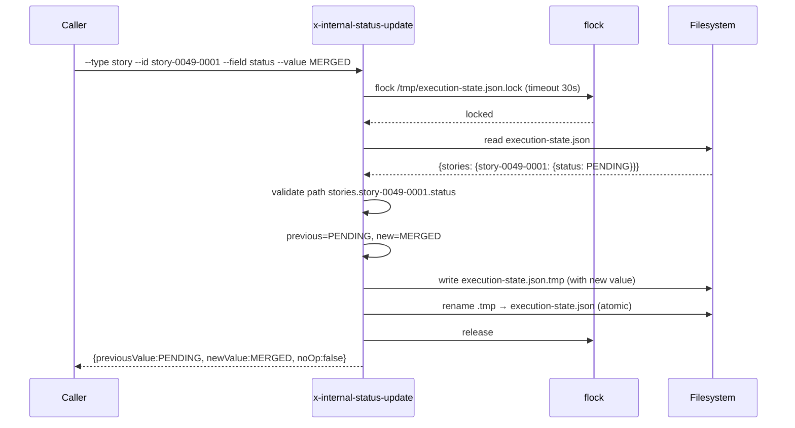

# História: Skill interna `x-internal-status-update` (story PILOTO da convenção `x-internal-*`)

**ID:** story-0049-0005
**Chave Jira:** —
**Status:** Concluída

## 1. Dependências

| Blocked By | Blocks |
| :--- | :--- |
| — | story-0049-0013, story-0049-0018, story-0049-0019 |

## 2. Regras Transversais Aplicáveis

| ID | Título |
| :--- | :--- |
| RULE-005 | Thin orchestrator (UseCase pattern) |
| RULE-006 | Convenção `x-internal-*` para skills internas |
| RULE-010 | Skills internas pequenas (token budget) |

## 3. Descrição

Como **arquiteto da plataforma**, eu quero criar a primeira skill interna seguindo a convenção `x-internal-*` (frontmatter, subdir, marker visível 🔒), implementando a operação atômica de read-modify-write de `execution-state.json`, para que esta story sirva de **referência canônica** para todas as 10 outras skills internas do épico (S6-S15) e estabeleça o padrão na codebase.

Esta é uma **story PILOTO da convenção**: o reviewer dela define o "what good looks like" para os subdir naming, frontmatter, marker, e generator filtering. Subsequentes seguem por imitação.

### 3.1 Funcionalidade

Read-modify-write atômico de `execution-state.json` com lock + schema validation. Substitui edição inline `Edit` em `x-epic-implement`, `x-story-implement`, `x-pr-fix-epic` que hoje sofre race condition em modo `--parallel`.

### 3.2 Argumentos

- `--file <path>` (M, default `execution-state.json` no cwd)
- `--type <epic|story|task>` (M)
- `--id <id>` (M) — epic ID, story ID, ou task ID
- `--field <name>` (M) — campo a atualizar (ex: `status`, `prNumber`, `commitSha`)
- `--value <value>` (M) — novo valor (string, será coerced ao tipo do schema)
- `--initialize` (default `false`) — cria file se não existe
- `--read-only` (default `false`) — apenas lê e retorna o valor atual

### 3.3 Comportamento

- Se file não existe e `--initialize=false`: erro `FILE_NOT_FOUND`
- Se file não existe e `--initialize=true`: cria com schema base
- Adquire lock via flock (`/tmp/<file>.lock`) com timeout 30s
- Lê file completo, valida schema básico (campo `version` presente)
- Localiza nó pelo path `stories.<id>.<field>` ou `stories.<id>.tasks.<id>.<field>` ou `<field>` (top-level se `--type epic`)
- Se valor atual == valor novo: no-op silencioso (`previousValue == newValue`)
- Atualiza JSON, salva atomicamente (tmp file + rename)
- Libera lock

### 3.4 Convenção `x-internal-*` aplicada

- Path: `internal/ops/x-internal-status-update/SKILL.md`
- Frontmatter:
  ```yaml
  name: x-internal-status-update
  description: Atomic read-modify-write of execution-state.json
  visibility: internal
  user-invocable: false
  allowed-tools: Bash
  ```
- Body inicia com bloco visível:
  ```markdown
  > 🔒 **INTERNAL SKILL**
  > Esta skill é invocada apenas por outras skills (orquestradores).
  > NÃO é destinada a invocação direta pelo usuário.
  > Caller principal: x-epic-implement, x-story-implement, x-pr-fix-epic
  ```

## 3.5 Entrega de Valor

- **Valor Principal:** Estabelece a convenção `x-internal-*` no repositório (Rule 22 piloto) e provê escrita atômica de `execution-state.json` reutilizável por todos os orquestradores. **Esta story é o BLUEPRINT** das outras 10 internas.
- **Métrica de Sucesso:** Após STORY-0049-0005 mergeada, S6-S15 conseguem ser desenvolvidas em paralelo sem ambiguidade sobre estrutura. Audit Rule 22 retorna 0 violações para `x-internal-status-update`.
- **Impacto no Negócio:** Elimina race conditions documentadas em modo `--parallel` (perda de updates em execution-state.json reportadas em EPIC-0042); plataforma ganha vocabulário comum ("internal vs public skill").

## 4. Definições de Qualidade Locais

### DoR Local

- [ ] Decisão sobre formato de lock (flock vs file create) finalizada
- [ ] Schema mínimo de execution-state.json documentado (referenciar checkpoint-schema.md)
- [ ] Path de subdir convention `internal/ops/` aprovada

### DoD Local

- [ ] Skill criada em `internal/ops/x-internal-status-update/SKILL.md`
- [ ] Frontmatter `visibility: internal` + `user-invocable: false`
- [ ] Block 🔒 INTERNAL SKILL visível no body
- [ ] Generator filtra a skill do `/help` menu (verificar pós-regen)
- [ ] Lock funcional (concurrent invocations não corrompem o file)
- [ ] Schema validation (rejeita `--field` inexistente)
- [ ] Idempotência (no-op se valor não muda)
- [ ] Modo `--read-only` funcional
- [ ] Pelo menos 4 testes (write, no-op, read-only, lock contention)

### Global DoD

- **Cobertura:** ≥ 95% / 90%
- **Testes:** Unit (schema, value coercion) + integration (lock contention via 2 processes)
- **Documentação:** SKILL.md com exemplos para cada tipo (epic, story, task)
- **Performance:** Read-modify-write < 100ms para state files até 1MB

## 5. Contratos de Dados

### 5.1 Request

| Campo | Tipo | M/O | Validações | Exemplo |
| :--- | :--- | :--- | :--- | :--- |
| `--file` | `String` | O | path válido | `execution-state.json` |
| `--type` | `Enum` | M | epic/story/task | `story` |
| `--id` | `String` | M | format por tipo | `story-0049-0001` |
| `--field` | `String` | M | campo do schema | `status` |
| `--value` | `String` | M | coerced ao schema | `MERGED` |
| `--initialize` | `Boolean` | O | — | `false` |
| `--read-only` | `Boolean` | O | — | `false` |

### 5.2 Response

| Campo | Tipo | Sempre presente | Descrição |
| :--- | :--- | :--- | :--- |
| `previousValue` | `String\|Null` | Sim | Valor anterior (null se field absente antes) |
| `newValue` | `String` | Sim | Valor após write (igual a previous se no-op) |
| `fileSha` | `String(64)` | Sim | sha256 do file pós-write |
| `noOp` | `Boolean` | Sim | true se previous == new |

### 5.3 Error Codes

| Exit Code | Error Code | Condição | Mensagem |
| :--- | :--- | :--- | :--- |
| 1 | `FILE_NOT_FOUND` | file inexistente sem --initialize | "State file not found: <path>" |
| 2 | `LOCK_TIMEOUT` | lock não obtido em 30s | "Lock timeout on <path>.lock" |
| 3 | `INVALID_PATH` | --type/--id/--field não resolvem nó válido | "Path '<...>' not found in schema" |
| 4 | `WRITE_FAILED` | rename do tmp file falhou | "Atomic write failed: <stderr>" |

## 6. Diagramas

### 6.1 Fluxo atômico read-modify-write



## 7. Critérios de Aceite (Gherkin)

```gherkin
Cenario: No-op — valor não muda
  DADO que execution-state.json contém stories.story-0049-0001.status=MERGED
  QUANDO invoco x-internal-status-update --type story --id story-0049-0001 --field status --value MERGED
  ENTÃO o exit code é 0
  E o output contém noOp=true e previousValue==newValue

Cenario: Write atômico bem-sucedido
  DADO que execution-state.json contém stories.story-0049-0001.status=PENDING
  QUANDO invoco x-internal-status-update --type story --id story-0049-0001 --field status --value MERGED
  ENTÃO o file é atualizado atomicamente
  E o output contém previousValue=PENDING, newValue=MERGED, noOp=false
  E fileSha reflete o novo conteúdo

Cenario: Erro — file inexistente sem --initialize
  DADO que execution-state.json não existe
  QUANDO invoco x-internal-status-update --type epic --id 0049 --field flowVersion --value 2
  ENTÃO o exit code é 1
  E a mensagem contém "FILE_NOT_FOUND"

Cenario: Erro — path inválido no schema
  DADO que execution-state.json existe mas não contém stories.unknown-story
  QUANDO invoco x-internal-status-update --type story --id unknown-story --field status --value DONE
  ENTÃO o exit code é 3
  E a mensagem contém "INVALID_PATH"

Cenario: Boundary — concurrent invocations não corrompem state
  DADO que 2 processos invocam a skill simultaneamente em campos distintos
  QUANDO ambos completam
  ENTÃO ambos os updates aparecem no file final (sem perda)
  E o file é JSON válido
```

### 7.2 Mandatory Categories

- [x] Degenerate (no-op)
- [x] Happy path (write)
- [x] Error paths (FILE_NOT_FOUND, INVALID_PATH)
- [x] Boundary (concurrent locks)

## 8. Tasks

### TASK-0049-0005-001: Skeleton seguindo convenção `x-internal-*`

- **Layer:** Doc
- **Test Type:** Verification
- **Size:** S
- **Dependencies:** —
- **Branch:** `feat/task-0049-0005-001-internal-convention`
- **Testability:** Config + VerificationTest
- **Files:**
  - `java/src/main/resources/targets/claude/skills/core/internal/ops/x-internal-status-update/SKILL.md`
- **Acceptance Criteria:**
  - [ ] Frontmatter completo: visibility: internal, user-invocable: false
  - [ ] Block 🔒 INTERNAL SKILL no body
  - [ ] Path em `internal/ops/`
  - [ ] Skill NÃO aparece em `/help` após regenerate

### TASK-0049-0005-002: Implementar lock + read

- **Layer:** Adapter
- **Test Type:** Integration
- **Size:** M
- **Dependencies:** TASK-0049-0005-001
- **Branch:** `feat/task-0049-0005-002-lock-read`
- **Testability:** Port + Adapter + IT
- **Files:**
  - `internal/ops/x-internal-status-update/SKILL.md`
- **Acceptance Criteria:**
  - [ ] flock com timeout 30s
  - [ ] Read JSON validado

### TASK-0049-0005-003: Implementar resolve de path + idempotência

- **Layer:** Domain
- **Test Type:** Unit
- **Size:** M
- **Dependencies:** TASK-0049-0005-002
- **Branch:** `feat/task-0049-0005-003-resolve-path`
- **Testability:** Domain + UnitTest
- **Files:**
  - `internal/ops/x-internal-status-update/SKILL.md`
- **Acceptance Criteria:**
  - [ ] Resolve `epic.<field>`, `stories.<id>.<field>`, `stories.<id>.tasks.<id>.<field>`
  - [ ] No-op detectado quando previous == new

### TASK-0049-0005-004: Implementar write atômico (tmp + rename)

- **Layer:** Adapter
- **Test Type:** Integration
- **Size:** M
- **Dependencies:** TASK-0049-0005-003
- **Branch:** `feat/task-0049-0005-004-atomic-write`
- **Testability:** Port + Adapter + IT
- **Files:**
  - `internal/ops/x-internal-status-update/SKILL.md`
- **Acceptance Criteria:**
  - [ ] Escrita em `.tmp` + rename
  - [ ] Lock liberado mesmo em erro

### TASK-0049-0005-005: Test de concurrency + smoke + goldens

- **Layer:** Test
- **Test Type:** Integration
- **Size:** M
- **Dependencies:** TASK-0049-0005-004
- **Branch:** `feat/task-0049-0005-005-concurrency`
- **Testability:** Port + Adapter + IT
- **Files:**
  - `src/test/.../StatusUpdateConcurrencyTest.java`
  - `src/test/resources/golden/internal/ops/x-internal-status-update/**`
- **Acceptance Criteria:**
  - [ ] 2 processes concorrentes em campos distintos não perdem updates
  - [ ] Goldens passam
  - [ ] Coverage ≥ 95% / 90%
