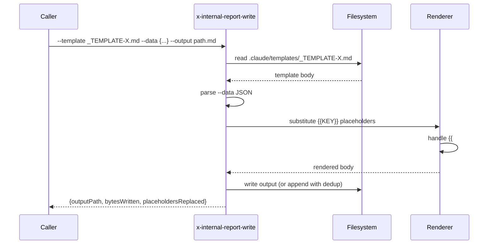

# História: Skill interna `x-internal-report-write` para render de templates

**ID:** story-0049-0006
**Chave Jira:** —
**Status:** Concluída

## 1. Dependências

| Blocked By | Blocks |
| :--- | :--- |
| — | story-0049-0009, story-0049-0010, story-0049-0015 |

## 2. Regras Transversais Aplicáveis

| ID | Título |
| :--- | :--- |
| RULE-005 | Thin orchestrator (UseCase pattern) |
| RULE-006 | Convenção `x-internal-*` para skills internas |
| RULE-010 | Skills internas pequenas (token budget) |

## 3. Descrição

Como **orquestrador**, eu quero uma skill interna `x-internal-report-write` que renderiza um template `_TEMPLATE-*.md` substituindo placeholders `{{KEY}}` por valores estruturados (JSON), para centralizar a geração de phase reports, epic execution reports e planning reports em vez de duplicar `Read template + Write output` em N skills.

### 3.1 Argumentos

- `--template <name>` (M) — nome do template em `.claude/templates/` (ex: `_TEMPLATE-EPIC-EXECUTION-PLAN.md`)
- `--output <path>` (M) — path do arquivo de saída
- `--data <json>` (M) — JSON inline ou path para JSON file (`@path/to/data.json`)
- `--append` (default `false`) — anexa em vez de sobrescrever (com de-duplicação por ID)

### 3.2 Comportamento

- Lê template do path resolvido
- Parse data (JSON inline ou file)
- Substitui placeholders `{{KEY}}` (recursivos: `{{stories.story-0049-0001.status}}`)
- Suporta loops básicos: `{{#each stories}}...{{/each}}` (handlebars-like)
- Em `--append` com seção `## ID: <id>`, detecta entradas existentes e atualiza em vez de duplicar
- Escreve `--output` (sobrescrevendo ou anexando)

## 3.5 Entrega de Valor

- **Valor Principal:** Centraliza render de reports a partir de templates `_TEMPLATE-*.md`, eliminando edição inline duplicada em 3+ skills (`x-epic-implement`, `x-epic-orchestrate`, `x-story-implement`).
- **Métrica de Sucesso:** Após S9, S10, S15: zero ocorrências de `Read _TEMPLATE-*.md + Write` em SKILL.md de orquestradores. Templates podem evoluir sem editar N skills.
- **Impacto no Negócio:** Reports consistentes (mesma estrutura) entre épicos; mudanças em templates propagam automaticamente.

## 4. Definições de Qualidade Locais

### DoR Local

- [ ] Sintaxe de placeholders decidida (`{{KEY}}` simples + `{{#each}}` para loops)
- [ ] Convenção de ID para `--append` definida (`## ID: <value>` no markdown)

### DoD Local

- [ ] Skill criada em `internal/ops/x-internal-report-write/SKILL.md` seguindo convenção S5
- [ ] Substitui placeholders simples e nested
- [ ] Suporta `{{#each}}` básico
- [ ] Modo `--append` com de-duplicação por ID
- [ ] Erro claro quando template não existe ou data malformado

### Global DoD

- **Cobertura:** ≥ 95% / 90%
- **Documentação:** Exemplos para cada tipo de template usado pelo épico
- **Performance:** Render < 200ms para templates < 50KB

## 5. Contratos de Dados

### 5.1 Request

| Campo | Tipo | M/O | Validações | Exemplo |
| :--- | :--- | :--- | :--- | :--- |
| `--template` | `String` | M | file existe em `.claude/templates/` | `_TEMPLATE-EPIC-EXECUTION-PLAN.md` |
| `--output` | `String` | M | path writable | `plans/epic-0049/reports/exec-plan.md` |
| `--data` | `String` | M | JSON válido (inline ou @path) | `{"epicId":"0049","stories":[...]}` |
| `--append` | `Boolean` | O | — | `false` |

### 5.2 Response

| Campo | Tipo | Sempre presente | Descrição |
| :--- | :--- | :--- | :--- |
| `outputPath` | `String` | Sim | Path final do arquivo |
| `bytesWritten` | `Integer` | Sim | Tamanho final |
| `placeholdersReplaced` | `Integer` | Sim | Contagem de substituições |
| `entriesAppended` | `Integer` | Não (apenas --append) | Novas entradas (não duplicadas) |

### 5.3 Error Codes

| Exit Code | Error Code | Condição | Mensagem |
| :--- | :--- | :--- | :--- |
| 1 | `TEMPLATE_NOT_FOUND` | template não existe | "Template '<name>' not found in .claude/templates/" |
| 2 | `INVALID_JSON` | --data não parseia | "Invalid JSON in --data" |
| 3 | `UNRESOLVED_PLACEHOLDER` | placeholder sem valor em data | "Placeholder '{{KEY}}' has no value (strict mode)" |
| 4 | `WRITE_FAILED` | erro de IO no output | "Failed to write <path>" |

## 6. Diagramas

### 6.1 Fluxo de render



## 7. Critérios de Aceite (Gherkin)

```gherkin
Cenario: Render simples sem loops
  DADO que template contém "Epic: {{epicId}}"
  E data é {"epicId":"0049"}
  QUANDO invoco x-internal-report-write
  ENTÃO output contém "Epic: 0049"

Cenario: Render com loop {{#each}}
  DADO que template contém "{{#each stories}}- {{id}}\n{{/each}}"
  E data é {"stories":[{"id":"story-0049-0001"},{"id":"story-0049-0002"}]}
  QUANDO invoco a skill
  ENTÃO output contém "- story-0049-0001\n- story-0049-0002\n"

Cenario: Modo --append com de-duplicação
  DADO que output já contém "## ID: story-0049-0001\nstatus: PENDING"
  E data é {"id":"story-0049-0001","status":"DONE"}
  QUANDO invoco com --append true
  ENTÃO a entrada existente é atualizada (não duplicada)
  E o output contém "status: DONE" e NÃO contém "status: PENDING"

Cenario: Erro — template inexistente
  DADO que template "_TEMPLATE-NONEXISTENT.md" não existe
  QUANDO invoco a skill
  ENTÃO exit code é 1
  E mensagem contém "TEMPLATE_NOT_FOUND"

Cenario: Boundary — placeholder não resolvido em modo strict
  DADO que template contém "{{undefined_key}}"
  E data não contém undefined_key
  QUANDO invoco a skill
  ENTÃO exit code é 3
  E mensagem contém "UNRESOLVED_PLACEHOLDER"
```

### 7.2 Mandatory Categories

- [x] Degenerate (placeholder simples)
- [x] Happy path (loop com data)
- [x] Error paths (TEMPLATE_NOT_FOUND, INVALID_JSON)
- [x] Boundary (placeholder não resolvido)

## 8. Tasks

### TASK-0049-0006-001: Skeleton seguindo convenção S5

- **Layer:** Doc · **Test Type:** Verification · **Size:** S · **Dependencies:** —
- **Branch:** `feat/task-0049-0006-001-skeleton`
- **Testability:** Config + VerificationTest
- **Files:** `internal/ops/x-internal-report-write/SKILL.md`
- **Acceptance Criteria:** Frontmatter visibility:internal + block 🔒

### TASK-0049-0006-002: Parser de placeholders simples `{{KEY}}`

- **Layer:** Domain · **Test Type:** Unit · **Size:** M · **Dependencies:** TASK-0049-0006-001
- **Branch:** `feat/task-0049-0006-002-simple-placeholders`
- **Testability:** Domain + UnitTest
- **Files:** `internal/ops/x-internal-report-write/SKILL.md`
- **Acceptance Criteria:** Substitui `{{key}}` e `{{nested.key}}`; erro UNRESOLVED claro

### TASK-0049-0006-003: Suporte a `{{#each}}` loops

- **Layer:** Domain · **Test Type:** Unit · **Size:** M · **Dependencies:** TASK-0049-0006-002
- **Branch:** `feat/task-0049-0006-003-each-loops`
- **Testability:** Domain + UnitTest
- **Files:** `internal/ops/x-internal-report-write/SKILL.md`
- **Acceptance Criteria:** Loops básicos com array de objetos; placeholder dentro do loop resolvido

### TASK-0049-0006-004: Modo --append com de-duplicação por ID

- **Layer:** Adapter · **Test Type:** Integration · **Size:** M · **Dependencies:** TASK-0049-0006-003
- **Branch:** `feat/task-0049-0006-004-append-dedup`
- **Testability:** Port + Adapter + IT
- **Files:** `internal/ops/x-internal-report-write/SKILL.md`
- **Acceptance Criteria:** Detecta seções `## ID: <x>` e atualiza in-place

### TASK-0049-0006-005: Goldens + smoke

- **Layer:** Test · **Test Type:** Smoke · **Size:** S · **Dependencies:** TASK-0049-0006-004
- **Branch:** `feat/task-0049-0006-005-smoke`
- **Testability:** Migration + Smoke
- **Files:** `src/test/.../ReportWriteSmokeTest.java`, `src/test/resources/golden/internal/ops/x-internal-report-write/**`
- **Acceptance Criteria:** Goldens passam; coverage ≥ 95% / 90%
