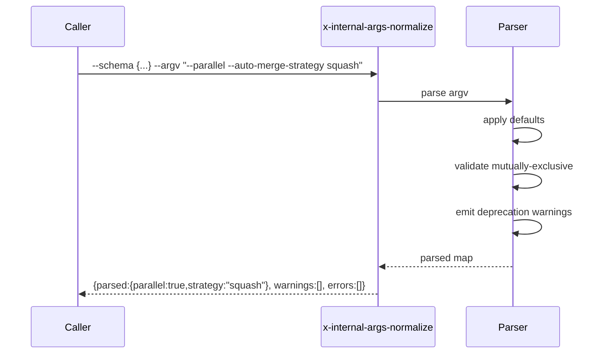

# História: Skill interna `x-internal-args-normalize` para parser genérico

**ID:** story-0049-0007
**Chave Jira:** —
**Status:** Pendente

## 1. Dependências

| Blocked By | Blocks |
| :--- | :--- |
| — | story-0049-0018, story-0049-0019 |

## 2. Regras Transversais Aplicáveis

| ID | Título |
| :--- | :--- |
| RULE-005 | Thin orchestrator (UseCase pattern) |
| RULE-006 | Convenção `x-internal-*` para skills internas |
| RULE-010 | Skills internas pequenas (token budget) |

## 3. Descrição

Como **orquestrador** (`x-epic-implement`, `x-story-implement`), eu quero uma skill interna `x-internal-args-normalize` que faz parsing genérico de argv contra um schema JSON com defaults, mutually-exclusive groups e deprecation warnings, para extrair ~150 linhas de parsing inline de cada orquestrador e padronizar o tratamento de flags.

### 3.1 Argumentos

- `--schema <json>` (M) — schema descrevendo flags válidas (inline ou @file)
- `--argv <string>` (M) — string de argv original a parsear

### 3.2 Schema example

```json
{
  "flags": [
    {"name": "--parallel", "type": "boolean", "default": false},
    {"name": "--auto-merge-strategy", "type": "enum", "values": ["merge","squash","rebase"], "default": "merge"},
    {"name": "--no-merge", "type": "boolean", "deprecated": "use --auto-merge=false"}
  ],
  "mutuallyExclusive": [
    ["--auto-merge", "--no-merge", "--interactive-merge"]
  ]
}
```

### 3.3 Comportamento

- Parse argv (string Bash-like)
- Aplicar defaults para flags ausentes
- Validar mutually-exclusive groups
- Validar enum values
- Emitir warnings para flags `deprecated`
- Coercion de tipos (string → boolean/integer/enum)

## 3.5 Entrega de Valor

- **Valor Principal:** Permite remover ~150 linhas de parsing inline de `x-epic-implement` (e similar de `x-story-implement`) e padroniza validação de flags.
- **Métrica de Sucesso:** Após S18+S19, x-epic-implement e x-story-implement não têm mais código inline de parsing de argv.
- **Impacto no Negócio:** Flags entre orquestradores são consistentes (mesma sintaxe de erro), facilitando UX.

## 4. Definições de Qualidade Locais

### DoR Local

- [ ] Schema JSON Schema definido (qual é o meta-schema do schema?)

### DoD Local

- [ ] Skill em `internal/lib/x-internal-args-normalize/SKILL.md`
- [ ] Suporta types: boolean, string, integer, enum
- [ ] Mutually-exclusive enforcement
- [ ] Deprecation warnings
- [ ] Defaults aplicados

### Global DoD

- **Cobertura:** ≥ 95% / 90%
- **Performance:** Parse < 50ms para schemas com ~30 flags

## 5. Contratos de Dados

### 5.1 Request

| Campo | Tipo | M/O | Validações | Exemplo |
| :--- | :--- | :--- | :--- | :--- |
| `--schema` | `String\|@path` | M | JSON válido | `{...}` |
| `--argv` | `String` | M | Bash-quoted argv | `"--parallel --auto-merge-strategy squash"` |

### 5.2 Response

| Campo | Tipo | Sempre presente | Descrição |
| :--- | :--- | :--- | :--- |
| `parsed` | `Object` | Sim | Mapa de flag → valor (após defaults) |
| `warnings` | `List<String>` | Sim | Warnings (deprecation, etc) |
| `errors` | `List<String>` | Sim | Erros de validação (vazio em sucesso) |

### 5.3 Error Codes

| Exit Code | Error Code | Condição | Mensagem |
| :--- | :--- | :--- | :--- |
| 1 | `INVALID_SCHEMA` | schema malformado | "Schema validation failed: <detail>" |
| 2 | `MUTUALLY_EXCLUSIVE` | múltiplos flags do grupo | "Flags X, Y are mutually exclusive" |
| 3 | `UNKNOWN_FLAG` | flag não declarada no schema | "Unknown flag '--xxx'" |
| 4 | `INVALID_ENUM_VALUE` | valor fora do allowed set | "Invalid value 'X' for --flag (allowed: ...)" |

## 6. Diagramas



## 7. Critérios de Aceite (Gherkin)

```gherkin
Cenario: Defaults aplicados
  DADO schema {flags:[{name:"--strategy", default:"merge"}]}
  E argv vazio
  QUANDO invoco a skill
  ENTÃO parsed contém {strategy:"merge"}

Cenario: Parse argv simples
  DADO schema válido
  E argv "--parallel --strategy squash"
  QUANDO invoco a skill
  ENTÃO parsed contém {parallel:true, strategy:"squash"}

Cenario: Erro — mutually exclusive
  DADO schema com mutuallyExclusive [["--auto-merge","--no-merge"]]
  E argv "--auto-merge --no-merge"
  QUANDO invoco a skill
  ENTÃO exit code é 2
  E errors contém "Flags --auto-merge, --no-merge are mutually exclusive"

Cenario: Warning — flag deprecated
  DADO schema com flag {name:"--no-merge", deprecated:"use --auto-merge=false"}
  E argv "--no-merge"
  QUANDO invoco a skill
  ENTÃO exit code é 0
  E warnings contém "use --auto-merge=false"

Cenario: Boundary — enum invalid value
  DADO schema com flag {name:"--strategy", type:"enum", values:["merge","squash"]}
  E argv "--strategy invalid"
  QUANDO invoco a skill
  ENTÃO exit code é 4
  E errors contém "Invalid value 'invalid' for --strategy"
```

### 7.2 Mandatory Categories

- [x] Degenerate (defaults)
- [x] Happy path (parse simples)
- [x] Error paths (mutually exclusive, enum invalid)
- [x] Boundary (deprecation warning)

## 8. Tasks

### TASK-0049-0007-001: Skeleton

- **Layer:** Doc · **Test Type:** Verification · **Size:** S · **Dependencies:** —
- **Branch:** `feat/task-0049-0007-001-skeleton`
- **Testability:** Config + VerificationTest
- **Files:** `internal/lib/x-internal-args-normalize/SKILL.md`

### TASK-0049-0007-002: Parser de argv + types boolean/string

- **Layer:** Domain · **Test Type:** Unit · **Size:** M · **Dependencies:** TASK-0049-0007-001
- **Branch:** `feat/task-0049-0007-002-parser-base`
- **Testability:** Domain + UnitTest
- **Files:** `internal/lib/x-internal-args-normalize/SKILL.md`

### TASK-0049-0007-003: Types integer + enum + defaults

- **Layer:** Domain · **Test Type:** Unit · **Size:** M · **Dependencies:** TASK-0049-0007-002
- **Branch:** `feat/task-0049-0007-003-types-defaults`
- **Testability:** Domain + UnitTest
- **Files:** `internal/lib/x-internal-args-normalize/SKILL.md`

### TASK-0049-0007-004: Mutually-exclusive + deprecation warnings

- **Layer:** Domain · **Test Type:** Unit · **Size:** M · **Dependencies:** TASK-0049-0007-003
- **Branch:** `feat/task-0049-0007-004-validation`
- **Testability:** Domain + UnitTest
- **Files:** `internal/lib/x-internal-args-normalize/SKILL.md`

### TASK-0049-0007-005: Goldens + integration test

- **Layer:** Test · **Test Type:** Smoke · **Size:** S · **Dependencies:** TASK-0049-0007-004
- **Branch:** `feat/task-0049-0007-005-smoke`
- **Testability:** Migration + Smoke
- **Files:** `src/test/.../ArgsNormalizeSmokeTest.java`, `src/test/resources/golden/internal/lib/**`
