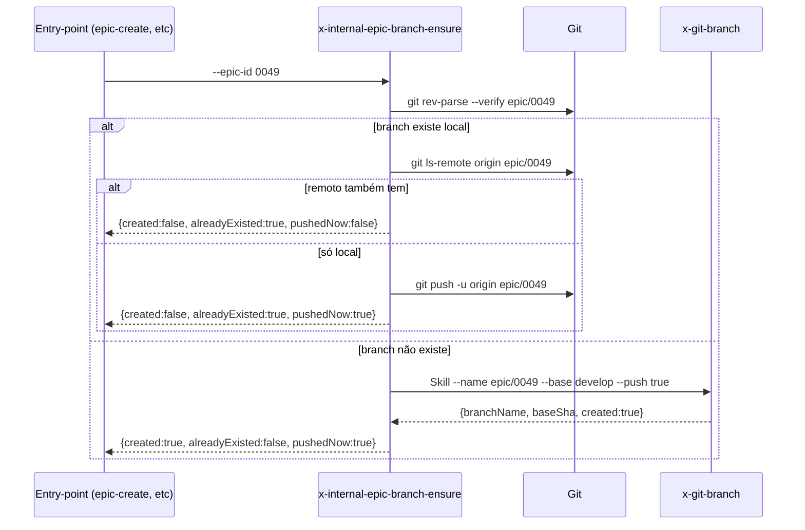

# História: Skill interna `x-internal-epic-branch-ensure` (idempotente)

**ID:** story-0049-0008
**Chave Jira:** —
**Status:** Pendente

## 1. Dependências

| Blocked By | Blocks |
| :--- | :--- |
| story-0049-0001 | story-0049-0018, story-0049-0021, story-0049-0022 |

## 2. Regras Transversais Aplicáveis

| ID | Título |
| :--- | :--- |
| RULE-001 | Branch única por épico (`epic/XXXX`) |
| RULE-005 | Thin orchestrator (UseCase pattern) |
| RULE-006 | Convenção `x-internal-*` para skills internas |

## 3. Descrição

Como **entry-point de épico** (`x-epic-create`, `x-epic-decompose`, `x-epic-orchestrate`, `x-epic-implement`, `x-epic-map`), eu quero uma skill interna `x-internal-epic-branch-ensure` que cria ou reutiliza idempotentemente a branch `epic/XXXX`, para que cada entry-point chame UMA skill no início e tenha garantia de que a branch existe (local + remoto).

Esta skill é a "single source of truth" da convenção RULE-001.

### 3.1 Argumentos

- `--epic-id <ID>` (M) — 4 dígitos
- `--base <branch>` (default `develop`)
- `--push` (default `true`)

### 3.2 Comportamento

- Computar branch name: `epic/<ID>`
- Verificar se já existe local: `git rev-parse --verify epic/<ID>`
- Se sim e `--push true`: verificar remoto, push se ausente
- Se não existe local: invocar `Skill x-git-branch --name epic/<ID> --base <base> --push <push>`
- Retornar `{branchName, baseSha, created, alreadyExisted}`

## 3.5 Entrega de Valor

- **Valor Principal:** Single source of truth para "qual é a branch deste épico"; chamada por todos os entry-points de épico (decompose, create, orchestrate, implement, map). Garante RULE-001.
- **Métrica de Sucesso:** Após S21+S22+S18: cada execução de `x-epic-decompose 0049` ou `x-epic-implement 0049` pode ser feita N vezes sem criar branches duplicadas ou erro.
- **Impacto no Negócio:** Auditoria simplificada (1 branch por épico, garantida).

## 4. Definições de Qualidade Locais

### DoR Local

- [ ] STORY-0049-0001 (`x-git-branch`) mergeada
- [ ] Convenção `x-internal-*` validada (S5 mergeada)

### DoD Local

- [ ] Skill em `internal/git/x-internal-epic-branch-ensure/SKILL.md`
- [ ] Idempotente local + remoto
- [ ] Erros claros se base não existe

### Global DoD

- **Cobertura:** ≥ 95% / 90%
- **Performance:** Idempotência check < 1s; criação inicial < 3s

## 5. Contratos de Dados

### 5.1 Request

| Campo | Tipo | M/O | Validações | Exemplo |
| :--- | :--- | :--- | :--- | :--- |
| `--epic-id` | `String(4)` | M | regex `^\d{4}$` | `0049` |
| `--base` | `String` | O | branch existente | `develop` |
| `--push` | `Boolean` | O | — | `true` |

### 5.2 Response

| Campo | Tipo | Sempre presente | Descrição |
| :--- | :--- | :--- | :--- |
| `branchName` | `String` | Sim | `epic/0049` |
| `baseSha` | `String(40)` | Sim | SHA do base |
| `created` | `Boolean` | Sim | true se criou agora |
| `alreadyExisted` | `Boolean` | Sim | true se já existia local |
| `pushedNow` | `Boolean` | Sim | true se push feito nesta execução |

### 5.3 Error Codes

| Exit Code | Error Code | Condição | Mensagem |
| :--- | :--- | :--- | :--- |
| 1 | `INVALID_EPIC_ID` | regex falha | "Epic ID must be 4 digits" |
| 2 | `BASE_NOT_FOUND` | base inexistente | "Base branch '<name>' not found" |

## 6. Diagramas



## 7. Critérios de Aceite (Gherkin)

```gherkin
Cenario: Criar branch nova quando epic é novo
  DADO que epic/0049 não existe local nem remoto
  QUANDO invoco x-internal-epic-branch-ensure --epic-id 0049
  ENTÃO epic/0049 é criada local + remoto
  E output contém created=true, alreadyExisted=false, pushedNow=true

Cenario: Idempotência — branch já existe local + remoto
  DADO que epic/0049 já existe local e remoto
  QUANDO invoco a skill
  ENTÃO output contém created=false, alreadyExisted=true, pushedNow=false

Cenario: Push complementar — branch local mas não remota
  DADO que epic/0049 existe local mas não foi pushed
  QUANDO invoco a skill com --push true
  ENTÃO branch é pushed
  E output contém pushedNow=true

Cenario: Erro — base inexistente
  DADO que --base mybase não existe
  QUANDO invoco a skill
  ENTÃO exit code é 2

Cenario: Boundary — epic-id mal formado
  DADO --epic-id 49
  QUANDO invoco a skill
  ENTÃO exit code é 1
  E mensagem contém "INVALID_EPIC_ID"
```

### 7.2 Mandatory Categories

- [x] Degenerate (idempotência)
- [x] Happy path (criação)
- [x] Error paths (BASE_NOT_FOUND, INVALID_EPIC_ID)
- [x] Boundary (push complementar)

## 8. Tasks

### TASK-0049-0008-001: Skeleton

- **Layer:** Doc · **Test Type:** Verification · **Size:** S · **Dependencies:** —
- **Branch:** `feat/task-0049-0008-001-skeleton`
- **Testability:** Config + VerificationTest
- **Files:** `internal/git/x-internal-epic-branch-ensure/SKILL.md`

### TASK-0049-0008-002: Validação de --epic-id + computação de branch name

- **Layer:** Domain · **Test Type:** Unit · **Size:** S · **Dependencies:** TASK-0049-0008-001
- **Branch:** `feat/task-0049-0008-002-validation`
- **Testability:** Domain + UnitTest
- **Files:** `internal/git/x-internal-epic-branch-ensure/SKILL.md`

### TASK-0049-0008-003: Detecção idempotente + delegação a x-git-branch

- **Layer:** Adapter · **Test Type:** Integration · **Size:** M · **Dependencies:** TASK-0049-0008-002
- **Branch:** `feat/task-0049-0008-003-idempotency`
- **Testability:** Port + Adapter + IT
- **Files:** `internal/git/x-internal-epic-branch-ensure/SKILL.md`

### TASK-0049-0008-004: Smoke test e2e

- **Layer:** Test · **Test Type:** Smoke · **Size:** S · **Dependencies:** TASK-0049-0008-003
- **Branch:** `feat/task-0049-0008-004-smoke`
- **Testability:** Migration + Smoke
- **Files:** `src/test/.../EpicBranchEnsureSmokeTest.java`, `src/test/resources/golden/internal/git/**`
