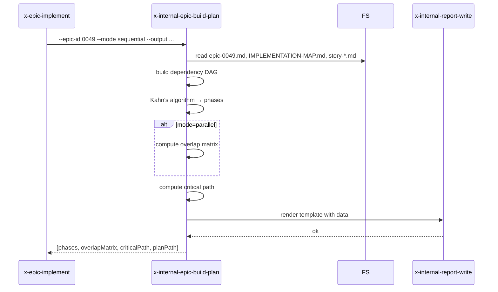

# História: Skill interna `x-internal-epic-build-plan`

**ID:** story-0049-0009
**Chave Jira:** —
**Status:** Concluída

## 1. Dependências

| Blocked By | Blocks |
| :--- | :--- |
| story-0049-0006 | story-0049-0018 |

## 2. Regras Transversais Aplicáveis

| ID | Título |
| :--- | :--- |
| RULE-005 | Thin orchestrator (UseCase pattern) |
| RULE-006 | Convenção `x-internal-*` |

## 3. Descrição

Como **`x-epic-implement`**, eu quero uma skill interna `x-internal-epic-build-plan` que carrega epic + IMPLEMENTATION-MAP + stories e produz o `ExecutionPlan` (ordem de fases via Kahn, dependency matrix, overlap analysis, critical path), emitindo também o markdown `epic-execution-plan.md` via `x-internal-report-write`.

Substitui Phase 0/0.5 inline de `x-epic-implement` (~250 linhas).

### 3.1 Argumentos

- `--epic-id <ID>` (M)
- `--mode <sequential|parallel>` (M)
- `--strict-overlap` (default `false`)
- `--output <path>` (M) — onde salvar `epic-execution-plan.md`

### 3.2 Comportamento

- Lê `plans/epic-XXXX/epic-XXXX.md` (parse de table de stories)
- Lê `plans/epic-XXXX/IMPLEMENTATION-MAP.md` (matriz de dependências)
- Para cada story em `plans/epic-XXXX/story-*.md`: extrai dependências
- Computa fases via Kahn's algorithm (detecta ciclos)
- Em `--mode parallel`: computa overlap matrix de arquivos modificados (advisory por default; strict aborta com warning estruturado)
- Em `--mode sequential`: ignora overlap analysis
- Computa critical path
- Renderiza markdown via `x-internal-report-write` com template `_TEMPLATE-EPIC-EXECUTION-PLAN.md`

## 3.5 Entrega de Valor

- **Valor Principal:** Extrai ~250 linhas de pre-flight conflict analysis e phase computation de `x-epic-implement`; habilita reuso por orquestradores futuros (ex: `x-epic-orchestrate-v2`).
- **Métrica de Sucesso:** Após S18, x-epic-implement Phase 1 cabe em ~80 linhas.
- **Impacto no Negócio:** Plan computation deterministic e testável isoladamente.

## 4. Definições de Qualidade Locais

### DoR Local

- [ ] STORY-0049-0006 (`x-internal-report-write`) mergeada
- [ ] Template `_TEMPLATE-EPIC-EXECUTION-PLAN.md` revisado para uso com placeholders

### DoD Local

- [ ] Skill em `internal/plan/x-internal-epic-build-plan/SKILL.md`
- [ ] Detecção de ciclo no DAG (CyclicDependencyException equivalente)
- [ ] Overlap matrix calculada apenas em modo parallel
- [ ] Output markdown compatível com formato atual (regression test)

### Global DoD

- **Cobertura:** ≥ 95% / 90%
- **Performance:** Plan computation < 5s para épicos até 30 stories

## 5. Contratos de Dados

### 5.1 Request

| Campo | Tipo | M/O | Validações | Exemplo |
| :--- | :--- | :--- | :--- | :--- |
| `--epic-id` | `String(4)` | M | regex | `0049` |
| `--mode` | `Enum` | M | sequential/parallel | `sequential` |
| `--strict-overlap` | `Boolean` | O | — | `false` |
| `--output` | `String` | M | path writable | `plans/epic-0049/epic-execution-plan.md` |

### 5.2 Response

| Campo | Tipo | Sempre presente | Descrição |
| :--- | :--- | :--- | :--- |
| `phases` | `List<Phase>` | Sim | Lista ordenada de fases, cada uma com `stories[]` |
| `overlapMatrix` | `Map<storyId, List<storyId>>` | Não (apenas mode=parallel) | Stories com sobreposição de arquivos |
| `criticalPath` | `List<storyId>` | Sim | Cadeia mais longa do DAG |
| `planPath` | `String` | Sim | Path do markdown gerado |

### 5.3 Error Codes

| Exit Code | Error Code | Condição | Mensagem |
| :--- | :--- | :--- | :--- |
| 1 | `EPIC_NOT_FOUND` | `plans/epic-XXXX/` não existe | "Epic dir not found" |
| 2 | `MAP_NOT_FOUND` | IMPLEMENTATION-MAP.md absente | "IMPLEMENTATION-MAP.md missing" |
| 3 | `CYCLIC_DEPENDENCY` | DAG tem ciclo | "Cycle detected: <chain>" |
| 4 | `STORY_FILE_MISSING` | story declarada mas file ausente | "Story file '<id>.md' missing" |

## 6. Diagramas



## 7. Critérios de Aceite (Gherkin)

```gherkin
Cenario: Plan sequential simples
  DADO epic-0049 com 22 stories e dependências válidas
  QUANDO invoco x-internal-epic-build-plan --epic-id 0049 --mode sequential
  ENTÃO output contém 5 fases com stories distribuídas corretamente
  E criticalPath é a cadeia mais longa
  E o markdown é gerado

Cenario: Detecção de ciclo
  DADO epic com story A→B e B→A
  QUANDO invoco a skill
  ENTÃO exit code é 3
  E mensagem contém "CYCLIC_DEPENDENCY"

Cenario: Modo parallel calcula overlap
  DADO epic com 2 stories tocando o mesmo arquivo
  QUANDO invoco com --mode parallel
  ENTÃO overlapMatrix contém entrada para o par
  E warning sobre overlap é registrado

Cenario: Erro — epic dir não existe
  DADO plans/epic-9999/ não existe
  QUANDO invoco --epic-id 9999
  ENTÃO exit code é 1

Cenario: Boundary — épico com 1 story (sem deps)
  DADO epic com apenas story-XXXX-0001
  QUANDO invoco a skill
  ENTÃO 1 fase é gerada com 1 story
```

### 7.2 Mandatory Categories

- [x] Degenerate (1 story só)
- [x] Happy path (plan completo)
- [x] Error paths (CYCLIC, EPIC_NOT_FOUND)
- [x] Boundary (mode parallel com overlap)

## 8. Tasks

### TASK-0049-0009-001: Skeleton

- **Layer:** Doc · **Test Type:** Verification · **Size:** S · **Dependencies:** —
- **Branch:** `feat/task-0049-0009-001-skeleton`
- **Testability:** Config + VerificationTest
- **Files:** `internal/plan/x-internal-epic-build-plan/SKILL.md`

### TASK-0049-0009-002: Parser de epic + map + story files

- **Layer:** Domain · **Test Type:** Unit · **Size:** M · **Dependencies:** TASK-0049-0009-001
- **Branch:** `feat/task-0049-0009-002-parser`
- **Testability:** Domain + UnitTest
- **Files:** `internal/plan/x-internal-epic-build-plan/SKILL.md`

### TASK-0049-0009-003: Kahn's algorithm + cycle detection

- **Layer:** Domain · **Test Type:** Unit · **Size:** M · **Dependencies:** TASK-0049-0009-002
- **Branch:** `feat/task-0049-0009-003-kahn`
- **Testability:** Domain + UnitTest
- **Files:** `internal/plan/x-internal-epic-build-plan/SKILL.md`

### TASK-0049-0009-004: Overlap matrix + critical path

- **Layer:** Domain · **Test Type:** Unit · **Size:** L · **Dependencies:** TASK-0049-0009-003
- **Branch:** `feat/task-0049-0009-004-overlap-critical`
- **Testability:** Domain + UnitTest
- **Files:** `internal/plan/x-internal-epic-build-plan/SKILL.md`

### TASK-0049-0009-005: Render markdown via x-internal-report-write

- **Layer:** Adapter · **Test Type:** Integration · **Size:** M · **Dependencies:** TASK-0049-0009-004
- **Branch:** `feat/task-0049-0009-005-render`
- **Testability:** Port + Adapter + IT
- **Files:** `internal/plan/x-internal-epic-build-plan/SKILL.md`

### TASK-0049-0009-006: Goldens + smoke

- **Layer:** Test · **Test Type:** Smoke · **Size:** S · **Dependencies:** TASK-0049-0009-005
- **Branch:** `feat/task-0049-0009-006-smoke`
- **Testability:** Migration + Smoke
- **Files:** `src/test/.../EpicBuildPlanSmokeTest.java`, `src/test/resources/golden/internal/plan/x-internal-epic-build-plan/**`
