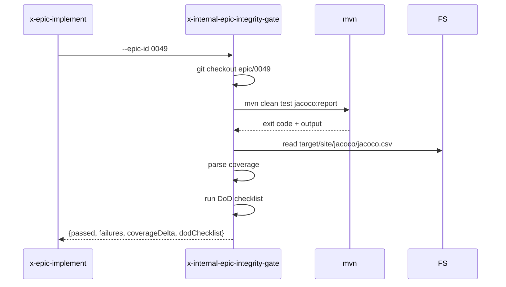

# História: Skill interna `x-internal-epic-integrity-gate`

**ID:** story-0049-0010
**Chave Jira:** —
**Status:** Pendente

## 1. Dependências

| Blocked By | Blocks |
| :--- | :--- |
| story-0049-0006 | story-0049-0018 |

## 2. Regras Transversais Aplicáveis

| ID | Título |
| :--- | :--- |
| RULE-005 | Thin orchestrator |
| RULE-006 | `x-internal-*` |

## 3. Descrição

Como **`x-epic-implement`**, eu quero uma skill interna `x-internal-epic-integrity-gate` que roda o verification gate end-to-end (mvn test full + coverage threshold + DoD checklist) na branch `epic/XXXX` HEAD e retorna pass/fail estruturado, para isolar ~180 linhas de Phase 1.7 inline.

### 3.1 Argumentos

- `--epic-id <ID>` (M)
- `--branch <name>` (default `epic/<ID>`)
- `--coverage-threshold-line <N>` (default 95)
- `--coverage-threshold-branch <N>` (default 90)

### 3.2 Comportamento

- Checkout da branch
- `mvn clean test jacoco:report`
- Parse coverage (line + branch) do `target/site/jacoco/jacoco.csv`
- Compara com thresholds
- Roda DoD checklist (validações estáticas: presença de tests, tasks DONE, etc)
- Retorna `{passed, failures[], coverageDelta, dodChecklist[]}`

## 3.5 Entrega de Valor

- **Valor Principal:** Extrai ~180 linhas de integrity gate de `x-epic-implement`; padroniza pass/fail estruturado consumível por reports.
- **Métrica de Sucesso:** Após S18, x-epic-implement Phase 4 cabe em ~80 linhas.
- **Impacto no Negócio:** Gate independente, pode ser invocado standalone para validar épico.

## 4. Definições de Qualidade Locais

### DoR Local

- [ ] STORY-0049-0006 mergeada
- [ ] Mvn test command padronizado (com profile gold? jacoco?)

### DoD Local

- [ ] Skill em `internal/plan/x-internal-epic-integrity-gate/SKILL.md`
- [ ] Coverage parse correto
- [ ] DoD checklist extensível (lista declarativa)

### Global DoD

- **Cobertura:** ≥ 95% / 90%
- **Performance:** Gate completo < 5min para épicos médios

## 5. Contratos de Dados

### 5.1 Request

| Campo | Tipo | M/O | Exemplo |
| :--- | :--- | :--- | :--- |
| `--epic-id` | String(4) | M | `0049` |
| `--branch` | String | O | `epic/0049` |
| `--coverage-threshold-line` | Integer | O | `95` |
| `--coverage-threshold-branch` | Integer | O | `90` |

### 5.2 Response

| Campo | Tipo | Sempre presente | Descrição |
| :--- | :--- | :--- | :--- |
| `passed` | Boolean | Sim | Gate global pass/fail |
| `failures` | List<String> | Sim | Mensagens de falha |
| `coverageDelta` | Object | Sim | `{line, branch, lineThreshold, branchThreshold}` |
| `dodChecklist` | List<{item, passed}> | Sim | Cada item do DoD com status |

### 5.3 Error Codes

| Exit Code | Error Code | Condição | Mensagem |
| :--- | :--- | :--- | :--- |
| 1 | `BRANCH_NOT_FOUND` | branch inexistente | "Branch <name> not found" |
| 2 | `MVN_TEST_FAILED` | mvn test exit != 0 | "Test suite failed" |
| 3 | `COVERAGE_BELOW_THRESHOLD` | coverage < threshold | "Coverage below threshold: line=X, branch=Y" |
| 4 | `JACOCO_REPORT_MISSING` | csv não gerado | "JaCoCo report not found" |

## 6. Diagramas



## 7. Critérios de Aceite (Gherkin)

```gherkin
Cenario: Gate passa em branch limpa
  DADO epic/0049 tem todas as tasks DONE
  E mvn test passa
  E coverage line=96, branch=91
  QUANDO invoco a skill
  ENTÃO passed=true e failures=[]

Cenario: Gate falha por coverage abaixo
  DADO coverage line=88
  QUANDO invoco a skill
  ENTÃO passed=false
  E failures contém "Coverage line 88 < threshold 95"

Cenario: Gate falha por test failure
  DADO mvn test falha em N testes
  QUANDO invoco a skill
  ENTÃO exit code é 2
  E failures contém detalhes

Cenario: Erro — branch não existe
  DADO epic/9999 não existe
  QUANDO invoco --epic-id 9999
  ENTÃO exit code é 1

Cenario: Boundary — coverage exatamente no threshold
  DADO coverage line=95, branch=90
  QUANDO invoco a skill
  ENTÃO passed=true (>= é inclusive)
```

### 7.2 Mandatory Categories

- [x] Degenerate (gate passa limpo)
- [x] Happy path (gate passa com tudo OK)
- [x] Error paths (BRANCH_NOT_FOUND, MVN_TEST_FAILED, COVERAGE_BELOW)
- [x] Boundary (coverage no limite)

## 8. Tasks

### TASK-0049-0010-001: Skeleton

- **Layer:** Doc · **Test Type:** Verification · **Size:** S · **Dependencies:** —
- **Branch:** `feat/task-0049-0010-001-skeleton`
- **Testability:** Config + VerificationTest
- **Files:** `internal/plan/x-internal-epic-integrity-gate/SKILL.md`

### TASK-0049-0010-002: Checkout + mvn test invocation

- **Layer:** Adapter · **Test Type:** Integration · **Size:** M · **Dependencies:** TASK-0049-0010-001
- **Branch:** `feat/task-0049-0010-002-mvn`
- **Testability:** Port + Adapter + IT
- **Files:** `internal/plan/x-internal-epic-integrity-gate/SKILL.md`

### TASK-0049-0010-003: Coverage parser + threshold check

- **Layer:** Domain · **Test Type:** Unit · **Size:** M · **Dependencies:** TASK-0049-0010-002
- **Branch:** `feat/task-0049-0010-003-coverage`
- **Testability:** Domain + UnitTest
- **Files:** `internal/plan/x-internal-epic-integrity-gate/SKILL.md`

### TASK-0049-0010-004: DoD checklist extensível

- **Layer:** Domain · **Test Type:** Unit · **Size:** M · **Dependencies:** TASK-0049-0010-003
- **Branch:** `feat/task-0049-0010-004-dod`
- **Testability:** Domain + UnitTest
- **Files:** `internal/plan/x-internal-epic-integrity-gate/SKILL.md`

### TASK-0049-0010-005: Goldens + smoke

- **Layer:** Test · **Test Type:** Smoke · **Size:** S · **Dependencies:** TASK-0049-0010-004
- **Branch:** `feat/task-0049-0010-005-smoke`
- **Testability:** Migration + Smoke
- **Files:** `src/test/.../IntegrityGateSmokeTest.java`, `src/test/resources/golden/internal/plan/x-internal-epic-integrity-gate/**`
