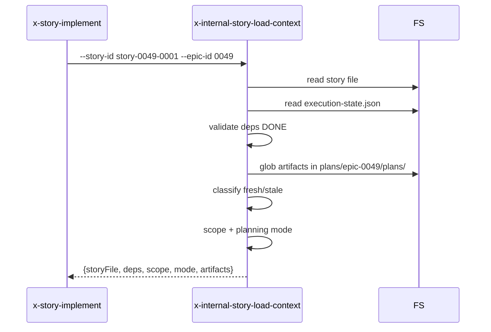

# História: Skill interna `x-internal-story-load-context`

**ID:** story-0049-0011
**Chave Jira:** —
**Status:** Concluída

## 1. Dependências

| Blocked By | Blocks |
| :--- | :--- |
| — | story-0049-0019 |

## 2. Regras Transversais Aplicáveis

| ID | Título |
| :--- | :--- |
| RULE-005 | Thin orchestrator |
| RULE-006 | `x-internal-*` |

## 3. Descrição

Como **`x-story-implement`**, eu quero uma skill interna `x-internal-story-load-context` que carrega o story file, valida dependências (stories antecessoras DONE), executa artifact pre-checks (staleness detection), faz scope assessment (SIMPLE/STANDARD/COMPLEX) e detecta planning mode (PRE_PLANNED/HYBRID/INLINE), substituindo Phase 0 inline (~140 linhas).

### 3.1 Argumentos

- `--story-id <ID>` (M) — ex `story-0049-0001`
- `--epic-id <ID>` (M) — ex `0049`

### 3.2 Comportamento

- Lê `plans/epic-XXXX/story-XXXX-YYYY.md`
- Parse de Section 1 (Dependencies) e verifica se cada blocker está DONE em `execution-state.json`
- Glob por artifacts em `plans/epic-XXXX/plans/*-story-XXXX-YYYY.md`
- Para cada artifact: comparar mtime com mtime do story file → fresh ou stale
- Scope assessment via heurística: contar Gherkin scenarios + tasks; SIMPLE (<= 4 tasks), STANDARD (5-7), COMPLEX (8+)
- Planning mode: PRE_PLANNED se artifacts fresh; HYBRID se alguns; INLINE se todos missing/stale

## 3.5 Entrega de Valor

- **Valor Principal:** Extrai loading + dependency check + scope assessment + planning mode detection de `x-story-implement` Phase 0 (~140 linhas inline removidas).
- **Métrica de Sucesso:** Após S19, x-story-implement Phase 0 cabe em ~80 linhas.

## 4. Definições de Qualidade Locais

### DoR Local

- [ ] Critérios de scope assessment alinhados com PO

### DoD Local

- [ ] Skill em `internal/plan/x-internal-story-load-context/SKILL.md`
- [ ] Read-only (nunca modifica filesystem)
- [ ] Heurísticas de scope/planning mode documentadas

### Global DoD

- **Cobertura:** ≥ 95% / 90%
- **Performance:** Load < 500ms

## 5. Contratos de Dados

### 5.1 Request

| Campo | Tipo | M/O | Exemplo |
| :--- | :--- | :--- | :--- |
| `--story-id` | String | M | `story-0049-0001` |
| `--epic-id` | String(4) | M | `0049` |

### 5.2 Response

| Campo | Tipo | Sempre presente | Descrição |
| :--- | :--- | :--- | :--- |
| `storyFile` | String | Sim | Path do story.md |
| `dependencies` | List<{id,status}> | Sim | Cada dep + status |
| `scope` | Enum | Sim | SIMPLE/STANDARD/COMPLEX |
| `planningMode` | Enum | Sim | PRE_PLANNED/HYBRID/INLINE |
| `artifacts` | {fresh:[], stale:[], missing:[]} | Sim | Classificação dos planning artifacts |

### 5.3 Error Codes

| Exit Code | Error Code | Condição | Mensagem |
| :--- | :--- | :--- | :--- |
| 1 | `STORY_NOT_FOUND` | story file ausente | "Story file not found" |
| 2 | `DEPENDENCY_NOT_DONE` | blocker não DONE | "Blocker <id> is <status>" |
| 3 | `EPIC_NOT_FOUND` | epic dir ausente | "Epic dir not found" |

## 6. Diagramas



## 7. Critérios de Aceite (Gherkin)

```gherkin
Cenario: Load story sem dependências
  DADO story-0049-0001 sem blockers
  QUANDO invoco a skill
  ENTÃO output contém dependencies=[] e scope/mode válidos

Cenario: Detecta dependência não DONE
  DADO story-0049-0008 depende de story-0049-0001
  E story-0049-0001.status=PENDING
  QUANDO invoco --story-id story-0049-0008
  ENTÃO exit code é 2
  E mensagem contém "Blocker story-0049-0001 is PENDING"

Cenario: Classifica artifacts como fresh
  DADO planning artifacts modificados após o story file
  QUANDO invoco a skill
  ENTÃO planningMode=PRE_PLANNED

Cenario: Erro — story file inexistente
  DADO --story-id story-9999-0001 mas file não existe
  QUANDO invoco a skill
  ENTÃO exit code é 1

Cenario: Boundary — story COMPLEX (8+ tasks)
  DADO story com 10 tasks
  QUANDO invoco a skill
  ENTÃO scope=COMPLEX
```

### 7.2 Mandatory Categories

- [x] Degenerate (sem deps)
- [x] Happy path (load completo)
- [x] Error paths (DEPENDENCY_NOT_DONE, STORY_NOT_FOUND)
- [x] Boundary (COMPLEX scope)

## 8. Tasks

### TASK-0049-0011-001: Skeleton
- **Layer:** Doc · **Test Type:** Verification · **Size:** S · **Dependencies:** —
- **Branch:** `feat/task-0049-0011-001-skeleton`
- **Testability:** Config + VerificationTest
- **Files:** `internal/plan/x-internal-story-load-context/SKILL.md`

### TASK-0049-0011-002: Parser de story file + dep extraction
- **Layer:** Domain · **Test Type:** Unit · **Size:** M · **Dependencies:** TASK-0049-0011-001
- **Branch:** `feat/task-0049-0011-002-parser`
- **Testability:** Domain + UnitTest
- **Files:** `internal/plan/x-internal-story-load-context/SKILL.md`

### TASK-0049-0011-003: Dependency status check via execution-state.json
- **Layer:** Adapter · **Test Type:** Integration · **Size:** M · **Dependencies:** TASK-0049-0011-002
- **Branch:** `feat/task-0049-0011-003-dep-check`
- **Testability:** Port + Adapter + IT
- **Files:** `internal/plan/x-internal-story-load-context/SKILL.md`

### TASK-0049-0011-004: Artifact freshness detection + scope/mode classification
- **Layer:** Domain · **Test Type:** Unit · **Size:** M · **Dependencies:** TASK-0049-0011-003
- **Branch:** `feat/task-0049-0011-004-classification`
- **Testability:** Domain + UnitTest
- **Files:** `internal/plan/x-internal-story-load-context/SKILL.md`

### TASK-0049-0011-005: Goldens + smoke
- **Layer:** Test · **Test Type:** Smoke · **Size:** S · **Dependencies:** TASK-0049-0011-004
- **Branch:** `feat/task-0049-0011-005-smoke`
- **Testability:** Migration + Smoke
- **Files:** `src/test/.../StoryLoadContextSmokeTest.java`, `src/test/resources/golden/internal/plan/x-internal-story-load-context/**`
