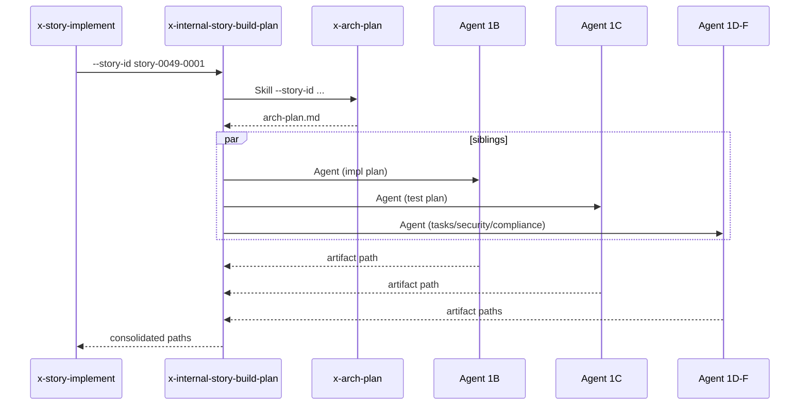

# História: Skill interna `x-internal-story-build-plan`

**ID:** story-0049-0012
**Chave Jira:** —
**Status:** Concluída

## 1. Dependências

| Blocked By | Blocks |
| :--- | :--- |
| — | story-0049-0019 |

## 2. Regras Transversais Aplicáveis

| ID | Título |
| :--- | :--- |
| RULE-005 | Thin orchestrator |
| RULE-006 | `x-internal-*` |

## 3. Descrição

Como **`x-story-implement`**, eu quero uma skill interna `x-internal-story-build-plan` que orquestra o planejamento da story (Phase 1 atual): invoca `x-arch-plan` (1A) + 5 subagents paralelos para impl plan, test plan, task breakdown, security, compliance (1B-1F), substituindo ~250 linhas de orquestração inline.

### 3.1 Argumentos

- `--story-id <ID>` (M)
- `--epic-id <ID>` (M)
- `--scope <SIMPLE|STANDARD|COMPLEX>` (default `STANDARD`)
- `--skip-review` (default `false`)

### 3.2 Comportamento

- Step 1A: `Skill x-arch-plan --story-id ... --epic-id ...`
- Step 1B-1F: lança 5 `Agent(general-purpose)` siblings em UMA mensagem (Pattern 2 SUBAGENT-GENERAL):
  - 1B: implementation plan
  - 1C: test plan
  - 1D: task breakdown
  - 1E: security assessment (skipável se scope=SIMPLE)
  - 1F: compliance assessment (skipável se scope=SIMPLE)
- Aguarda todos os agents
- Coleta artifact paths produzidos
- Retorna estrutura consolidada

## 3.5 Entrega de Valor

- **Valor Principal:** Extrai orquestração de planejamento paralelo (~250 linhas) de `x-story-implement` Phase 1; isola padrão SUBAGENT-GENERAL.
- **Métrica de Sucesso:** Após S19, Phase 1 de x-story-implement cabe em ~50 linhas.

## 4. Definições de Qualidade Locais

### DoR Local

- [ ] Templates de cada artifact disponíveis em `.claude/templates/`
- [ ] Subagent prompts canônicos definidos (ou referenciados)

### DoD Local

- [ ] Skill em `internal/plan/x-internal-story-build-plan/SKILL.md`
- [ ] Pattern SUBAGENT-GENERAL aplicado corretamente (Rule 13)
- [ ] Scope SIMPLE pula 1E/1F
- [ ] Retorno consistente

### Global DoD

- **Cobertura:** ≥ 95% / 90%
- **Performance:** ~3-5min para STANDARD scope (5 subagents paralelos)

## 5. Contratos de Dados

### 5.1 Request

| Campo | Tipo | M/O | Exemplo |
| :--- | :--- | :--- | :--- |
| `--story-id` | String | M | `story-0049-0001` |
| `--epic-id` | String(4) | M | `0049` |
| `--scope` | Enum | O | `STANDARD` |
| `--skip-review` | Boolean | O | `false` |

### 5.2 Response

| Campo | Tipo | Sempre presente | Descrição |
| :--- | :--- | :--- | :--- |
| `archPlan` | String (path) | Sim | Path do arch-plan.md |
| `implPlan` | String (path) | Sim | Path do impl-plan.md |
| `testPlan` | String (path) | Sim | Path do test-plan.md |
| `taskBreakdown` | String (path) | Sim | Path do tasks.md |
| `securityAssessment` | String (path)\|Null | Não (null em SIMPLE) | Path do security.md |
| `complianceAssessment` | String (path)\|Null | Não (null em SIMPLE) | Path do compliance.md |
| `taskMap` | String (path) | Sim | Path do task-implementation-map (v2) |

### 5.3 Error Codes

| Exit Code | Error Code | Condição | Mensagem |
| :--- | :--- | :--- | :--- |
| 1 | `ARCH_PLAN_FAILED` | x-arch-plan falhou | "Architecture plan failed: <detail>" |
| 2 | `SUBAGENT_FAILED` | um dos subagents 1B-1F falhou | "Subagent <name> failed" |

## 6. Diagramas



## 7. Critérios de Aceite (Gherkin)

```gherkin
Cenario: Plan completo para STANDARD scope
  DADO --scope STANDARD
  QUANDO invoco a skill
  ENTÃO arch-plan + impl-plan + test-plan + tasks + security + compliance gerados

Cenario: Plan reduzido para SIMPLE scope
  DADO --scope SIMPLE
  QUANDO invoco a skill
  ENTÃO security e compliance retornam null
  E os outros 4 artifacts são gerados

Cenario: Falha em subagent abortando o pipeline
  DADO subagent de impl-plan falha
  QUANDO invoco a skill
  ENTÃO exit code é 2
  E mensagem identifica qual subagent

Cenario: Erro — arch-plan falha
  DADO x-arch-plan retorna error
  QUANDO invoco a skill
  ENTÃO exit code é 1

Cenario: Boundary — COMPLEX scope (todos os 6 artifacts)
  DADO --scope COMPLEX
  QUANDO invoco a skill
  ENTÃO 6 artifacts gerados
```

### 7.2 Mandatory Categories

- [x] Degenerate (SIMPLE com menos artifacts)
- [x] Happy path (STANDARD)
- [x] Error paths (ARCH_PLAN_FAILED, SUBAGENT_FAILED)
- [x] Boundary (COMPLEX)

## 8. Tasks

### TASK-0049-0012-001: Skeleton
- **Layer:** Doc · **Test Type:** Verification · **Size:** S · **Dependencies:** —
- **Branch:** `feat/task-0049-0012-001-skeleton`
- **Testability:** Config + VerificationTest
- **Files:** `internal/plan/x-internal-story-build-plan/SKILL.md`

### TASK-0049-0012-002: Step 1A delegation a x-arch-plan
- **Layer:** Adapter · **Test Type:** Integration · **Size:** M · **Dependencies:** TASK-0049-0012-001
- **Branch:** `feat/task-0049-0012-002-arch-plan`
- **Testability:** Port + Adapter + IT
- **Files:** `internal/plan/x-internal-story-build-plan/SKILL.md`

### TASK-0049-0012-003: Steps 1B-1D parallel subagents (impl/test/tasks)
- **Layer:** Adapter · **Test Type:** Integration · **Size:** M · **Dependencies:** TASK-0049-0012-002
- **Branch:** `feat/task-0049-0012-003-parallel-bcd`
- **Testability:** Port + Adapter + IT
- **Files:** `internal/plan/x-internal-story-build-plan/SKILL.md`

### TASK-0049-0012-004: Steps 1E-1F (security/compliance) com gate por scope
- **Layer:** Adapter · **Test Type:** Integration · **Size:** M · **Dependencies:** TASK-0049-0012-003
- **Branch:** `feat/task-0049-0012-004-sec-compl`
- **Testability:** Port + Adapter + IT
- **Files:** `internal/plan/x-internal-story-build-plan/SKILL.md`

### TASK-0049-0012-005: Goldens + smoke
- **Layer:** Test · **Test Type:** Smoke · **Size:** S · **Dependencies:** TASK-0049-0012-004
- **Branch:** `feat/task-0049-0012-005-smoke`
- **Testability:** Migration + Smoke
- **Files:** `src/test/.../StoryBuildPlanSmokeTest.java`, `src/test/resources/golden/internal/plan/x-internal-story-build-plan/**`
