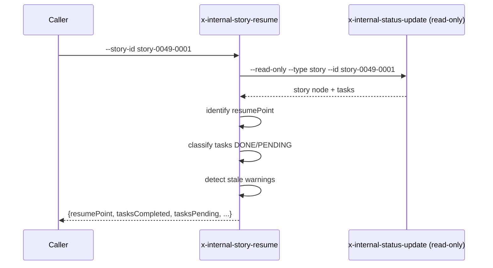

# História: Skill interna `x-internal-story-resume`

**ID:** story-0049-0013
**Chave Jira:** —
**Status:** Concluída

## 1. Dependências

| Blocked By | Blocks |
| :--- | :--- |
| story-0049-0005 | story-0049-0019 |

## 2. Regras Transversais Aplicáveis

| ID | Título |
| :--- | :--- |
| RULE-005 | Thin orchestrator |
| RULE-006 | `x-internal-*` |
| RULE-008 | Backward compatibility via `flowVersion` |

## 3. Descrição

Como **`x-story-implement`**, eu quero uma skill interna `x-internal-story-resume` que detecta o estado retomável de uma story em andamento (lê `execution-state.json`, identifica tasks DONE vs PENDING, valida freshness, retorna ponto de retomada), substituindo ~120 linhas inline.

### 3.1 Argumentos

- `--story-id <ID>` (M)
- `--epic-id <ID>` (M)

### 3.2 Comportamento

- Lê `execution-state.json` via `x-internal-status-update --read-only`
- Localiza `stories.<id>` e `stories.<id>.tasks.*`
- Identifica resume point: primeira task em PENDING (ou IN_PROGRESS)
- Lista tasks completadas (DONE) com seus commitSha
- Valida freshness: se story file mtime > task DONE timestamp, marca como STALE warning
- Retorna estrutura de resume

## 3.5 Entrega de Valor

- **Valor Principal:** Extrai detecção de resume point de `x-story-implement` (~120 linhas); padroniza identificação de tasks DONE/PENDING.
- **Métrica de Sucesso:** Após S19, `--resume` em x-story-implement vira chamada única.

## 4. Definições de Qualidade Locais

### DoR Local

- [ ] STORY-0049-0005 (`x-internal-status-update`) mergeada (modo read-only disponível)

### DoD Local

- [ ] Skill em `internal/plan/x-internal-story-resume/SKILL.md`
- [ ] Read-only (não muta state)
- [ ] Detecção de stale warnings clara

### Global DoD

- **Cobertura:** ≥ 95% / 90%
- **Performance:** Resume detection < 200ms

## 5. Contratos de Dados

### 5.1 Request

| Campo | Tipo | M/O | Exemplo |
| :--- | :--- | :--- | :--- |
| `--story-id` | String | M | `story-0049-0001` |
| `--epic-id` | String(4) | M | `0049` |

### 5.2 Response

| Campo | Tipo | Sempre presente | Descrição |
| :--- | :--- | :--- | :--- |
| `resumePoint` | String | Sim | "phase-2-task-3" ou "fresh-start" se nada DONE |
| `tasksCompleted` | List<{id, commitSha}> | Sim | Tasks DONE com SHA |
| `tasksPending` | List<String> | Sim | Tasks PENDING |
| `lastCommitSha` | String\|Null | Sim | SHA do último commit da story |
| `staleWarnings` | List<String> | Sim | Lista de warnings de freshness |

### 5.3 Error Codes

| Exit Code | Error Code | Condição | Mensagem |
| :--- | :--- | :--- | :--- |
| 1 | `STATE_FILE_MISSING` | `execution-state.json` ausente | "execution-state.json not found" |
| 2 | `STORY_NOT_IN_STATE` | story não registrada no state | "Story not in execution-state.json" |

## 6. Diagramas



## 7. Critérios de Aceite (Gherkin)

```gherkin
Cenario: Fresh start — story sem progresso
  DADO story-0049-0001 não tem tasks DONE
  QUANDO invoco a skill
  ENTÃO resumePoint="fresh-start"
  E tasksCompleted=[]

Cenario: Resume mid-story
  DADO 3 tasks DONE de 5
  QUANDO invoco a skill
  ENTÃO resumePoint="phase-2-task-4"
  E tasksCompleted contém 3 entradas

Cenario: Detecta stale warning
  DADO task-0049-0001-001 está DONE com commitSha X
  E story file foi modificado após o commit
  QUANDO invoco a skill
  ENTÃO staleWarnings contém "Story file modified after task DONE"

Cenario: Erro — state file missing
  DADO execution-state.json não existe
  QUANDO invoco a skill
  ENTÃO exit code é 1

Cenario: Boundary — todas tasks DONE
  DADO todas tasks DONE
  QUANDO invoco a skill
  ENTÃO resumePoint="all-done"
  E tasksPending=[]
```

### 7.2 Mandatory Categories

- [x] Degenerate (fresh start)
- [x] Happy path (resume mid)
- [x] Error paths (STATE_FILE_MISSING, STORY_NOT_IN_STATE)
- [x] Boundary (all done)

## 8. Tasks

### TASK-0049-0013-001: Skeleton
- **Layer:** Doc · **Test Type:** Verification · **Size:** S · **Dependencies:** —
- **Branch:** `feat/task-0049-0013-001-skeleton`
- **Files:** `internal/plan/x-internal-story-resume/SKILL.md`

### TASK-0049-0013-002: Read state via x-internal-status-update read-only
- **Layer:** Adapter · **Test Type:** Integration · **Size:** M · **Dependencies:** TASK-0049-0013-001
- **Branch:** `feat/task-0049-0013-002-read-state`
- **Files:** `internal/plan/x-internal-story-resume/SKILL.md`

### TASK-0049-0013-003: Resume point computation + stale detection
- **Layer:** Domain · **Test Type:** Unit · **Size:** M · **Dependencies:** TASK-0049-0013-002
- **Branch:** `feat/task-0049-0013-003-resume-logic`
- **Files:** `internal/plan/x-internal-story-resume/SKILL.md`

### TASK-0049-0013-004: Goldens + smoke
- **Layer:** Test · **Test Type:** Smoke · **Size:** S · **Dependencies:** TASK-0049-0013-003
- **Branch:** `feat/task-0049-0013-004-smoke`
- **Files:** `src/test/.../StoryResumeSmokeTest.java`, `src/test/resources/golden/internal/plan/x-internal-story-resume/**`
