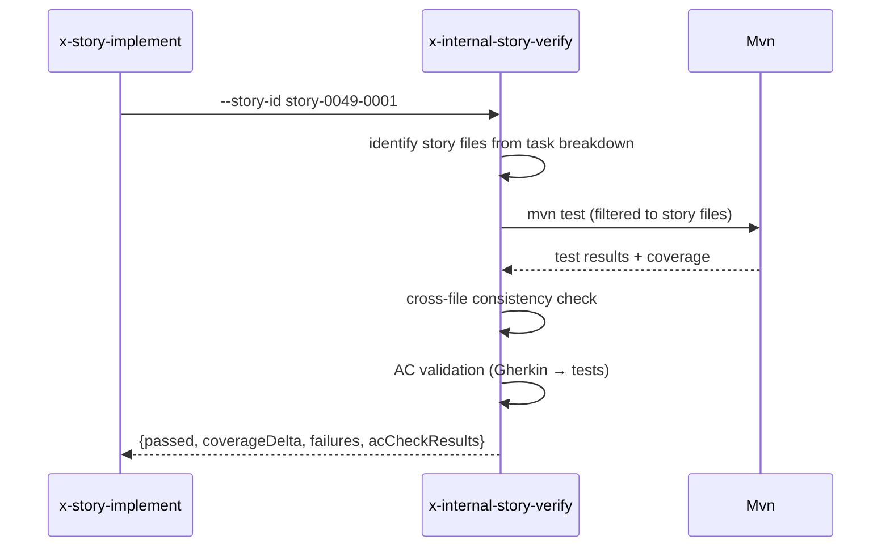

# História: Skill interna `x-internal-story-verify`

**ID:** story-0049-0014
**Chave Jira:** —
**Status:** Concluída

## 1. Dependências

| Blocked By | Blocks |
| :--- | :--- |
| — | story-0049-0019 |

## 2. Regras Transversais Aplicáveis

| ID | Título |
| :--- | :--- |
| RULE-005 | Thin orchestrator |
| RULE-006 | `x-internal-*` |

## 3. Descrição

Como **`x-story-implement`**, eu quero uma skill interna `x-internal-story-verify` que executa o verification gate da story (Phase 3 atual): coverage check (>=95% line, >=90% branch para arquivos da story), cross-file consistency, smoke test, AC validation, substituindo ~160 linhas inline.

### 3.1 Argumentos

- `--story-id <ID>` (M)
- `--epic-id <ID>` (M)
- `--coverage-threshold-line <N>` (default 95)
- `--coverage-threshold-branch <N>` (default 90)

### 3.2 Comportamento

- Identificar arquivos da story (do task breakdown)
- Rodar `mvn test` filtrando para arquivos da story
- Parse de coverage filtrado para esses arquivos
- Verificar cross-file consistency (constructor patterns, return types iguais entre files do mesmo role)
- Rodar smoke test (se `testing.smoke_tests == true`)
- Validar AC: cada Gherkin scenario tem teste correspondente
- Retornar pass/fail estruturado

## 3.5 Entrega de Valor

- **Valor Principal:** Extrai coverage check + cross-file consistency + smoke + AC validation (~160 linhas) de `x-story-implement` Phase 3.

## 4. Definições de Qualidade Locais

### DoR Local

- [ ] Heurística de cross-file consistency documentada

### DoD Local

- [ ] Skill em `internal/plan/x-internal-story-verify/SKILL.md`
- [ ] Coverage filtrado por files da story (não global)
- [ ] AC validation contra Gherkin scenarios

### Global DoD

- **Cobertura:** ≥ 95% / 90%
- **Performance:** Verify < 3min para story média

## 5. Contratos de Dados

### 5.1 Request

| Campo | Tipo | M/O | Exemplo |
| :--- | :--- | :--- | :--- |
| `--story-id` | String | M | `story-0049-0001` |
| `--epic-id` | String(4) | M | `0049` |
| `--coverage-threshold-line` | Integer | O | `95` |
| `--coverage-threshold-branch` | Integer | O | `90` |

### 5.2 Response

| Campo | Tipo | Sempre presente | Descrição |
| :--- | :--- | :--- | :--- |
| `passed` | Boolean | Sim | Gate global |
| `coverageDelta` | Object | Sim | line/branch + thresholds |
| `failures` | List<String> | Sim | Detalhes de falhas |
| `acCheckResults` | List<{scenario, hasTest}> | Sim | Cada scenario + se tem teste |

### 5.3 Error Codes

| Exit Code | Error Code | Condição | Mensagem |
| :--- | :--- | :--- | :--- |
| 1 | `STORY_FILES_NOT_FOUND` | sem arquivos identificados | "Could not identify story files" |
| 2 | `MVN_TEST_FAILED` | mvn test falhou | "Test suite failed" |
| 3 | `COVERAGE_BELOW_THRESHOLD` | coverage abaixo | "Coverage below threshold" |

## 6. Diagramas



## 7. Critérios de Aceite (Gherkin)

```gherkin
Cenario: Verify passa em story limpa
  DADO todas as ACs têm tests
  E coverage line=96, branch=92
  QUANDO invoco a skill
  ENTÃO passed=true

Cenario: Falha — AC sem teste
  DADO scenario "X" não tem teste correspondente
  QUANDO invoco a skill
  ENTÃO passed=false
  E failures contém "AC 'X' has no test"

Cenario: Falha — coverage abaixo do threshold
  DADO coverage line=88
  QUANDO invoco a skill
  ENTÃO passed=false
  E exit code é 3

Cenario: Erro — story sem arquivos
  DADO task breakdown vazio
  QUANDO invoco a skill
  ENTÃO exit code é 1

Cenario: Boundary — coverage exatamente no threshold
  DADO coverage line=95
  QUANDO invoco a skill
  ENTÃO passed=true
```

### 7.2 Mandatory Categories

- [x] Degenerate (verify passa)
- [x] Happy path (verify pass com tudo OK)
- [x] Error paths (MVN_FAILED, COVERAGE_BELOW)
- [x] Boundary (coverage no limite)

## 8. Tasks

### TASK-0049-0014-001: Skeleton
- **Layer:** Doc · **Test Type:** Verification · **Size:** S · **Dependencies:** —
- **Branch:** `feat/task-0049-0014-001-skeleton`
- **Files:** `internal/plan/x-internal-story-verify/SKILL.md`

### TASK-0049-0014-002: Identify story files + mvn test scoped
- **Layer:** Adapter · **Test Type:** Integration · **Size:** M · **Dependencies:** TASK-0049-0014-001
- **Branch:** `feat/task-0049-0014-002-mvn-scoped`
- **Files:** `internal/plan/x-internal-story-verify/SKILL.md`

### TASK-0049-0014-003: Coverage parser + cross-file consistency
- **Layer:** Domain · **Test Type:** Unit · **Size:** M · **Dependencies:** TASK-0049-0014-002
- **Branch:** `feat/task-0049-0014-003-coverage-consistency`
- **Files:** `internal/plan/x-internal-story-verify/SKILL.md`

### TASK-0049-0014-004: AC validation (Gherkin → tests)
- **Layer:** Domain · **Test Type:** Unit · **Size:** M · **Dependencies:** TASK-0049-0014-003
- **Branch:** `feat/task-0049-0014-004-ac-validation`
- **Files:** `internal/plan/x-internal-story-verify/SKILL.md`

### TASK-0049-0014-005: Goldens + smoke
- **Layer:** Test · **Test Type:** Smoke · **Size:** S · **Dependencies:** TASK-0049-0014-004
- **Branch:** `feat/task-0049-0014-005-smoke`
- **Files:** `src/test/.../StoryVerifySmokeTest.java`, `src/test/resources/golden/internal/plan/x-internal-story-verify/**`
