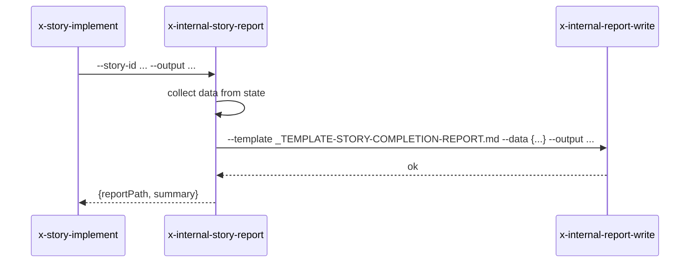

# História: Skill interna `x-internal-story-report`

**ID:** story-0049-0015
**Chave Jira:** —
**Status:** Concluída

## 1. Dependências

| Blocked By | Blocks |
| :--- | :--- |
| story-0049-0006 | story-0049-0019 |

## 2. Regras Transversais Aplicáveis

| ID | Título |
| :--- | :--- |
| RULE-005 | Thin orchestrator |
| RULE-006 | `x-internal-*` |

## 3. Descrição

Como **`x-story-implement`**, eu quero uma skill interna `x-internal-story-report` que gera relatório final consolidando tasks executadas, commits, PR criada, coverage delta, findings de review, renderizando via `x-internal-report-write` com template específico.

### 3.1 Argumentos

- `--story-id <ID>` (M)
- `--epic-id <ID>` (M)
- `--output <path>` (M)

### 3.2 Comportamento

- Lê `execution-state.json` para a story
- Coleta dados: tasks executadas, commitShas, prNumber, prState, coverage delta
- Renderiza markdown via `x-internal-report-write` com `_TEMPLATE-STORY-COMPLETION-REPORT.md`
- Emite `--output` path

## 3.5 Entrega de Valor

- **Valor Principal:** Gera report final consolidado da story; isola template + dados estruturados.

## 4. Definições de Qualidade Locais

### DoR Local

- [ ] STORY-0049-0006 mergeada
- [ ] Template `_TEMPLATE-STORY-COMPLETION-REPORT.md` criado em `.claude/templates/`

### DoD Local

- [ ] Skill em `internal/plan/x-internal-story-report/SKILL.md`
- [ ] Template renderizado corretamente
- [ ] Output file gerado em path especificado

### Global DoD

- **Cobertura:** ≥ 95% / 90%

## 5. Contratos de Dados

### 5.1 Request

| Campo | Tipo | M/O | Exemplo |
| :--- | :--- | :--- | :--- |
| `--story-id` | String | M | `story-0049-0001` |
| `--epic-id` | String(4) | M | `0049` |
| `--output` | String | M | `plans/epic-0049/reports/story-0049-0001-report.md` |

### 5.2 Response

| Campo | Tipo | Sempre presente | Descrição |
| :--- | :--- | :--- | :--- |
| `reportPath` | String | Sim | Path do report |
| `summary` | Object | Sim | Resumo (tasksCount, commitsCount, prState, coverageLine) |

### 5.3 Error Codes

| Exit Code | Error Code | Condição | Mensagem |
| :--- | :--- | :--- | :--- |
| 1 | `STATE_NOT_FOUND` | execution-state.json ausente | "State missing" |
| 2 | `TEMPLATE_MISSING` | template não existe | "Template missing" |

## 6. Diagramas



## 7. Critérios de Aceite (Gherkin)

```gherkin
Cenario: Report happy path
  DADO story-0049-0001 com 5 tasks DONE, 1 PR mergeada
  QUANDO invoco a skill
  ENTÃO report é gerado
  E summary contém tasksCount=5, prState=MERGED

Cenario: Report para story com tasks PENDING
  DADO story em andamento (3 tasks DONE, 2 PENDING)
  QUANDO invoco a skill
  ENTÃO report inclui status detalhado de cada task

Cenario: Erro — state missing
  DADO execution-state.json ausente
  QUANDO invoco a skill
  ENTÃO exit code é 1

Cenario: Erro — template missing
  DADO _TEMPLATE-STORY-COMPLETION-REPORT.md ausente
  QUANDO invoco a skill
  ENTÃO exit code é 2

Cenario: Boundary — story sem PR (story em planejamento)
  DADO story sem prNumber
  QUANDO invoco a skill
  ENTÃO summary.prState=null e report omite seção "Pull Request"
```

### 7.2 Mandatory Categories

- [x] Degenerate (story sem PR)
- [x] Happy path (report consolidado)
- [x] Error paths (STATE_NOT_FOUND, TEMPLATE_MISSING)
- [x] Boundary (sem PR section)

## 8. Tasks

### TASK-0049-0015-001: Skeleton
- **Layer:** Doc · **Test Type:** Verification · **Size:** S · **Dependencies:** —
- **Branch:** `feat/task-0049-0015-001-skeleton`
- **Files:** `internal/plan/x-internal-story-report/SKILL.md`

### TASK-0049-0015-002: Criar `_TEMPLATE-STORY-COMPLETION-REPORT.md`
- **Layer:** Doc · **Test Type:** Verification · **Size:** S · **Dependencies:** TASK-0049-0015-001
- **Branch:** `feat/task-0049-0015-002-template`
- **Files:** `java/src/main/resources/targets/claude/templates/_TEMPLATE-STORY-COMPLETION-REPORT.md`

### TASK-0049-0015-003: Coleta de dados + render
- **Layer:** Adapter · **Test Type:** Integration · **Size:** M · **Dependencies:** TASK-0049-0015-002
- **Branch:** `feat/task-0049-0015-003-render`
- **Files:** `internal/plan/x-internal-story-report/SKILL.md`

### TASK-0049-0015-004: Goldens + smoke
- **Layer:** Test · **Test Type:** Smoke · **Size:** S · **Dependencies:** TASK-0049-0015-003
- **Branch:** `feat/task-0049-0015-004-smoke`
- **Files:** `src/test/.../StoryReportSmokeTest.java`, `src/test/resources/golden/internal/plan/x-internal-story-report/**`
