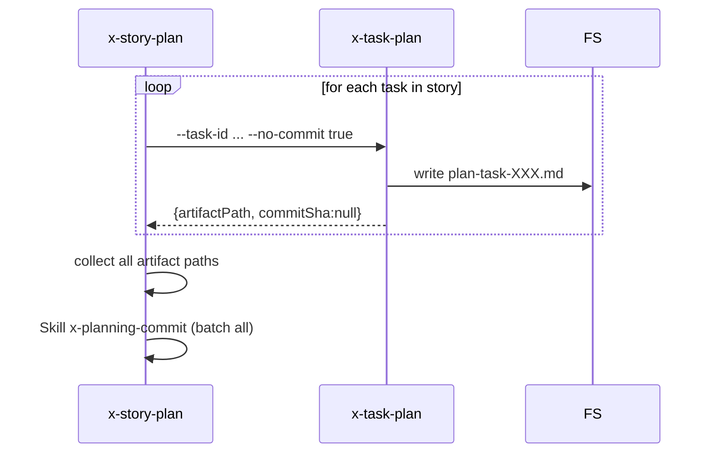

# História: Estensão `x-task-plan` com flag `--no-commit`

**ID:** story-0049-0017
**Chave Jira:** —
**Status:** Pendente

## 1. Dependências

| Blocked By | Blocks |
| :--- | :--- |
| — | story-0049-0022 |

## 2. Regras Transversais Aplicáveis

| ID | Título |
| :--- | :--- |
| RULE-007 | Skills de planejamento devem versionar |
| RULE-009 | Propagação OO-style |

## 3. Descrição

Como **`x-story-plan`**, eu quero que `x-task-plan` aceite flag `--no-commit` para suprimir o commit individual do `plan-task-*.md`, permitindo que `x-story-plan` invoque N tasks em batch e faça UM ÚNICO commit cobrindo todos os artifacts da story (evita 20+ commits ruidosos).

### 3.1 Flag novo

- `--no-commit` (default `false`)
  - Default `false`: comportamento atual (commit individual via `x-planning-commit`)
  - `true`: pula commit; só escreve o file e retorna

### 3.2 Backward compat

Sem flag, comportamento idêntico ao atual.

## 3.5 Entrega de Valor

- **Valor Principal:** Permite commit batch de planos de task em `x-story-plan`, evitando 20+ commits ruidosos no histórico do épico.
- **Métrica de Sucesso:** Após S22, `x-story-plan` gera 1 commit por story em vez de N (1 + tasks).

## 4. Definições de Qualidade Locais

### DoR Local

- [ ] Decisão sobre default (`false` para preservar standalone behavior) confirmada

### DoD Local

- [ ] `x-task-plan/SKILL.md` modificado
- [ ] Flag `--no-commit` documentado
- [ ] Backward compat preservado (regression test)

### Global DoD

- **Cobertura:** ≥ 95% / 90%

## 5. Contratos de Dados

### 5.1 Novo flag

| Campo | Tipo | M/O | Validações | Exemplo |
| :--- | :--- | :--- | :--- | :--- |
| `--no-commit` | Boolean | O | — | `true` |

### 5.2 Response (sem mudança contratual)

Sem mudanças, mas em `--no-commit true`, `commitSha=null` no response.

### 5.3 Error Codes

Sem novos error codes.

## 6. Diagramas



## 7. Critérios de Aceite (Gherkin)

```gherkin
Cenario: Backward compat — sem --no-commit
  DADO invoco x-task-plan TASK-0049-0001-001
  QUANDO a skill executa
  ENTÃO commit individual é feito (commitSha não-vazio)

Cenario: --no-commit suprime commit
  DADO invoco x-task-plan TASK-0049-0001-001 --no-commit true
  QUANDO a skill executa
  ENTÃO file é escrito mas NENHUM commit é criado
  E response contém commitSha=null

Cenario: --no-commit false explícito
  DADO --no-commit false
  QUANDO a skill executa
  ENTÃO commit individual é feito (mesmo do default)

Cenario: Erro — combinação inválida (se houver)
  N/A — flag standalone

Cenario: Boundary — re-execução com --no-commit alterna comportamento
  DADO primeira invocação com --no-commit true
  QUANDO segunda invocação sem --no-commit
  ENTÃO segunda invocação faz commit do plan
```

### 7.2 Mandatory Categories

- [x] Degenerate (default false)
- [x] Happy path (--no-commit suprime)
- [x] Error paths (n/a)
- [x] Boundary (re-execução)

## 8. Tasks

### TASK-0049-0017-001: Adicionar parsing de --no-commit
- **Layer:** Domain · **Test Type:** Unit · **Size:** S · **Dependencies:** —
- **Branch:** `feat/task-0049-0017-001-arg`
- **Files:** `plan/x-task-plan/SKILL.md`

### TASK-0049-0017-002: Suprimir commit step quando --no-commit true
- **Layer:** Adapter · **Test Type:** Integration · **Size:** S · **Dependencies:** TASK-0049-0017-001
- **Branch:** `feat/task-0049-0017-002-skip-commit`
- **Files:** `plan/x-task-plan/SKILL.md`

### TASK-0049-0017-003: Goldens regression + smoke
- **Layer:** Test · **Test Type:** Smoke · **Size:** S · **Dependencies:** TASK-0049-0017-002
- **Branch:** `feat/task-0049-0017-003-smoke`
- **Files:** `src/test/resources/golden/plan/x-task-plan/**`
