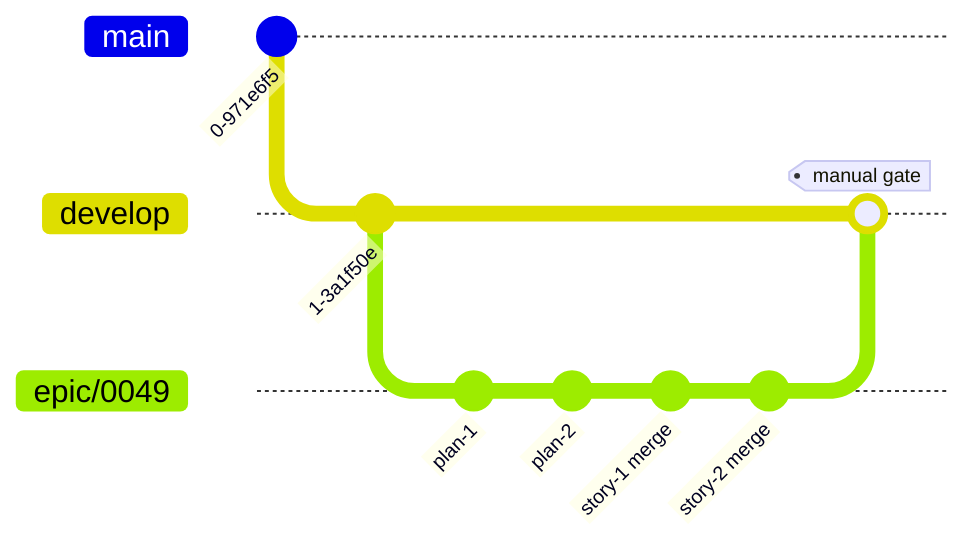

# História: Atualização de Rules 09/14/19 + criação de Rules 20/21

**ID:** story-0049-0020
**Chave Jira:** —
**Status:** Pendente

## 1. Dependências

| Blocked By | Blocks |
| :--- | :--- |
| — | — |

## 2. Regras Transversais Aplicáveis

| ID | Título |
| :--- | :--- |
| RULE-001 | Branch única por épico |
| RULE-006 | Convenção `x-internal-*` |
| RULE-008 | Backward compatibility via `flowVersion` |

## 3. Descrição

Como **plataforma**, eu quero documentar formalmente o novo branch model (`epic/XXXX`) na **Rule 20** e a convenção de visibility (`x-internal-*`) na **Rule 21**, e atualizar Rules 09 (Branching Model), 14 (Worktree Lifecycle) e 19 (Backward Compatibility) para refletir as mudanças do EPIC-0049, garantindo que invariantes sejam enforcadas por audit scripts no CI.

### 3.1 Nova Rule 20 — Epic Branch Model

Path: `java/src/main/resources/targets/claude/rules/20-epic-branch-model.md`. Conteúdo:
- Branch única por épico, criada no nascimento (planejamento ou execução)
- Recebe commits de planejamento + merges de stories
- PR final manual `epic/XXXX → develop` é o gate
- Excluída do conjunto de protected branches do `x-git-cleanup-branches`
- `--legacy-flow` desabilita esse modelo

### 3.2 Nova Rule 21 — Skill Visibility

Path: `java/src/main/resources/targets/claude/rules/21-skill-visibility.md`. Conteúdo:
- Convenção `x-internal-*` para skills internas
- Frontmatter obrigatório: `visibility: internal`, `user-invocable: false`
- Body começa com bloco visível 🔒 INTERNAL SKILL
- Subdir convention: `internal/{group}/x-internal-{name}/`
- Generator filtra do `/help` e do menu
- Forbidden: invocar `x-internal-*` em texto user-facing
- Audit script no CI

### 3.3 Atualização Rule 09 (Branching Model)

Adicionar entry à tabela de Branch Types:

| Branch | Purpose | Lifetime | Created From | Merges Into |
| :--- | :--- | :--- | :--- | :--- |
| `epic/*` | Epic integration | Temporário | `develop` | `develop` (manual) |

### 3.4 Atualização Rule 14 (Worktree Lifecycle)

- Adicionar pattern: `Epic Integration | .claude/worktrees/epic-XXXX/`
- Nota: stories em modo `--parallel` criam worktrees `story-XXXX-YYYY` com base `epic/XXXX` (não `develop`)

### 3.5 Atualização Rule 19 (Backward Compatibility)

Adicionar matriz de fallback para `flowVersion`:

| Condição | Resolved | Comportamento |
| :--- | :--- | :--- |
| flowVersion ausente | "1" | Legacy flow |
| flowVersion = "1" | "1" | Legacy flow |
| flowVersion = "2" | "2" | New flow |
| flowVersion outro valor | "1" + warning | Legacy flow |

## 3.5 Entrega de Valor

- **Valor Principal:** Documenta o novo branch model (Rule 20) e a convenção `x-internal-*` (Rule 21); garante invariante para futuras mudanças.
- **Métrica de Sucesso:** Audit scripts no CI passam para todas as 5 rules; futuros épicos automaticamente herdam os modelos.

## 4. Definições de Qualidade Locais

### DoR Local

- [ ] Conteúdo das 2 rules novas validado pelo PO
- [ ] Audit script base disponível (Rule 13 já tem)

### DoD Local

- [ ] Rules 20 e 21 criadas com conteúdo completo
- [ ] Rules 09, 14, 19 atualizadas
- [ ] Audit scripts adicionados ao CI
- [ ] Goldens regenerados

### Global DoD

- **Cobertura:** N/A (rules são docs)
- **Documentação:** SKILL.md de cada nova/alterada inclui exemplos

## 5. Contratos de Dados

N/A (story de documentação).

## 6. Diagramas

### 6.1 Branch model documentado pela Rule 20



## 7. Critérios de Aceite (Gherkin)

```gherkin
Cenario: Rule 20 documenta epic/* branch
  DADO 20-epic-branch-model.md existe
  QUANDO leio o conteúdo
  ENTÃO contém seções: Purpose, Branch Naming, Lifecycle, Anti-Patterns

Cenario: Rule 21 documenta convenção x-internal-*
  DADO 21-skill-visibility.md existe
  QUANDO leio o conteúdo
  ENTÃO contém: critérios, frontmatter, body marker, subdir convention, audit

Cenario: Rule 09 atualizada com epic/* row
  DADO 09-branching-model.md modificado
  QUANDO leio Branch Types table
  ENTÃO contém row "epic/*"

Cenario: Audit Rule 21 retorna 0 violações
  QUANDO rodo o audit script de visibility
  ENTÃO exit code 0
  E nenhuma violação reportada

Cenario: Boundary — Rule 19 fallback flowVersion ausente
  DADO execution-state.json sem flowVersion
  QUANDO sistema avalia
  ENTÃO retorna "1" + warning visível
```

### 7.2 Mandatory Categories

- [x] Degenerate (rules existem)
- [x] Happy path (audit passa)
- [x] Error paths (audit detecta violação)
- [x] Boundary (fallback flowVersion)

## 8. Tasks

### TASK-0049-0020-001: Criar Rule 20 (Epic Branch Model)
- **Layer:** Doc · **Test Type:** Verification · **Size:** M · **Dependencies:** —
- **Branch:** `feat/task-0049-0020-001-rule-20`
- **Files:** `rules/20-epic-branch-model.md`

### TASK-0049-0020-002: Criar Rule 21 (Skill Visibility)
- **Layer:** Doc · **Test Type:** Verification · **Size:** M · **Dependencies:** —
- **Branch:** `feat/task-0049-0020-002-rule-21`
- **Files:** `rules/21-skill-visibility.md`

### TASK-0049-0020-003: Atualizar Rule 09 + Rule 14
- **Layer:** Doc · **Test Type:** Verification · **Size:** S · **Dependencies:** TASK-0049-0020-001, TASK-0049-0020-002
- **Branch:** `feat/task-0049-0020-003-rule-09-14`
- **Files:** `rules/09-branching-model.md`, `rules/14-worktree-lifecycle.md`

### TASK-0049-0020-004: Atualizar Rule 19 com flowVersion matrix
- **Layer:** Doc · **Test Type:** Verification · **Size:** S · **Dependencies:** TASK-0049-0020-003
- **Branch:** `feat/task-0049-0020-004-rule-19`
- **Files:** `rules/19-backward-compatibility.md`

### TASK-0049-0020-005: Audit scripts no CI (Rule 21 enforcement)
- **Layer:** Config · **Test Type:** Verification · **Size:** M · **Dependencies:** TASK-0049-0020-004
- **Branch:** `feat/task-0049-0020-005-audit`
- **Files:** `.github/workflows/audit-rules.yml` (ou equivalente), `scripts/audit-skill-visibility.sh`
