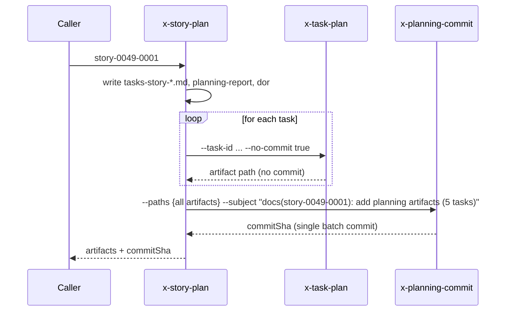

# História: Versionamento em `x-epic-orchestrate`, `x-story-create`, `x-story-plan`, `x-task-plan`

**ID:** story-0049-0022
**Chave Jira:** —
**Status:** Concluída

## 1. Dependências

| Blocked By | Blocks |
| :--- | :--- |
| story-0049-0004, story-0049-0008, story-0049-0017 | — |

## 2. Regras Transversais Aplicáveis

| ID | Título |
| :--- | :--- |
| RULE-001 | Branch única por épico |
| RULE-007 | Skills de planejamento devem versionar |

## 3. Descrição

Como **plataforma**, eu quero adicionar versionamento Git automático às 4 skills restantes de planejamento (`x-epic-orchestrate`, `x-story-create`, `x-story-plan`, `x-task-plan`), fechando o ciclo das 7 skills versionadas. Aplica o mesmo padrão P1-P5 da S21.

### 3.1 Por skill

- **`x-epic-orchestrate`**: P4 commit pós cada wave de planejamento. Subject: `chore(epic-XXXX): planning orchestration cycle (wave N)`. Inclui `execution-state.json` e reports.
- **`x-story-create`**: P4 commit do story file. Subject: `docs(story-XXXX-YYYY): add user story`.
- **`x-story-plan`**: P4 commit batch de TODOS os artifacts da story (tasks, planning-report, dor, e (v2) task-files + plan-tasks). Invoca `x-task-plan --no-commit true` (S17) para cada task. Subject: `docs(story-XXXX-YYYY): add planning artifacts (N tasks)`.
- **`x-task-plan`** (já estendido em S17): standalone faz commit; invocado por `x-story-plan` com `--no-commit true` não commita.

### 3.2 Padrão P1-P5

Idêntico ao S21 (detect-context → ensure branch → fases → commit → push).

## 3.5 Entrega de Valor

- **Valor Principal:** Audit trail completo do planejamento de cada story (artefatos commitados); fecha o ciclo de versionamento das 7 skills de planejamento.
- **Métrica de Sucesso:** Após esta story, executar `x-epic-orchestrate 0049` deixa working tree limpo. `git log epic/0049` mostra commits granulares por story plan.

## 4. Definições de Qualidade Locais

### DoR Local

- [ ] Stories S4, S8, S17 mergeadas

### DoD Local

- [ ] As 4 skills modificadas seguem padrão P1-P5
- [ ] `x-story-plan` commit batch funciona (não gera N+1 commits)
- [ ] `--dry-run` propaga
- [ ] Goldens regenerados

### Global DoD

- **Cobertura:** ≥ 95% / 90%

## 5. Contratos de Dados

Sem mudanças contratuais (comportamento + commit pós).

## 6. Diagramas



## 7. Critérios de Aceite (Gherkin)

```gherkin
Cenario: x-story-create commit do story file
  DADO `x-story-create story-0049-0001 ...`
  QUANDO a skill executa
  ENTÃO 1 commit `docs(story-0049-0001): add user story` é feito
  E working tree limpo

Cenario: x-story-plan commit batch (1 commit, não N+1)
  DADO story com 5 tasks
  QUANDO `x-story-plan story-0049-0001`
  ENTÃO 1 ÚNICO commit cobrindo planning + 5 task plans é criado
  E `x-task-plan` foi invocado com `--no-commit true`

Cenario: x-task-plan standalone commita
  DADO `x-task-plan TASK-0049-0001-001` (sem orquestrador)
  QUANDO a skill executa
  ENTÃO 1 commit `docs(task-0049-0001-001): add task plan` é criado

Cenario: x-epic-orchestrate commit pós-wave
  DADO planning de 3 stories em wave
  QUANDO wave completa
  ENTÃO 1 commit `chore(epic-0049): planning orchestration cycle (wave 1)` é criado
  E inclui `execution-state.json` e reports

Cenario: Boundary — --dry-run não commita
  DADO --dry-run true em qualquer skill
  QUANDO executa
  ENTÃO zero commits criados
```

### 7.2 Mandatory Categories

- [x] Degenerate (--dry-run skip)
- [x] Happy path (commit batch single)
- [x] Error paths (n/a — operação idempotente)
- [x] Boundary (standalone vs orquestrador)

## 8. Tasks

### TASK-0049-0022-001: Modificar x-story-create com P1-P5
- **Layer:** Adapter · **Test Type:** Integration · **Size:** S · **Dependencies:** —
- **Branch:** `feat/task-0049-0022-001-story-create`
- **Files:** `plan/x-story-create/SKILL.md`

### TASK-0049-0022-002: Modificar x-task-plan standalone P1-P5
- **Layer:** Adapter · **Test Type:** Integration · **Size:** S · **Dependencies:** —
- **Branch:** `feat/task-0049-0022-002-task-plan`
- **Files:** `plan/x-task-plan/SKILL.md`

### TASK-0049-0022-003: Modificar x-story-plan com commit batch
- **Layer:** Adapter · **Test Type:** Integration · **Size:** M · **Dependencies:** TASK-0049-0022-002
- **Branch:** `feat/task-0049-0022-003-story-plan-batch`
- **Files:** `plan/x-story-plan/SKILL.md`

### TASK-0049-0022-004: Modificar x-epic-orchestrate com commit por wave
- **Layer:** Adapter · **Test Type:** Integration · **Size:** M · **Dependencies:** TASK-0049-0022-003
- **Branch:** `feat/task-0049-0022-004-orchestrate`
- **Files:** `plan/x-epic-orchestrate/SKILL.md`

### TASK-0049-0022-005: Smoke + dual-run regression
- **Layer:** Test · **Test Type:** Smoke · **Size:** S · **Dependencies:** TASK-0049-0022-004
- **Branch:** `feat/task-0049-0022-005-smoke`
- **Files:** `src/test/.../PlanningVcsSmokeTest.java`, goldens das 4 skills
