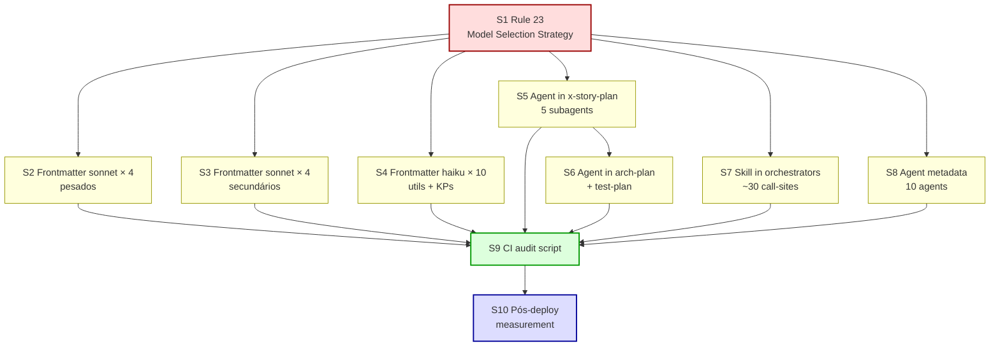

# Mapa de Implementação — EPIC-0050: Model Selection Enforcement & Token Optimization

**Gerado a partir das dependências BlockedBy/Blocks de cada história do epic-0050.**

---

## 1. Matriz de Dependências

| Story | Título | Chave Jira | Blocked By | Blocks | Status |
| :--- | :--- | :--- | :--- | :--- | :--- |
| story-0050-0001 | Rule nova — Model Selection Strategy (foundation) | — | — | story-0050-0002, story-0050-0003, story-0050-0004, story-0050-0005, story-0050-0006, story-0050-0007, story-0050-0008 | Pendente |
| story-0050-0002 | Frontmatter `model: sonnet` em 4 orquestradores pesados | — | story-0050-0001 | story-0050-0009 | Pendente |
| story-0050-0003 | Frontmatter `model: sonnet` em 4 orquestradores secundários | — | story-0050-0001 | story-0050-0009 | Pendente |
| story-0050-0004 | Frontmatter `model: haiku` em 10 skills utilitárias e KPs | — | story-0050-0001 | story-0050-0009 | Pendente |
| story-0050-0005 | `Agent(...)` com `model:` em x-story-plan (5 subagents) | — | story-0050-0001 | story-0050-0006, story-0050-0009 | Pendente |
| story-0050-0006 | `Agent(...)` com `model:` em x-arch-plan + x-test-plan | — | story-0050-0005 | story-0050-0009 | Pendente |
| story-0050-0007 | `Skill(...)` com `model:` param em orquestradores | — | story-0050-0001 | story-0050-0009 | Pendente |
| story-0050-0008 | Agent metadata determinístico (substituir Adaptive) | — | story-0050-0001 | story-0050-0009 | Pendente |
| story-0050-0009 | CI audit script de model selection | — | story-0050-0002, story-0050-0003, story-0050-0004, story-0050-0005, story-0050-0006, story-0050-0007, story-0050-0008 | story-0050-0010 | Pendente |
| story-0050-0010 | Medição pós-deploy via telemetria (EPIC-0040) | — | story-0050-0009 | — | Pendente |

> **Valores de Status:** `Pendente` (padrão) · `Em Andamento` · `Concluída` · `Falha` · `Bloqueada` · `Parcial`

> **Nota:** Todas as 10 stories são de plataforma (sem dependências de domínio externo). STORY-0050-0010 depende do EPIC-0040 (já mergeado) mas esta dependência é externa a este épico.

---

## 2. Fases de Implementação

> As histórias são agrupadas em fases. Dentro de cada fase, as histórias podem ser implementadas **em paralelo** (sujeito ao default sequencial do novo `x-epic-implement`). Uma fase só pode iniciar quando todas as dependências das fases anteriores estiverem concluídas.

```
╔══════════════════════════════════════════════════════════════════════════╗
║                        FASE 0 — Governança (Foundation)                 ║
║                                 (1 story)                                ║
║                                                                          ║
║                    ┌─────────────────────────────┐                       ║
║                    │ S1 Rule 23                  │                       ║
║                    │ Model Selection Strategy    │                       ║
║                    │ (BLOCKS TODAS AS DEMAIS)    │                       ║
║                    └─────────────────────────────┘                       ║
╚══════════════════════════════╪═══════════════════════════════════════════╝
                               │
                               ▼
╔══════════════════════════════════════════════════════════════════════════╗
║               FASE 1 — Enforcement Técnico (6 paralelas)                ║
║                                                                          ║
║   ┌────────────┐ ┌────────────┐ ┌────────────┐ ┌────────────┐          ║
║   │ S2         │ │ S3         │ │ S4         │ │ S5         │          ║
║   │ Frontmatter│ │ Frontmatter│ │ Frontmatter│ │ Agent() em │          ║
║   │ sonnet × 4 │ │ sonnet × 4 │ │ haiku × 10 │ │ x-story-   │          ║
║   │ (pesados)  │ │ (secund.)  │ │ (utils+KPs)│ │ plan       │          ║
║   └────────────┘ └────────────┘ └────────────┘ └────────────┘          ║
║   ┌────────────┐ ┌────────────┐                                         ║
║   │ S7         │ │ S8         │                                         ║
║   │ Skill()    │ │ Agent      │                                         ║
║   │ em orch.   │ │ metadata   │                                         ║
║   │ (4 files)  │ │ (10 agents)│                                         ║
║   └────────────┘ └────────────┘                                         ║
╚══════════════════════════════╪═══════════════════════════════════════════╝
                               │
                               ▼
╔══════════════════════════════════════════════════════════════════════════╗
║            FASE 2 — Padrão estendido de Agent() (1 story)               ║
║                                                                          ║
║                    ┌─────────────────────────────┐                       ║
║                    │ S6 Agent() em               │                       ║
║                    │ x-arch-plan + x-test-plan   │                       ║
║                    │ (depende do padrão S5)      │                       ║
║                    └─────────────────────────────┘                       ║
╚══════════════════════════════╪═══════════════════════════════════════════╝
                               │
                               ▼
╔══════════════════════════════════════════════════════════════════════════╗
║                FASE 3 — CI Audit Enforcement (1 story)                  ║
║                                                                          ║
║                    ┌─────────────────────────────┐                       ║
║                    │ S9 scripts/audit-model-     │                       ║
║                    │ selection.sh + CI hook      │                       ║
║                    │ (depende de S2..S8)         │                       ║
║                    └─────────────────────────────┘                       ║
╚══════════════════════════════╪═══════════════════════════════════════════╝
                               │
                               ▼
╔══════════════════════════════════════════════════════════════════════════╗
║             FASE 4 — Medição Pós-Deploy (1 story)                       ║
║                                                                          ║
║                    ┌─────────────────────────────┐                       ║
║                    │ S10 telemetry-model-mix     │                       ║
║                    │ + post-deploy report        │                       ║
║                    │ (depende de S9 + EPIC-0040) │                       ║
║                    └─────────────────────────────┘                       ║
╚══════════════════════════════════════════════════════════════════════════╝
```

---

## 3. Caminho Crítico

> O caminho crítico (sequência mais longa de dependências) determina o tempo mínimo de implementação do épico.

```
S1 (Rule 23) ──→ S5 (Agent x-story-plan) ──→ S6 (Agent arch+test-plan) ──→ S9 (CI audit) ──→ S10 (medição)
   │
   ├──→ S2 (frontmatter pesados) ──┐
   ├──→ S3 (frontmatter secund.) ──┤
   ├──→ S4 (frontmatter haiku) ────┼──→ S9 (CI audit) ──→ S10 (medição)
   ├──→ S7 (Skill param) ──────────┤
   └──→ S8 (agent metadata) ───────┘
```

- **Sequência crítica**: S1 → S5 → S6 → S9 → S10 (5 passos sequenciais)
- **Sequência paralela alternativa**: S1 → {S2..S8 em paralelo} → S9 → S10 (3 passos sequenciais; ~60% mais rápido em paralelo)
- **Bottleneck principal**: S9 depende de todas as stories 2-8 concluídas (fan-in de 7)
- **Bottleneck secundário**: S10 depende também de 2 epics executados pós-merge (aspecto temporal)

---

## 4. Grafo de Dependências (Mermaid)



**Legenda das cores:**
- 🔴 **Phase 0** (foundation — bloqueia tudo)
- 🟡 **Phase 1** (6 stories paralelas após foundation)
- 🟡 **Phase 2** (1 story que depende do padrão estabelecido em Phase 1)
- 🟢 **Phase 3** (CI audit consolidando fixes)
- 🔵 **Phase 4** (medição pós-deploy, depende de execução real)

---

## 5. Sumário por Fase

| Fase | Stories | Duração estimada (sequencial) | Duração (paralelo máx) | Tipo de trabalho | Ganho de tokens esperado |
| :--- | :--- | :--- | :--- | :--- | :--- |
| 0 — Governança | 1 (S1) | 1 dia | 1 dia | Documentação (Rule) | 0% (foundation) |
| 1 — Enforcement técnico | 6 (S2, S3, S4, S5, S7, S8) | 6 dias | 1-2 dias | Metadata + refactor | ~80% (quick wins) |
| 2 — Padrão estendido | 1 (S6) | 0,5 dia | 0,5 dia | Refactor | ~5% |
| 3 — CI audit | 1 (S9) | 1-2 dias | 1-2 dias | Script bash + CI config | 0% (governança) |
| 4 — Medição | 1 (S10) | 1 dia + wait | 1 dia + wait | Script + report | 0% (validação) |
| **Total** | **10** | **~9-10 dias** | **~4-5 dias** | — | **~85% (~7.850 tokens/execução)** |

**Observações operacionais:**

1. **Coordenação com EPIC-0049 (PR #421)**: Se PR #421 não estiver mergeado, evitar tocar em `x-epic-implement` e `x-story-implement` (STORY-0050-0002 e STORY-0050-0007) até resolução. Alternativa: rebasear após merge.

2. **Regeneração de goldens**: Cada story que modifica SKILL.md ou agent exige `mvn process-resources && mvn test -Dtest=GoldenFileRegenerator -Dgolden.regenerate=true`. Centralizar esse comando num hook post-edit ajuda a evitar esquecimento (referenciar memória `reference_golden_regen_command.md`).

3. **Smoke tests críticos por story**:
   - S2: `/x-review` carrega sem erro
   - S4: `/x-git-commit` produz Conventional Commit válido
   - S5: `/x-story-plan` dispara 5 subagents
   - S7: `/x-review` executa sem regressão
   - S9: teste do próprio script (violação injetada → FAIL; remoção → PASS)
   - S10: targets atingidos em 2 epics reais

4. **Ordem recomendada de PRs**:
   1. Este PR (planejamento) → develop
   2. PR de S1 (Rule 23) → develop
   3. PRs paralelos S2..S8 → develop (depois de S1 mergeada)
   4. PR de S6 → develop (depois de S5)
   5. PR de S9 → develop (depois de S2..S8)
   6. PR de S10 → develop (pós-merge + 2 epics executados)

5. **Anti-padrão a evitar**: Mergear S9 (CI audit) antes de S2..S8 — o CI falharia em qualquer novo PR porque os fixes ainda não foram aplicados. Dependência explicitada na matriz.
