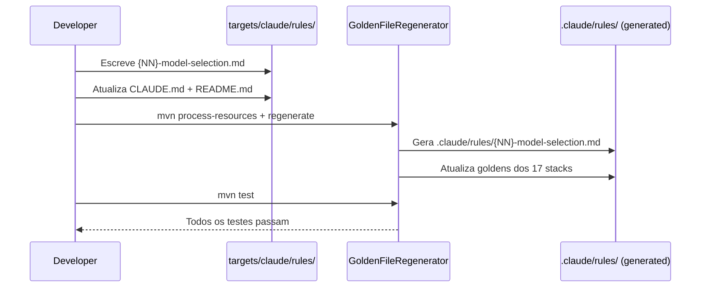

# História: Rule nova — Model Selection Strategy (foundation)

**ID:** story-0050-0001
**Chave Jira:** —
**Status:** Pendente

## 1. Dependências

| Blocked By | Blocks |
| :--- | :--- |
| — | story-0050-0002, story-0050-0003, story-0050-0004, story-0050-0005, story-0050-0006, story-0050-0007, story-0050-0008 |

## 2. Regras Transversais Aplicáveis

| ID | Título |
| :--- | :--- |
| RULE-001 | Orquestradores declaram `model:` no frontmatter |
| RULE-002 | `Agent(...)` com `model:` explícito |
| RULE-003 | `Skill(...)` com `model:` param em orquestradores |
| RULE-004 | Agents declaram `Recommended Model` determinístico |
| RULE-005 | Haiku-eligibility por categoria |
| RULE-006 | CI audit script obrigatório |
| RULE-007 | Backward compatibility (escopo aditivo) |

## 3. Descrição

Como **engenheiro de plataforma**, eu quero uma Rule normativa publicada no `.claude/rules/` que documente a estratégia de seleção de modelos (Opus/Sonnet/Haiku) do projeto, os três pontos de enforcement técnico (frontmatter, Agent param, Skill param), o contrato de metadata dos agents e o contrato de audit no CI, para que todas as demais stories deste épico tenham uma fonte única de verdade e para que futuros contribuintes não introduzam regressões por desconhecimento do padrão.

Hoje existe uma "RULE-009" referenciada em 8 locais (SKILL.md de `x-arch-plan`, `x-story-implement`, `x-test-plan`, `x-story-plan`) apenas em prosa — nunca foi formalizada como rule normativa em `.claude/rules/`. Esta story preenche essa lacuna, fornecendo o documento governance que bloqueia o resto do épico.

### 3.1 Nome e localização

- Nome sugerido: `model-selection-strategy.md`
- Numeração: próximo slot livre após Rule 22 (EPIC-0049 está usando 21 e 22). Candidatos: **23** (sequencial) ou **10** (reservado para conditional rules, citado em `.claude/rules/README.md`). Durante a implementação desta story, validar com o tech lead qual slot usar.
- Source-of-truth: `java/src/main/resources/targets/claude/rules/{NN}-model-selection.md`
- Output gerado: `.claude/rules/{NN}-model-selection.md`

### 3.2 Seções obrigatórias do arquivo

1. **Purpose** — 1 parágrafo justificando o trade-off Opus/Sonnet/Haiku (custo vs qualidade de raciocínio).
2. **Matrix** — tabela com 5 colunas: Camada | Tier padrão | Exemplos | Justificativa | Exceção.
3. **Enforcement points** — 3 contratos técnicos com sintaxe exata:
   - Frontmatter YAML (`model: sonnet`)
   - `Agent(subagent_type: "general-purpose", model: "<tier>", description: ..., prompt: ...)`
   - `Skill(skill: "...", model: "<tier>", args: ...)`
4. **Agent metadata contract** — sintaxe de `Recommended Model: <Opus|Sonnet|Haiku>` em `.claude/agents/*.md`; proíbe `Adaptive`.
5. **Haiku eligibility criteria** — critérios (a) e (b) com exemplos.
6. **Audit contract** — comando bash canônico (padrão Rule 13 linhas 230-255); grep com 0 matches = pass.
7. **Backward compatibility** — escopo aditivo; skills fora da matriz ignoradas.
8. **Exceptions** — lista explícita (entry points user-invoked não precisam de frontmatter `model:` obrigatório; o CI audit ignora essas skills).

### 3.3 Integração com outros artefatos

- `CLAUDE.md` na raiz: adicionar entrada na tabela de rules.
- `.claude/rules/README.md`: adicionar linha na tabela de rules listadas.
- Nenhuma alteração em SKILL.md existentes nesta story — apenas documentação.

## 3.5 Entrega de Valor

- **Valor Principal:** Estabelece a fonte única de verdade para seleção de modelo. Bloqueia sem ambiguidade decisões futuras de tier em skills e agents. Habilita as demais stories do épico a referenciarem "Rule 23" em vez de replicarem justificativas inline.
- **Métrica de Sucesso:** Arquivo gerado em `.claude/rules/{NN}-model-selection.md` passa em todos os 17 stacks suportados; `CLAUDE.md` e `README.md` referenciam-no corretamente; audit script mencionado na seção "Audit contract" é executável e retorna exit 0 quando invocado em estado limpo.
- **Impacto no Negócio:** Previne que futuros PRs introduzam skills sem `model:` ou agents com "Adaptive" — o que é o mecanismo causal do 84,4% Opus atual.

## 4. Definições de Qualidade Locais

### DoR Local (Definition of Ready)

- [ ] Numeração da Rule decidida (23 ou 10) e confirmada com tech lead
- [ ] Matriz de tiers consolidada a partir da análise de skills/agents (disponível no SPEC deste épico)
- [ ] Templates de Rule (`.claude/rules/*.md` existentes) disponíveis como referência

### DoD Local (Definition of Done)

- [ ] Arquivo `targets/claude/rules/{NN}-model-selection.md` criado com as 8 seções obrigatórias
- [ ] Entrada em `targets/claude/CLAUDE.md` (tabela de rules) adicionada
- [ ] Entrada em `targets/claude/rules/README.md` adicionada
- [ ] Golden files regenerados para os 17 stacks (`mvn process-resources && mvn test -Dtest=GoldenFileRegenerator -Dgolden.regenerate=true`)
- [ ] Testes de integração do módulo Rule assembly passam
- [ ] Arquivo não excede 200 linhas (legibilidade)

### Global Definition of Done (DoD)

- **Cobertura:** ≥ 95% Line, ≥ 90% Branch (módulo Rule assembly)
- **Testes Automatizados:** Golden tests para os 17 stacks
- **Relatório de Cobertura:** JaCoCo
- **Documentação:** Rule arquivada em `.claude/rules/`, listada em índice
- **Persistência:** N/A
- **Performance:** N/A (documentação)

## 5. Contratos de Dados (Data Contract)

Esta story produz **apenas documentação**. Contrato é o arquivo markdown em si.

### 5.1 Input

- Análise do SPEC (`specs/SPEC-model-selection-enforcement-v1.md`) como fonte das regras

### 5.2 Output

| Artefato | Caminho | Formato |
| :--- | :--- | :--- |
| Rule file | `.claude/rules/{NN}-model-selection.md` | Markdown com as 8 seções listadas em 3.2 |
| CLAUDE.md update | Entrada na tabela de rules | Markdown (linha de tabela) |
| README.md update | Entrada na tabela | Markdown (linha de tabela) |

### 5.3 Error Codes

N/A — story de documentação.

## 6. Diagramas

### 6.1 Fluxo de geração da Rule



## 7. Critérios de Aceite (Gherkin)

```gherkin
Cenário: Rule é gerada no output
  DADO que a rule model-selection-strategy está em targets/claude/rules/
  QUANDO o assembler gera o profile "java-picocli"
  ENTÃO o output contém ".claude/rules/{NN}-model-selection.md"
  E a rule contém a seção "## Matrix"
  E a rule contém a seção "## Enforcement points"

Cenário: Rule referencia os 3 contratos técnicos
  DADO a rule gerada
  QUANDO um desenvolvedor a lê
  ENTÃO ela cita "frontmatter model:"
  E ela cita "Agent(subagent_type:" com "model:"
  E ela cita "Skill(skill:" com "model:"

Cenário: Rule proíbe Adaptive
  DADO a rule gerada
  QUANDO a seção "Agent metadata contract" é lida
  ENTÃO ela proíbe explicitamente o valor "Adaptive"

Cenário: CLAUDE.md referencia a nova Rule
  DADO CLAUDE.md gerado no output
  QUANDO a tabela de rules é lida
  ENTÃO contém uma linha para "{NN}-model-selection"

Cenário: Boundary — rule não excede 200 linhas
  DADO o arquivo de rule gerado
  QUANDO as linhas são contadas
  ENTÃO o total é ≤ 200
```

### 7.1 Scenario Ordering (TPP)

Cenários ordenados de degenerate (geração em stack base) → happy path (seções corretas) → constraints (proibições, referências cruzadas) → boundary (tamanho máximo).

### 7.2 Mandatory Scenario Categories

- [x] Degenerate cases (geração mínima em um stack)
- [x] Happy path (seções obrigatórias presentes)
- [x] Error paths (n/a — doc-only)
- [x] Boundary values (tamanho de arquivo ≤ 200 linhas)

## 8. Tasks

### TASK-0050-0001-001: Decidir numeração e criar skeleton da Rule

- **Layer:** Doc
- **Test Type:** Verification
- **Size:** S
- **Dependencies:** —
- **Branch:** `feat/task-0050-0001-001-rule-skeleton`
- **Testability:** INDEPENDENT
- **Files:**
  - `java/src/main/resources/targets/claude/rules/{NN}-model-selection.md` (novo)
- **Acceptance Criteria:**
  - [ ] Numeração confirmada (sugestão: 23)
  - [ ] Arquivo com as 8 seções em skeleton (títulos + 1 parágrafo placeholder em cada)
  - [ ] Arquivo segue formatação dos outros rules (`.claude/rules/*.md`)

### TASK-0050-0001-002: Popular seções Matrix + Enforcement points

- **Layer:** Doc
- **Test Type:** Verification
- **Size:** M
- **Dependencies:** TASK-0050-0001-001
- **Branch:** `feat/task-0050-0001-002-rule-matrix`
- **Testability:** INDEPENDENT
- **Files:**
  - Mesmo arquivo da task 001
- **Acceptance Criteria:**
  - [ ] Tabela Matrix com 5 colunas e ≥ 6 linhas (orquestrador, planner, reviewer, executor, utility, KP)
  - [ ] Enforcement points cita sintaxe exata dos 3 contratos
  - [ ] Revisão cruzada com Rule 13 confirma consistência

### TASK-0050-0001-003: Popular Agent metadata + Haiku eligibility + Audit contract + BC + Exceptions

- **Layer:** Doc
- **Test Type:** Verification
- **Size:** M
- **Dependencies:** TASK-0050-0001-002
- **Branch:** `feat/task-0050-0001-003-rule-remaining`
- **Testability:** INDEPENDENT
- **Files:**
  - Mesmo arquivo
- **Acceptance Criteria:**
  - [ ] Agent metadata contract define sintaxe e proíbe "Adaptive"
  - [ ] Haiku eligibility lista os 2 critérios + 10 exemplos
  - [ ] Audit contract com comando bash executável (padrão Rule 13)
  - [ ] Backward compatibility declarada como aditiva
  - [ ] Exceptions listadas (entry points user-invoked)

### TASK-0050-0001-004: Atualizar CLAUDE.md + .claude/rules/README.md

- **Layer:** Doc
- **Test Type:** Verification
- **Size:** S
- **Dependencies:** TASK-0050-0001-003
- **Branch:** `feat/task-0050-0001-004-index-updates`
- **Testability:** INDEPENDENT
- **Files:**
  - `java/src/main/resources/targets/claude/CLAUDE.md`
  - `java/src/main/resources/targets/claude/rules/README.md`
- **Acceptance Criteria:**
  - [ ] Tabela de rules em CLAUDE.md inclui linha para Rule {NN}
  - [ ] README.md da pasta rules inclui linha
  - [ ] Links relativos funcionam

### TASK-0050-0001-005: Regenerar goldens + validar testes

- **Layer:** Test
- **Test Type:** Integration + Smoke
- **Size:** S
- **Dependencies:** TASK-0050-0001-004
- **Branch:** `feat/task-0050-0001-005-goldens`
- **Testability:** INDEPENDENT
- **Files:**
  - `src/test/resources/golden/**` (regenerados)
- **Acceptance Criteria:**
  - [ ] `mvn process-resources` ok
  - [ ] `mvn test -Dtest=GoldenFileRegenerator -Dgolden.regenerate=true` ok
  - [ ] `mvn verify` passa com coverage ≥ 95% line
  - [ ] Smoke: ler `.claude/rules/{NN}-model-selection.md` em output e validar seções via grep
