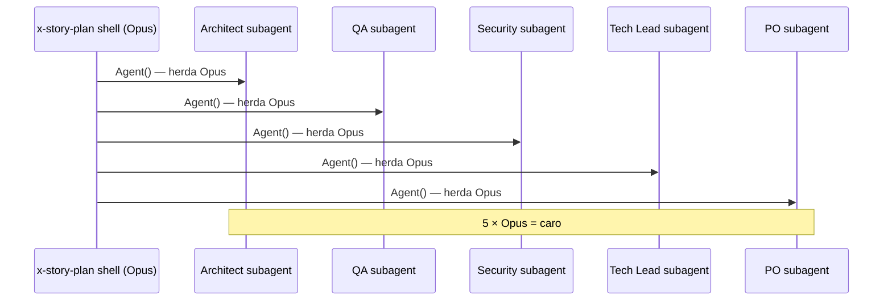
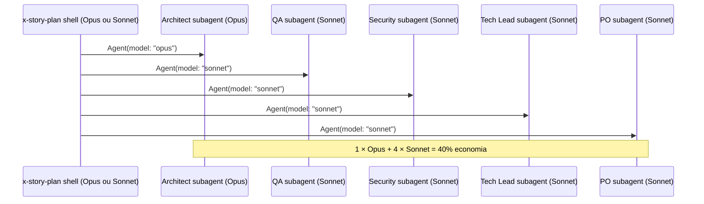

# História: `Agent(...)` com `model:` em x-story-plan (5 subagents)

**ID:** story-0050-0005
**Chave Jira:** —
**Status:** Pendente

## 1. Dependências

| Blocked By | Blocks |
| :--- | :--- |
| story-0050-0001 | story-0050-0006, story-0050-0009 |

## 2. Regras Transversais Aplicáveis

| ID | Título |
| :--- | :--- |
| RULE-002 | `Agent(...)` com `model:` explícito |
| RULE-007 | Backward compatibility (escopo aditivo) |

## 3. Descrição

Como **engenheiro de plataforma**, eu quero refatorar as 5 invocações de subagents em `x-story-plan/SKILL.md` (Architect, QA Engineer, Security Engineer, Tech Lead, Product Owner) para passarem o parâmetro `model:` explícito na chamada `Agent(subagent_type: "general-purpose", ...)`, para eliminar o maior ponto único de cascata Opus do projeto. Hoje os 5 subagents herdam o modelo do pai (Opus) mesmo com "model hint" documentado em prosa dentro do SKILL.md.

### 3.1 Localização das invocações

Arquivo: `java/src/main/resources/targets/claude/skills/core/x-story-plan/SKILL.md` (1.007 linhas).

As 5 invocações ficam entre as linhas ~231 e ~436 (aproximadamente — confirmar com grep durante a implementação):

| # | Subagent | Modelo alvo | Rationale |
| :--- | :--- | :--- | :--- |
| 1 | Architect | `opus` | Design arquitetural profundo justifica Opus |
| 2 | QA Engineer | `sonnet` | Checklist de qualidade — Sonnet suficiente |
| 3 | Security Engineer | `sonnet` | Análise STRIDE — Sonnet suficiente |
| 4 | Tech Lead | `sonnet` | Quality gates — Sonnet suficiente |
| 5 | Product Owner | `sonnet` | Validação de DoR — Sonnet suficiente |

### 3.2 Mudança exata por invocação

**Antes:**
```markdown
Launch `general-purpose` subagent:
> You are a **Senior Architect**...
[prompt]
```

ou

```markdown
Agent(
  subagent_type: "general-purpose",
  description: "...",
  prompt: "..."
)
```

**Depois:**
```markdown
Launch `general-purpose` subagent with explicit model (RULE-002):

Agent(
  subagent_type: "general-purpose",
  model: "opus",           # ← ADICIONADO (ou "sonnet")
  description: "...",
  prompt: "..."
)
```

### 3.3 Alinhamento com Rule 13

O formato final DEVE seguir Pattern 2 (SUBAGENT-GENERAL) de Rule 13 literalmente, apenas adicionando o campo `model:` entre `subagent_type:` e `description:`.

### 3.4 Remoção de "model hint" redundante

Comentários em prosa do tipo "model hint: opus" tornam-se redundantes após a declaração formal — remover para evitar confusão.

## 3.5 Entrega de Valor

- **Valor Principal:** Captura ~13% da redução de tokens do épico. Elimina o maior ponto único de cascata Opus — cada execução de `x-story-plan` dispara 5 subagents em paralelo.
- **Métrica de Sucesso:** `grep -A1 "Agent(subagent_type" .claude/skills/x-story-plan/SKILL.md | grep "model:"` retorna 5 linhas. Telemetria pós-merge confirma que 4 dos 5 subagents agora rodam em Sonnet.
- **Impacto no Negócio:** Cada story planejada consome ~1.050 tokens a menos (5 subagents × 210 tokens de economia por subagent).

## 4. Definições de Qualidade Locais

### DoR Local

- [ ] Rule 23 publicada com matriz que valida Architect=Opus, demais=Sonnet
- [ ] Rule 13 revisada para confirmar Pattern 2 como contrato

### DoD Local

- [ ] 5 invocações `Agent(...)` em x-story-plan têm `model:` explícito
- [ ] Valores batem com matriz (Architect=opus; demais=sonnet)
- [ ] Nenhum "model hint" em prosa remanescente
- [ ] Golden files regenerados
- [ ] Smoke: `/x-story-plan` invocado em story de teste completa os 5 subagents
- [ ] Audit Rule 23 Check B passa para x-story-plan

## 5. Contratos de Dados

### 5.1 Diff esperado

5 hunks no mesmo arquivo, cada um adicionando 1 linha `model: "<tier>"` na invocação Agent().

### 5.2 Error Codes

N/A.

## 6. Diagramas

### 6.1 Antes (fluxo atual — todos Opus)



### 6.2 Depois (tiers explícitos)



## 7. Critérios de Aceite (Gherkin)

```gherkin
Cenário: Subagent Architect usa Opus
  DADO x-story-plan/SKILL.md gerado
  QUANDO a invocação do subagent Architect é lida
  ENTÃO contém 'model: "opus"'

Cenário: Subagent QA usa Sonnet
  DADO x-story-plan/SKILL.md gerado
  QUANDO a invocação do subagent QA é lida
  ENTÃO contém 'model: "sonnet"'

Cenário: Todos os 5 subagents têm model explícito
  DADO x-story-plan/SKILL.md gerado
  QUANDO todas invocações Agent() são grepadas
  ENTÃO 5 delas têm "model:"
  E nenhuma está sem

Cenário: "model hint" em prosa foi removido
  DADO x-story-plan/SKILL.md gerado
  QUANDO grepado por "model hint"
  ENTÃO 0 matches

Cenário: Boundary — 5 subagents em paralelo dispatchados
  DADO uma story sendo planejada
  QUANDO x-story-plan executa Phase 2
  ENTÃO os 5 subagents são dispatched como sibling tool calls
  E cada um herda o model declarado
```

### 7.1 Scenario Ordering (TPP)

Degenerate (1 subagent: Architect) → happy (5 subagents) → invariance (prose removal) → boundary (parallel dispatch).

### 7.2 Mandatory Scenario Categories

- [x] Degenerate
- [x] Happy path
- [x] Error paths (ausência de match = erro)
- [x] Boundary (dispatch paralelo)

## 8. Tasks

### TASK-0050-0005-001: Adicionar `model: "opus"` no subagent Architect

- **Layer:** Doc
- **Test Type:** Verification
- **Size:** S
- **Dependencies:** —
- **Branch:** `feat/task-0050-0005-001-architect-opus`
- **Testability:** INDEPENDENT
- **Files:**
  - `java/src/main/resources/targets/claude/skills/core/x-story-plan/SKILL.md`
- **Acceptance Criteria:**
  - [ ] Invocação Architect tem `model: "opus"`
  - [ ] Formato Pattern 2 de Rule 13

### TASK-0050-0005-002: Adicionar `model: "sonnet"` em QA + Security + Tech Lead + PO

- **Layer:** Doc
- **Test Type:** Verification
- **Size:** M
- **Dependencies:** TASK-0050-0005-001
- **Branch:** `feat/task-0050-0005-002-four-sonnets`
- **Testability:** INDEPENDENT
- **Files:**
  - Mesmo arquivo
- **Acceptance Criteria:**
  - [ ] 4 invocações com `model: "sonnet"`
  - [ ] Formato Pattern 2 em todas

### TASK-0050-0005-003: Remover comentários "model hint" redundantes

- **Layer:** Doc
- **Test Type:** Verification
- **Size:** S
- **Dependencies:** TASK-0050-0005-002
- **Branch:** `feat/task-0050-0005-003-cleanup-hints`
- **Testability:** INDEPENDENT
- **Files:**
  - Mesmo arquivo
- **Acceptance Criteria:**
  - [ ] `grep "model hint" x-story-plan/SKILL.md` retorna 0 matches
  - [ ] Texto de rationale mantido no Rule 23 (não duplicado no SKILL.md)

### TASK-0050-0005-004: Regenerar goldens + smoke x-story-plan

- **Layer:** Test
- **Test Type:** Integration + Smoke
- **Size:** M
- **Dependencies:** TASK-0050-0005-003
- **Branch:** `feat/task-0050-0005-004-goldens-smoke`
- **Testability:** INDEPENDENT
- **Files:**
  - `src/test/resources/golden/**`
- **Acceptance Criteria:**
  - [ ] `mvn verify` ok
  - [ ] Smoke: `/x-story-plan` invocado em story de teste dispatches os 5 subagents sem erro
  - [ ] Audit Rule 23 Check B passa (preview do audit script da STORY-0050-0009)
