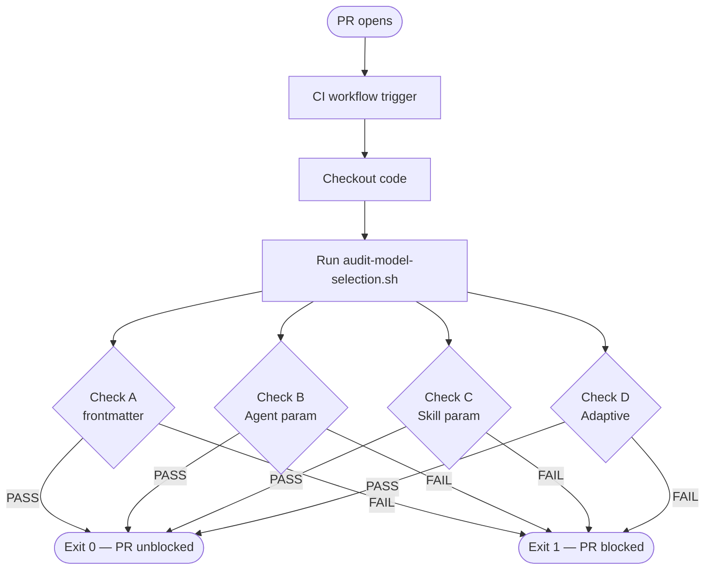

# História: CI audit script de model selection

**ID:** story-0050-0009
**Chave Jira:** —
**Status:** Pendente

## 1. Dependências

| Blocked By | Blocks |
| :--- | :--- |
| story-0050-0002, story-0050-0003, story-0050-0004, story-0050-0005, story-0050-0006, story-0050-0007, story-0050-0008 | story-0050-0010 |

## 2. Regras Transversais Aplicáveis

| ID | Título |
| :--- | :--- |
| RULE-006 | CI audit script obrigatório |
| RULE-007 | Backward compatibility (escopo aditivo) |

## 3. Descrição

Como **engenheiro de plataforma**, eu quero um script bash `scripts/audit-model-selection.sh` integrado ao CI que falha qualquer PR introduzindo violações dos 4 checks da Rule 23, para prevenir regressões futuras. Replica o padrão canônico do audit de Rule 13 (EPIC-0033) — grep com expectativa de 0 matches.

Sem audit automatizado, qualquer PR futuro pode reintroduzir `Agent(...)` sem `model:`, skill nova sem frontmatter, ou "Adaptive" em agent — desfazendo o trabalho do épico. Esta story seals o enforcement loop.

### 3.1 Checks do script

**Check A — Skills de orquestração sem `model:` no frontmatter:**

```bash
# Lista alvos: skills declaradas como orquestradores na matriz da Rule 23
for skill in x-epic-implement x-story-implement x-release x-review \
            x-epic-orchestrate x-pr-fix-epic x-task-implement x-epic-decompose; do
  if ! grep -q "^model: " ".claude/skills/${skill}/SKILL.md"; then
    echo "FAIL: ${skill}/SKILL.md missing 'model:' in frontmatter"
    fail=1
  fi
done
```

**Check B — `Agent(...)` sem `model:` em skill de orquestração:**

> **Nota de implementação:** usar process substitution (`< <(...)`) em vez de pipe para
> que o `while` rode no shell pai — caso contrário `fail_b=1` não persiste. Com
> `set -euo pipefail`, um `grep` sem matches retorna exit 1 e aborta o script; o `|| true`
> trata "sem matches" como PASS explícito.

```bash
fail_b=0
while read -r match; do
  file=$(echo "$match" | cut -d: -f1)
  line=$(echo "$match" | cut -d: -f2)
  # Check if "model:" appears within 5 lines after the match
  if ! sed -n "${line},$((line+5))p" "$file" | grep -q "model:"; then
    echo "FAIL: $file:$line Agent() without model:"
    fail_b=1
  fi
done < <(
  grep -rnE "Agent\(subagent_type: \"general-purpose\"" \
    .claude/skills/x-story-plan/ \
    .claude/skills/x-arch-plan/ \
    .claude/skills/x-test-plan/ \
  || true
)
```

**Check C — `Skill(...)` sem `model:` em orquestrador:**

> **Nota de implementação:** `mapfile` + array evita o problema do subshell em pipe.
> `|| true` em cada `grep` lida com skills que não têm nenhuma chamada `Skill(...)` (exit 1 seria
> abortado por `set -euo pipefail`).

```bash
fail_c=0
for skill in x-epic-implement x-story-implement x-review x-task-implement; do
  skill_file=".claude/skills/${skill}/SKILL.md"
  mapfile -t matches < <(grep -nE 'Skill\(skill: "x-[a-z-]+' "$skill_file" || true)

  if [ ${#matches[@]} -eq 0 ]; then
    continue  # Skill sem chamadas Skill(...) — PASS implícito
  fi

  for match in "${matches[@]}"; do
    if [[ "$match" != *"model:"* ]]; then
      echo "FAIL: $match"
      fail_c=1
    fi
  done
done
```

**Check D — Agent com `Recommended Model: Adaptive`:**

```bash
fail_d=0
if grep -rq "Recommended Model: Adaptive" .claude/agents/; then
  grep -rn "Recommended Model: Adaptive" .claude/agents/ \
    | sed 's/^/FAIL: agent with Adaptive — /'
  fail_d=1
fi
```

### 3.2 Estrutura do script

> **Nota de implementação:** cada check usa seu próprio flag local (`fail_a`, `fail_b`,
> `fail_c`, `fail_d`) para que o status reportado por cada check seja independente. O
> flag global `overall_fail` é agregado apenas ao final para determinar o exit code. Sem
> isso, um FAIL em Check A faria todos os checks subsequentes reportarem FAIL mesmo se
> individualmente passassem.

```bash
#!/usr/bin/env bash
set -euo pipefail

echo "=== Audit: Model Selection (Rule 23) ==="

# Check A — Frontmatter model: em orquestradores declarados
fail_a=0
echo "Check A — Frontmatter model: in orchestrator skills"
for skill in x-epic-implement x-story-implement x-release x-review \
             x-epic-orchestrate x-pr-fix-epic x-task-implement x-epic-decompose; do
  if ! grep -q "^model: " ".claude/skills/${skill}/SKILL.md"; then
    echo "FAIL: ${skill}/SKILL.md missing 'model:' in frontmatter"
    fail_a=1
  fi
done
echo "Check A: $([[ $fail_a -eq 0 ]] && echo PASS || echo FAIL)"

# Check B — (vide 3.1 acima; usa fail_b)
echo "Check B: $([[ $fail_b -eq 0 ]] && echo PASS || echo FAIL)"

# Check C — (vide 3.1 acima; usa fail_c)
echo "Check C: $([[ $fail_c -eq 0 ]] && echo PASS || echo FAIL)"

# Check D — (vide 3.1 acima; usa fail_d)
echo "Check D: $([[ $fail_d -eq 0 ]] && echo PASS || echo FAIL)"

# Agregação final
overall_fail=$(( fail_a + fail_b + fail_c + fail_d ))
if [[ $overall_fail -eq 0 ]]; then
  echo "=== ALL CHECKS PASS ==="
  exit 0
else
  echo "=== AUDIT FAILED ($overall_fail check(s) failed) ==="
  exit 1
fi
```

### 3.3 Integração com CI

Adicionar step em `.github/workflows/` (workflow existente de CI do projeto):

```yaml
- name: Audit Model Selection (Rule 23)
  run: scripts/audit-model-selection.sh
```

### 3.4 Performance target

Script deve executar em < 5s no repo atual (grep + bash puro, sem dependências externas).

## 3.5 Entrega de Valor

- **Valor Principal:** Previne regressões futuras; seal enforcement loop. Sem este script, qualquer novo PR pode silenciosamente reintroduzir Opus por default.
- **Métrica de Sucesso:** Script executa em < 5s; em estado pós-STORY-0050-0008, todos 4 checks PASS com exit 0. Teste de regressão: introduzir violação proposital em branch → CI falha; remover → CI passa.
- **Impacto no Negócio:** Governança automatizada; qualquer desenvolvedor que abrir PR é bloqueado se violar a Rule 23.

## 4. Definições de Qualidade Locais

### DoR Local

- [ ] Todas STORY-0050-0002..0008 mergeadas (caso contrário o audit falha em estado inicial)
- [ ] Rule 23 publicada com "Audit contract" seção citando os 4 checks

### DoD Local

- [ ] `scripts/audit-model-selection.sh` existe, executável, e passa shellcheck
- [ ] Os 4 checks implementados conforme spec acima
- [ ] Script executa em < 5s
- [ ] Hook no workflow CI adicionado
- [ ] Documentação de uso em `scripts/README.md` (se existir) ou em comentário no topo do script
- [ ] Teste bash do próprio script: cria um arquivo temporário com violação → roda → confirma exit 1; remove → confirma exit 0

## 5. Contratos de Dados

### 5.1 Input

- `.claude/skills/*/SKILL.md` (leitura)
- `.claude/agents/*.md` (leitura)

### 5.2 Output

- stdout: relatório texto com PASS/FAIL por check
- exit code: 0 ou 1

### 5.3 Error Codes

| Exit | Condição |
| :--- | :--- |
| 0 | Todos checks PASS |
| 1 | Qualquer check FAIL |
| 2 | Script invocado fora de um repo `ia-dev-environment` |

## 6. Diagramas

### 6.1 Fluxo do audit



## 7. Critérios de Aceite (Gherkin)

```gherkin
Cenário: Audit passa em estado limpo
  DADO o repositório pós-STORY-0050-0008
  QUANDO scripts/audit-model-selection.sh é executado
  ENTÃO exit code é 0
  E stdout contém "Check A: PASS"
  E stdout contém "Check B: PASS"
  E stdout contém "Check C: PASS"
  E stdout contém "Check D: PASS"

Cenário: Audit falha quando Agent() sem model é introduzido
  DADO um SKILL.md recebe Agent(subagent_type: "general-purpose", prompt: "...") sem model
  QUANDO o script é executado
  ENTÃO exit code é 1
  E stdout contém "Check B: FAIL"
  E a violação é listada com file:line

Cenário: Audit falha quando agent tem Adaptive
  DADO agents/custom.md com "Recommended Model: Adaptive"
  QUANDO o script é executado
  ENTÃO exit code é 1
  E stdout contém "Check D: FAIL"

Cenário: CI bloqueia PR com violação
  DADO um PR introduzindo violação
  QUANDO o workflow CI é executado
  ENTÃO o step audit-model-selection falha
  E o PR não pode ser mergeado sem correção

Cenário: Performance — script executa em < 5s
  DADO o repositório completo
  QUANDO o script é cronometrado
  ENTÃO elapsed < 5s

Cenário: Boundary — sem violações em repo limpo
  DADO estado pós-STORY-0050-0008
  QUANDO cada check é executado isoladamente
  ENTÃO cada um retorna PASS
```

### 7.1 Scenario Ordering (TPP)

Degenerate (1 check PASS) → happy (todos PASS) → errors (cada tipo de violação) → boundary (performance + CI integration).

### 7.2 Mandatory Scenario Categories

- [x] Degenerate
- [x] Happy path
- [x] Error paths (4 tipos de falha)
- [x] Boundary (performance + CI)

## 8. Tasks

### TASK-0050-0009-001: Esqueleto do script + Check A

- **Layer:** Scripts
- **Test Type:** Unit (bash)
- **Size:** M
- **Dependencies:** —
- **Branch:** `feat/task-0050-0009-001-skeleton-check-a`
- **Testability:** INDEPENDENT
- **Files:**
  - `scripts/audit-model-selection.sh` (novo)
- **Acceptance Criteria:**
  - [ ] Shebang + `set -euo pipefail`
  - [ ] Check A implementado (frontmatter model: em orquestradores)
  - [ ] Output formatado (PASS/FAIL por check)
  - [ ] `chmod +x` aplicado

### TASK-0050-0009-002: Implementar Check B (Agent param)

- **Layer:** Scripts
- **Test Type:** Unit
- **Size:** M
- **Dependencies:** TASK-0050-0009-001
- **Branch:** `feat/task-0050-0009-002-check-b`
- **Testability:** INDEPENDENT
- **Files:**
  - Mesmo script
- **Acceptance Criteria:**
  - [ ] Check B detecta Agent() sem model: dentro de 5 linhas seguintes
  - [ ] Teste manual: introduzir violação, confirmar FAIL; remover, confirmar PASS

### TASK-0050-0009-003: Implementar Check C (Skill param) + Check D (Adaptive)

- **Layer:** Scripts
- **Test Type:** Unit
- **Size:** M
- **Dependencies:** TASK-0050-0009-002
- **Branch:** `feat/task-0050-0009-003-checks-c-d`
- **Testability:** INDEPENDENT
- **Files:**
  - Mesmo script
- **Acceptance Criteria:**
  - [ ] Check C detecta Skill(skill: ...) sem model em orquestrador
  - [ ] Check D detecta "Recommended Model: Adaptive"
  - [ ] Exit codes corretos

### TASK-0050-0009-004: Teste bash do próprio script + documentação

- **Layer:** Test + Doc
- **Test Type:** Integration
- **Size:** S
- **Dependencies:** TASK-0050-0009-003
- **Branch:** `feat/task-0050-0009-004-tests-docs`
- **Testability:** INDEPENDENT
- **Files:**
  - `scripts/tests/test-audit-model-selection.sh` (novo, ou similar)
  - `scripts/README.md` (atualização ou criação)
- **Acceptance Criteria:**
  - [ ] Teste bash cobre: estado limpo (PASS), introdução de violações (4 tipos, FAIL)
  - [ ] README documenta uso: comando, checks, exit codes
  - [ ] Shellcheck passa

### TASK-0050-0009-005: Hook no CI workflow

- **Layer:** CI
- **Test Type:** Integration
- **Size:** S
- **Dependencies:** TASK-0050-0009-004
- **Branch:** `feat/task-0050-0009-005-ci-hook`
- **Testability:** INDEPENDENT
- **Files:**
  - `.github/workflows/<ci-workflow>.yml`
- **Acceptance Criteria:**
  - [ ] Step adicionado ao workflow de CI
  - [ ] Testar em PR de exemplo: workflow executa o step e bloqueia/passa conforme estado
  - [ ] Teste de regressão: PR com violação → CI falha; PR sem violação → CI passa
