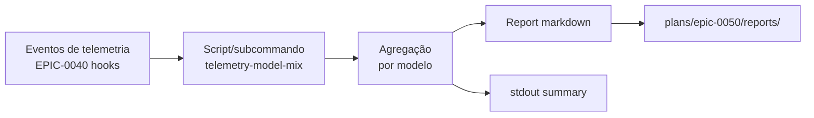

# História: Medição pós-deploy via telemetria (EPIC-0040)

**ID:** story-0050-0010
**Chave Jira:** —
**Status:** Pendente

## 1. Dependências

| Blocked By | Blocks |
| :--- | :--- |
| story-0050-0009 | — |

## 2. Regras Transversais Aplicáveis

| ID | Título |
| :--- | :--- |
| RULE-007 | Backward compatibility (escopo aditivo) |

## 3. Descrição

Como **engenheiro de plataforma**, eu quero uma query/script de telemetria que mede o mix de modelos (Opus/Sonnet/Haiku) em execuções pós-merge deste épico, para validar quantitativamente que os targets definidos no SPEC foram atingidos (≤50% Opus, ≥35% Sonnet, ≥12% Haiku). Sem medição, o épico fica sem evidência de sucesso.

O EPIC-0040 (mergeado) já instalou hooks de telemetria em `.claude/hooks/telemetry-*.sh` e a STORY-0040-0011 introduziu `/x-telemetry-trend` para comparação entre epics. Esta story consome essa infraestrutura e adiciona uma análise focada em model mix.

### 3.1 Scope

1. **Confirmar que `model` é capturado** — Verificar se os hooks existentes de `EPIC-0040` capturam o campo `model` em invocações de `Agent()` e `Skill()`. Se não, adicionar captura.

2. **Criar script/subcommando** — `scripts/telemetry-model-mix.sh` OU subcommando de `/x-telemetry-analyze` que:
   - Lê os eventos de telemetria das últimas N execuções (parâmetro configurável; default N=50)
   - Calcula % tokens por modelo (opus/sonnet/haiku)
   - Lista top 10 skills consumidoras de Opus
   - Produz trend comparativo: pré-EPIC-0050 vs pós-EPIC-0050

3. **Validar em 2 epics de referência** — Após merge, escolher 2 epics executados (pós STORY-0050-0009) e rodar a query. Confirmar:
   - % Opus ≤ 50%
   - % Sonnet ≥ 35%
   - % Haiku ≥ 12%

4. **Report em `plans/epic-0050/reports/`** — Salvar `post-deploy-measurement.md` com:
   - Tabela de targets vs real
   - Top 10 consumidores Opus (para diagnóstico de gaps remanescentes)
   - Recomendações para épicos futuros (próximas skills a otimizar)

5. **Feedback loop** — Se targets não forem atingidos, documentar no report quais skills continuam em Opus desnecessariamente e propor ajustes para a Rule 23 ou para skills específicas (input para épico futuro).

### 3.2 Reuso de EPIC-0040

- `/x-telemetry-analyze` (story-0040-0010) já reporta tendências. Este script pode ser um subcommando ou filtro adicional.
- `/x-telemetry-trend` (story-0040-0011) já faz cross-epic comparison. Pode ser estendido com filtro por modelo.

### 3.3 Execução

- Executar o script manualmente após merge (não é parte do CI — é medição one-off).
- Opcional: agendar execução semanal via `/schedule` para monitoramento contínuo (futuro).

## 3.5 Entrega de Valor

- **Valor Principal:** Valida quantitativamente que o épico atingiu seus targets. Fornece evidência para stakeholders. Identifica gaps remanescentes.
- **Métrica de Sucesso:** Report salvo em `plans/epic-0050/reports/post-deploy-measurement.md`; % Opus medido ≤ 50%; ganho documentado em comparação com baseline 84,4%.
- **Impacto no Negócio:** Fecha o ciclo PDCA (Plan → Do → Check → Act). Baseline para épicos futuros de otimização.

## 4. Definições de Qualidade Locais

### DoR Local

- [ ] STORY-0050-0009 mergeada (base estável pós-enforcement)
- [ ] EPIC-0040 (telemetry) mergeado e operacional (status atual: mergeado ✓)
- [ ] Pelo menos 2 epics executados em develop pós-merge deste épico (para amostra de medição)

### DoD Local

- [ ] Script/subcommando executa sem erro
- [ ] Campo `model` capturado pela telemetria (se necessário, instrumentação adicional aplicada)
- [ ] Report salvo em `plans/epic-0050/reports/post-deploy-measurement.md` com tabela de targets vs real
- [ ] Targets atingidos OU análise clara do gap com próximos passos documentados
- [ ] Top 10 consumidores Opus listados para diagnóstico

## 5. Contratos de Dados

### 5.1 Input

- Eventos de telemetria em `.claude/telemetry/` (formato definido em EPIC-0040)

### 5.2 Output

- stdout: relatório texto com mix de modelos
- `plans/epic-0050/reports/post-deploy-measurement.md`: report markdown estruturado

### 5.3 Schema do report

```markdown
# Post-Deploy Measurement — EPIC-0050

**Data**: YYYY-MM-DD
**Período analisado**: últimas N execuções
**Baseline (pré-épico)**: 84,4% Opus / 0,2% Sonnet / 5,8% Haiku

## Mix de Modelos (Real)

| Modelo | % Tokens | Target | Delta |
| :--- | :--- | :--- | :--- |
| Opus | XX% | ≤ 50% | ... |
| Sonnet | XX% | ≥ 35% | ... |
| Haiku | XX% | ≥ 12% | ... |

## Top 10 Consumidores Opus

| Skill/Agent | Tokens | % total Opus |
| :--- | :--- | :--- |
| ... | ... | ... |

## Conclusão

[Atingido / Parcialmente atingido / Não atingido]

## Próximos passos

[Sugestões de próximas otimizações — input para épico futuro]
```

## 6. Diagramas

### 6.1 Fluxo de medição



## 7. Critérios de Aceite (Gherkin)

```gherkin
Cenário: Script reporta mix de modelos
  DADO telemetria disponível para ≥ 2 epics pós-merge
  QUANDO scripts/telemetry-model-mix.sh é executado
  ENTÃO stdout contém "% Opus: <valor>"
  E stdout contém "% Sonnet: <valor>"
  E stdout contém "% Haiku: <valor>"

Cenário: Report pós-deploy é gerado
  DADO execução do script em estado pós-EPIC-0050
  QUANDO o report é salvo
  ENTÃO existe plans/epic-0050/reports/post-deploy-measurement.md
  E contém tabela de targets vs real
  E contém top 10 consumidores Opus

Cenário: Target de Opus atingido
  DADO mix de modelos medido
  QUANDO comparado com target de 50%
  ENTÃO % Opus ≤ 50%

Cenário: Target de Sonnet atingido
  DADO mix medido
  QUANDO comparado com target de 35%
  ENTÃO % Sonnet ≥ 35%

Cenário: Target de Haiku atingido
  DADO mix medido
  QUANDO comparado com target de 12%
  ENTÃO % Haiku ≥ 12%

Cenário: Boundary — gap não atingido é documentado
  DADO mix não atingindo algum target
  QUANDO o report é gerado
  ENTÃO contém seção "Próximos passos" com skills a otimizar
  E documenta o gap quantitativamente
```

### 7.1 Scenario Ordering (TPP)

Degenerate (1 métrica) → happy (todos 3 targets atingidos) → error (gap documentado) → boundary (report structure).

### 7.2 Mandatory Scenario Categories

- [x] Degenerate
- [x] Happy path (targets atingidos)
- [x] Error paths (gap documentado)
- [x] Boundary (report structure)

## 8. Tasks

### TASK-0050-0010-001: Validar/instrumentar captura de `model` na telemetria

- **Layer:** Telemetry
- **Test Type:** Integration
- **Size:** M
- **Dependencies:** —
- **Branch:** `feat/task-0050-0010-001-telemetry-model-capture`
- **Testability:** REQUIRES_MOCK of EPIC-0040 telemetry infrastructure
- **Files:**
  - `.claude/hooks/telemetry-*.sh` (inspecionar; modificar se necessário)
- **Acceptance Criteria:**
  - [ ] Eventos de Agent() e Skill() contêm campo `model`
  - [ ] Se não contêm, instrumentação adicional aplicada
  - [ ] Teste: executar skill de exemplo e verificar log

### TASK-0050-0010-002: Criar script `telemetry-model-mix.sh`

- **Layer:** Scripts
- **Test Type:** Unit
- **Size:** M
- **Dependencies:** TASK-0050-0010-001
- **Branch:** `feat/task-0050-0010-002-script`
- **Testability:** INDEPENDENT
- **Files:**
  - `scripts/telemetry-model-mix.sh` (novo) OU extensão em `x-telemetry-analyze`
- **Acceptance Criteria:**
  - [ ] Script lê telemetria e agrega por modelo
  - [ ] Lista top 10 consumidores Opus
  - [ ] Aceita parâmetro `--last-n <num>` (default 50)

### TASK-0050-0010-003: Executar medição em 2 epics de referência + gerar report

- **Layer:** Analysis
- **Test Type:** Verification
- **Size:** M
- **Dependencies:** TASK-0050-0010-002
- **Branch:** `feat/task-0050-0010-003-measurement`
- **Testability:** INDEPENDENT
- **Files:**
  - `plans/epic-0050/reports/post-deploy-measurement.md` (novo)
- **Acceptance Criteria:**
  - [ ] 2 epics executados pós-merge são analisados
  - [ ] Report preenchido com targets vs real
  - [ ] Top 10 consumidores Opus listados
  - [ ] Seção "Próximos passos" tem recomendações concretas

### TASK-0050-0010-004: Revisar resultados e documentar conclusão

- **Layer:** Doc
- **Test Type:** Verification
- **Size:** S
- **Dependencies:** TASK-0050-0010-003
- **Branch:** `feat/task-0050-0010-004-conclusion`
- **Testability:** INDEPENDENT
- **Files:**
  - Mesmo report
- **Acceptance Criteria:**
  - [ ] Conclusão documentada (Atingido / Parcial / Não atingido)
  - [ ] Se gap, proposta de próximo épico
  - [ ] Compartilhamento do report com stakeholders (menção no PR)
