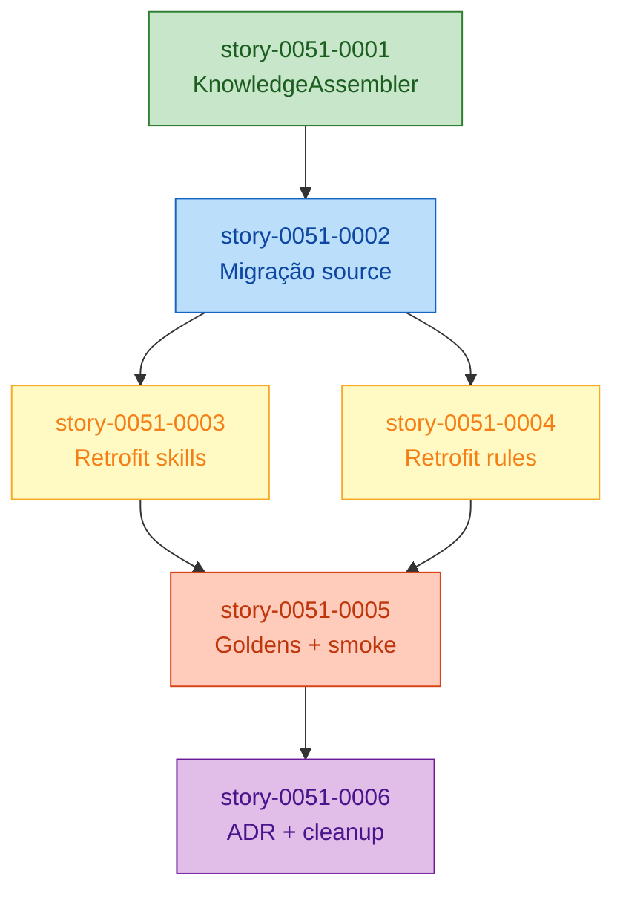

# Implementation Map — EPIC-0051: Knowledge Packs fora de `.claude/skills/`

**Épico:** [epic-0051.md](./epic-0051.md)
**Spec:** [spec-epic-0051.md](./spec-epic-0051.md)
**Total de stories:** 6
**Fases:** 5
**Paralelismo máximo:** 2 (Fase 3)

## 1. Matriz de Dependências

| Story | Título | Blocked By | Blocks | Fase |
| :--- | :--- | :--- | :--- | :--- |
| story-0051-0001 | KnowledgeAssembler + contrato | — | 0051-0002 | 1 |
| story-0051-0002 | Migração source-of-truth | 0051-0001 | 0051-0003, 0051-0004 | 2 |
| story-0051-0003 | Retrofit skills consumidoras | 0051-0002 | 0051-0005 | 3 |
| story-0051-0004 | Retrofit rules | 0051-0002 | 0051-0005 | 3 |
| story-0051-0005 | Goldens + smoke | 0051-0003, 0051-0004 | 0051-0006 | 4 |
| story-0051-0006 | ADR + cleanup + CHANGELOG | 0051-0005 | — | 5 |

Simetria verificada: toda célula "Blocked By" tem recíproca em "Blocks" e
vice-versa.

## 2. Diagrama de Fases (ASCII)

```
┌──────────────────────────────────────────────────────────────────────┐
│ Fase 1 — Foundation                                                  │
│                                                                      │
│   ┌──────────────────────────────────────┐                           │
│   │ story-0051-0001                      │                           │
│   │ KnowledgeAssembler + contrato        │                           │
│   └──────────────────────────────────────┘                           │
└──────────────────────────────────────────────────────────────────────┘
                              │
                              ▼
┌──────────────────────────────────────────────────────────────────────┐
│ Fase 2 — Migração                                                    │
│                                                                      │
│   ┌──────────────────────────────────────┐                           │
│   │ story-0051-0002                      │                           │
│   │ Migração source-of-truth             │                           │
│   └──────────────────────────────────────┘                           │
└──────────────────────────────────────────────────────────────────────┘
                              │
                     ┌────────┴────────┐
                     ▼                 ▼
┌──────────────────────────────────────────────────────────────────────┐
│ Fase 3 — Retrofit (paralelo)                                         │
│                                                                      │
│   ┌──────────────────────┐   ┌──────────────────────┐                │
│   │ story-0051-0003      │   │ story-0051-0004      │                │
│   │ Retrofit skills      │   │ Retrofit rules       │                │
│   └──────────────────────┘   └──────────────────────┘                │
└──────────────────────────────────────────────────────────────────────┘
                     │                 │
                     └────────┬────────┘
                              ▼
┌──────────────────────────────────────────────────────────────────────┐
│ Fase 4 — Verificação                                                 │
│                                                                      │
│   ┌──────────────────────────────────────┐                           │
│   │ story-0051-0005                      │                           │
│   │ Goldens + smoke                      │                           │
│   └──────────────────────────────────────┘                           │
└──────────────────────────────────────────────────────────────────────┘
                              │
                              ▼
┌──────────────────────────────────────────────────────────────────────┐
│ Fase 5 — Formalização                                                │
│                                                                      │
│   ┌──────────────────────────────────────┐                           │
│   │ story-0051-0006                      │                           │
│   │ ADR + cleanup + CHANGELOG            │                           │
│   └──────────────────────────────────────┘                           │
└──────────────────────────────────────────────────────────────────────┘
```

## 3. Caminho Crítico

`0001 → 0002 → {0003 || 0004} → 0005 → 0006`

- Fases sequenciais: **5**.
- Stories no caminho crítico: **5** (qualquer branch da Fase 3 serve — 0003
  e 0004 têm tamanhos comparáveis).
- Gargalo principal: **story-0051-0002** (migração) — bloqueia duas stories
  simultaneamente. Também é a maior em volume de arquivos (~32 KPs movidos).
- Paralelismo máximo: **2 stories** na Fase 3.

## 4. Grafo Mermaid de Dependências



## 5. Tabela Resumo de Fases

| Fase | Stories | Paralelismo | Descrição |
| :---: | :--- | :---: | :--- |
| 1 | 0001 | 1 | Entrega o `KnowledgeAssembler` e valida o contrato do diretório com fixtures sintéticas. |
| 2 | 0002 | 1 | Move ~32 KPs da source-of-truth antiga para a nova, normaliza frontmatter e persiste evidência do inventário. |
| 3 | 0003, 0004 | 2 | Retrofits mecânicos em skills consumidoras e rules; paralelizáveis porque tocam arquivos disjuntos. |
| 4 | 0005 | 1 | Regenera goldens numa única story (RULE-051-08) e roda smoke test end-to-end. |
| 5 | 0006 | 1 | Formaliza decisão em ADR, remove código legado do `SkillsAssembler`, publica CHANGELOG. |

## 6. Detalhamento por Fase

### Fase 1 — Foundation

| Story | Esforço relativo | Risco | Hotspot |
| :--- | :---: | :--- | :--- |
| 0051-0001 | S | Baixo (novo código isolado, sem impacto em consumidores) | `KnowledgeAssembler.java` (novo) |

### Fase 2 — Migração

| Story | Esforço relativo | Risco | Hotspot |
| :--- | :---: | :--- | :--- |
| 0051-0002 | M | Médio (volume de arquivos; risco de perda de bytes durante renaming — mitigado pela invariante body-byte-identity) | `targets/claude/knowledge/**` (novo) |

### Fase 3 — Retrofit

| Story | Esforço relativo | Risco | Hotspot |
| :--- | :---: | :--- | :--- |
| 0051-0003 | M | Médio (edição em ~30 SKILL.md; risco de regex catch-all deixar falso-positivo) | `core/**/SKILL.md` |
| 0051-0004 | S | Baixo (7 rules, ~10 ocorrências; superfície muito controlada) | `rules/0[3-9]-*.md` |

### Fase 4 — Verificação

| Story | Esforço relativo | Risco | Hotspot |
| :--- | :---: | :--- | :--- |
| 0051-0005 | M | Alto se alguma story anterior regredir (goldens explicitam qualquer regressão). Baixo se stories 0001–0004 estiverem corretas. | `src/test/resources/golden/**` (RULE-051-08) |

### Fase 5 — Formalização

| Story | Esforço relativo | Risco | Hotspot |
| :--- | :---: | :--- | :--- |
| 0051-0006 | S | Baixo (ADR é doc; cleanup é refactor local com testes como rede de proteção) | `SkillsAssembler.java`, `CLAUDE.md`, `CHANGELOG.md` |

## 7. Observações Estratégicas

- **Gargalo:** STORY-0051-0002 é ponto único de falha — nenhuma story de
  Fase 3 arranca antes dela. Alocar a mesma pessoa da 0051-0001 para manter
  contexto.
- **Validação milestone:** STORY-0051-0005 é o primeiro ponto em que o build
  inteiro fica verde com a migração. Funciona como checkpoint de confiança
  para a PR final.
- **Paralelismo + RULE-051-08:** Fase 3 degrada a serial sob
  `/x-parallel-eval` somente se o assembler hash detectar colisão em
  `src/test/resources/golden/`. Como ambas as stories declaram `regen:
  src/test/resources/golden/**` e delegam a regeneração para 0005, não há
  conflito hard — apenas regen overlap mitigado pela RULE-051-08.
- **Restrições de Paralelismo:** `KnowledgeAssembler.java` é hotspot novo
  (RULE-051-06). Stories 0001 e 0006 declaram write sobre ele; stories 0002,
  0003, 0004 e 0005 não tocam o arquivo.
- **Folhas (terminais):** 0051-0006 é o único nó sem sucessores. Fechá-lo
  equivale a encerrar o épico.
- **Convergência:** STORY-0051-0005 converge 0003 e 0004 — é o primeiro
  ponto onde o épico precisa estar 100% coerente entre skills e rules.

## 8. Restrições de Paralelismo (RULE-004 / EPIC-0041)

| Arquivo | Stories que escrevem | Tipo de conflito | Mitigação |
| :--- | :--- | :--- | :--- |
| `KnowledgeAssembler.java` | 0001 | Sem conflito (única escrita no épico) | — |
| `CLAUDE.md` | 0006 | Sem conflito (sozinho) | — |
| `CHANGELOG.md` | 0006 | Sem conflito (sozinho) | — |
| `src/test/resources/golden/**` | 0005 (único commit) | Regen concentrado | RULE-051-08 |
| `SkillsAssembler.java` / `SkillsCopyHelper.java` | 0006 | Sem conflito (sozinho) | — |
| `rules/0[3-9]-*.md` | 0004 | Sem conflito (sozinho) | — |
| `core/**/SKILL.md` | 0003 | Sem conflito (sozinho) | — |
| `targets/claude/knowledge/**` | 0001 (fixtures sintéticas), 0002 (arquivos reais) | Paths disjuntos (fixtures em `src/test/resources/fixtures/knowledge/`, não em `targets/`) | Story 0001 explicita fixture path para evitar coincidência com 0002. |

Se `/x-parallel-eval --scope=epic` reportar hotspot, degradar Fase 3 para
serial. Nenhum conflito hard previsto no planejamento atual.
