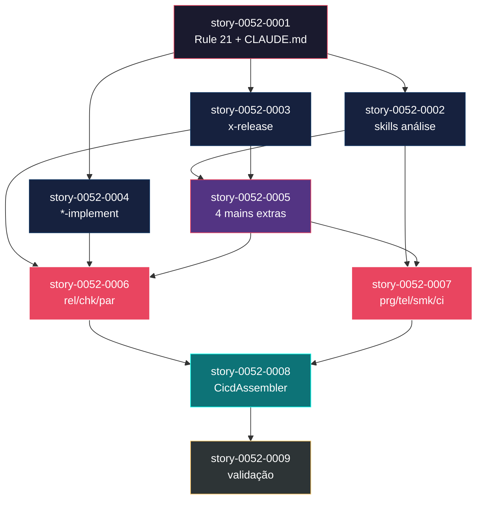
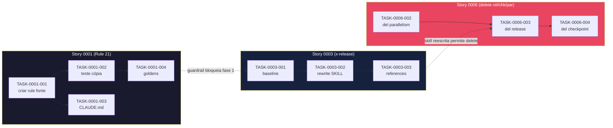

# Mapa de Implementação — EPIC-0052 Restauração do Escopo de Gerador do `ia-dev-env`

**Gerado a partir das dependências BlockedBy/Blocks de cada história do epic-0052.**

---

## 1. Matriz de Dependências

| Story | Título | Chave Jira | Blocked By | Blocks | Status |
| :--- | :--- | :--- | :--- | :--- | :--- |
| story-0052-0001 | Publicar Rule 21 e atualizar CLAUDE.md | — | — | story-0052-0002, story-0052-0003, story-0052-0004 | Pendente |
| story-0052-0002 | Reescrever skills de análise (telemetry-analyze, telemetry-trend, parallel-eval) | — | story-0052-0001 | story-0052-0005, story-0052-0007 | Pendente |
| story-0052-0003 | Reescrever skill `x-release` em LLM+bash/git/gh | — | story-0052-0001 | story-0052-0005, story-0052-0006 | Pendente |
| story-0052-0004 | Reescrever skills de implementação (epic/story/task-implement) | — | story-0052-0001 | story-0052-0006 | Pendente |
| story-0052-0005 | Remover entry points `main()` extras do JAR | — | story-0052-0002, story-0052-0003 | story-0052-0006, story-0052-0007 | Pendente |
| story-0052-0006 | Deletar pacotes `release`, `checkpoint`, `parallelism` | — | story-0052-0003, story-0052-0004, story-0052-0005 | story-0052-0008 | Pendente |
| story-0052-0007 | Deletar pacotes `progress`, `telemetry` (Java), `smoke`, `ci` | — | story-0052-0002, story-0052-0005 | story-0052-0008 | Pendente |
| story-0052-0008 | Simplificar `CicdAssembler` e auditar Assemblers categoria B | — | story-0052-0006, story-0052-0007 | story-0052-0009 | Pendente |
| story-0052-0009 | Validação end-to-end: smoke 18 stacks + coverage | — | story-0052-0008 | — | Pendente |

> **Valores de Status:** `Pendente` (padrão) · `Em Andamento` · `Concluída` · `Falha` · `Bloqueada` · `Parcial`

> **Nota:** Todas as dependências são estruturais (a história anterior precisa estar DONE antes da próxima começar). Não há dependências de dados cruzadas — cada story opera em artefatos bem delimitados via `## File Footprint`.

---

## 2. Fases de Implementação

> As histórias são agrupadas em fases. Dentro de cada fase, as histórias podem ser implementadas **em paralelo**. Uma fase só pode iniciar quando todas as dependências das fases anteriores estiverem concluídas.

```
╔══════════════════════════════════════════════════════════════════════════╗
║                 FASE 0 — Guardrail (bloqueia tudo)                     ║
║                                                                        ║
║                       ┌─────────────────┐                              ║
║                       │ story-0052-0001 │  Rule 21 + CLAUDE.md         ║
║                       └────────┬────────┘                              ║
╚════════════════════════════════╪═══════════════════════════════════════╝
                                 │
        ┌────────────────────────┼────────────────────────┐
        ▼                        ▼                        ▼
╔══════════════════════════════════════════════════════════════════════════╗
║              FASE 1 — Reescrita de skills (3 paralelas)                ║
║                                                                        ║
║   ┌─────────────────┐    ┌─────────────────┐   ┌─────────────────┐     ║
║   │ story-0052-0002 │    │ story-0052-0003 │   │ story-0052-0004 │     ║
║   │  3 skills obs.  │    │    x-release    │   │  epic/story/tsk │     ║
║   └────────┬────────┘    └────────┬────────┘   └────────┬────────┘     ║
╚════════════╪══════════════════════╪═════════════════════╪═════════════╝
             │                      │                     │
             └───────┬──────────────┘                     │
                     ▼                                    │
╔══════════════════════════════════════════════════════════════════════════╗
║           FASE 2 — Remoção de entry points                             ║
║                                                                        ║
║                       ┌─────────────────┐                              ║
║                       │ story-0052-0005 │  4 mains removidos           ║
║                       └────────┬────────┘                              ║
╚════════════════════════════════╪═══════════════════════════════════════╝
                                 │
                    ┌────────────┴────────────┐
                    │                         │
                    ▼                         ▼
╔══════════════════════════════════════════════════════════════════════════╗
║            FASE 3 — Remoção de pacotes Java (2 paralelas)              ║
║                                                                        ║
║   ┌─────────────────┐              ┌─────────────────┐                 ║
║   │ story-0052-0006 │              │ story-0052-0007 │                 ║
║   │ rel/chk/par     │              │ prg/tel/smk/ci  │                 ║
║   └────────┬────────┘              └────────┬────────┘                 ║
╚════════════╪════════════════════════════════╪════════════════════════╝
             │                                │
             └──────────────┬─────────────────┘
                            ▼
╔══════════════════════════════════════════════════════════════════════════╗
║            FASE 4 — Ajuste de Assemblers                               ║
║                                                                        ║
║                       ┌─────────────────┐                              ║
║                       │ story-0052-0008 │  CicdAssembler simplificado  ║
║                       └────────┬────────┘                              ║
╚════════════════════════════════╪═══════════════════════════════════════╝
                                 │
                                 ▼
╔══════════════════════════════════════════════════════════════════════════╗
║              FASE 5 — Validação end-to-end                             ║
║                                                                        ║
║                       ┌─────────────────┐                              ║
║                       │ story-0052-0009 │  8 gates + smoke 18 stacks   ║
║                       └─────────────────┘                              ║
╚══════════════════════════════════════════════════════════════════════════╝
```

---

## 3. Caminho Crítico

> O caminho crítico (a sequência mais longa de dependências) determina o tempo mínimo de implementação do projeto.

```
story-0052-0001 → story-0052-0003 → story-0052-0005 → story-0052-0006 → story-0052-0008 → story-0052-0009
        │               │                  │                  │                  │                │
      Fase 0         Fase 1             Fase 2             Fase 3             Fase 4          Fase 5
     (1 hist.)      (3 paral.)         (1 hist.)          (2 paral.)        (1 hist.)       (1 hist.)
```

**6 fases no caminho crítico, 6 histórias na cadeia mais longa (0001 → 0003 → 0005 → 0006 → 0008 → 0009).**

O caminho crítico passa por 0003 (reescrita de `x-release`) e 0006 (deleção de `release`/`checkpoint`/`parallelism`), pois juntos acumulam a maior carga: 0003 tem 5 tasks (L) reescrevendo uma skill complexa; 0006 tem 6 tasks deletando 3 pacotes grandes com ~60 arquivos. Atraso em qualquer uma empurra o merge final.

---

## 4. Grafo de Dependências (Mermaid)



---

## 5. Resumo por Fase

| Fase | Histórias | Camada | Paralelismo | Pré-requisito |
| :--- | :--- | :--- | :--- | :--- |
| 0 | story-0052-0001 | Rule / Docs | 1 | — |
| 1 | story-0052-0002, story-0052-0003, story-0052-0004 | Skills (Markdown) | 3 paralelas | Fase 0 concluída |
| 2 | story-0052-0005 | Delete (Java mains) | 1 | Fase 1 parcial (0002 e 0003) concluídas |
| 3 | story-0052-0006, story-0052-0007 | Delete (Java packages) | 2 paralelas | Fases 1 e 2 concluídas |
| 4 | story-0052-0008 | Application + Config (CI/CD templates) | 1 | Fase 3 concluída |
| 5 | story-0052-0009 | Validation | 1 | Fase 4 concluída |

**Total: 9 histórias em 6 fases.**

> **Nota:** A Fase 1 é a de maior paralelismo (3 histórias). A Fase 3 é a de maior risco (deleção de ~55 classes em total). A Fase 5 é puramente validação e não produz código novo.

---

## 6. Detalhamento por Fase

### Fase 0 — Guardrail

| Story | Escopo Principal | Artefatos Chave |
| :--- | :--- | :--- |
| story-0052-0001 | Publicar Rule 21 em `resources/targets/claude/rules/` e referenciar no `CLAUDE.md` raiz | `21-generator-scope.md` (source + output), `CLAUDE.md`, golden files de rules |

**Entregas da Fase 0:**

- Rule 21 carregada automaticamente em toda conversa Claude Code aberta neste repositório.
- Princípio "ia-dev-env é apenas um gerador" passa a ser parte da system prompt.
- `CLAUDE.md` raiz aponta para a rule 21 em 1 parágrafo.

### Fase 1 — Reescrita de skills

| Story | Escopo Principal | Artefatos Chave |
| :--- | :--- | :--- |
| story-0052-0002 | Reescrever `x-telemetry-analyze`, `x-telemetry-trend`, `x-parallel-eval` em LLM+bash (`jq`/`awk`) | 3 SKILL.md reescritas; fixtures de baseline NDJSON; regression tests |
| story-0052-0003 | Reescrever `x-release` em LLM+bash/git/gh; state file em `release-state.json` leve | 1 SKILL.md (L); references atualizadas; fixture de repo git; IT com `gh` mock |
| story-0052-0004 | Reescrever `x-epic-implement`, `x-story-implement`, `x-task-implement` desacoplando `dev.iadev.checkpoint.*`; state file inline | 3 SKILL.md; Section "State File Schema" inline; fixtures v1 e v2 |

**Entregas da Fase 1:**

- 7 skills reescritas (3 + 1 + 3) sem dependência de classes Java `[DELETE]`.
- Nenhum `java -cp` ou `java -jar` em `skills/**` ou `hooks/**` referente ao JAR do `ia-dev-env`.
- Baselines capturados e regression tests passando (diff ≤ 5% textual).

### Fase 2 — Remoção de entry points

| Story | Escopo Principal | Artefatos Chave |
| :--- | :--- | :--- |
| story-0052-0005 | Deletar 4 `main()` extras (`TelemetryAnalyzeCli`, `TelemetryTrendCli`, `PiiAudit`, `ExpectedArtifactsGenerator`) + arg parsers locais + testes espelho | Grep `public static void main` retorna apenas `IaDevEnvApplication`; `pom.xml` ajustado |

**Entregas da Fase 2:**

- JAR buildado expõe apenas 1 entry point.
- `java -jar target/ia-dev-env.jar --help` mostra só `generate` e `validate`.
- Entrada "Removed" no CHANGELOG.md.

### Fase 3 — Remoção de pacotes Java

| Story | Escopo Principal | Artefatos Chave |
| :--- | :--- | :--- |
| story-0052-0006 | Deletar pacotes `release/` (~60 arquivos), `checkpoint/` (~10), `parallelism/` (~5); avaliar `SchemaVersionResolver` | Diretórios ausentes; grep retorna 0; smoke 18 stacks preserva Assemblers categoria A |
| story-0052-0007 | Deletar pacotes `progress/` (~3), `telemetry/` Java (~15 restantes), `smoke/` (~3 restantes), `ci/` (~1); hooks shell intactos; Rule 20 atualizada para scrubber shell | Hooks `.sh` byte-idênticos; Rule 20 aponta para scrubber shell; `pom.xml` ajustado |

**Entregas da Fase 3:**

- ~55 classes Java deletadas em total (soma das duas stories) + testes espelho.
- Hooks shell `telemetry-*.sh` em `resources/targets/claude/hooks/` **não foram alterados** (verificado por diff).
- NDJSON emit continua funcional em smoke test.
- Rule 20 atualizada se necessário (scrubber shell agora é o enforcer).

### Fase 4 — Ajuste de Assemblers

| Story | Escopo Principal | Artefatos Chave |
| :--- | :--- | :--- |
| story-0052-0008 | Simplificar `CicdAssembler` e step-classes; reescrever templates `shared/cicd-templates/` removendo refs a classes Java removidas; auditar `EpicReportAssembler` e `ReleaseChecklistAssembler` | Templates CI/CD atualizados; `pii-audit-shell` job via ripgrep; goldens atualizados |

**Entregas da Fase 4:**

- Projetos gerados têm CI/CD que não referencia mais classes Java removidas.
- `pii-audit-shell` job garante o mesmo gate via regex shell.
- Goldens atualizados apenas para arquivos CI/CD afetados.

### Fase 5 — Validação

| Story | Escopo Principal | Artefatos Chave |
| :--- | :--- | :--- |
| story-0052-0009 | Executar 8 gates globais + smoke 18 stacks + `/x-review-pr` + consolidar CHANGELOG; marcar épico como Concluído | `validation-report.md`, `techlead-review-epic-0052.md`, `smoke-18-stacks.log`, CHANGELOG final, status Concluído |

**Entregas da Fase 5:**

- Relatório de validação com 8 gates PASS.
- GO/NO-GO decision documentada.
- CHANGELOG consolidado com Added/Changed/Removed.
- Epic 0052 status = Concluído.

---

## 7. Observações Estratégicas

### Gargalo Principal

**story-0052-0003 (Reescrever `x-release`)** é o maior gargalo do caminho crítico:

- Pacote `release/` é o maior dos que saem (60+ arquivos); a reescrita da skill precisa cobrir todas as fases do fluxo Java (preflight, parse, bump, changelog, branch, approval, tag, back-merge) em LLM+bash.
- Está na Fase 1 (paralelo com 0002 e 0004), mas **bloqueia 0005 e 0006** — portanto, se 0003 atrasa, toda a Fase 2 atrasa.
- Investir em fixture de repo git bem realista e em `gh` CLI mock compensa: reduz retrabalho em 0006 quando o pacote `release/` sai.

### Histórias Folha (sem dependentes)

Apenas **story-0052-0009** é folha (bloqueada por 0008 mas não bloqueia ninguém). Todas as outras bloqueiam pelo menos uma próxima.

### Otimização de Tempo

- **Fase 1 comporta 3 agentes em paralelo**. Se houver 3 contribuidores disponíveis, ganham ~66% de throughput versus serial.
- **Fase 3 comporta 2 agentes em paralelo** (0006 e 0007 operam em pacotes disjuntos). Ambas dependem de 0005; depois de 0005, pode-se dividir.
- **Fase 1 pode começar imediatamente após 0001 terminar** (não precisa esperar a Fase 2). Gatilho de início da Fase 1 é `story-0052-0001.status == Concluída`.

### Dependências Cruzadas

- **story-0052-0005** converge 0002 e 0003 (Fase 1 parcial) em uma única story de limpeza de entry points. Essa convergência evita que 0006 tenha de tocar o mesmo `pom.xml` duas vezes.
- **story-0052-0008** converge 0006 e 0007 (Fase 3) em uma única story de ajuste do `CicdAssembler`. Evita merge conflicts nos templates CI/CD.

### Marco de Validação Arquitetural

**story-0052-0006** é o checkpoint arquitetural. Quando concluída, o grafo de imports do código `[KEEP]` já é coerente com o target state — nenhum pacote remanescente importa de `release/`, `checkpoint/`, ou `parallelism/`. Se 0006 passa em `mvn verify` e smoke 18 stacks, o resto do épico é execução conservadora. Antes de 0006 há incerteza; depois de 0006, é só ajustar templates e validar.

### Riscos de Execução

- **Auto-dogfooding (R-A do SPEC)**: `x-epic-implement` está sendo reescrito em 0004 enquanto o próprio épico tem stories a executar. Mitigação: **executar story-a-story manualmente via `/x-story-implement`**, NÃO via `/x-epic-implement`. 0009 pode usar o novo orchestrator como smoke test contra um epic antigo já concluído.
- **Regressão em goldens (R-C)**: 18 stacks × 22 Assemblers = muitos arquivos golden. Usar `GoldenFileRegenerator` APENAS em 0001, 0002, 0008 — e confirmar que os Assemblers categoria A não mudaram (diff exato vs baseline).
- **Referências em docs externos (R-D)**: antes de 0006/0007, `rg -r` em `specs/`, `adr/`, `plans/epic-*` por classes a serem removidas. Criar task ad-hoc em 0009 caso apareça menção em doc histórica.

---

## 8. Dependências entre Tasks (Cross-Story)

> Esta seção é gerada automaticamente quando as histórias contêm tasks formais com IDs `TASK-XXXX-YYYY-NNN`. O EPIC-0052 declara tasks em todas as histórias; logo, esta seção é populada.

### 8.1 Dependências Cross-Story entre Tasks

| Task | Depends On | Story Source | Story Target | Tipo |
| :--- | :--- | :--- | :--- | :--- |
| TASK-0052-0002-001 (baseline) | — | story-0052-0002 | — | — |
| TASK-0052-0005-002 (delete AnalyzeCli) | TASK-0052-0002-002 (rewrite skill) | story-0052-0002 | story-0052-0005 | interface (skill não precisa mais do CLI) |
| TASK-0052-0005-003 (delete TrendCli) | TASK-0052-0002-003 | story-0052-0002 | story-0052-0005 | interface |
| TASK-0052-0006-002 (delete parallelism) | TASK-0052-0005-005 (delete ExpectedArtifacts) | story-0052-0005 | story-0052-0006 | interface |
| TASK-0052-0006-003 (delete release) | TASK-0052-0003-002 (rewrite x-release) | story-0052-0003 | story-0052-0006 | interface |
| TASK-0052-0006-004 (delete checkpoint) | TASK-0052-0004-002/003/004 (rewrite *-implement) | story-0052-0004 | story-0052-0006 | interface |
| TASK-0052-0007-003 (delete telemetry Java) | TASK-0052-0002-002 (skill não chama TelemetryAnalyzeCli) | story-0052-0002 | story-0052-0007 | interface |
| TASK-0052-0008-004 (simplify CicdAssembler) | TASK-0052-0006-003 (release removed) + TASK-0052-0007-005 (ci removed) | story-0052-0006, story-0052-0007 | story-0052-0008 | data (templates dependem de classes removidas) |
| TASK-0052-0009-001 (gates) | TASK-0052-0008-006 (goldens atualizados) | story-0052-0008 | story-0052-0009 | data |

> **Validação RULE-012:** Cada dependência cross-story entre tasks corresponde a uma dependência declarada entre stories (`Blocked By`). Grafo de tasks é acíclico.

### 8.2 Ordem de Merge (Topological Sort)

| Ordem | Task ID | Story | Parallelizável Com | Fase |
| :--- | :--- | :--- | :--- | :--- |
| 1 | TASK-0052-0001-001 | story-0052-0001 | — | 0 |
| 2 | TASK-0052-0001-002 | story-0052-0001 | TASK-0052-0001-003 | 0 |
| 3 | TASK-0052-0001-003 | story-0052-0001 | TASK-0052-0001-002 | 0 |
| 4 | TASK-0052-0001-004 | story-0052-0001 | — | 0 |
| 5–10 | TASK-0052-0002-001..006 | story-0052-0002 | TASK-0052-0003-*, TASK-0052-0004-* | 1 |
| 11–15 | TASK-0052-0003-001..005 | story-0052-0003 | TASK-0052-0002-*, TASK-0052-0004-* | 1 |
| 16–21 | TASK-0052-0004-001..006 | story-0052-0004 | TASK-0052-0002-*, TASK-0052-0003-* | 1 |
| 22–27 | TASK-0052-0005-001..006 | story-0052-0005 | — | 2 |
| 28–33 | TASK-0052-0006-001..006 | story-0052-0006 | TASK-0052-0007-* | 3 |
| 34–39 | TASK-0052-0007-001..006 | story-0052-0007 | TASK-0052-0006-* | 3 |
| 40–45 | TASK-0052-0008-001..006 | story-0052-0008 | — | 4 |
| 46–49 | TASK-0052-0009-001..004 | story-0052-0009 | — | 5 |

**Total: ~49 tasks em 6 fases de execução.**

### 8.3 Grafo de Dependências entre Tasks (Mermaid)



---

**Épico pronto para execução.** Executar story-a-story via `/x-story-implement`, iniciando por `story-0052-0001`. Após cada story `Concluída`, atualizar o status na Matriz de Dependências (§1) e no cabeçalho da story.
