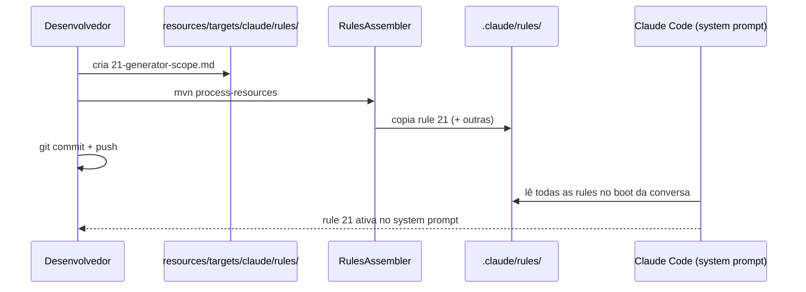

# História: Publicar Rule 21 e atualizar CLAUDE.md

**ID:** story-0052-0001
**Chave Jira:** —
**Status:** Pendente

## 1. Dependências

| Blocked By | Blocks |
| :--- | :--- |
| — | story-0052-0002, story-0052-0003, story-0052-0004 |

## 2. Regras Transversais Aplicáveis

| ID | Título |
| :--- | :--- |
| RULE-001 | Escopo de código Java |
| RULE-006 | Nenhuma feature nova |
| RULE-007 | Rule 21 é gate duradouro |

## 3. Descrição

Como **Platform Team**, eu quero **gravar o princípio "ia-dev-env é apenas um gerador" em uma rule numerada e carregada em toda conversa**, garantindo que **regressões futuras (inclusão de código Java fora de escopo) sejam detectadas automaticamente pela system prompt antes de chegarem a code review**.

O épico inteiro parte deste guardrail. Se a Rule 21 não existir **antes** das histórias de reescrita e remoção, qualquer divergência de interpretação entre contribuidores pode reintroduzir código Java auxiliar no meio do caminho. A rule é o contrato; todas as demais histórias são execução desse contrato.

### 3.1 Criar source of truth da Rule 21

- Caminho: `java/src/main/resources/targets/claude/rules/21-generator-scope.md`.
- Conteúdo normativo (rascunho completo no SPEC de entrada, §"Rule 21 — Draft Completo"):
  - Section 1 — Regra principal (escopo = gerador).
  - Section 2 — Lista exaustiva dos 8 pacotes Java permitidos.
  - Section 3 — Matriz "objetivo → artefato correto" (skill, hook, agent, knowledge, rule, template, perfil YAML, novo target).
  - Section 4 — Quando código Java novo é aceitável (apenas nos 8 pacotes, apenas para geração / validação de geração, com justificativa no PR).
  - Section 5 — Forbidden patterns (novo `main()`, classes `*Cli`/`*Orchestrator` em pacotes fora dos 8, invocação de `java -cp`/`java -jar` apontando para o JAR).

### 3.2 Regenerar output target

- Rodar `mvn process-resources` para que o `RulesAssembler` copie a nova rule para `.claude/rules/21-generator-scope.md`.
- Ou, alternativamente, rodar o `GoldenFileRegenerator` e confirmar que o golden espelha o arquivo novo.

### 3.3 Atualizar CLAUDE.md raiz

- Adicionar uma nota executiva (1 parágrafo) após o bloco "Concluded — EPIC-0041", apontando para a rule 21 e resumindo o princípio.
- Adicionar entrada na tabela de rules na própria raiz caso ela exista, ou no `.claude/README.md` gerado.

### 3.4 Atualizar `ia-dev-env` generator

- Verificar se o `RulesAssembler` já copia arquivos numerados automaticamente. Provavelmente sim (varre o diretório de rules). Confirmar com um `grep` rápido no `RulesAssembler.java`.
- Se o Assembler tiver lista hardcoded de rules, adicionar `21-generator-scope.md` à lista.

## 3.5 Entrega de Valor

- **Valor Principal:** Princípio "ia-dev-env é apenas um gerador" vira invariante da system prompt, carregado automaticamente em toda conversa dentro do projeto.
- **Métrica de Sucesso:** `grep '21-generator-scope' .claude/rules/` retorna 1 match; nova conversa do Claude Code carrega a Rule 21 no contexto (verificável pelo preâmbulo do system prompt).
- **Impacto no Negócio:** Futuros contribuidores (e o próprio LLM) são bloqueados por padrão ao tentar adicionar código Java fora de escopo; reduz custo de review e de regressão arquitetural.

## 4. Definições de Qualidade Locais

### DoR Local

- [ ] Rascunho completo da Rule 21 está disponível no SPEC de entrada.
- [ ] Decisão sobre formato (rule numerada 21) confirmada.
- [ ] Caminho do source of truth (`resources/targets/claude/rules/`) confirmado inalterado desde EPIC-0041.

### DoD Local

- [ ] `java/src/main/resources/targets/claude/rules/21-generator-scope.md` existe e contém as 5 sections normativas.
- [ ] `.claude/rules/21-generator-scope.md` é gerado pelo pipeline.
- [ ] `CLAUDE.md` raiz menciona `21-generator-scope` em pelo menos 1 linha.
- [ ] Golden files atualizados e `mvn test` passa.
- [ ] Teste automatizado: `RulesAssemblerTest` (ou similar) verifica que o arquivo é copiado.
- [ ] Smoke test passando (regeneração de qualquer stack copia a rule 21).

### Global DoD (referência)

- Cobertura ≥ 95% / 90%.
- TDD Compliance: teste de regeneração commitado antes da alteração da rule.
- Documentação: `README.md` em `.claude/` menciona a rule 21.

## 5. Contratos de Dados (Artefatos)

### 5.1 Arquivos criados

| Arquivo | Tipo | Descrição |
| :--- | :--- | :--- |
| `java/src/main/resources/targets/claude/rules/21-generator-scope.md` | Markdown | Source of truth da Rule 21 |
| `.claude/rules/21-generator-scope.md` | Markdown (gerado) | Output do `RulesAssembler` |

### 5.2 Arquivos modificados

| Arquivo | Mudança |
| :--- | :--- |
| `CLAUDE.md` (raiz) | +1 parágrafo referenciando Rule 21 |
| `.claude/README.md` (gerado) | +1 entrada na tabela de rules, se aplicável |
| `java/src/test/resources/golden/**` | Golden files atualizados para refletir a nova rule |

### 5.3 Arquivos NÃO tocados

- Qualquer `.java` em `java/src/main/java/dev/iadev/**`.
- Qualquer rule 01–20 (preservadas).
- Hooks, skills, agents (preservados).

## 5.4 File Footprint (RULE-004 / RULE-008)

```
write: java/src/main/resources/targets/claude/rules/21-generator-scope.md
write: CLAUDE.md
regen: .claude/rules/21-generator-scope.md
regen: .claude/README.md
regen: java/src/test/resources/golden/**/rules/21-generator-scope.md
read:  specs/SPEC-generator-scope-restoration-v1.md
```

## 6. Diagramas

### 6.1 Fluxo de publicação da Rule 21



## 7. Critérios de Aceite (Gherkin)

```gherkin
Cenario: Rule 21 ausente antes da história
  DADO que o repositório está na branch base do épico
  QUANDO eu executo "ls java/src/main/resources/targets/claude/rules/21-generator-scope.md"
  ENTÃO o comando retorna exit code não-zero
  E .claude/rules/21-generator-scope.md não existe

Cenario: Rule 21 publicada após a história
  DADO que a história 0052-0001 foi concluída
  QUANDO eu executo "cat java/src/main/resources/targets/claude/rules/21-generator-scope.md"
  ENTÃO o arquivo existe e contém as seções 1 a 5 normativas
  E contém a lista literal dos 8 pacotes Java permitidos
  E contém "ia-dev-env é apenas um gerador" (case-insensitive)

Cenario: Rule 21 é propagada pelo pipeline
  DADO que a rule 21 existe em resources
  QUANDO eu executo "ia-dev-env generate --stack java-picocli-cli -o /tmp/out --force"
  ENTÃO /tmp/out/.claude/rules/21-generator-scope.md existe
  E tem o mesmo conteúdo (byte-a-byte) do source of truth

Cenario: CLAUDE.md raiz referencia a Rule 21
  DADO que a história foi concluída
  QUANDO eu executo "grep -c '21-generator-scope' CLAUDE.md"
  ENTÃO o resultado é ≥ 1

Cenario: Regeneração não altera rules 01-20
  DADO que as rules 01 a 20 estão no estado pré-história
  QUANDO eu regenero o projeto
  ENTÃO o diff em .claude/rules/ contém apenas +21-generator-scope.md (nenhum outro arquivo mudou)
```

### 7.1 Scenario Ordering (TPP)

Cenários ordenados do mais degenerate (rule ausente) ao mais composto (regeneração preserva invariantes).

### 7.2 Mandatory Scenario Categories

- [x] Degenerate (rule ausente)
- [x] Happy path (rule publicada)
- [x] Error paths (pipeline propaga corretamente)
- [x] Boundary values (CLAUDE.md referencia; regeneração preserva outras rules)

### 7.3 TDD Implementation Notes

- Outer loop: primeiro cenário vira um teste de aceitação que falha antes da story (rule não existe) e passa após.
- Inner loop: unit test para `RulesAssembler` verificando que a nova rule é incluída na lista copiada.

## 8. Tasks

### TASK-0052-0001-001: Criar arquivo fonte `21-generator-scope.md`

- **Layer:** Resource (Markdown)
- **Test Type:** Verification
- **Size:** M (~120 LOC de Markdown)
- **Dependencies:** —
- **Branch:** `feat/task-0052-0001-001-create-rule-21-source`
- **Testability:** Config + VerificationTest (rule é arquivo de configuração da geração; verificação é o teste do `RulesAssembler`)
- **Files:**
  - `java/src/main/resources/targets/claude/rules/21-generator-scope.md`
- **Acceptance Criteria:**
  - [ ] Arquivo contém 5 sections normativas conforme rascunho do SPEC.
  - [ ] Lista literal dos 8 pacotes permitidos presente.
  - [ ] Lista de forbidden patterns presente.

### TASK-0052-0001-002: Garantir cópia pelo `RulesAssembler`

- **Layer:** Test
- **Test Type:** Integration
- **Size:** S (< 40 LOC)
- **Dependencies:** TASK-0052-0001-001
- **Branch:** `feat/task-0052-0001-002-rule-21-copied`
- **Testability:** Config + VerificationTest
- **Files:**
  - `java/src/test/java/dev/iadev/application/assembler/RulesAssemblerTest.java` (ou arquivo existente análogo)
- **Acceptance Criteria:**
  - [ ] Teste verifica que `.claude/rules/21-generator-scope.md` está presente no output e tem o mesmo hash do source.
  - [ ] Teste passa em verde antes de considerar a task concluída.

### TASK-0052-0001-003: Atualizar CLAUDE.md raiz

- **Layer:** Doc
- **Test Type:** Verification
- **Size:** S (~10 linhas)
- **Dependencies:** TASK-0052-0001-001
- **Branch:** `feat/task-0052-0001-003-claudemd-rule-21`
- **Testability:** Config + VerificationTest
- **Files:**
  - `CLAUDE.md`
- **Acceptance Criteria:**
  - [ ] Parágrafo curto referenciando `21-generator-scope` adicionado.
  - [ ] `grep -c '21-generator-scope' CLAUDE.md` retorna ≥ 1.

### TASK-0052-0001-004: Atualizar golden files

- **Layer:** Test (fixture)
- **Test Type:** Smoke
- **Size:** S (atualização automática via `GoldenFileRegenerator`)
- **Dependencies:** TASK-0052-0001-002
- **Branch:** `feat/task-0052-0001-004-golden-rule-21`
- **Testability:** Migration + Smoke
- **Files:**
  - `java/src/test/resources/golden/**/rules/` (atualizações automáticas)
- **Acceptance Criteria:**
  - [ ] `mvn process-resources && GoldenFileRegenerator` executado para todos os stacks.
  - [ ] `mvn -pl java test -Dtest='*Golden*'` passa verde.
  - [ ] Diff dos goldens contém apenas o arquivo novo; rules 01-20 inalteradas.
