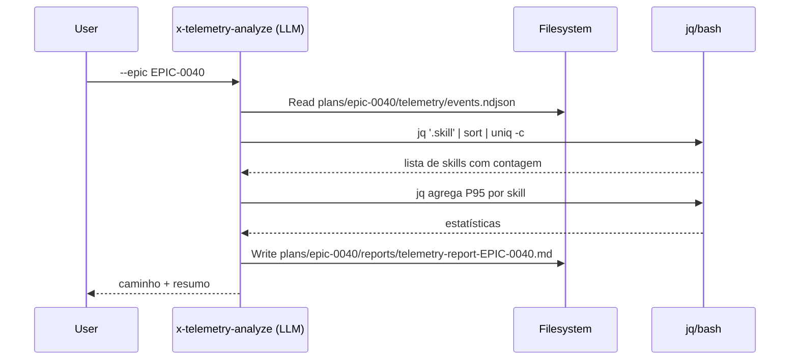

# História: Reescrever skills de análise (telemetry-analyze, telemetry-trend, parallel-eval) em LLM+bash

**ID:** story-0052-0002
**Chave Jira:** —
**Status:** Pendente

## 1. Dependências

| Blocked By | Blocks |
| :--- | :--- |
| story-0052-0001 | story-0052-0005, story-0052-0007 |

## 2. Regras Transversais Aplicáveis

| ID | Título |
| :--- | :--- |
| RULE-001 | Escopo de código Java |
| RULE-003 | Skills coupladas passam a LLM+bash |
| RULE-004 | Hooks shell são preservados |

## 3. Descrição

Como **operador do `ia-dev-env`**, eu quero **rodar `/x-telemetry-analyze`, `/x-telemetry-trend` e `/x-parallel-eval` sem precisar do JAR Java instalado**, garantindo que **essas skills funcionem em qualquer ambiente que tenha `bash`, `jq` e `git`**.

Hoje as três skills invocam classes Java (`TelemetryAnalyzeCli`, `TelemetryTrendCli`, `ParallelEvalCli`) via `java -cp target/classes:target/dependency/*`. Isso acopla a skill ao build artifact do projeto, força todo consumidor a ter Maven + JAR disponíveis, e confunde a direção de dependência (skill invoca JVM, quando o natural é LLM operar sobre dados em disco).

A reescrita preserva o **output observável** (mesmos argumentos de CLI, mesmo formato Markdown final) mas muda a **implementação interna**: o LLM agrega NDJSON com `jq` e compõe o relatório diretamente.

### 3.1 `x-telemetry-analyze`

- **Input**: `plans/epic-*/telemetry/events.ndjson` (formato preservado).
- **Output**: `plans/epic-XXXX/reports/telemetry-report-EPIC-XXXX.md`.
- **Pipeline reescrito**:
  1. Skill lê o NDJSON via `Read` tool.
  2. Agrega com `jq` (ou LLM reasoning quando o volume é pequeno):
     - Total de eventos por skill.
     - Total de eventos por phase.
     - Duração por skill: somatório, média, P50, P95.
     - Gantt Mermaid: para cada `phase.start`/`phase.end`, extrair intervalos.
  3. Compõe Markdown seguindo `_TEMPLATE-TELEMETRY-REPORT.md` (template existente permanece).
- **Argumentos preservados**: `--epic`, `--epics`, `--export json|csv --out`, `--since`, `--by-tool`, `--base-dir`.
- **Exit codes preservados**: 0 sucesso; 2 NDJSON ausente.

### 3.2 `x-telemetry-trend`

- **Input**: múltiplos `plans/epic-*/telemetry/events.ndjson` (últimos N epics).
- **Output**: stdout ou arquivo Markdown/JSON com top-10 regressões e top-10 mais lentas.
- **Pipeline reescrito**:
  1. `find plans/epic-*/telemetry/events.ndjson -type f | sort | tail -n N`.
  2. Para cada arquivo, `jq` calcula P95 por skill.
  3. LLM compara P95 atual contra baseline (mean ou median dos epics anteriores) e classifica como regressão se delta > threshold-pct.
  4. Render Markdown ou JSON conforme `--format`.
- **Argumentos preservados**: `--last`, `--threshold-pct`, `--baseline mean|median`, `--format md|json`, `--out`, `--base-dir`, `--index-path`, `--rebuild-index`.

### 3.3 `x-parallel-eval`

- **Input**: blocos `## File Footprint` dos planos de story/task em `plans/epic-XXXX/`.
- **Output**: matriz de colisão Markdown ou JSON.
- **Pipeline reescrito**:
  1. Skill lê cada plan via `Read`/`Glob`.
  2. Extrai bloco `## File Footprint` (delimitadores `write:`, `read:`, `regen:`).
  3. LLM aplica heurísticas do knowledge pack `parallelism-heuristics` (caminho existente):
     - HARD: dois planos escrevem no mesmo arquivo.
     - REGEN: dois planos regeneram o mesmo arquivo (não-hard se a geração é determinística).
     - SOFT: sobreposição apenas em `read:`.
     - Overrides de hotspots em `RULE-004`.
  4. Render matriz ou JSON.
- **Argumentos preservados**: `--scope=epic|story|task`, `--epic`, `--a`, `--b`, `--out`, `--format`, `--map`, `--include-soft`.

### 3.4 Preservação de comportamento

- Os templates de relatório (`_TEMPLATE-TELEMETRY-REPORT.md` etc.) não mudam.
- O output final Markdown é **visualmente equivalente** ao produzido hoje. Pequenas diferenças (ordenação por nome em caso de empate, formatação de duração) são aceitáveis mas devem ser documentadas na SKILL.md.

## 3.5 Entrega de Valor

- **Valor Principal:** Três skills de observabilidade e análise de paralelismo tornam-se portáveis e independentes de JVM.
- **Métrica de Sucesso:** Execução `Skill(skill: "x-telemetry-analyze", args: "--epic EPIC-0040")` produz relatório idêntico ao baseline (diff < 5%, desvio aceito em formatação) sem rodar `java`.
- **Impacto no Negócio:** Qualquer projeto gerado pelo `ia-dev-env` passa a usar essas skills sem precisar build do `ia-dev-env`; reduz fricção de adoção.

## 4. Definições de Qualidade Locais

### DoR Local

- [ ] Rule 21 publicada (story-0052-0001).
- [ ] Knowledge pack `parallelism-heuristics` disponível e atualizado (existente, sem mudança).
- [ ] Templates de relatório existentes (`_TEMPLATE-TELEMETRY-REPORT.md`) não exigem ajuste para acomodar a reescrita.

### DoD Local

- [ ] As 3 SKILL.md reescritas não contêm `dev.iadev.`, `java -cp`, `java -jar`.
- [ ] Golden NDJSON fixture existe e é consumido pelos testes de cada skill.
- [ ] Pelo menos 1 teste automatizado por skill executando o fluxo bash+LLM de ponta a ponta (pode ser `SkillInvocationTest` ou integration test do próprio gerador).
- [ ] Relatório gerado pelo novo pipeline bate com baseline do pipeline Java (diff textual < 5% de linhas).
- [ ] Smoke test passando.

## 5. Contratos de Dados (Artefatos)

### 5.1 Arquivos modificados

| Arquivo | Mudança |
| :--- | :--- |
| `java/src/main/resources/targets/claude/skills/core/ops/x-telemetry-analyze/SKILL.md` | Substituir §Invocation (linhas 53–63) por fluxo LLM+bash |
| `java/src/main/resources/targets/claude/skills/core/ops/x-telemetry-trend/SKILL.md` | Idem (remover §Invocation Java) |
| `java/src/main/resources/targets/claude/skills/core/plan/x-parallel-eval/SKILL.md` | Idem (remover linha 119 que invoca `ParallelEvalCli`) |

### 5.2 Arquivos inalterados

- Knowledge pack `parallelism-heuristics/**` (heurísticas já estão lá em `.md`).
- Hooks `telemetry-*.sh` (continuam emitindo NDJSON).
- Template `_TEMPLATE-TELEMETRY-REPORT.md`.
- Classes Java em `dev.iadev.telemetry.*` (**serão removidas em story-0052-0007**, não nesta).

### 5.3 Arquivos NÃO tocados (invariantes)

- Qualquer `.java`.
- Rules 01–20.

## 5.4 File Footprint

```
write: java/src/main/resources/targets/claude/skills/core/ops/x-telemetry-analyze/SKILL.md
write: java/src/main/resources/targets/claude/skills/core/ops/x-telemetry-trend/SKILL.md
write: java/src/main/resources/targets/claude/skills/core/plan/x-parallel-eval/SKILL.md
read:  .claude/skills/parallelism-heuristics/**
read:  java/src/main/resources/shared/templates/_TEMPLATE-TELEMETRY-REPORT.md
regen: .claude/skills/x-telemetry-analyze/SKILL.md
regen: .claude/skills/x-telemetry-trend/SKILL.md
regen: .claude/skills/x-parallel-eval/SKILL.md
regen: java/src/test/resources/golden/**/skills/x-telemetry-*
regen: java/src/test/resources/golden/**/skills/x-parallel-eval/**
```

## 6. Diagramas

### 6.1 Pipeline novo de `x-telemetry-analyze`



## 7. Critérios de Aceite (Gherkin)

```gherkin
Cenario: NDJSON vazio retorna exit code informativo
  DADO que plans/epic-9999/telemetry/events.ndjson não existe
  QUANDO eu executo /x-telemetry-analyze --epic EPIC-9999
  ENTÃO a skill reporta "events.ndjson ausente" e sugere o caminho esperado
  E NÃO invoca java -cp nem java -jar

Cenario: NDJSON válido gera relatório equivalente ao baseline
  DADO que plans/epic-0040/telemetry/events.ndjson é a fixture golden
  QUANDO eu executo /x-telemetry-analyze --epic EPIC-0040
  ENTÃO plans/epic-0040/reports/telemetry-report-EPIC-0040.md é criado
  E o conteúdo bate com o baseline Java com diff < 5% de linhas
  E o relatório contém tabela "Por Skill", tabela "Por Phase" e Gantt Mermaid

Cenario: x-telemetry-trend detecta regressão
  DADO que há 5 epics em plans/ com NDJSONs sintéticos
  E o último epic tem P95 150% maior que a mediana dos anteriores para skill X
  QUANDO eu executo /x-telemetry-trend --last 5 --threshold-pct 20
  ENTÃO a skill lista skill X no top-10 regressões
  E o output é Markdown por default

Cenario: x-parallel-eval detecta colisão HARD entre duas stories
  DADO que story-A declara "write: src/Foo.java"
  E story-B declara "write: src/Foo.java"
  QUANDO eu executo /x-parallel-eval --scope=story --a A --b B
  ENTÃO o output classifica o par como HARD
  E recomenda execução serial

Cenario: Skill não invoca JVM
  DADO que qualquer das 3 skills foi reescrita
  QUANDO eu inspeciono a SKILL.md via grep
  ENTÃO grep 'java -(cp|jar)' retorna 0 matches
  E grep 'dev\.iadev\.' retorna 0 matches
```

### 7.1 Scenario Ordering (TPP)

Degenerate (NDJSON ausente) → happy path (relatório idêntico) → regressão detectada → colisão paralelismo → invariante (sem JVM).

### 7.2 Mandatory Scenario Categories

- [x] Degenerate (NDJSON ausente)
- [x] Happy path (relatório idêntico)
- [x] Error paths (regressão detectada)
- [x] Boundary values (invariante sem JVM)

### 7.3 TDD Implementation Notes

- Acceptance test (outer loop): comparação diff-a-diff de relatório novo vs baseline Java.
- Inner loops: unit tests para cada etapa de agregação (`jq` específico retorna estrutura esperada; formatador Markdown produz tabela correta).

## 8. Tasks

### TASK-0052-0002-001: Capturar baseline de outputs Java

- **Layer:** Test (fixture)
- **Test Type:** Smoke
- **Size:** S
- **Dependencies:** —
- **Branch:** `feat/task-0052-0002-001-baseline-outputs`
- **Testability:** Migration + Smoke
- **Files:**
  - `java/src/test/resources/fixtures/telemetry/baseline-EPIC-0040-report.md` (gerado com Java atual)
  - `java/src/test/resources/fixtures/telemetry/baseline-trend-last-5.md`
  - `java/src/test/resources/fixtures/parallelism/baseline-epic-0041-matrix.md`
- **Acceptance Criteria:**
  - [ ] Três fixtures capturadas rodando o Java atual contra dados reais.
  - [ ] Documentado o comando que gerou cada fixture (no README de fixtures).

### TASK-0052-0002-002: Reescrever SKILL.md de `x-telemetry-analyze`

- **Layer:** Skill (Markdown)
- **Test Type:** Verification
- **Size:** M (~200 linhas)
- **Dependencies:** TASK-0052-0002-001
- **Branch:** `feat/task-0052-0002-002-rewrite-telemetry-analyze`
- **Testability:** Config + VerificationTest
- **Files:**
  - `java/src/main/resources/targets/claude/skills/core/ops/x-telemetry-analyze/SKILL.md`
- **Acceptance Criteria:**
  - [ ] Seção "Invocation" removida ou reescrita sem `java -cp`.
  - [ ] Novo fluxo com `jq`/`awk` documentado passo a passo.
  - [ ] Mesmos argumentos CLI documentados.

### TASK-0052-0002-003: Reescrever SKILL.md de `x-telemetry-trend`

- **Layer:** Skill (Markdown)
- **Test Type:** Verification
- **Size:** M
- **Dependencies:** TASK-0052-0002-001
- **Branch:** `feat/task-0052-0002-003-rewrite-telemetry-trend`
- **Testability:** Config + VerificationTest
- **Files:**
  - `java/src/main/resources/targets/claude/skills/core/ops/x-telemetry-trend/SKILL.md`
- **Acceptance Criteria:**
  - [ ] Idem TASK-0052-0002-002 mas para trend.

### TASK-0052-0002-004: Reescrever SKILL.md de `x-parallel-eval`

- **Layer:** Skill (Markdown)
- **Test Type:** Verification
- **Size:** M
- **Dependencies:** TASK-0052-0002-001
- **Branch:** `feat/task-0052-0002-004-rewrite-parallel-eval`
- **Testability:** Config + VerificationTest
- **Files:**
  - `java/src/main/resources/targets/claude/skills/core/plan/x-parallel-eval/SKILL.md`
- **Acceptance Criteria:**
  - [ ] Linha 119 (invocação de `ParallelEvalCli`) removida.
  - [ ] Novo fluxo: LLM lê `## File Footprint` de cada plano e aplica heurística documentada em `parallelism-heuristics`.

### TASK-0052-0002-005: Testes de regressão (new vs baseline)

- **Layer:** Test
- **Test Type:** Integration
- **Size:** L (~200 linhas)
- **Dependencies:** TASK-0052-0002-002, TASK-0052-0002-003, TASK-0052-0002-004
- **Branch:** `feat/task-0052-0002-005-regression-tests`
- **Testability:** UseCase + AT
- **Files:**
  - `java/src/test/java/dev/iadev/skills/SkillOutputParityIT.java` (ou similar)
- **Acceptance Criteria:**
  - [ ] Teste invoca cada skill reescrita (via subprocess Bash ou dry-run documentado) e compara output com as 3 fixtures baseline.
  - [ ] Diff aceitável ≤ 5% de linhas (formatação); diff de **conteúdo** (números, nomes) = 0.

### TASK-0052-0002-006: Atualizar golden files

- **Layer:** Test (fixture)
- **Test Type:** Smoke
- **Size:** S
- **Dependencies:** TASK-0052-0002-002 a 004
- **Branch:** `feat/task-0052-0002-006-regen-goldens`
- **Testability:** Migration + Smoke
- **Files:**
  - `java/src/test/resources/golden/**/skills/x-telemetry-*`
  - `java/src/test/resources/golden/**/skills/x-parallel-eval/**`
- **Acceptance Criteria:**
  - [ ] Goldens regenerados; `mvn test -Dtest='*Golden*'` verde.
