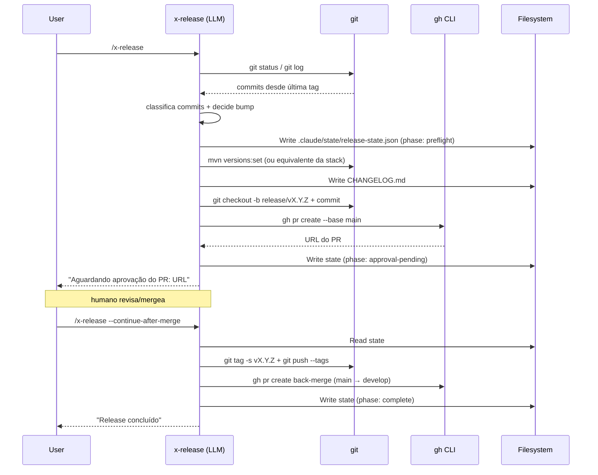

# História: Reescrever skill `x-release` em LLM+bash/git/gh

**ID:** story-0052-0003
**Chave Jira:** —
**Status:** Pendente

## 1. Dependências

| Blocked By | Blocks |
| :--- | :--- |
| story-0052-0001 | story-0052-0005, story-0052-0006 |

## 2. Regras Transversais Aplicáveis

| ID | Título |
| :--- | :--- |
| RULE-001 | Escopo de código Java |
| RULE-003 | Skills coupladas passam a LLM+bash |

## 3. Descrição

Como **usuário de qualquer projeto gerado pelo `ia-dev-env`**, eu quero **executar `/x-release` usando apenas `git`, `gh` CLI e `jq`**, garantindo que **release flow funcione sem depender do JAR do `ia-dev-env` instalado**.

Hoje `/x-release` orquestra release via classes Java do pacote `dev.iadev.release` (`SemVer`, `ConventionalCommitsParser`, `PreflightOrchestrator`, `DryRunInteractiveExecutor`, `HandoffOrchestrator`, `SmartResumeOrchestrator`, subpastas `preflight/`, `dryrun/`, `handoff/`, `resume/`, `abort/`, `integrity/`, `prompt/`, `state/`, `status/`, `summary/`, `changelog/`, `telemetry/`). Essa dependência força o usuário a ter o build do `ia-dev-env` disponível e acopla um fluxo genérico (release SemVer) à implementação de um projeto específico.

A reescrita preserva o fluxo de release (git-flow hotfix + release branches, SemVer bump automático, CHANGELOG via Conventional Commits, handoff interativo, resume via state file, tag assinada, back-merge para develop) mas implementa tudo em bash + LLM reasoning usando ferramentas padrão.

### 3.1 Fluxo reescrito

```
Phase 0 — Preflight (bash)
  * git status limpo, branch develop ou main
  * gh auth status ok
  * working tree no commit topo

Phase 1 — Parse commits (git log + bash)
  * git log $(git describe --tags --abbrev=0)..HEAD --format="%s"
  * LLM classifica cada commit (feat/fix/breaking) seguindo Conventional Commits
  * LLM propõe bump type (major/minor/patch)

Phase 2 — Bump version (jq + sed)
  * Atualiza version em pom.xml (mvn versions:set), package.json, pyproject.toml, etc.
  * LLM escolhe qual arquivo tocar baseado na stack detectada

Phase 3 — Changelog (git log + LLM)
  * LLM gera CHANGELOG.md entry no formato Keep a Changelog
  * Agrupa por Added/Changed/Fixed

Phase 4 — Release branch
  * git checkout -b release/vX.Y.Z
  * Commit "chore(release): vX.Y.Z"
  * gh pr create (base: main)

Phase 5 — Approval gate
  * State file .claude/state/release-state.json persiste em qual fase parou
  * Skill re-executável via --continue-after-merge

Phase 6 — Tag + back-merge
  * Após merge no main: git tag -s vX.Y.Z; git push --tags
  * gh pr create back-merge (main → develop)
```

### 3.2 State file

Novo formato do `.claude/state/release-state.json` (ou `plans/epic-*/release/state.json`):

```json
{
  "version": "1.2.3",
  "phase": "approval-pending",
  "releaseBranch": "release/1.2.3",
  "baseBranch": "main",
  "prUrl": "https://github.com/...",
  "bumpType": "minor",
  "createdAt": "2026-04-18T00:00:00Z",
  "updatedAt": "2026-04-18T00:05:00Z"
}
```

Gerenciado via `Read`/`Write` tool da skill. Sem schema Java.

### 3.3 Invariantes preservadas

- Release branches seguem Rule 09 (Git Flow).
- Conventional Commits parsing alinhado com Rule 08.
- CHANGELOG.md atualizado em todo release.
- Tag GPG-signed se `git config user.signingkey` existir.
- Back-merge para develop acontece após merge em main.

## 3.5 Entrega de Valor

- **Valor Principal:** Release flow funciona em qualquer projeto gerado, independente de build do `ia-dev-env`.
- **Métrica de Sucesso:** Release dry-run do próprio `ia-dev-env` gera PR + tag + back-merge PR sem invocar nenhuma classe Java de `dev.iadev.release.*`.
- **Impacto no Negócio:** Reduz dependência operacional; release é uma habilidade LLM transferível entre projetos.

## 4. Definições de Qualidade Locais

### DoR Local

- [ ] Rule 21 publicada.
- [ ] Baseline capturado: execução atual de `/x-release` em dry-run gerando PR fake, com log completo das fases.
- [ ] `gh` CLI disponível no ambiente de teste.

### DoD Local

- [ ] SKILL.md de `x-release` não contém `dev.iadev.`, `java -cp`, `java -jar`.
- [ ] State file JSON documentado inline na SKILL.md (shape mínimo).
- [ ] Teste integração com fixture de repositório git (gh mock): skill produz mesmo PR que baseline Java.
- [ ] Dry-run funciona e re-execução com `--continue-after-merge` avança fase sem duplicar commits.
- [ ] Smoke test em repositório fixture passa.

## 5. Contratos de Dados (Artefatos)

### 5.1 Arquivos modificados

| Arquivo | Mudança |
| :--- | :--- |
| `java/src/main/resources/targets/claude/skills/core/ops/x-release/SKILL.md` | Substituição total do Workflow por fluxo bash+LLM |
| `java/src/main/resources/targets/claude/skills/core/ops/x-release/references/*.md` | Ajustes de invocação se referenciarem Java |

### 5.2 Arquivos NÃO tocados

- Classes Java `dev.iadev.release.*` (**removidas em story-0052-0006**).
- Rule 08 (release process), Rule 09 (branching).

## 5.4 File Footprint

```
write: java/src/main/resources/targets/claude/skills/core/ops/x-release/SKILL.md
write: java/src/main/resources/targets/claude/skills/core/ops/x-release/references/**.md (apenas as que mencionam Java)
regen: .claude/skills/x-release/**
regen: java/src/test/resources/golden/**/skills/x-release/**
read:  .claude/rules/08-release-process.md
read:  .claude/rules/09-branching-model.md
```

## 6. Diagramas

### 6.1 Pipeline reescrito



## 7. Critérios de Aceite (Gherkin)

```gherkin
Cenario: Working tree sujo bloqueia release
  DADO que git status mostra arquivos não commitados
  QUANDO eu executo /x-release
  ENTÃO a skill aborta com mensagem "working tree não está limpo"
  E state file não é criado

Cenario: Release minor a partir de develop
  DADO que os últimos commits incluem "feat: X" sem breaking changes
  QUANDO eu executo /x-release em dry-run
  ENTÃO a skill propõe bump minor
  E cria release branch vX.(Y+1).0
  E CHANGELOG é atualizado com seção Added contendo o feat X

Cenario: Resume após merge
  DADO que release-state.json existe com phase "approval-pending"
  E o PR correspondente foi mergeado no main
  QUANDO eu executo /x-release --continue-after-merge
  ENTÃO a skill faz tag assinada + push
  E abre PR de back-merge main→develop
  E atualiza state para phase "complete"

Cenario: Skill não invoca JVM
  DADO que a skill foi reescrita
  QUANDO eu inspeciono SKILL.md e references
  ENTÃO grep 'java -(cp|jar)' retorna 0 matches
  E grep 'dev\.iadev\.release' retorna 0 matches

Cenario: Hotfix a partir de main
  DADO que estou em main
  E há um commit "fix: crítico"
  QUANDO eu executo /x-release --hotfix
  ENTÃO a skill cria hotfix/vX.Y.(Z+1)
  E bump é patch
```

### 7.1 Scenario Ordering (TPP)

Degenerate (tree sujo) → happy path (minor) → edge (resume) → invariante (sem JVM) → variação (hotfix).

### 7.2 Mandatory Scenario Categories

- [x] Degenerate (tree sujo)
- [x] Happy path (release minor)
- [x] Error paths (resume após merge)
- [x] Boundary values (hotfix, sem JVM)

### 7.3 TDD Implementation Notes

- Outer loop: acceptance test rodando em repo git fixture sem JVM.
- Inner loops: unit tests para classificação de commits (via LLM prompt teste) e para geração de CHANGELOG.

## 8. Tasks

### TASK-0052-0003-001: Capturar baseline Java do fluxo release

- **Layer:** Test (fixture)
- **Test Type:** Smoke
- **Size:** M
- **Dependencies:** —
- **Branch:** `feat/task-0052-0003-001-baseline-release`
- **Testability:** Migration + Smoke
- **Files:**
  - `java/src/test/resources/fixtures/release/baseline-dryrun-minor.log`
  - `java/src/test/resources/fixtures/release/baseline-changelog-entry.md`
- **Acceptance Criteria:**
  - [ ] Fixtures capturadas rodando o `/x-release` atual em sandbox.

### TASK-0052-0003-002: Reescrever SKILL.md de `x-release` (fluxo principal)

- **Layer:** Skill (Markdown)
- **Test Type:** Verification
- **Size:** L (~350 linhas)
- **Dependencies:** TASK-0052-0003-001
- **Branch:** `feat/task-0052-0003-002-rewrite-x-release`
- **Testability:** Config + VerificationTest
- **Files:**
  - `java/src/main/resources/targets/claude/skills/core/ops/x-release/SKILL.md`
- **Acceptance Criteria:**
  - [ ] 7 fases documentadas passo a passo (preflight → complete).
  - [ ] Schema do state file inline.
  - [ ] Zero referências a classes Java.

### TASK-0052-0003-003: Ajustar references da skill

- **Layer:** Skill (Markdown)
- **Test Type:** Verification
- **Size:** S
- **Dependencies:** TASK-0052-0003-002
- **Branch:** `feat/task-0052-0003-003-release-references`
- **Testability:** Config + VerificationTest
- **Files:**
  - `java/src/main/resources/targets/claude/skills/core/ops/x-release/references/*.md`
- **Acceptance Criteria:**
  - [ ] Qualquer reference que mencionava Java é atualizada ou removida.
  - [ ] `grep 'dev\.iadev\.release' references/` retorna 0.

### TASK-0052-0003-004: Teste integração (gh mock + git fixture)

- **Layer:** Test
- **Test Type:** Integration
- **Size:** L
- **Dependencies:** TASK-0052-0003-002
- **Branch:** `feat/task-0052-0003-004-release-it`
- **Testability:** UseCase + AT
- **Files:**
  - `java/src/test/java/dev/iadev/skills/XReleaseRewriteIT.java`
- **Acceptance Criteria:**
  - [ ] Teste monta repo git fixture com commits Conventional.
  - [ ] Executa skill em dry-run e compara log final com baseline.
  - [ ] Confirma state file tem campos obrigatórios.

### TASK-0052-0003-005: Atualizar goldens

- **Layer:** Test (fixture)
- **Test Type:** Smoke
- **Size:** S
- **Dependencies:** TASK-0052-0003-002, 003
- **Branch:** `feat/task-0052-0003-005-release-goldens`
- **Testability:** Migration + Smoke
- **Files:**
  - `java/src/test/resources/golden/**/skills/x-release/**`
- **Acceptance Criteria:**
  - [ ] Goldens regenerados; `*Golden*` tests verdes.
