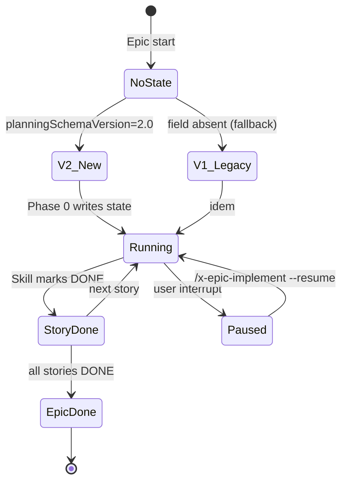

# História: Reescrever skills de implementação (epic/story/task-implement) removendo dependência de `checkpoint/`

**ID:** story-0052-0004
**Chave Jira:** —
**Status:** Pendente

## 1. Dependências

| Blocked By | Blocks |
| :--- | :--- |
| story-0052-0001 | story-0052-0006 |

## 2. Regras Transversais Aplicáveis

| ID | Título |
| :--- | :--- |
| RULE-001 | Escopo de código Java |
| RULE-003 | Skills coupladas passam a LLM+bash |
| RULE-005 | Ordem topológica imutável |

## 3. Descrição

Como **contribuidor executando um épico via `/x-epic-implement`**, eu quero **rodar o orchestrator sem depender de classes Java de `dev.iadev.checkpoint`**, garantindo que **o estado de execução (`execution-state.json`) seja apenas um JSON leve gerenciado pela própria skill via Read/Write tools**.

Hoje três skills (`x-epic-implement`, `x-story-implement`, `x-task-implement`) leem e escrevem `execution-state.json` com schema validado por `dev.iadev.checkpoint.*` (`ExecutionState`, `StoryEntry`, `TaskEntry`, `FileCheckpointStore`, `JacksonCheckpointPersistence`). Este acoplamento força o JAR presente no ambiente executor e mistura responsabilidade: a skill **deveria** ser o autor autoritativo do estado, não a validadora.

A reescrita:

1. Mantém **o formato do `execution-state.json`** (backward compatible com epics 0025–0051 existentes) para não quebrar retomadas em andamento.
2. Move a **validação** e **mutação** para dentro da própria SKILL.md — documentação inline do shape + Read/Write.
3. Remove dependência da `SchemaVersionResolver` (Rule 19): o resolvedor continua documentado na Rule 19, mas a lógica vira uma tabela de decisão aplicada pelo LLM com `jq` em runtime.

### 3.1 Schema do `execution-state.json` (backward compatible com v1 e v2)

Preservado exatamente como hoje. Documentado inline em `x-epic-implement/SKILL.md` Section "State File Schema":

```json
{
  "planningSchemaVersion": "2.0",
  "epicId": "EPIC-XXXX",
  "startedAt": "ISO-8601",
  "currentPhase": 2,
  "stories": [
    {
      "id": "story-XXXX-YYYY",
      "status": "Concluída | Em Andamento | Pendente | Falha | Bloqueada",
      "startedAt": "...",
      "completedAt": "...",
      "tasks": [
        { "id": "TASK-XXXX-YYYY-NNN", "status": "...", "commitSha": "..." }
      ]
    }
  ],
  "parallelismDowngrades": []
}
```

Quando `planningSchemaVersion` estiver ausente ou igual a `"1.0"`, aplica fallback para v1 (tasks inline na story, sem TDD cycles) — mesma regra da Rule 19 mas aplicada em bash+LLM.

### 3.2 Operações do state file por skill

| Skill | Read | Mutate |
| :--- | :--- | :--- |
| `x-epic-implement` | Phase 0: detecta retomada | Phase N: marca story DONE/FAILED |
| `x-story-implement` | Phase 0: lê fase atual | Phase N: marca task DONE |
| `x-task-implement` | Phase 0 (v2): lê contrato da task | Phase 4: escreve commitSha |

Cada mutação é `Read → mutate (jq) → Write` (idempotente, preserva campos desconhecidos).

### 3.3 Log codes Rule 19 preservados

- `SCHEMA_VERSION_FALLBACK_NO_FILE`, `SCHEMA_VERSION_FALLBACK_MISSING_FIELD`, `SCHEMA_VERSION_INVALID_VALUE` continuam sendo emitidos pelas skills (como output textual ao operador) mesmo sem Java.

## 3.5 Entrega de Valor

- **Valor Principal:** As 3 skills de implementação sobrevivem em qualquer ambiente com `jq` + Claude Code; não dependem do JAR.
- **Métrica de Sucesso:** Retomada de um epic antigo (EPIC-0040, por exemplo) lê o state file existente sem erro; skill produz mesma sequência de ações da execução Java para o próximo passo.
- **Impacto no Negócio:** Permite que projetos gerados (que não têm o JAR instalado) usem os workflows de implementação nativamente.

## 4. Definições de Qualidade Locais

### DoR Local

- [ ] Rule 21 publicada.
- [ ] Inventário das chamadas a `dev.iadev.checkpoint.*` em cada uma das 3 SKILL.md mapeado.
- [ ] Fixture de `execution-state.json` real capturada de 2 epics (um v1, um v2).

### DoD Local

- [ ] As 3 SKILL.md não contêm `dev.iadev.checkpoint`, `ExecutionState`, `SchemaVersionResolver` como invocação Java.
- [ ] Section "State File Schema" inline em `x-epic-implement/SKILL.md` e referenciada pelas outras 2.
- [ ] Teste lê/escreve `execution-state.json` v1 e v2 fixture e valida que campos são preservados.
- [ ] Retomada funciona em epic real (smoke test).
- [ ] Coverage local ≥ 95%.

## 5. Contratos de Dados (Artefatos)

### 5.1 Arquivos modificados

| Arquivo | Mudança |
| :--- | :--- |
| `java/src/main/resources/targets/claude/skills/core/dev/x-epic-implement/SKILL.md` | Remove refs Java; adiciona Section "State File Schema" inline |
| `java/src/main/resources/targets/claude/skills/core/dev/x-story-implement/SKILL.md` | Remove refs Java; lê state via Read tool |
| `java/src/main/resources/targets/claude/skills/core/dev/x-task-implement/SKILL.md` | Remove refs Java; lê state via Read tool |

### 5.2 Arquivos NÃO tocados

- Classes Java `dev.iadev.checkpoint.*` (**removidas em story-0052-0006**).
- Rule 14 (worktree lifecycle), Rule 15-18 (task-first rules), Rule 19 (backward compatibility).
- Templates `.claude/templates/_TEMPLATE-*.md`.

## 5.4 File Footprint

```
write: java/src/main/resources/targets/claude/skills/core/dev/x-epic-implement/SKILL.md
write: java/src/main/resources/targets/claude/skills/core/dev/x-story-implement/SKILL.md
write: java/src/main/resources/targets/claude/skills/core/dev/x-task-implement/SKILL.md
read:  .claude/rules/19-backward-compatibility.md
read:  .claude/rules/15-task-testability.md
read:  .claude/rules/16-task-io-contracts.md
read:  .claude/rules/17-topological-execution.md
read:  .claude/rules/18-atomic-task-commits.md
regen: .claude/skills/x-epic-implement/**
regen: .claude/skills/x-story-implement/**
regen: .claude/skills/x-task-implement/**
regen: java/src/test/resources/golden/**/skills/x-{epic,story,task}-implement/**
```

## 6. Diagramas

### 6.1 State file lifecycle



## 7. Critérios de Aceite (Gherkin)

```gherkin
Cenario: Epic novo sem state file
  DADO que plans/epic-0060/execution-state.json não existe
  QUANDO eu executo /x-epic-implement EPIC-0060
  ENTÃO a skill cria o state file com planningSchemaVersion "2.0" e currentPhase 0
  E não invoca java

Cenario: Retomada de epic v2 existente
  DADO que plans/epic-0040/execution-state.json tem 3 stories com status "Concluída"
  E 1 story com status "Em Andamento"
  QUANDO eu executo /x-epic-implement --resume EPIC-0040
  ENTÃO a skill retoma na story "Em Andamento"
  E preserva as outras 3 stories como "Concluída"

Cenario: Fallback v1 quando planningSchemaVersion ausente
  DADO que plans/epic-0030/execution-state.json existe sem campo planningSchemaVersion
  QUANDO eu executo /x-story-implement story-0030-0001
  ENTÃO a skill emite log "SCHEMA_VERSION_FALLBACK_MISSING_FIELD"
  E executa o fluxo v1 (inline tasks)

Cenario: Task v2 grava commitSha no state
  DADO que estou executando TASK-0052-0001-001
  QUANDO a skill finaliza a task
  ENTÃO o state file contém tasks[id=TASK-0052-0001-001].commitSha com o SHA do commit
  E status = "DONE"

Cenario: Skill não invoca JVM
  DADO que as 3 skills foram reescritas
  QUANDO inspeciono as SKILL.md
  ENTÃO grep 'dev\.iadev\.checkpoint' retorna 0 matches
  E grep 'java -(cp|jar)' retorna 0 matches
```

### 7.1 Scenario Ordering (TPP)

Degenerate (state ausente) → happy path (resume v2) → fallback (v1) → edge (commit write) → invariante (sem JVM).

### 7.2 Mandatory Scenario Categories

- [x] Degenerate
- [x] Happy path
- [x] Error paths (fallback)
- [x] Boundary values (sem JVM)

### 7.3 TDD Implementation Notes

- Outer loop: cenário de retomada v2 executado em epic fixture.
- Inner loops: unit tests do `jq` de mutação do state file (idempotência, preservação de campos desconhecidos).

## 8. Tasks

### TASK-0052-0004-001: Capturar fixtures de state file

- **Layer:** Test (fixture)
- **Test Type:** Smoke
- **Size:** S
- **Dependencies:** —
- **Branch:** `feat/task-0052-0004-001-state-fixtures`
- **Testability:** Migration + Smoke
- **Files:**
  - `java/src/test/resources/fixtures/checkpoint/execution-state-v2.json`
  - `java/src/test/resources/fixtures/checkpoint/execution-state-v1.json`
- **Acceptance Criteria:**
  - [ ] Fixtures extraídas de 2 epics reais.

### TASK-0052-0004-002: Reescrever `x-epic-implement/SKILL.md`

- **Layer:** Skill
- **Test Type:** Verification
- **Size:** L
- **Dependencies:** TASK-0052-0004-001
- **Branch:** `feat/task-0052-0004-002-rewrite-epic-implement`
- **Testability:** Config + VerificationTest
- **Files:**
  - `java/src/main/resources/targets/claude/skills/core/dev/x-epic-implement/SKILL.md`
- **Acceptance Criteria:**
  - [ ] Section "State File Schema" inline.
  - [ ] Fluxo de Read/Write do state via Read/Write tool documentado.
  - [ ] Zero `dev.iadev.checkpoint`.

### TASK-0052-0004-003: Reescrever `x-story-implement/SKILL.md`

- **Layer:** Skill
- **Test Type:** Verification
- **Size:** L
- **Dependencies:** TASK-0052-0004-002
- **Branch:** `feat/task-0052-0004-003-rewrite-story-implement`
- **Testability:** Config + VerificationTest
- **Files:**
  - `java/src/main/resources/targets/claude/skills/core/dev/x-story-implement/SKILL.md`
- **Acceptance Criteria:**
  - [ ] Referência `## State File Schema` aponta para SKILL de `x-epic-implement`.
  - [ ] Zero refs Java.

### TASK-0052-0004-004: Reescrever `x-task-implement/SKILL.md`

- **Layer:** Skill
- **Test Type:** Verification
- **Size:** L
- **Dependencies:** TASK-0052-0004-002
- **Branch:** `feat/task-0052-0004-004-rewrite-task-implement`
- **Testability:** Config + VerificationTest
- **Files:**
  - `java/src/main/resources/targets/claude/skills/core/dev/x-task-implement/SKILL.md`
- **Acceptance Criteria:**
  - [ ] Zero refs Java.
  - [ ] Fluxo de Read state file + commit atômico (Rule 18) preservado.

### TASK-0052-0004-005: Teste de retomada em epic real

- **Layer:** Test
- **Test Type:** Integration
- **Size:** M
- **Dependencies:** TASK-0052-0004-002, 003, 004
- **Branch:** `feat/task-0052-0004-005-resume-it`
- **Testability:** UseCase + AT
- **Files:**
  - `java/src/test/java/dev/iadev/skills/XEpicImplementResumeIT.java`
- **Acceptance Criteria:**
  - [ ] Fixture epic v2 com state file incompleto; skill retoma e avança 1 story.
  - [ ] State file preserva campos desconhecidos.

### TASK-0052-0004-006: Atualizar goldens

- **Layer:** Test (fixture)
- **Test Type:** Smoke
- **Size:** S
- **Dependencies:** TASK-0052-0004-002 a 004
- **Branch:** `feat/task-0052-0004-006-impl-goldens`
- **Testability:** Migration + Smoke
- **Files:**
  - `java/src/test/resources/golden/**/skills/x-{epic,story,task}-implement/**`
- **Acceptance Criteria:**
  - [ ] Goldens regenerados; `*Golden*` verdes.
