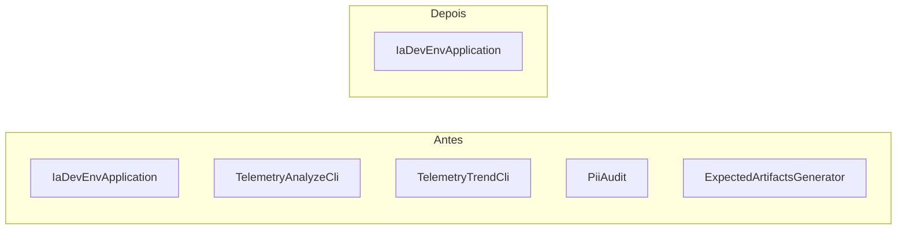

# História: Remover entry points `main()` extras do JAR

**ID:** story-0052-0005
**Chave Jira:** —
**Status:** Pendente

## 1. Dependências

| Blocked By | Blocks |
| :--- | :--- |
| story-0052-0002, story-0052-0003 | story-0052-0006, story-0052-0007 |

## 2. Regras Transversais Aplicáveis

| ID | Título |
| :--- | :--- |
| RULE-001 | Escopo de código Java |
| RULE-005 | Ordem topológica imutável |
| RULE-006 | Nenhuma feature nova |

## 3. Descrição

Como **mantenedor do `ia-dev-env`**, eu quero **que o JAR buildado exponha um único entry point (`IaDevEnvApplication`)**, garantindo que **o artefato de distribuição seja coerente com o escopo de "apenas gerador" definido na Rule 21**.

Hoje há 5 `public static void main(String[] args)` no código Java:

1. `dev.iadev.cli.IaDevEnvApplication` (KEEP — é o CLI público).
2. `dev.iadev.telemetry.analyze.TelemetryAnalyzeCli` (DELETE — skill agora usa `jq`).
3. `dev.iadev.telemetry.trend.TelemetryTrendCli` (DELETE).
4. `dev.iadev.telemetry.PiiAudit` (DELETE — auditoria PII vira regex shell, já existente no scrubber.sh).
5. `dev.iadev.smoke.ExpectedArtifactsGenerator` (DELETE — substituído pelos testes unitários de Assembler).

Esta história remove **apenas os 4 `main()` extras e sua infraestrutura imediata de entry point** (Picocli commands, arg parsing). Os pacotes que os contêm são deletados inteiros na story-0052-0006 e story-0052-0007 — esta é a prep para desacoplar o grafo de classes antes do `rm -rf` de pacote inteiro.

### 3.1 Escopo exato de remoção

- `TelemetryAnalyzeCli.java` + classes de suporte exclusivas ao CLI (args, subcomandos, `HelpCommand` se for específico).
- `TelemetryTrendCli.java` + idem.
- `PiiAudit.java` (classe única).
- `ExpectedArtifactsGenerator.java` (classe única).
- Seus testes espelho em `java/src/test/java/dev/iadev/**`.

### 3.2 Classes auxiliares que NÃO são removidas aqui

- `TelemetryScrubber`, `TelemetryWriter`, `MetadataWhitelist`, `TelemetryEvent` — usados como biblioteca por outros mains **só se estivessem presentes**; como os mains saem, essas classes ficam órfãs e são removidas junto da pasta inteira em story-0052-0007. Sinalizar nesse commit se forem referenciadas por código `[KEEP]` (não devem ser).
- `CollisionDetector`, `ExecutionState`, `SemVer` etc.: mantidos para story-0052-0006.

### 3.3 Build config

- Verificar `pom.xml` por plugin `maven-shade-plugin` ou `exec-maven-plugin` com `mainClass` apontando para qualquer dos 4 removidos. Limpar.
- Verificar `pom.xml` por `maven-assembly-plugin` entries que referenciem as classes deletadas. Limpar.
- Garantir que `java -jar target/ia-dev-env.jar` continua invocando `IaDevEnvApplication`.

## 3.5 Entrega de Valor

- **Valor Principal:** JAR único com um entry point único; distribuição, docs e troubleshooting simplificados.
- **Métrica de Sucesso:** `grep -r 'public static void main' java/src/main/java` retorna apenas `IaDevEnvApplication`; `mvn package && java -jar target/ia-dev-env.jar --help` mostra apenas `generate` e `validate`.
- **Impacto no Negócio:** Onboarding de novo contribuidor vê 1 entrada, não 5; confusão de escopo diminui.

## 4. Definições de Qualidade Locais

### DoR Local

- [ ] Story 0052-0002 e 0052-0003 concluídas (skills não dependem mais dos 4 CLIs extras).
- [ ] Inventário das 4 classes removidas + testes correspondentes.
- [ ] Verificado que não há outro consumidor no código `[KEEP]`.

### DoD Local

- [ ] `grep -r 'public static void main' java/src/main/java` retorna exatamente 1 match (`IaDevEnvApplication`).
- [ ] `mvn compile` verde sem os 4 arquivos.
- [ ] `mvn test` verde (testes dos 4 mains foram removidos junto).
- [ ] `java -jar target/ia-dev-env.jar --help` mostra o help correto.
- [ ] CHANGELOG.md atualizado com entrada "Removed: extra main() entry points (TelemetryAnalyzeCli, TelemetryTrendCli, PiiAudit, ExpectedArtifactsGenerator)".

## 5. Contratos de Dados (Artefatos)

### 5.1 Arquivos deletados

| Arquivo | Motivo |
| :--- | :--- |
| `java/src/main/java/dev/iadev/telemetry/analyze/TelemetryAnalyzeCli.java` | Skill reescrita em LLM+bash |
| `java/src/main/java/dev/iadev/telemetry/trend/TelemetryTrendCli.java` | Idem |
| `java/src/main/java/dev/iadev/telemetry/PiiAudit.java` | Auditoria via shell regex |
| `java/src/main/java/dev/iadev/smoke/ExpectedArtifactsGenerator.java` | Coberto por `AssemblerPipelineIT` existentes |
| Classes de suporte exclusivas a esses mains (arg parsers, HelpCommand locais) | Órfãs após remoção |
| Testes espelho em `java/src/test/java/dev/iadev/telemetry/analyze/**` etc. | Mesmo pacote |

### 5.2 Arquivos modificados

| Arquivo | Mudança |
| :--- | :--- |
| `java/pom.xml` | Remover `mainClass` ou `execution` references para as 4 classes |
| `CHANGELOG.md` | Entrada "Removed" |

### 5.3 Arquivos NÃO tocados

- `cli.IaDevEnvApplication` e seu teste.
- Resto do pacote `telemetry/` (scrubber, writer, etc. — removidos em story 0007).
- Classes `checkpoint/`, `release/`, etc. (removidas em story 0006/0007).

## 5.4 File Footprint

```
delete: java/src/main/java/dev/iadev/telemetry/analyze/**
delete: java/src/main/java/dev/iadev/telemetry/trend/**
delete: java/src/main/java/dev/iadev/telemetry/PiiAudit.java
delete: java/src/main/java/dev/iadev/smoke/ExpectedArtifactsGenerator.java
delete: java/src/test/java/dev/iadev/telemetry/analyze/**
delete: java/src/test/java/dev/iadev/telemetry/trend/**
delete: java/src/test/java/dev/iadev/telemetry/PiiAuditTest.java
delete: java/src/test/java/dev/iadev/smoke/ExpectedArtifactsGeneratorTest.java (se existir)
write:  java/pom.xml
write:  CHANGELOG.md
read:   java/src/main/java/dev/iadev/cli/IaDevEnvApplication.java (verificação)
```

## 6. Diagramas

### 6.1 Entry points antes/depois



## 7. Critérios de Aceite (Gherkin)

```gherkin
Cenario: Único main no código
  DADO que a história foi concluída
  QUANDO eu executo "grep -rn 'public static void main' java/src/main/java"
  ENTÃO o resultado contém exatamente 1 linha
  E a linha referencia "dev.iadev.cli.IaDevEnvApplication"

Cenario: JAR continua funcional
  DADO que o código foi limpo
  QUANDO eu executo "mvn -pl java package" e depois "java -jar java/target/ia-dev-env.jar --help"
  ENTÃO o help mostra "generate" e "validate" como subcomandos
  E não mostra referência a TelemetryAnalyzeCli nem aos demais removidos

Cenario: Compilação verde
  DADO que os 4 arquivos foram removidos
  QUANDO eu executo "mvn -pl java compile"
  ENTÃO o build termina com BUILD SUCCESS

Cenario: Testes verdes
  DADO que os testes espelho foram removidos
  QUANDO eu executo "mvn -pl java test"
  ENTÃO o build termina com BUILD SUCCESS
  E nenhum teste sobrevivente referencia as classes removidas

Cenario: Documentação atualizada
  DADO que a história foi concluída
  QUANDO eu inspeciono CHANGELOG.md (seção Unreleased)
  ENTÃO há entrada "Removed: extra main() entry points"
```

### 7.1 Scenario Ordering (TPP)

Degenerate (grep main) → happy path (JAR funciona) → error paths (build verde) → boundary (testes verdes) → doc.

### 7.2 Mandatory Scenario Categories

- [x] Degenerate (único main)
- [x] Happy path (JAR funciona)
- [x] Error paths (compilação)
- [x] Boundary values (testes; CHANGELOG)

### 7.3 TDD Implementation Notes

- Outer loop: teste que roda `grep` em build pipeline e falha se > 1 main.
- Inner loops: unit test já não aplicável (classes removidas); regressão via suite existente.

## 8. Tasks

### TASK-0052-0005-001: Inventário e verificação de consumidores

- **Layer:** Doc
- **Test Type:** Verification
- **Size:** S
- **Dependencies:** —
- **Branch:** `feat/task-0052-0005-001-inventory`
- **Testability:** Config + VerificationTest
- **Files:**
  - `plans/epic-0052/notes/removal-inventory.md` (nota de trabalho)
- **Acceptance Criteria:**
  - [ ] Lista completa das 4 classes + testes.
  - [ ] Confirmado que nenhum `[KEEP]` importa esses símbolos.

### TASK-0052-0005-002: Deletar `TelemetryAnalyzeCli` + teste

- **Layer:** Delete
- **Test Type:** Verification
- **Size:** S
- **Dependencies:** TASK-0052-0005-001
- **Branch:** `feat/task-0052-0005-002-delete-analyze-cli`
- **Testability:** Config + VerificationTest
- **Files:**
  - `java/src/main/java/dev/iadev/telemetry/analyze/**`
  - `java/src/test/java/dev/iadev/telemetry/analyze/**`
- **Acceptance Criteria:**
  - [ ] `mvn compile` verde após deleção.
  - [ ] `mvn test` verde.

### TASK-0052-0005-003: Deletar `TelemetryTrendCli` + teste

- **Layer:** Delete
- **Test Type:** Verification
- **Size:** S
- **Dependencies:** TASK-0052-0005-002
- **Branch:** `feat/task-0052-0005-003-delete-trend-cli`
- **Testability:** Config + VerificationTest
- **Files:**
  - `java/src/main/java/dev/iadev/telemetry/trend/**`
  - `java/src/test/java/dev/iadev/telemetry/trend/**`
- **Acceptance Criteria:**
  - [ ] Build verde.

### TASK-0052-0005-004: Deletar `PiiAudit` + teste

- **Layer:** Delete
- **Test Type:** Verification
- **Size:** S
- **Dependencies:** TASK-0052-0005-003
- **Branch:** `feat/task-0052-0005-004-delete-pii-audit`
- **Testability:** Config + VerificationTest
- **Files:**
  - `java/src/main/java/dev/iadev/telemetry/PiiAudit.java`
  - `java/src/test/java/dev/iadev/telemetry/PiiAuditTest.java`
  - `java/src/test/java/dev/iadev/telemetry/PiiAuditSmokeIT.java`
- **Acceptance Criteria:**
  - [ ] Build verde.
  - [ ] CI (se houver gate PiiAudit no pipeline gerado) é ajustado em story-0052-0008.

### TASK-0052-0005-005: Deletar `ExpectedArtifactsGenerator`

- **Layer:** Delete
- **Test Type:** Verification
- **Size:** S
- **Dependencies:** TASK-0052-0005-004
- **Branch:** `feat/task-0052-0005-005-delete-expected-artifacts`
- **Testability:** Config + VerificationTest
- **Files:**
  - `java/src/main/java/dev/iadev/smoke/ExpectedArtifactsGenerator.java`
- **Acceptance Criteria:**
  - [ ] Build verde.

### TASK-0052-0005-006: Atualizar `pom.xml` + CHANGELOG

- **Layer:** Config
- **Test Type:** Verification
- **Size:** S
- **Dependencies:** TASK-0052-0005-002 a 005
- **Branch:** `feat/task-0052-0005-006-pom-changelog`
- **Testability:** Config + VerificationTest
- **Files:**
  - `java/pom.xml`
  - `CHANGELOG.md`
- **Acceptance Criteria:**
  - [ ] `mvn package` produz JAR único com main = `IaDevEnvApplication`.
  - [ ] CHANGELOG tem entrada Removed.
