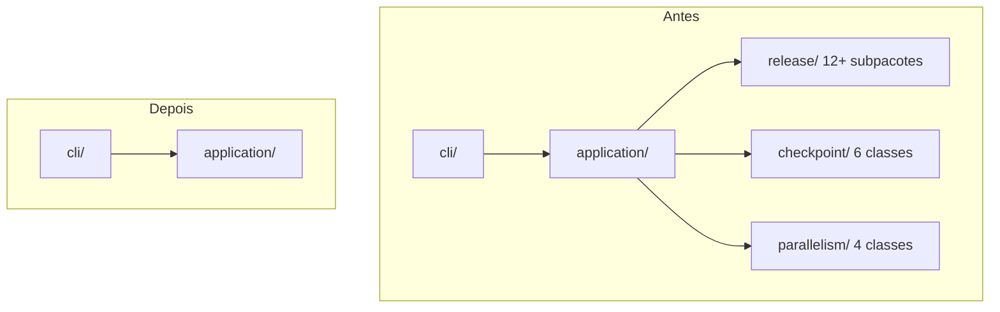

# História: Deletar pacotes `release`, `checkpoint`, `parallelism`

**ID:** story-0052-0006
**Chave Jira:** —
**Status:** Pendente

## 1. Dependências

| Blocked By | Blocks |
| :--- | :--- |
| story-0052-0003, story-0052-0004, story-0052-0005 | story-0052-0008 |

## 2. Regras Transversais Aplicáveis

| ID | Título |
| :--- | :--- |
| RULE-001 | Escopo de código Java |
| RULE-005 | Ordem topológica imutável |
| RULE-006 | Nenhuma feature nova |

## 3. Descrição

Como **mantenedor**, eu quero **remover integralmente os pacotes `release`, `checkpoint` e `parallelism` do código Java**, garantindo que **o JAR deixe de conter ~30 classes fora de escopo sem impactar o comportamento do comando `generate`**.

Esta história é **irreversível por natureza** (deleção em massa). Depende de:

- story-0052-0003 (skill `x-release` já não invoca `dev.iadev.release.*`).
- story-0052-0004 (skills `*-implement` já não invocam `dev.iadev.checkpoint.*`).
- story-0052-0005 (entry points extras já removidos; nenhum `main()` órfão referencia essas classes).

Uma verificação via `grep -r 'dev\.iadev\.(release|checkpoint|parallelism)\.' java/src/main/java` + resources DEVE retornar **zero matches em código `[KEEP]`** antes do commit de deleção.

### 3.1 Pacote `release/`

Estrutura atual (ver `ls java/src/main/java/dev/iadev/release/`):

- `SemVer.java`, `BumpType.java`, `BumpRestriction.java`, `InvalidBumpException.java`, `VersionBumper.java`
- `ConventionalCommitsParser.java`, `CommitCounts.java`
- `ReleaseContext.java`, `GitTagReader.java`, `TagReader.java`
- `HotfixInvalidCommitsException.java`, `HotfixVersionNotPatchException.java`
- Subpacotes: `abort/`, `changelog/`, `dryrun/`, `handoff/`, `integrity/`, `preflight/`, `prompt/`, `resume/`, `state/`, `status/`, `summary/`, `telemetry/`
- Total estimado: ~60–80 arquivos Java (incluindo subpacotes e testes).

### 3.2 Pacote `checkpoint/`

- `CheckpointEngine.java`, `ExecutionState.java`, `StoryEntry.java`, `TaskEntry.java`
- `FileCheckpointStore.java`, `JacksonCheckpointPersistence.java`
- `SchemaVersionResolver.java` (se estiver neste pacote — pode estar em `domain.schemaversion`; verificar e mover a remoção apropriada)
- Testes espelho.

### 3.3 Pacote `parallelism/`

- `CollisionDetector.java`, `ParallelismEvaluator.java`, `FileFootprint.java`, `HotspotCatalog.java`
- `ParallelEvalCli.java` (se ainda existir — deve ter saído com story-0052-0005)
- Testes espelho.

### 3.4 Domain SchemaVersionResolver

Conforme Rule 19, `SchemaVersionResolver` vive em `dev.iadev.domain.schemaversion`. Esta classe é DOMÍNIO e pertenceria a categoria `[KEEP]`, mas só é usada pelas skills `*-implement` (que agora fazem o resolver em bash+LLM). Avaliar em runtime:

- Se ainda é chamada por `application/` ou `cli/`: **mantém**.
- Se só era chamada por `checkpoint/` (que sai): **remove junto**.

A Rule 19 é preservada como documentação normativa, mas seu enforcement migra do Java (`SchemaVersionResolver`) para o LLM (skill executando a tabela de decisão).

### 3.5 Ordem de remoção sugerida (sub-histórias)

1. Remover `parallelism/` (menor, mais isolado).
2. Remover `release/` (maior, mais subpacotes).
3. Remover `checkpoint/` + avaliar `SchemaVersionResolver`.

Cada sub-remoção é um commit separado (atomicidade via TASKs).

## 3.5 Entrega de Valor

- **Valor Principal:** ~30 classes Java + testes espelho deletados; tamanho do JAR reduz; foco do repositório volta a ser geração.
- **Métrica de Sucesso:** `grep -r 'dev\.iadev\.(release|checkpoint|parallelism)' java/src/main/java` retorna 0 matches; `mvn verify` verde; `generate` nas 18 stacks byte-idêntico aos golden files.
- **Impacto no Negócio:** Desenvolvedor novo vê código focado; tempo de build diminui; superfície de vulnerabilidade diminui.

## 4. Definições de Qualidade Locais

### DoR Local

- [ ] Stories 0052-0003, 0052-0004, 0052-0005 concluídas.
- [ ] Grep confirmando zero referências em código `[KEEP]`.

### DoD Local

- [ ] Diretórios `java/src/main/java/dev/iadev/{release,checkpoint,parallelism}/` não existem.
- [ ] Diretórios `java/src/test/java/dev/iadev/{release,checkpoint,parallelism}/` não existem.
- [ ] `mvn verify` verde (coverage ≥ 95% no escopo remanescente).
- [ ] Smoke 18 stacks: golden files dos Assemblers categoria A byte-idênticos.
- [ ] CHANGELOG atualizado: "Removed: dev.iadev.release, dev.iadev.checkpoint, dev.iadev.parallelism packages".

## 5. Contratos de Dados (Artefatos)

### 5.1 Arquivos deletados

- Todo conteúdo recursivo de `java/src/main/java/dev/iadev/release/`.
- Todo conteúdo recursivo de `java/src/main/java/dev/iadev/checkpoint/`.
- Todo conteúdo recursivo de `java/src/main/java/dev/iadev/parallelism/`.
- Idem em `java/src/test/java/dev/iadev/**`.
- `domain/schemaversion/SchemaVersionResolver.java` se não usado por `[KEEP]`.

### 5.2 Arquivos modificados

| Arquivo | Mudança |
| :--- | :--- |
| `java/pom.xml` | Remover deps Maven órfãs (Jackson específico se era só para checkpoint; etc.) |
| `CHANGELOG.md` | Entrada Removed |
| Possivelmente alguma referência em `application.*Step` | Remover import ou substituir por stub se for inofensivo |

### 5.3 Arquivos NÃO tocados

- `dev.iadev.{cli,config,domain,application,template,infrastructure,exception,util}/` (exceto remoção incidental de imports).
- Skills `.md` (já reescritas nas stories anteriores).
- Rules.

## 5.4 File Footprint

```
delete: java/src/main/java/dev/iadev/release/**
delete: java/src/main/java/dev/iadev/checkpoint/**
delete: java/src/main/java/dev/iadev/parallelism/**
delete: java/src/test/java/dev/iadev/release/**
delete: java/src/test/java/dev/iadev/checkpoint/**
delete: java/src/test/java/dev/iadev/parallelism/**
write:  java/pom.xml (deps órfãs)
write:  CHANGELOG.md
read:   java/src/main/java/dev/iadev/application/**  (verificação de refs)
```

## 6. Diagramas

### 6.1 Grafo de imports antes/depois



## 7. Critérios de Aceite (Gherkin)

```gherkin
Cenario: Diretórios removidos
  DADO que a história foi concluída
  QUANDO eu executo "test -d java/src/main/java/dev/iadev/release"
  ENTÃO exit code != 0
  E o mesmo para checkpoint e parallelism

Cenario: Grep não encontra imports órfãos
  DADO que os pacotes foram removidos
  QUANDO eu executo "rg 'dev\\.iadev\\.(release|checkpoint|parallelism)' java/src/main/java"
  ENTÃO o resultado é vazio

Cenario: Build verde
  DADO que os pacotes foram removidos
  QUANDO eu executo "mvn -pl java verify"
  ENTÃO o resultado é BUILD SUCCESS
  E coverage ≥ 95% line, ≥ 90% branch

Cenario: Smoke 18 stacks preserva output
  DADO que os pacotes foram removidos
  QUANDO eu executo generate para cada uma das 18 stacks
  ENTÃO o output é byte-idêntico aos golden files existentes para Assemblers categoria A

Cenario: CHANGELOG registra a remoção
  DADO que a história foi concluída
  QUANDO eu inspeciono CHANGELOG.md
  ENTÃO a seção Unreleased contém "Removed: dev.iadev.release, dev.iadev.checkpoint, dev.iadev.parallelism packages"
```

### 7.1 Scenario Ordering (TPP)

Degenerate (dirs removidos) → grep limpo → build verde → smoke 18 stacks → doc.

### 7.2 Mandatory Scenario Categories

- [x] Degenerate
- [x] Happy path
- [x] Error paths (build verde)
- [x] Boundary values (smoke 18 stacks)

### 7.3 TDD Implementation Notes

- Outer loop: smoke 18 stacks comparando golden (teste de regressão da geração).
- Inner loops: n/a (remoção em massa; testes de suite existente cobrem).

## 8. Tasks

### TASK-0052-0006-001: Verificar referências remanescentes em `[KEEP]`

- **Layer:** Doc
- **Test Type:** Verification
- **Size:** S
- **Dependencies:** —
- **Branch:** `feat/task-0052-0006-001-verify-refs`
- **Testability:** Config + VerificationTest
- **Files:**
  - `plans/epic-0052/notes/ref-audit.md`
- **Acceptance Criteria:**
  - [ ] Grep report mostrando zero referências em `[KEEP]`.

### TASK-0052-0006-002: Deletar pacote `parallelism/`

- **Layer:** Delete
- **Test Type:** Verification
- **Size:** M
- **Dependencies:** TASK-0052-0006-001
- **Branch:** `feat/task-0052-0006-002-delete-parallelism`
- **Testability:** Config + VerificationTest
- **Files:**
  - `java/src/main/java/dev/iadev/parallelism/**`
  - `java/src/test/java/dev/iadev/parallelism/**`
- **Acceptance Criteria:**
  - [ ] `mvn compile` verde.
  - [ ] `mvn test` verde.

### TASK-0052-0006-003: Deletar pacote `release/`

- **Layer:** Delete
- **Test Type:** Verification
- **Size:** L
- **Dependencies:** TASK-0052-0006-002
- **Branch:** `feat/task-0052-0006-003-delete-release`
- **Testability:** Config + VerificationTest
- **Files:**
  - `java/src/main/java/dev/iadev/release/**`
  - `java/src/test/java/dev/iadev/release/**`
- **Acceptance Criteria:**
  - [ ] Build verde.
  - [ ] `pom.xml` deps ajustadas.

### TASK-0052-0006-004: Deletar pacote `checkpoint/` e avaliar `SchemaVersionResolver`

- **Layer:** Delete
- **Test Type:** Verification
- **Size:** M
- **Dependencies:** TASK-0052-0006-003
- **Branch:** `feat/task-0052-0006-004-delete-checkpoint`
- **Testability:** Config + VerificationTest
- **Files:**
  - `java/src/main/java/dev/iadev/checkpoint/**`
  - `java/src/test/java/dev/iadev/checkpoint/**`
  - `java/src/main/java/dev/iadev/domain/schemaversion/SchemaVersionResolver.java` (condicional)
- **Acceptance Criteria:**
  - [ ] `SchemaVersionResolver` removido se órfão, preservado se consumido por `[KEEP]`.
  - [ ] Build verde.

### TASK-0052-0006-005: Atualizar CHANGELOG

- **Layer:** Doc
- **Test Type:** Verification
- **Size:** S
- **Dependencies:** TASK-0052-0006-004
- **Branch:** `feat/task-0052-0006-005-changelog`
- **Testability:** Config + VerificationTest
- **Files:**
  - `CHANGELOG.md`
- **Acceptance Criteria:**
  - [ ] Entrada Removed correta.

### TASK-0052-0006-006: Smoke 18 stacks

- **Layer:** Test
- **Test Type:** Smoke
- **Size:** M
- **Dependencies:** TASK-0052-0006-004
- **Branch:** `feat/task-0052-0006-006-smoke`
- **Testability:** Migration + Smoke
- **Files:**
  - `java/src/test/java/dev/iadev/application/AssemblerPipelineSmokeIT.java` (se já existir, executar)
- **Acceptance Criteria:**
  - [ ] Todos os 18 stacks passam com golden byte-idêntico nos Assemblers categoria A.
