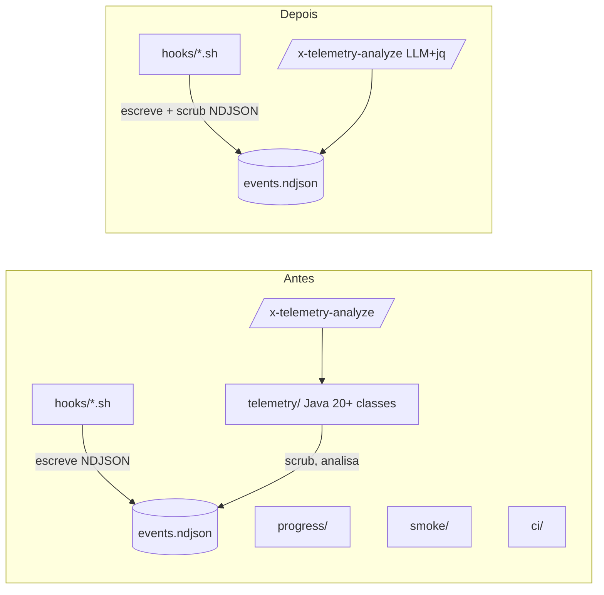

# História: Deletar pacotes `progress`, `telemetry` (Java), `smoke`, `ci`

**ID:** story-0052-0007
**Chave Jira:** —
**Status:** Pendente

## 1. Dependências

| Blocked By | Blocks |
| :--- | :--- |
| story-0052-0002, story-0052-0005 | story-0052-0008 |

## 2. Regras Transversais Aplicáveis

| ID | Título |
| :--- | :--- |
| RULE-001 | Escopo de código Java |
| RULE-004 | Hooks shell são preservados |
| RULE-006 | Nenhuma feature nova |

## 3. Descrição

Como **mantenedor**, eu quero **remover os pacotes Java `progress`, `telemetry`, `smoke` e `ci`**, garantindo que **~25 classes adicionais fora de escopo saiam do JAR, enquanto os hooks shell de telemetria permanecem intactos capturando NDJSON**.

Esta história é paralela à story-0052-0006 (remoção de `release`/`checkpoint`/`parallelism`). Depende de:

- story-0052-0002 (skills de telemetria não invocam mais Java).
- story-0052-0005 (entry points extras `TelemetryAnalyzeCli`, `TelemetryTrendCli`, `PiiAudit`, `ExpectedArtifactsGenerator` já removidos — essa story é que remove o **restante dos pacotes**).

### 3.1 Pacote `progress/`

- `ProgressReporter.java`, `ProgressFormatter.java`, `MetricsCalculator.java`
- Testes espelho.

### 3.2 Pacote `telemetry/` (Java side)

Após story-0052-0005, `telemetry/analyze/`, `telemetry/trend/` e `PiiAudit.java` já saíram. Sobra:

- `TelemetryEvent.java`, `TelemetryWriter.java`, `TelemetryScrubber.java`, `MetadataWhitelist.java`, `TelemetryJson.java`
- `TelemetryTrendAnalyzer.java`, `RegressionDetector.java` (se ainda existirem)
- Eventuais subpacotes (`persistence/`, `regression/`, etc.)
- Testes espelho (incluindo `TelemetryScrubberFuzzTest`, fixtures `pii-corpus.txt`).

**Decisão sobre fixtures**: `java/src/test/resources/fixtures/telemetry/pii-corpus.txt` pode ser preservado se algum teste de hook shell o consumir (via `jq`/`grep`). Avaliar; padrão: remover.

### 3.3 Pacote `smoke/`

Após story-0052-0005, `ExpectedArtifactsGenerator.java` saiu. Sobra:

- `FileTreeWalker.java`, `ProfileArtifacts.java`
- Helpers internos.
- Testes espelho.

### 3.4 Pacote `ci/`

- `TelemetryMarkerLint.java`
- Teste `TelemetryMarkerLintTest.java`.

### 3.5 Rule 20 — avaliação

A Rule 20 (`.claude/rules/20-telemetry-privacy.md`) hoje cita `TelemetryScrubber` e `MetadataWhitelist` como mecanismos enforçadores. Após esta história:

- **Cenário A** (scrubber shell já existe em `telemetry-emit.sh`): Rule 20 é atualizada para apontar **apenas** para o scrubber shell; mantém semântica.
- **Cenário B** (scrubber shell não existe): criar scrubber shell equivalente antes de remover `TelemetryScrubber.java`. **Bloqueia** a remoção de `telemetry/` Java até scrubber shell estar publicado.

Avaliar durante a execução. Rule 20 NÃO sai (privacidade do NDJSON continua importando).

### 3.6 Hooks shell — preservação

Os scripts `telemetry-emit.sh`, `telemetry-lib.sh`, `telemetry-phase.sh`, `telemetry-session-start.sh`, `telemetry-pretool.sh`, `telemetry-posttool.sh`, `telemetry-subagentstop.sh`, `telemetry-stop.sh` (ou similares) em `java/src/main/resources/targets/claude/hooks/` são **shell puro** e não são tocados. Continuam escrevendo `plans/epic-*/telemetry/events.ndjson`.

## 3.5 Entrega de Valor

- **Valor Principal:** ~25 classes Java + testes removidos. JAR minimizado ao escopo gerador. Hooks shell continuam emitindo telemetria e skills reescritas continuam analisando.
- **Métrica de Sucesso:** `grep -r 'dev\.iadev\.(progress|telemetry|smoke|ci)' java/src/main/java` retorna 0 matches; hooks shell em `resources/targets/claude/hooks/` intactos; nova conversa ainda emite eventos NDJSON.
- **Impacto no Negócio:** Foco do repositório claramente gerador; observabilidade preservada por outra via.

## 4. Definições de Qualidade Locais

### DoR Local

- [ ] Stories 0052-0002 e 0052-0005 concluídas.
- [ ] Rule 20 avaliada; scrubber shell confirmado ou criado se necessário.

### DoD Local

- [ ] Diretórios `progress/`, `telemetry/`, `smoke/`, `ci/` removidos em `java/src/main/java/dev/iadev/`.
- [ ] Idem em `java/src/test/java/dev/iadev/`.
- [ ] Hooks shell em `resources/targets/claude/hooks/` byte-idênticos ao baseline.
- [ ] Rule 20 atualizada se necessário.
- [ ] `mvn verify` verde.
- [ ] Smoke 18 stacks: golden files dos Assemblers categoria A byte-idênticos.
- [ ] CHANGELOG entrada Removed.

## 5. Contratos de Dados (Artefatos)

### 5.1 Arquivos deletados

- `java/src/main/java/dev/iadev/progress/**`
- `java/src/main/java/dev/iadev/telemetry/**` (resto após story-0052-0005)
- `java/src/main/java/dev/iadev/smoke/**` (resto após story-0052-0005)
- `java/src/main/java/dev/iadev/ci/**`
- Idem em `java/src/test/java/dev/iadev/**`.
- Fixtures `pii-corpus.txt` etc. (condicional).

### 5.2 Arquivos modificados

| Arquivo | Mudança |
| :--- | :--- |
| `java/pom.xml` | Remover deps órfãs (Jackson específico de telemetria, Gson de NDJSON, etc.) |
| `java/src/main/resources/targets/claude/rules/20-telemetry-privacy.md` | Apontar para scrubber shell (se necessário) |
| `CHANGELOG.md` | Entrada Removed |

### 5.3 Arquivos NÃO tocados

- Hooks shell `.sh` em `resources/targets/claude/hooks/`.
- Rule 20 — caminho preservado, apenas conteúdo atualizado.
- Pacotes `[KEEP]`.

## 5.4 File Footprint

```
delete: java/src/main/java/dev/iadev/progress/**
delete: java/src/main/java/dev/iadev/telemetry/**
delete: java/src/main/java/dev/iadev/smoke/**
delete: java/src/main/java/dev/iadev/ci/**
delete: java/src/test/java/dev/iadev/progress/**
delete: java/src/test/java/dev/iadev/telemetry/**
delete: java/src/test/java/dev/iadev/smoke/**
delete: java/src/test/java/dev/iadev/ci/**
write:  java/pom.xml
write:  java/src/main/resources/targets/claude/rules/20-telemetry-privacy.md (conditional)
write:  CHANGELOG.md
regen:  .claude/rules/20-telemetry-privacy.md (if rule changed)
regen:  java/src/test/resources/golden/**/rules/20-telemetry-privacy.md
read:   java/src/main/resources/targets/claude/hooks/telemetry-emit.sh  (verificar scrubber shell)
```

## 6. Diagramas

### 6.1 Antes/depois



## 7. Critérios de Aceite (Gherkin)

```gherkin
Cenario: Diretórios Java removidos
  DADO que a história foi concluída
  QUANDO eu executo "test -d java/src/main/java/dev/iadev/progress" (e telemetry, smoke, ci)
  ENTÃO exit code != 0 para todos os 4

Cenario: Hooks shell intactos
  DADO que os pacotes Java foram removidos
  QUANDO eu comparo os arquivos .sh em resources/targets/claude/hooks/ com o baseline pre-história
  ENTÃO o diff é vazio

Cenario: Build verde
  DADO que os pacotes foram removidos
  QUANDO eu executo "mvn -pl java verify"
  ENTÃO BUILD SUCCESS
  E coverage ≥ 95% line, ≥ 90% branch

Cenario: NDJSON continua sendo emitido
  DADO que os pacotes Java foram removidos
  E que uma conversa Claude Code é iniciada nesse projeto
  QUANDO a conversa executa uma tool call
  ENTÃO plans/epic-XXXX/telemetry/events.ndjson ganha uma linha NDJSON válida
  E o valor é scrubbed conforme Rule 20

Cenario: Rule 20 atualizada se necessário
  DADO que TelemetryScrubber.java foi removido
  QUANDO inspeciono .claude/rules/20-telemetry-privacy.md
  ENTÃO a rule NÃO menciona dev.iadev.telemetry.TelemetryScrubber como enforcer
  E menciona o scrubber shell em telemetry-emit.sh (se for o cenário A)
```

### 7.1 Scenario Ordering (TPP)

Degenerate (dirs removidos) → hooks intactos → build verde → NDJSON sobrevive → rule atualizada.

### 7.2 Mandatory Scenario Categories

- [x] Degenerate
- [x] Happy path (hooks intactos)
- [x] Error paths (build verde)
- [x] Boundary values (NDJSON emite; rule atualizada)

### 7.3 TDD Implementation Notes

- Outer loop: smoke NDJSON emit after remoção.
- Inner loops: n/a.

## 8. Tasks

### TASK-0052-0007-001: Avaliar scrubber shell + atualizar Rule 20

- **Layer:** Config
- **Test Type:** Verification
- **Size:** M
- **Dependencies:** —
- **Branch:** `feat/task-0052-0007-001-scrubber-shell-audit`
- **Testability:** Config + VerificationTest
- **Files:**
  - `java/src/main/resources/targets/claude/hooks/telemetry-emit.sh` (inspeção; se faltar scrubber, adicionar)
  - `java/src/main/resources/targets/claude/rules/20-telemetry-privacy.md` (atualização)
- **Acceptance Criteria:**
  - [ ] `telemetry-emit.sh` implementa os 8 padrões mínimos de redação (Rule 20 §2).
  - [ ] Rule 20 aponta para o scrubber shell.

### TASK-0052-0007-002: Deletar `progress/`

- **Layer:** Delete
- **Test Type:** Verification
- **Size:** S
- **Dependencies:** TASK-0052-0007-001
- **Branch:** `feat/task-0052-0007-002-delete-progress`
- **Testability:** Config + VerificationTest
- **Files:**
  - `java/src/main/java/dev/iadev/progress/**`
  - `java/src/test/java/dev/iadev/progress/**`
- **Acceptance Criteria:**
  - [ ] Build verde.

### TASK-0052-0007-003: Deletar restante de `telemetry/`

- **Layer:** Delete
- **Test Type:** Verification
- **Size:** M
- **Dependencies:** TASK-0052-0007-001
- **Branch:** `feat/task-0052-0007-003-delete-telemetry-java`
- **Testability:** Config + VerificationTest
- **Files:**
  - `java/src/main/java/dev/iadev/telemetry/**`
  - `java/src/test/java/dev/iadev/telemetry/**`
  - `java/src/test/resources/fixtures/telemetry/pii-corpus.txt` (condicional)
- **Acceptance Criteria:**
  - [ ] Build verde.
  - [ ] NDJSON emit continua funcional em smoke test.

### TASK-0052-0007-004: Deletar `smoke/`

- **Layer:** Delete
- **Test Type:** Verification
- **Size:** S
- **Dependencies:** TASK-0052-0007-003
- **Branch:** `feat/task-0052-0007-004-delete-smoke`
- **Testability:** Config + VerificationTest
- **Files:**
  - `java/src/main/java/dev/iadev/smoke/**`
  - `java/src/test/java/dev/iadev/smoke/**`
- **Acceptance Criteria:**
  - [ ] Build verde.

### TASK-0052-0007-005: Deletar `ci/`

- **Layer:** Delete
- **Test Type:** Verification
- **Size:** S
- **Dependencies:** TASK-0052-0007-004
- **Branch:** `feat/task-0052-0007-005-delete-ci`
- **Testability:** Config + VerificationTest
- **Files:**
  - `java/src/main/java/dev/iadev/ci/**`
  - `java/src/test/java/dev/iadev/ci/**`
- **Acceptance Criteria:**
  - [ ] Build verde.

### TASK-0052-0007-006: Atualizar `pom.xml` + CHANGELOG + regenerar goldens

- **Layer:** Config
- **Test Type:** Smoke
- **Size:** S
- **Dependencies:** TASK-0052-0007-002 a 005
- **Branch:** `feat/task-0052-0007-006-pom-changelog-goldens`
- **Testability:** Migration + Smoke
- **Files:**
  - `java/pom.xml`
  - `CHANGELOG.md`
  - `java/src/test/resources/golden/**/rules/20-telemetry-privacy.md`
- **Acceptance Criteria:**
  - [ ] Goldens regenerados; `*Golden*` verdes.
  - [ ] Smoke emit NDJSON validado.
