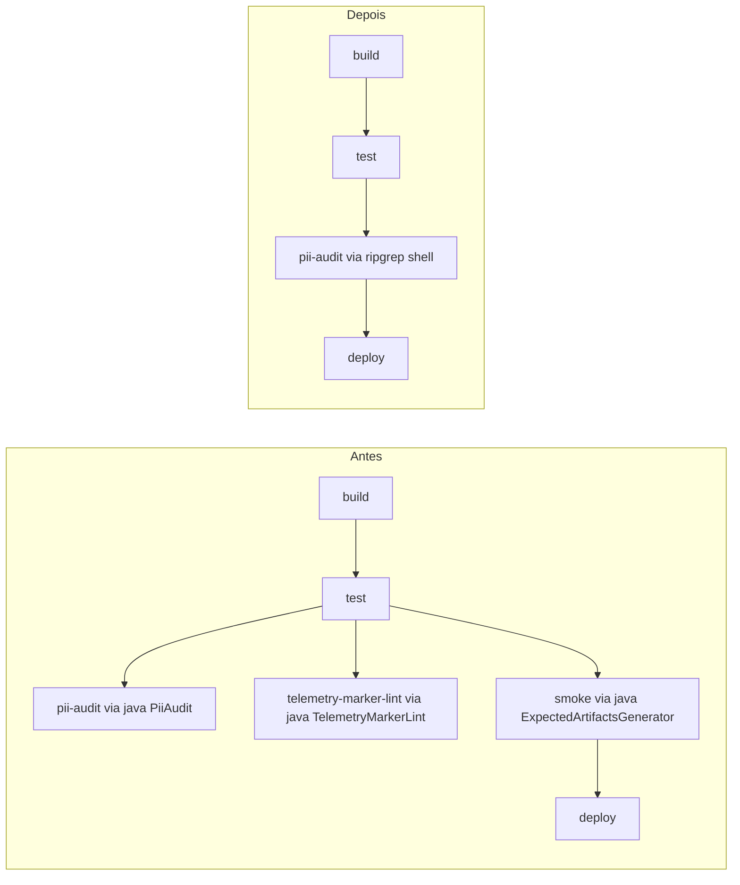

# História: Simplificar `CicdAssembler` e auditar Assemblers categoria B

**ID:** story-0052-0008
**Chave Jira:** —
**Status:** Pendente

## 1. Dependências

| Blocked By | Blocks |
| :--- | :--- |
| story-0052-0006, story-0052-0007 | story-0052-0009 |

## 2. Regras Transversais Aplicáveis

| ID | Título |
| :--- | :--- |
| RULE-002 | Contrato do comando `generate` é invariante |
| RULE-006 | Nenhuma feature nova |

## 3. Descrição

Como **usuário do `ia-dev-env`**, eu quero **que os workflows CI/CD gerados (`.github/workflows/*.yml`, `Dockerfile`, `docker-compose.yml`, `k8s/**`) parem de referenciar classes Java que deixaram de existir**, garantindo que **os projetos gerados tenham pipelines funcionais sem dependência do JAR `ia-dev-env`**.

Hoje o `CicdAssembler` e seus 6 step-classes (`CicdBuildStep`, `CicdSecurityStep`, `CicdReleaseStep`, etc.) orquestram a geração de CI/CD referenciando em alguns workflows classes Java removidas:

- `PiiAudit` (gate de privacidade de telemetria).
- `TelemetryMarkerLint` (gate de marcadores de skill).
- `ExpectedArtifactsGenerator` (gate de smoke).

Essas referências estão nos **templates dos workflows** em `java/src/main/resources/shared/cicd-templates/`. A substituição é:

- **Gate PiiAudit** → remover step ou substituir por `rg 'AKIA|ghp_|eyJ[A-Za-z0-9_-]+\.eyJ'` em `plans/epic-*/telemetry/events.ndjson` (regex shell).
- **Gate TelemetryMarkerLint** → remover (marcadores são validados em code review manual; gate era guloso demais).
- **Gate ExpectedArtifactsGenerator** → substituir por smoke shell (rodar `generate` em 1–2 stacks representativas e comparar com golden files).

### 3.1 Assemblers categoria B — auditoria

| Assembler | Decisão esperada |
| :--- | :--- |
| `CicdAssembler` | **Simplificar** — remover 3 gates acima dos templates. |
| `EpicReportAssembler` | **Auditar** — se for só `.md` template copy com placeholders `{{PLACEHOLDER}}` resolvidos por LLM em runtime, **manter**. Se ainda embutir lógica dependente de classes removidas, **ajustar**. |
| `ReleaseChecklistAssembler` | **Auditar** — template `.md` checklist de release. Se mencionar `x-release` como Java CLI, ajustar; se for neutro, manter. |
| `PlanTemplatesAssembler` | **Manter** — 20 templates `.md` puros com placeholders runtime (resolvidos pelo LLM durante execução da skill, não build-time). |

### 3.2 Substituições concretas nos templates CI/CD

- **GitHub Actions** (`shared/cicd-templates/github-actions/*.yml`): remover `jobs.security-telemetry-lint`, `jobs.smoke-expected-artifacts`, `jobs.pii-audit`.
- **Substituir por**:
  ```yaml
  pii-audit-shell:
    runs-on: ubuntu-latest
    steps:
      - uses: actions/checkout@v4
      - name: Scan NDJSON for common secret patterns
        run: |
          if find plans -path '*/telemetry/events.ndjson' -print -quit | grep -q . ; then
            ! rg -q '(AKIA[0-9A-Z]{16}|ghp_[A-Za-z0-9]{36,}|eyJ[A-Za-z0-9_-]+\.eyJ[A-Za-z0-9_-]+\.[A-Za-z0-9_-]+)' plans/**/telemetry/events.ndjson
          fi
  ```
- **GitLab CI / Azure DevOps** idem.

### 3.3 Invariante de output

- Para os 19 Assemblers categoria A, output **byte-idêntico** aos golden files pré-épico.
- Para o `CicdAssembler` (categoria B, simplificado), golden files **serão atualizados** — a diff é esperada e documentada na story.

## 3.5 Entrega de Valor

- **Valor Principal:** Projetos gerados pelo `ia-dev-env` têm pipelines CI/CD funcionais sem dependência do JAR do gerador.
- **Métrica de Sucesso:** `rg 'PiiAudit|TelemetryMarkerLint|ExpectedArtifactsGenerator' .claude/ .github/ Dockerfile` em projeto gerado retorna 0 matches. Workflow gerado roda em GitHub Actions sintético sem erro de classe não encontrada.
- **Impacto no Negócio:** Removido ruído de "classe não encontrada" em CI de projetos que consomem `ia-dev-env`; tempo até primeiro CI verde em projeto novo diminui.

## 4. Definições de Qualidade Locais

### DoR Local

- [ ] Stories 0052-0006 e 0052-0007 concluídas (classes Java removidas).
- [ ] Inventário das referências em templates CI/CD documentado.
- [ ] Decisão sobre `EpicReportAssembler` / `ReleaseChecklistAssembler` confirmada via auditoria.

### DoD Local

- [ ] Nenhum template `shared/cicd-templates/**` referencia classes Java removidas.
- [ ] `CicdAssembler` e step-classes compilam sem imports órfãos.
- [ ] Golden files atualizados para os Assemblers categoria B afetados.
- [ ] `mvn verify` verde.
- [ ] Smoke 18 stacks: Assemblers categoria A byte-idênticos; Assemblers categoria B produzem novo golden consistente.

## 5. Contratos de Dados (Artefatos)

### 5.1 Arquivos modificados

| Arquivo | Mudança |
| :--- | :--- |
| `java/src/main/resources/shared/cicd-templates/github-actions/*.yml` | Remover jobs referenciando classes Java removidas; adicionar shell alternativo para pii-audit |
| `java/src/main/resources/shared/cicd-templates/gitlab-ci/*.yml` | Idem |
| `java/src/main/resources/shared/cicd-templates/azure-devops/*.yml` | Idem |
| `java/src/main/java/dev/iadev/application/assembler/CicdAssembler.java` + step-classes | Remover imports órfãos; simplificar lógica condicional |
| `java/src/test/resources/golden/**/github/workflows/*.yml` | Goldens atualizados |
| `java/src/test/resources/golden/**/Dockerfile` | Idem |
| `CHANGELOG.md` | Entrada Changed |

### 5.2 Arquivos NÃO tocados

- Assemblers categoria A (19 itens).
- Hooks shell.
- Skills.
- Rules (exceto Rule 20 já tratada em story-0007).

## 5.4 File Footprint

```
write: java/src/main/resources/shared/cicd-templates/**
write: java/src/main/java/dev/iadev/application/assembler/CicdAssembler.java
write: java/src/main/java/dev/iadev/application/assembler/Cicd*Step.java
write: java/src/main/java/dev/iadev/application/assembler/EpicReportAssembler.java (condicional)
write: java/src/main/java/dev/iadev/application/assembler/ReleaseChecklistAssembler.java (condicional)
regen: java/src/test/resources/golden/**/github/workflows/*.yml
regen: java/src/test/resources/golden/**/Dockerfile
regen: java/src/test/resources/golden/**/.gitlab-ci.yml
read:  plans/epic-0052/notes/ref-audit.md
```

## 6. Diagramas

### 6.1 Pipeline gerado antes/depois



## 7. Critérios de Aceite (Gherkin)

```gherkin
Cenario: Workflow gerado não referencia classes Java removidas
  DADO que um projeto foi gerado via "ia-dev-env generate --stack java-spring -o /tmp/x"
  QUANDO eu executo "rg 'PiiAudit|TelemetryMarkerLint|ExpectedArtifactsGenerator' /tmp/x/.github/ /tmp/x/Dockerfile /tmp/x/.gitlab-ci.yml"
  ENTÃO o resultado é vazio

Cenario: pii-audit shell detecta segredo plantado
  DADO que um workflow gerado tem o job pii-audit-shell
  E eu planto "AKIA1234567890ABCDEF" em plans/epic-test/telemetry/events.ndjson
  QUANDO o job executa
  ENTÃO ele falha com exit code != 0

Cenario: build continua verde
  DADO que CicdAssembler foi simplificado
  QUANDO eu executo "mvn -pl java verify"
  ENTÃO BUILD SUCCESS

Cenario: Assemblers categoria A preservam byte-idêntico
  DADO que a story foi concluída
  QUANDO eu comparo golden files de RulesAssembler, SkillsAssembler, ReadmeAssembler
  ENTÃO diff é vazio contra o baseline pré-épico

Cenario: Assembler categoria B tem golden atualizado
  DADO que CicdAssembler mudou
  QUANDO eu inspeciono golden de .github/workflows/ci.yml
  ENTÃO o novo golden difere do pré-épico (jobs removidos) mas está consistente com a nova versão
```

### 7.1 Scenario Ordering (TPP)

Degenerate (grep vazio) → happy path (shell pii funciona) → build verde → boundary (categoria A intacta) → boundary (categoria B atualizada).

### 7.2 Mandatory Scenario Categories

- [x] Degenerate
- [x] Happy path
- [x] Error paths (shell detecta)
- [x] Boundary values (A byte-idêntico, B atualizado)

### 7.3 TDD Implementation Notes

- Outer loop: smoke test rodando `ia-dev-env generate` e fazendo grep em output.
- Inner loops: unit test do `CicdAssembler` com input controlado.

## 8. Tasks

### TASK-0052-0008-001: Inventariar referências nos templates CI/CD

- **Layer:** Doc
- **Test Type:** Verification
- **Size:** S
- **Dependencies:** —
- **Branch:** `feat/task-0052-0008-001-cicd-inventory`
- **Testability:** Config + VerificationTest
- **Files:**
  - `plans/epic-0052/notes/cicd-inventory.md`
- **Acceptance Criteria:**
  - [ ] Lista de todos os YAML templates que mencionam classes removidas.
  - [ ] Propostas de substituição para cada um.

### TASK-0052-0008-002: Reescrever templates GitHub Actions

- **Layer:** Config
- **Test Type:** Verification
- **Size:** M
- **Dependencies:** TASK-0052-0008-001
- **Branch:** `feat/task-0052-0008-002-rewrite-gha-templates`
- **Testability:** Config + VerificationTest
- **Files:**
  - `java/src/main/resources/shared/cicd-templates/github-actions/**.yml`
- **Acceptance Criteria:**
  - [ ] Nenhuma ref a classe Java removida.
  - [ ] pii-audit-shell job presente com regex.

### TASK-0052-0008-003: Reescrever templates GitLab/Azure (se existirem)

- **Layer:** Config
- **Test Type:** Verification
- **Size:** M
- **Dependencies:** TASK-0052-0008-001
- **Branch:** `feat/task-0052-0008-003-rewrite-other-ci-templates`
- **Testability:** Config + VerificationTest
- **Files:**
  - `java/src/main/resources/shared/cicd-templates/gitlab-ci/**.yml`
  - `java/src/main/resources/shared/cicd-templates/azure-devops/**.yml`
- **Acceptance Criteria:**
  - [ ] Idem TASK-0052-0008-002.

### TASK-0052-0008-004: Simplificar `CicdAssembler` e step-classes

- **Layer:** Application
- **Test Type:** Integration
- **Size:** M
- **Dependencies:** TASK-0052-0008-002, 003
- **Branch:** `feat/task-0052-0008-004-simplify-cicd-assembler`
- **Testability:** UseCase + AT
- **Files:**
  - `java/src/main/java/dev/iadev/application/assembler/CicdAssembler.java`
  - `java/src/main/java/dev/iadev/application/assembler/Cicd*Step.java`
- **Acceptance Criteria:**
  - [ ] Sem imports órfãos.
  - [ ] Sem condicionais dependentes de classes removidas.

### TASK-0052-0008-005: Auditar `EpicReportAssembler` e `ReleaseChecklistAssembler`

- **Layer:** Application
- **Test Type:** Verification
- **Size:** S
- **Dependencies:** TASK-0052-0008-001
- **Branch:** `feat/task-0052-0008-005-audit-report-checklist`
- **Testability:** Config + VerificationTest
- **Files:**
  - `java/src/main/java/dev/iadev/application/assembler/EpicReportAssembler.java`
  - `java/src/main/java/dev/iadev/application/assembler/ReleaseChecklistAssembler.java`
- **Acceptance Criteria:**
  - [ ] Decisão documentada (KEEP ou MODIFY).
  - [ ] Se MODIFY: refs ajustadas.

### TASK-0052-0008-006: Regenerar goldens + smoke 18 stacks

- **Layer:** Test
- **Test Type:** Smoke
- **Size:** M
- **Dependencies:** TASK-0052-0008-004, 005
- **Branch:** `feat/task-0052-0008-006-cicd-goldens`
- **Testability:** Migration + Smoke
- **Files:**
  - `java/src/test/resources/golden/**`
  - `CHANGELOG.md`
- **Acceptance Criteria:**
  - [ ] Goldens atualizados apenas para arquivos afetados (CI/CD).
  - [ ] `mvn test -Dtest='*Golden*'` verde.
  - [ ] Smoke 18 stacks verde.
  - [ ] CHANGELOG entrada Changed.
