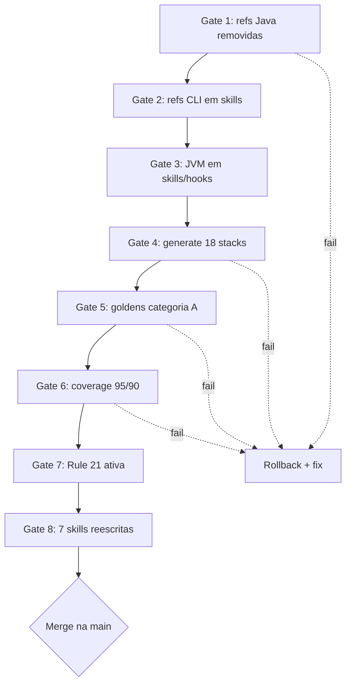

# História: Validação end-to-end — smoke 18 stacks + coverage + gates de aceitação

**ID:** story-0052-0009
**Chave Jira:** —
**Status:** Pendente

## 1. Dependências

| Blocked By | Blocks |
| :--- | :--- |
| story-0052-0008 | — |

## 2. Regras Transversais Aplicáveis

| ID | Título |
| :--- | :--- |
| RULE-002 | Contrato do comando `generate` é invariante |
| RULE-006 | Nenhuma feature nova |
| RULE-007 | Rule 21 é gate duradouro |

## 3. Descrição

Como **tech lead fechando o épico**, eu quero **rodar os 8 gates globais de aceitação definidos no SPEC contra o merge candidate**, garantindo que **nenhum dos invariantes do épico foi violado e o release candidate está pronto para merge na `main`**.

Esta é a história de **validação final**. Não altera produção de código — apenas executa verificações automatizadas e manuais definidas em §"Critérios de Aceitação Globais" do SPEC.

### 3.1 Os 8 gates

| # | Gate | Comando |
| :--- | :--- | :--- |
| 1 | Zero refs a pacotes removidos | `rg -l 'dev\.iadev\.(release\|checkpoint\|parallelism\|progress\|smoke\|ci)' java/src/main/java java/src/test/java` → vazio |
| 2 | Zero refs a CLIs Java removidos em skills/hooks | `rg -l 'dev\.iadev\.telemetry\.(PiiAudit\|TelemetryAnalyze\|TelemetryTrend\|analyze\.\|trend\.)' java/src/main/resources/targets/claude` → vazio |
| 3 | Zero JVM em skills/hooks | `rg -l 'java -(cp\|jar)' java/src/main/resources/targets/claude` → vazio |
| 4 | `generate` passa nas 18 stacks | loop for sobre stacks (ver §3.2) → zero FAIL |
| 5 | Golden files preservados para Assemblers categoria A | `mvn -pl java test -Dtest='*Golden*'` → BUILD SUCCESS |
| 6 | Coverage ≥ 95%/90% | `mvn -pl java verify` + leitura do JaCoCo report |
| 7 | Rule 21 ativa | `test -f .claude/rules/21-generator-scope.md && grep -q '21-generator-scope' CLAUDE.md` |
| 8 | Skills reescritas sem refs Java | loop for sobre as 7 skills (ver §3.3) → todas vazias |

### 3.2 Smoke 18 stacks

```bash
for s in java-picocli-cli java-quarkus java-spring java-spring-clickhouse \
         java-spring-cqrs-es java-spring-elasticsearch java-spring-event-driven \
         java-spring-fintech-pci java-spring-hexagonal java-spring-neo4j \
         python-fastapi python-fastapi-timescale python-click-cli \
         go-gin kotlin-ktor typescript-nestjs typescript-commander-cli rust-axum; do
  rm -rf /tmp/iadev-smoke
  java -jar java/target/ia-dev-env.jar generate --stack "$s" \
       -o /tmp/iadev-smoke --force --platform claude-code \
    || { echo "FAIL: $s"; exit 1; }
done
```

### 3.3 Verificação das 7 skills reescritas

```bash
for skill in x-telemetry-analyze x-telemetry-trend x-parallel-eval \
             x-release x-epic-implement x-story-implement x-task-implement; do
  matches=$(rg -l 'dev\.iadev\.|java -(cp|jar)' \
              "java/src/main/resources/targets/claude/skills/**/$skill/SKILL.md")
  if [ -n "$matches" ]; then
    echo "FAIL: $skill ainda tem ref Java"
    exit 1
  fi
done
```

### 3.4 Validação cross-document

- Spec drift: rodar `/x-spec-drift` comparando SPEC de entrada com código final. Divergências documentadas.
- Review técnico: rodar `/x-review-pr` no branch de épico como última validação.
- CHANGELOG: confirmar que há entradas Removed/Changed cobrindo as 9 histórias.

## 3.5 Entrega de Valor

- **Valor Principal:** Garantia objetiva de que a refatoração do épico foi consistente, sem regressões observáveis no contrato do CLI ou no comportamento das skills.
- **Métrica de Sucesso:** Todos os 8 gates retornam verde; `mvn verify` BUILD SUCCESS; smoke 18 stacks sem FAIL; PR consolidado do épico é merged na `main`.
- **Impacto no Negócio:** Confiança no merge. Próximos épicos (ex: suporte a `cursor` como target) começam sobre base saneada.

## 4. Definições de Qualidade Locais

### DoR Local

- [ ] Stories 0052-0001 a 0052-0008 concluídas e mergeadas (ou em PR final pronto).
- [ ] Ambiente de CI disponível para reprodução dos gates.

### DoD Local

- [ ] Todos os 8 gates executados e documentados em `plans/epic-0052/reports/validation-report.md`.
- [ ] `/x-review-pr` report salvo em `plans/epic-0052/reports/techlead-review-epic-0052.md`.
- [ ] CHANGELOG.md finalizado com todas as entradas do épico.
- [ ] Epic 0052 marcado como `Concluído` em `epic-0052.md` (status).
- [ ] Golden files commitados no merge final.

## 5. Contratos de Dados (Artefatos)

### 5.1 Arquivos criados

| Arquivo | Tipo |
| :--- | :--- |
| `plans/epic-0052/reports/validation-report.md` | Relatório dos 8 gates |
| `plans/epic-0052/reports/techlead-review-epic-0052.md` | Output de `/x-review-pr` |
| `plans/epic-0052/reports/smoke-18-stacks.log` | Log da execução smoke |

### 5.2 Arquivos modificados

| Arquivo | Mudança |
| :--- | :--- |
| `CHANGELOG.md` | Consolidação final |
| `plans/epic-0052/epic-0052.md` | Status → Concluído |

### 5.3 Arquivos NÃO tocados

- Código Java, skills, hooks, rules — esta story é validação, não modificação.

## 5.4 File Footprint

```
write: plans/epic-0052/reports/validation-report.md
write: plans/epic-0052/reports/techlead-review-epic-0052.md
write: plans/epic-0052/reports/smoke-18-stacks.log
write: plans/epic-0052/epic-0052.md (status final)
write: CHANGELOG.md
read:  java/src/main/java/**
read:  java/src/main/resources/targets/claude/**
read:  specs/SPEC-generator-scope-restoration-v1.md
```

## 6. Diagramas

### 6.1 Gates funil



## 7. Critérios de Aceite (Gherkin)

```gherkin
Cenario: Gate 1 — sem refs a pacotes removidos
  DADO que o épico está pronto para merge
  QUANDO eu executo "rg -l 'dev\\.iadev\\.(release|checkpoint|parallelism|progress|smoke|ci)' java/src/main/java java/src/test/java"
  ENTÃO o resultado é vazio

Cenario: Gate 4 — generate passa em todas as 18 stacks
  DADO que o build está funcional
  QUANDO eu executo o loop smoke 18 stacks
  ENTÃO zero FAIL são reportados

Cenario: Gate 6 — coverage dentro do threshold
  DADO que todos os pacotes `[KEEP]` foram preservados
  QUANDO eu executo "mvn -pl java verify"
  ENTÃO BUILD SUCCESS
  E line coverage ≥ 95%
  E branch coverage ≥ 90%

Cenario: Gate 8 — skills reescritas sem JVM
  DADO que as 7 skills foram reescritas
  QUANDO eu inspeciono cada SKILL.md
  ENTÃO nenhuma menciona dev.iadev. ou java -cp/java -jar

Cenario: Relatório consolidado existe
  DADO que todos os gates passaram
  QUANDO eu abro plans/epic-0052/reports/validation-report.md
  ENTÃO o arquivo lista os 8 gates com status PASS
  E contém link para o smoke-log e para o techlead-review

Cenario: CHANGELOG consolidado
  DADO que o épico está para merge
  QUANDO eu inspeciono CHANGELOG.md seção Unreleased
  ENTÃO há entradas Removed para os 7 pacotes Java deletados
  E há entrada Changed para CicdAssembler
  E há entrada Added para Rule 21
```

### 7.1 Scenario Ordering (TPP)

Degenerate (gate 1 regex) → smoke 18 stacks → coverage → skills → relatório → CHANGELOG.

### 7.2 Mandatory Scenario Categories

- [x] Degenerate
- [x] Happy path (18 stacks)
- [x] Error paths (coverage)
- [x] Boundary values (7 skills, relatório, CHANGELOG)

### 7.3 TDD Implementation Notes

- Story é validação, não implementação. Sem TDD cycles — apenas execução de gates.

## 8. Tasks

### TASK-0052-0009-001: Executar 8 gates e escrever validation-report

- **Layer:** Test
- **Test Type:** Smoke
- **Size:** M
- **Dependencies:** —
- **Branch:** `feat/task-0052-0009-001-gates`
- **Testability:** Migration + Smoke
- **Files:**
  - `plans/epic-0052/reports/validation-report.md`
  - `plans/epic-0052/reports/smoke-18-stacks.log`
- **Acceptance Criteria:**
  - [ ] Cada gate executado e resultado registrado.
  - [ ] Zero gates FAIL.

### TASK-0052-0009-002: Tech lead review

- **Layer:** Doc
- **Test Type:** Verification
- **Size:** S
- **Dependencies:** TASK-0052-0009-001
- **Branch:** `feat/task-0052-0009-002-techlead-review`
- **Testability:** Config + VerificationTest
- **Files:**
  - `plans/epic-0052/reports/techlead-review-epic-0052.md`
- **Acceptance Criteria:**
  - [ ] `/x-review-pr` executado; GO/NO-GO decidido.
  - [ ] Se NO-GO: issues registradas e corrigidas; gate 1 a 8 re-executados.

### TASK-0052-0009-003: Consolidar CHANGELOG

- **Layer:** Doc
- **Test Type:** Verification
- **Size:** S
- **Dependencies:** TASK-0052-0009-001
- **Branch:** `feat/task-0052-0009-003-final-changelog`
- **Testability:** Config + VerificationTest
- **Files:**
  - `CHANGELOG.md`
- **Acceptance Criteria:**
  - [ ] Seção Unreleased lista Added (Rule 21), Changed (CicdAssembler, 7 SKILL.md), Removed (7 pacotes Java + 4 mains).
  - [ ] Nomenclatura consistente com Keep a Changelog.

### TASK-0052-0009-004: Marcar épico como Concluído

- **Layer:** Doc
- **Test Type:** Verification
- **Size:** S
- **Dependencies:** TASK-0052-0009-002, 003
- **Branch:** `feat/task-0052-0009-004-epic-done`
- **Testability:** Config + VerificationTest
- **Files:**
  - `plans/epic-0052/epic-0052.md`
- **Acceptance Criteria:**
  - [ ] Status do épico atualizado para "Concluído".
  - [ ] Data de conclusão registrada.
