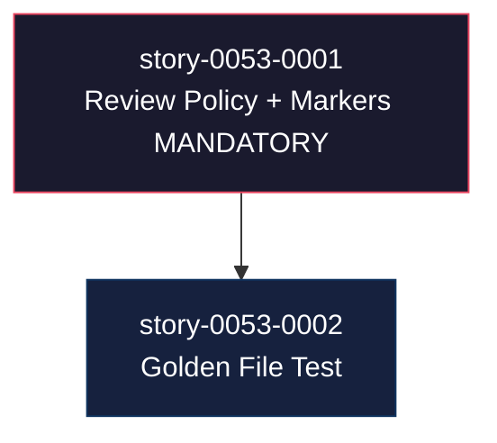

# Mapa de Implementação — EPIC-0053: Enforcement de Reviews Obrigatórias

**Gerado a partir das dependências BlockedBy/Blocks de cada história do epic-0053.**

---

## 1. Matriz de Dependências

| Story | Título | Chave Jira | Blocked By | Blocks | Status |
| :--- | :--- | :--- | :--- | :--- | :--- |
| [story-0053-0001](./story-0053-0001.md) | Adicionar Review Policy e marcadores MANDATORY ao SKILL.md source | — | — | story-0053-0002 | Pendente |
| [story-0053-0002](./story-0053-0002.md) | Teste de golden file para marcadores de review obrigatórios | — | story-0053-0001 | — | Pendente |

> **Valores de Status:** `Pendente` (padrão) · `Em Andamento` · `Concluída` · `Falha` · `Bloqueada` · `Parcial`

> **Nota:** story-0053-0002 tem dependência hard de story-0053-0001 porque os testes precisam
> do output regenerado para verificar os markers. Sem story-0053-0001 aplicada, os testes
> falharão no Red phase (comportamento esperado, não um bloqueio de desenvolvimento).

---

## 2. Fases de Implementação

> As histórias são agrupadas em fases. Dentro de cada fase, as histórias podem ser implementadas
> **em paralelo**. Uma fase só pode iniciar quando todas as dependências das fases anteriores
> estiverem concluídas.

```
╔══════════════════════════════════════════════════════════════════════════╗
║              FASE 0 — Enforcement Source (serial, 1 história)           ║
║                                                                          ║
║   ┌────────────────────────────────────────────────────────────────┐     ║
║   │  story-0053-0001                                               │     ║
║   │  Adicionar Review Policy + markers MANDATORY ao SKILL.md       │     ║
║   │  + regenerar output via mvn process-resources                  │     ║
║   └──────────────────────────────┬─────────────────────────────────┘     ║
╚═════════════════════════════════╪════════════════════════════════════════╝
                                  │
                                  ▼
╔══════════════════════════════════════════════════════════════════════════╗
║              FASE 1 — Test Coverage (serial, 1 história)                ║
║                                                                          ║
║   ┌────────────────────────────────────────────────────────────────┐     ║
║   │  story-0053-0002                                               │     ║
║   │  Teste de golden file para marcadores obrigatórios             │     ║
║   │  (← depende de story-0053-0001)                                │     ║
║   └────────────────────────────────────────────────────────────────┘     ║
╚══════════════════════════════════════════════════════════════════════════╝
```

---

## 3. Caminho Crítico

> O caminho crítico (a sequência mais longa de dependências) determina o tempo mínimo
> de implementação do projeto.

```
story-0053-0001 ──→ story-0053-0002
    Fase 0              Fase 1
```

**2 fases no caminho crítico, 2 histórias na cadeia mais longa (story-0053-0001 → story-0053-0002).**

Atrasos em story-0053-0001 bloqueiam diretamente story-0053-0002. Como é o único gargalo,
a velocidade de implementação de story-0053-0001 determina o prazo total do épico.

---

## 4. Grafo de Dependências (Mermaid)



---

## 5. Resumo por Fase

| Fase | Histórias | Camada | Paralelismo | Pré-requisito |
| :--- | :--- | :--- | :--- | :--- |
| 0 | story-0053-0001 | skills/core/dev (Doc + Config) | 1 (serial) | — |
| 1 | story-0053-0002 | test | 1 (serial) | Fase 0 concluída |

**Total: 2 histórias em 2 fases.**

> **Nota:** Este épico é intencionalmente pequeno (documentação-only). Não há código Java
> de produção a implementar — apenas edição de SKILL.md source, regeneração, e testes
> de verificação.

---

## 6. Detalhamento por Fase

### Fase 0 — Enforcement Source

| Story | Escopo Principal | Artefatos Chave |
| :--- | :--- | :--- |
| story-0053-0001 | Editar SKILL.md source com 4 mudanças + regenerar via mvn process-resources | `java/.../x-story-implement/SKILL.md` (editado), `.claude/skills/x-story-implement/SKILL.md` (regenerado) |

**Entregas da Fase 0:**

- Seção `## Review Policy` inserida no SKILL.md source
- Marker `MANDATORY — NON-NEGOTIABLE` adicionado em Step 3.4 e Step 3.6
- Linha `--skip-review` RESERVED adicionada à tabela CLI Arguments
- `.claude/skills/x-story-implement/SKILL.md` regenerado com todos os markers

### Fase 1 — Test Coverage

| Story | Escopo Principal | Artefatos Chave |
| :--- | :--- | :--- |
| story-0053-0002 | Adicionar 3 métodos de teste a SkillsAssemblerTest verificando markers obrigatórios | `java/src/test/.../SkillsAssemblerTest.java` (3 métodos adicionados) |

**Entregas da Fase 1:**

- Testes automatizados que falham sem story-0053-0001 (Red phase validada)
- Testes passando após story-0053-0001 (Green phase)
- CI protegido contra remoção acidental dos markers em PRs futuros

---

## 7. Observações Estratégicas

### Gargalo Principal

**story-0053-0001** é o único gargalo. Ela bloqueia story-0053-0002 diretamente. Investir
tempo em clareza e precisão nas 4 mudanças do SKILL.md (posicionamento correto, formatação
consistente com o estilo do documento existente) elimina o retrabalho que atrasaria
story-0053-0002.

### Histórias Folha (sem dependentes)

**story-0053-0002** não bloqueia nenhuma outra história. É uma história folha que pode
absorver qualquer atraso sem impacto downstream.

### Otimização de Tempo

- Paralelismo máximo: 1 (não há phase com mais de 1 história — épico serial por design)
- story-0053-0001 pode começar imediatamente (sem dependências)
- story-0053-0002 deve aguardar story-0053-0001 estar **merged** (não apenas implementada)
  para que o output regenerado esteja disponível no ambiente de teste

### Dependências Cruzadas

Nenhuma dependência cruzada entre tasks de histórias diferentes. As tasks de story-0053-0002
não fazem referência a artefatos específicos produzidos pelas tasks de story-0053-0001
(elas verificam o output final do processo de regeneração, não artefatos intermediários).

### Marco de Validação Arquitetural

**story-0053-0001** é o marco de validação. Após seu merge:
1. `grep -c "MANDATORY — NON-NEGOTIABLE" .claude/skills/x-story-implement/SKILL.md` deve retornar ≥ 2
2. A próxima execução de `x-story-implement` terá os markers em contexto
3. story-0053-0002 pode ser iniciada imediatamente na sequência

---

## 8. Dependências entre Tasks (Cross-Story)

> Não há dependências cross-story entre tasks. Todas as tasks de story-0053-0002 dependem
> apenas do estado do output regenerado (produzido pelo processo de story-0053-0001 completo),
> não de tasks individuais de story-0053-0001.

### 8.1 Ordem de Merge (Topological Sort)

| Ordem | Task ID | Story | Parallelizável Com | Fase |
| :--- | :--- | :--- | :--- | :--- |
| 1 | TASK-0053-0001-001 | story-0053-0001 | — | 0 |
| 2 | TASK-0053-0001-002 | story-0053-0001 | — (depende de TASK-001) | 0 |
| 3 | TASK-0053-0001-003 | story-0053-0001 | — (depende de TASK-001, 002) | 0 |
| 4 | TASK-0053-0002-001 | story-0053-0002 | — | 1 |
| 5 | TASK-0053-0002-002 | story-0053-0002 | TASK-0053-0002-003 | 1 |
| 6 | TASK-0053-0002-003 | story-0053-0002 | TASK-0053-0002-002 | 1 |
| 7 | TASK-0053-0002-004 | story-0053-0002 | — | 1 |

**Total: 7 tasks em 2 fases de execução.**

> **Nota:** TASK-0053-0002-002 e TASK-0053-0002-003 podem ser desenvolvidas em paralelo
> (ambas dependem apenas de TASK-0053-0002-001 e não há conflito nos arquivos).
> TASK-0053-0002-004 (Smoke) deve ser a última a executar, após 001+002+003 concluídas.
