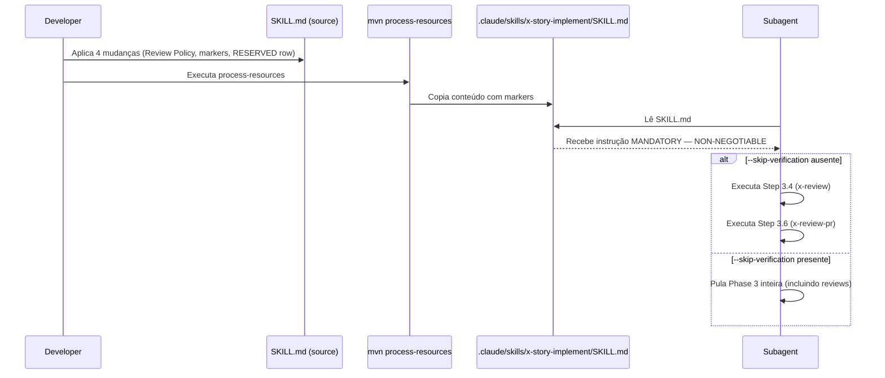

<!-- audit-exempt: pre EPIC 0057 expanded table. pr watch and dependency audit artifacts cannot be reconstructed faithfully for already merged PRs. Original 4 evidence artifacts present via story 0057 0008 backfill. -->
<!-- audit-exempt-extended: reason=pre-EPIC-0057-expanded-table approved-by=tech-lead date=2026-04-26 ref=PR-#653-Copilot-review -->
# História: Adicionar Review Policy e marcadores MANDATORY ao SKILL.md source

**ID:** story-0053-0001
**Chave Jira:** —
**Status:** Pendente

## 1. Dependências

| Blocked By | Blocks |
| :--- | :--- |
| — | story-0053-0002 |

## 2. Regras Transversais Aplicáveis

| ID | Título |
| :--- | :--- |
| RULE-001 | Mandatory Review Execution |
| RULE-002 | Protocol Violation Logging |
| RULE-003 | Source-of-Truth SKILL.md |

## 3. Descrição

Como **tech lead do projeto ia-dev-environment**, eu quero que a skill `x-story-implement`
contenha linguagem explicitamente obrigatória nas steps de review, garantindo que nenhum
subagente possa omitir Step 3.4 (Specialist Review) e Step 3.6 (Tech Lead Review) sem
violar uma regra documentada com um error code nomeado.

O problema constatado no EPIC-0042 foi que subagentes seguiram o "caminho manual" sem
invocar o review cycle completo, produzindo `reviewsExecuted: {specialist: false, techLead: false}`
mesmo sem `--skip-verification`. A causa raiz foi a ausência de qualquer marker de
obrigatoriedade no texto das steps — o texto dizia "Invoke the `x-review` skill..." mas
não dizia "MUST" nem o que acontece se o subagente não o fizer.

Esta história aplica quatro mudanças ao source file
`java/src/main/resources/targets/claude/skills/core/dev/x-story-implement/SKILL.md`
e executa `mvn process-resources` para propagar o output ao arquivo consumido pelos subagentes
(`.claude/skills/x-story-implement/SKILL.md`).

### 3.1 Change 1 — Seção global `## Review Policy`

Adicionar imediatamente após `## When to Use` (antes de `## CLI Arguments`):

```markdown
## Review Policy

> **MANDATORY:** Specialist Review (Step 3.4) e Tech Lead Review (Step 3.6) são
> NON-NEGOTIABLE por padrão. Devem executar em toda story a menos que
> `--skip-verification` seja explicitamente passado. Omitir qualquer uma dessas
> reviews sem o flag é uma violação de protocolo. Subagentes NÃO DEVEM omitir
> estas steps silenciosamente — se incapaz de executar, DEVE abortar e emitir
> `"REVIEW_SKIPPED_WITHOUT_FLAG"`.
```

### 3.2 Change 2 — Marker MANDATORY no Step 3.4

Adicionar imediatamente após `### Step 3.4 -- Review (invoke x-review via Skill tool)`:

```markdown
> **MANDATORY — NON-NEGOTIABLE:** Esta step DEVE executar a menos que
> `--skip-verification` esteja explicitamente presente. Um subagente que chega
> neste ponto sem executar `Skill(skill: "x-review", ...)` DEVE abortar e emitir
> `"PROTOCOL_VIOLATION: Step 3.4 skipped without --skip-verification"`.
```

### 3.3 Change 3 — Marker MANDATORY no Step 3.6

Adicionar imediatamente após `### Step 3.6 -- Tech Lead Review`:

```markdown
> **MANDATORY — NON-NEGOTIABLE:** Esta step DEVE executar a menos que
> `--skip-verification` esteja explicitamente presente. Um subagente que chega
> neste ponto sem executar `Skill(skill: "x-review-pr", ...)` DEVE abortar e emitir
> `"PROTOCOL_VIOLATION: Step 3.6 skipped without --skip-verification"`.
```

### 3.4 Change 4 — Linha RESERVED na tabela CLI Arguments

Adicionar após a linha `--skip-verification` na tabela `## CLI Arguments`:

```markdown
| `--skip-review` | Boolean | false | **RESERVED — não implementado.** Use `--skip-verification` para bypass de toda a Phase 3. Não existe caminho suportado para pular somente reviews mantendo outras steps da Phase 3 ativas. |
```

### 3.5 Regeneração do output

Após as 4 mudanças no source, executar:

```bash
cd java && mvn process-resources
```

Verificar que `.claude/skills/x-story-implement/SKILL.md` contém:
- String `## Review Policy`
- String `MANDATORY — NON-NEGOTIABLE` pelo menos 2 vezes
- String `REVIEW_SKIPPED_WITHOUT_FLAG`
- String `PROTOCOL_VIOLATION`

## 3.5 Entrega de Valor

> O que esta história entrega de valor mensurável para o negócio?

- **Valor Principal:** Reviews nunca mais são omitidas silenciosamente em `x-story-implement`. Todo subagente que seguir a skill recebe instrução explicitamente obrigatória com error code nomeado para cada step de review.
- **Métrica de Sucesso:** Após o merge, a próxima execução de `x-story-implement` sem `--skip-verification` produz `reviewsExecuted: {specialist: true, techLead: true}` ou emite `PROTOCOL_VIOLATION` se tentativa de pular.
- **Impacto no Negócio:** Elimina o padrão `reviewsExecuted: false` observado no EPIC-0042. Stories do projeto passam a ter cobertura de review garantida por protocolo, não por boa vontade do subagente.

## 4. Definições de Qualidade Locais

### DoR Local (Definition of Ready)

- [ ] SKILL.md source lido; linhas alvo identificadas (Step 3.4 ~L1061, Step 3.6 ~L1120, `## When to Use` L31, CLI table L39)
- [ ] `mvn process-resources` executa com sucesso no estado atual (baseline verde)
- [ ] Nenhum outro PR em aberto modificando `x-story-implement/SKILL.md`

### DoD Local (Definition of Done)

- [ ] 4 mudanças aplicadas ao source SKILL.md (Review Policy, marker Step 3.4, marker Step 3.6, linha RESERVED)
- [ ] `mvn process-resources` executado com sucesso após as mudanças
- [ ] `.claude/skills/x-story-implement/SKILL.md` contém todos os markers obrigatórios
- [ ] `grep -c "MANDATORY — NON-NEGOTIABLE" .claude/skills/x-story-implement/SKILL.md` retorna ≥ 2
- [ ] Pelo menos 1 teste automatizado (verificação manual via grep ou teste de golden file) validando o critério de aceite principal
- [ ] Smoke test passando (quando testing.smoke_tests == true no projeto)

### Global Definition of Done (DoD)

- **Cobertura:** ≥ 95% Line, ≥ 90% Branch
- **Testes Automatizados:** Verificação via grep pós-regeneração
- **Relatório de Cobertura:** Jacoco XML/HTML via `mvn test`
- **Documentação:** CHANGELOG.md atualizado
- **Persistência:** N/A
- **Performance:** N/A

## 5. Contratos de Dados (Data Contract)

Esta história não define API request/response. O "contrato" é a presença dos seguintes
padrões de texto no arquivo gerado `.claude/skills/x-story-implement/SKILL.md`.

### 5.1 Padrões Obrigatórios no Output Gerado

| Padrão | Tipo | Obrigatório | Descrição |
| :--- | :--- | :--- | :--- |
| `## Review Policy` | String (exact) | Sim | Cabeçalho da seção global de política de reviews |
| `MANDATORY — NON-NEGOTIABLE` | String (exact) | Sim (≥ 2 ocorrências) | Marker de obrigatoriedade em Step 3.4 e Step 3.6 |
| `REVIEW_SKIPPED_WITHOUT_FLAG` | String (exact) | Sim (≥ 1 ocorrência) | Error code na Review Policy global |
| `PROTOCOL_VIOLATION` | String (exact) | Sim (≥ 2 ocorrências) | Error code nos markers das steps 3.4 e 3.6 |
| `--skip-review` | String (exact) | Sim (≥ 1 ocorrência) | Documentação do flag RESERVED na CLI table |

### 5.2 Localização das Mudanças no Source

| Mudança | Localização Aproximada | Antes de |
| :--- | :--- | :--- |
| `## Review Policy` section | Após linha `## When to Use` (~L31) | `## CLI Arguments` |
| Step 3.4 MANDATORY marker | Após `### Step 3.4 -- Review` (~L1061) | `<!-- TELEMETRY: phase.start -->` |
| Step 3.6 MANDATORY marker | Após `### Step 3.6 -- Tech Lead Review` (~L1120) | `Invoke skill \`x-review-pr\`` |
| `--skip-review` RESERVED row | Após linha `--skip-verification` (~L43) | `--full-lifecycle` |

## 6. Diagramas

### 6.1 Fluxo de Propagação da Mudança



## 7. Critérios de Aceite (Gherkin)

```gherkin
Cenario: SKILL.md source sem Review Policy (estado atual — caso degenerado)
  DADO que o source SKILL.md não contém "## Review Policy"
  QUANDO grep é executado em .claude/skills/x-story-implement/SKILL.md
  ENTÃO o comando retorna 0 ocorrências de "## Review Policy"
  E retorna 0 ocorrências de "MANDATORY — NON-NEGOTIABLE"

Cenario: As 4 mudanças aplicadas e output regenerado (happy path)
  DADO que as 4 mudanças foram aplicadas ao source SKILL.md
  QUANDO mvn process-resources é executado com sucesso
  ENTÃO .claude/skills/x-story-implement/SKILL.md contém "## Review Policy"
  E contém "MANDATORY — NON-NEGOTIABLE" pelo menos 2 vezes
  E contém "REVIEW_SKIPPED_WITHOUT_FLAG" pelo menos 1 vez
  E contém "PROTOCOL_VIOLATION" pelo menos 2 vezes
  E contém "--skip-review" com nota "RESERVED — não implementado"

Cenario: mvn process-resources falha por erro de sintaxe no SKILL.md
  DADO que o source SKILL.md contém um bloco markdown malformado
  QUANDO mvn process-resources é executado
  ENTÃO o comando falha com exit code != 0
  E a causa do erro é corrigida antes de prosseguir

Cenario: Marcador presente em Step 3.4 mas ausente em Step 3.6 (valor de fronteira — mínimo insuficiente)
  DADO que apenas o marker de Step 3.4 foi adicionado ao source SKILL.md
  QUANDO grep -c "MANDATORY — NON-NEGOTIABLE" é executado no output
  ENTÃO o resultado é 1 (abaixo do mínimo esperado de 2)
  E a história NÃO está concluída — o marker de Step 3.6 DEVE ser adicionado

Cenario: Ambos os marcadores presentes (valor de fronteira — mínimo satisfeito)
  DADO que os markers de Step 3.4 e Step 3.6 foram adicionados ao source SKILL.md
  QUANDO grep -c "MANDATORY — NON-NEGOTIABLE" é executado no output
  ENTÃO o resultado é exatamente 2 (mínimo satisfeito)
  E a história pode ser marcada como concluída
```

### 7.1 Scenario Ordering (TPP)

Cenários ordenados do mais simples ao mais complexo: estado degenerado (atual, sem markers) → happy path (todas as 4 mudanças) → error path (mvn falha) → boundary (1 marker insuficiente) → boundary (2 markers — mínimo).

### 7.2 Mandatory Scenario Categories

- [x] Degenerate cases — estado atual sem markers
- [x] Happy path — todas as 4 mudanças aplicadas e regeneradas
- [x] Error paths — mvn process-resources falha
- [x] Boundary values — 1 marker (insuficiente) vs 2 markers (mínimo)

### 7.3 TDD Implementation Notes

- O primeiro cenário Gherkin (degenerado) vira o acceptance test (outer loop): rodar grep no estado atual, verificar 0 matches.
- Após aplicar as mudanças, o mesmo grep deve retornar ≥ 2 matches (green).
- A refactoring phase é verificar se a posição dos markers no SKILL.md está clara e bem formatada.

## 8. Tasks

### TASK-0053-0001-001: Add Review Policy section and MANDATORY markers to SKILL.md source

- **Layer:** Doc
- **Test Type:** Verification
- **Size:** S
- **Dependencies:** —
- **Branch:** `feat/task-0053-0001-001-add-review-policy`
- **Testability:** Config + VerificationTest (SKILL.md é um recurso de configuração; verificação é grep pós-edição)
- **Files:**
  - `java/src/main/resources/targets/claude/skills/core/dev/x-story-implement/SKILL.md`
- **Acceptance Criteria:**
  - [ ] Seção `## Review Policy` adicionada após `## When to Use`
  - [ ] Marker `MANDATORY — NON-NEGOTIABLE` adicionado após `### Step 3.4 -- Review`
  - [ ] Marker `MANDATORY — NON-NEGOTIABLE` adicionado após `### Step 3.6 -- Tech Lead Review`
  - [ ] `grep -c "MANDATORY — NON-NEGOTIABLE" java/.../x-story-implement/SKILL.md` retorna ≥ 2

### TASK-0053-0001-002: Add --skip-review RESERVED row to CLI Arguments table

- **Layer:** Doc
- **Test Type:** Verification
- **Size:** S
- **Dependencies:** TASK-0053-0001-001
- **Branch:** `feat/task-0053-0001-002-add-skip-review-reserved`
- **Testability:** Config + VerificationTest
- **Files:**
  - `java/src/main/resources/targets/claude/skills/core/dev/x-story-implement/SKILL.md`
- **Acceptance Criteria:**
  - [ ] Linha `--skip-review` adicionada à tabela CLI Arguments com nota RESERVED
  - [ ] Linha posicionada após `--skip-verification`
  - [ ] `grep "skip-review" java/.../x-story-implement/SKILL.md` retorna ≥ 1 match

### TASK-0053-0001-003: Regenerate output via mvn process-resources and verify

- **Layer:** Config
- **Test Type:** Smoke
- **Size:** S
- **Dependencies:** TASK-0053-0001-001, TASK-0053-0001-002
- **Branch:** `feat/task-0053-0001-003-regenerate-and-verify`
- **Testability:** Migration + Smoke (process-resources equivale a migration; grep equivale a smoke)
- **Files:**
  - `.claude/skills/x-story-implement/SKILL.md`
  - `src/test/resources/golden/` (se golden files existirem para este output)
- **Acceptance Criteria:**
  - [ ] `mvn process-resources` executa com exit code 0
  - [ ] `.claude/skills/x-story-implement/SKILL.md` contém `## Review Policy`
  - [ ] `grep -c "MANDATORY — NON-NEGOTIABLE" .claude/skills/x-story-implement/SKILL.md` retorna ≥ 2
  - [ ] `grep "REVIEW_SKIPPED_WITHOUT_FLAG" .claude/skills/x-story-implement/SKILL.md` retorna ≥ 1 match
  - [ ] `grep "PROTOCOL_VIOLATION" .claude/skills/x-story-implement/SKILL.md` retorna ≥ 2 matches
  - [ ] Golden files atualizados e `mvn test -Dtest=GoldenFileTest` passa (se aplicável)
