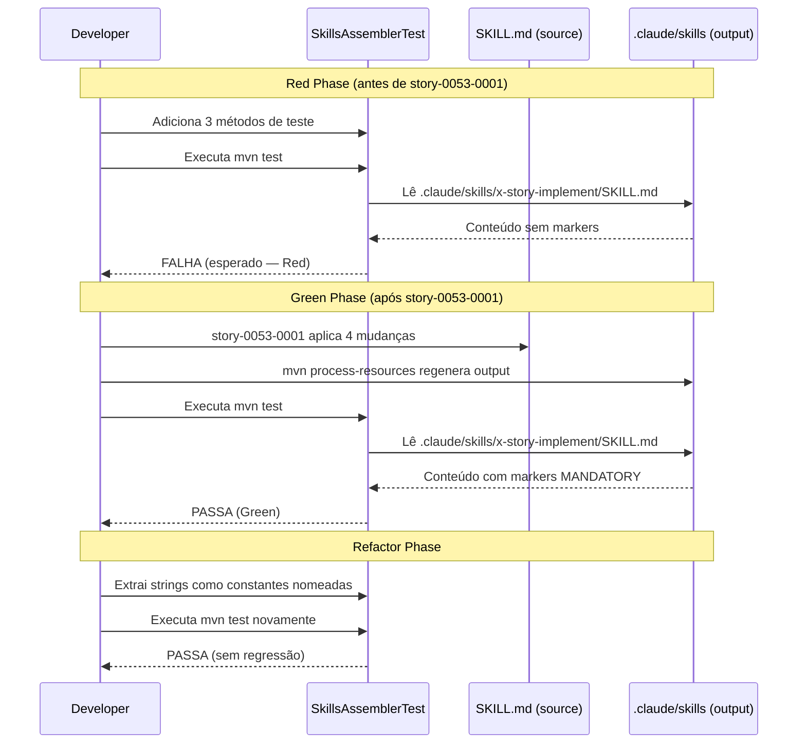

<!-- audit-exempt: pre EPIC 0057 expanded table. pr watch and dependency audit artifacts cannot be reconstructed faithfully for already merged PRs. Original 4 evidence artifacts present via story 0057 0008 backfill. -->
<!-- audit-exempt-extended: reason=pre-EPIC-0057-expanded-table approved-by=tech-lead date=2026-04-26 ref=PR-#653-Copilot-review -->
# História: Teste de golden file para marcadores de review obrigatórios

**ID:** story-0053-0002
**Chave Jira:** —
**Status:** Pendente

## 1. Dependências

| Blocked By | Blocks |
| :--- | :--- |
| story-0053-0001 | — |

## 2. Regras Transversais Aplicáveis

| ID | Título |
| :--- | :--- |
| RULE-001 | Mandatory Review Execution |
| RULE-002 | Protocol Violation Logging |
| RULE-003 | Source-of-Truth SKILL.md |

## 3. Descrição

Como **tech lead do projeto ia-dev-environment**, eu quero que a suíte de testes automatizados
valide a presença dos markers obrigatórios de review no output gerado de `x-story-implement`,
garantindo que qualquer remoção acidental dos markers seja capturada pelo CI antes do merge.

Esta história adiciona métodos de teste à classe existente (`SkillsAssemblerTest` ou equivalente)
que verificam que o arquivo `.claude/skills/x-story-implement/SKILL.md` gerado por
`mvn process-resources` contém os quatro padrões obrigatórios definidos em RULE-001 e RULE-002.

Os testes devem seguir o padrão RED → GREEN → REFACTOR:
- **Red**: Rodar os testes contra o estado _anterior_ às mudanças da story-0053-0001 → falham
- **Green**: Rodar após story-0053-0001 estar aplicada → passam
- **Refactor**: Extrair strings de verificação como constantes nomeadas se não existirem

### 3.1 Identificação do arquivo de teste existente

Procurar em `java/src/test/` por:
- `SkillsAssemblerTest.java`
- `SkillAssemblerTest.java`
- Qualquer classe que leia arquivos `.claude/skills/**/*.md` e os verifique

Se não existir nenhuma classe adequada, criar `SkillsAssemblerTest.java` no package
correspondente ao assembler da skill no path `java/src/test/`.

### 3.2 Métodos de teste a adicionar

Três métodos de verificação, cada um testando um aspecto independente:

1. `xStoryImplement_containsReviewPolicySection` — verifica presença de `## Review Policy`
2. `xStoryImplement_containsMandatoryMarkersOnBothReviewSteps` — verifica ≥ 2 ocorrências de `MANDATORY — NON-NEGOTIABLE`
3. `xStoryImplement_containsProtocolViolationErrorCodes` — verifica presença de `REVIEW_SKIPPED_WITHOUT_FLAG` e `PROTOCOL_VIOLATION`

Cada método lê o conteúdo do arquivo gerado (via classpath ou path relativo) e usa asserções
específicas (não apenas `isNotNull()`).

## 3.5 Entrega de Valor

> O que esta história entrega de valor mensurável para o negócio?

- **Valor Principal:** CI captura regressões futuras de review enforcement. Se os markers forem removidos acidentalmente do SKILL.md source em qualquer PR futuro, os testes falham antes do merge — sem intervenção humana manual.
- **Métrica de Sucesso:** `mvn test -Dtest=SkillsAssemblerTest` (ou equivalente) retorna exit 0 após story-0053-0001 e exit != 0 sem as mudanças da story-0053-0001.
- **Impacto no Negócio:** O enforcement de reviews deixa de ser um acordo informal e passa a ser uma invariante testada. Futuras stories que modificam `x-story-implement/SKILL.md` terão o CI como guardião automático.

## 4. Definições de Qualidade Locais

### DoR Local (Definition of Ready)

- [ ] story-0053-0001 concluída e `.claude/skills/x-story-implement/SKILL.md` contém os markers
- [ ] Classe de teste existente identificada (ou path para nova classe definido)
- [ ] Mecanismo de leitura do arquivo gerado compreendido (classpath vs file path relativo)

### DoD Local (Definition of Done)

- [ ] Três métodos de teste adicionados cobrindo: Review Policy, MANDATORY markers (≥ 2), error codes
- [ ] Testes passam após story-0053-0001 (`mvn test -Dtest=SkillsAssemblerTest` exit 0)
- [ ] Asserções são específicas (valores, contagens) — nenhum `isNotNull()` isolado
- [ ] Pelo menos 1 teste automatizado validando o critério de aceite principal
- [ ] Smoke test passando (quando testing.smoke_tests == true)

### Global Definition of Done (DoD)

- **Cobertura:** ≥ 95% Line, ≥ 90% Branch
- **Testes Automatizados:** 3 métodos de verificação cobrindo todos os markers obrigatórios
- **Relatório de Cobertura:** Jacoco XML/HTML via `mvn test`
- **Documentação:** CHANGELOG.md atualizado
- **Persistência:** N/A
- **Performance:** N/A

## 5. Contratos de Dados (Data Contract)

### 5.1 Strings Verificadas pelos Testes

| String | Tipo | Condição de Passe | Método de Teste |
| :--- | :--- | :--- | :--- |
| `## Review Policy` | String (exact) | `contains()` == true | `xStoryImplement_containsReviewPolicySection` |
| `MANDATORY — NON-NEGOTIABLE` | String (exact) | `countOccurrences() >= 2` | `xStoryImplement_containsMandatoryMarkersOnBothReviewSteps` |
| `REVIEW_SKIPPED_WITHOUT_FLAG` | String (exact) | `contains()` == true | `xStoryImplement_containsProtocolViolationErrorCodes` |
| `PROTOCOL_VIOLATION` | String (exact) | `countOccurrences() >= 2` | `xStoryImplement_containsProtocolViolationErrorCodes` |

### 5.2 Arquivo Lido pelo Teste

| Campo | Valor |
| :--- | :--- |
| Arquivo alvo | `.claude/skills/x-story-implement/SKILL.md` |
| Origem | Classpath (via `getResourceAsStream`) ou path relativo ao project root |
| Pré-condição | `mvn process-resources` executado antes dos testes (lifecycle padrão do Maven) |

## 6. Diagramas

### 6.1 Ciclo TDD para os Testes de Golden File



## 7. Critérios de Aceite (Gherkin)

```gherkin
Cenario: Testes falham sem as mudanças de story-0053-0001 (caso degenerado — Red phase)
  DADO que story-0053-0001 NÃO foi aplicada
  E o source SKILL.md não contém "## Review Policy"
  QUANDO mvn test -Dtest=SkillsAssemblerTest é executado
  ENTÃO os 3 métodos falham com AssertionError
  E o relatório aponta strings ausentes como causa

Cenario: Testes passam após story-0053-0001 aplicada (happy path — Green phase)
  DADO que story-0053-0001 foi aplicada e mvn process-resources executado
  QUANDO mvn test -Dtest=SkillsAssemblerTest é executado
  ENTÃO xStoryImplement_containsReviewPolicySection passa
  E xStoryImplement_containsMandatoryMarkersOnBothReviewSteps passa
  E xStoryImplement_containsProtocolViolationErrorCodes passa
  E exit code é 0

Cenario: Asserção de contagem falha com apenas 1 ocorrência de MANDATORY (error path)
  DADO que apenas 1 marker MANDATORY foi adicionado (Step 3.4 apenas)
  QUANDO xStoryImplement_containsMandatoryMarkersOnBothReviewSteps é executado
  ENTÃO a asserção de countOccurrences >= 2 falha
  E a mensagem de erro indica "expected >= 2 but found 1"

Cenario: Exatamente 2 ocorrências de MANDATORY satisfaz o mínimo (valor de fronteira — at-min)
  DADO que os markers de Step 3.4 e Step 3.6 foram adicionados
  QUANDO xStoryImplement_containsMandatoryMarkersOnBothReviewSteps é executado
  ENTÃO countOccurrences retorna 2
  E a asserção >= 2 passa

Cenario: Mais de 2 ocorrências de MANDATORY também satisfaz (valor de fronteira — above-min)
  DADO que 3 ou mais markers MANDATORY existem no output gerado
  QUANDO xStoryImplement_containsMandatoryMarkersOnBothReviewSteps é executado
  ENTÃO countOccurrences retorna > 2
  E a asserção >= 2 passa sem erro
```

### 7.1 Scenario Ordering (TPP)

Degenerado (sem mudanças, testes falham) → happy path (tudo aplicado, testes passam) → error path (1 marker insuficiente) → boundary at-min (exatamente 2) → boundary above-min (> 2).

### 7.2 Mandatory Scenario Categories

- [x] Degenerate cases — testes sem story-0053-0001 aplicada
- [x] Happy path — todos os markers presentes, todos os testes passam
- [x] Error paths — 1 marker (abaixo do mínimo esperado)
- [x] Boundary values — exatamente 2 (at-min) e > 2 (above-min)

### 7.3 TDD Implementation Notes

- O primeiro cenário Gherkin (degenerado) é o acceptance test da outer loop: criar os testes, ver falhar.
- A green phase da inner loop é story-0053-0001 aplicada + os testes passando.
- Refactoring: extrair constantes de string para evitar magic strings nos métodos de teste.

## 8. Tasks

### TASK-0053-0002-001: Identify test class and add xStoryImplement_containsReviewPolicySection

- **Layer:** Test
- **Test Type:** Unit
- **Size:** S
- **Dependencies:** —
- **Branch:** `feat/task-0053-0002-001-review-policy-test`
- **Testability:** Domain + UnitTest (classe de teste + método de verificação)
- **Files:**
  - `java/src/test/java/**/SkillsAssemblerTest.java` (ou equivalente, localizar primeiro)
- **Acceptance Criteria:**
  - [ ] Método `xStoryImplement_containsReviewPolicySection` criado
  - [ ] Lê `.claude/skills/x-story-implement/SKILL.md` via classpath ou path relativo
  - [ ] Asserta `contains("## Review Policy")` com mensagem descritiva
  - [ ] Falha quando testado contra source sem a mudança (red phase verificada manualmente)

### TASK-0053-0002-002: Add xStoryImplement_containsMandatoryMarkersOnBothReviewSteps

- **Layer:** Test
- **Test Type:** Unit
- **Size:** S
- **Dependencies:** TASK-0053-0002-001
- **Branch:** `feat/task-0053-0002-002-mandatory-markers-test`
- **Testability:** Domain + UnitTest
- **Files:**
  - `java/src/test/java/**/SkillsAssemblerTest.java` (ou equivalente)
- **Acceptance Criteria:**
  - [ ] Método `xStoryImplement_containsMandatoryMarkersOnBothReviewSteps` criado
  - [ ] Conta ocorrências de `"MANDATORY — NON-NEGOTIABLE"` no conteúdo do arquivo
  - [ ] Asserta `count >= 2` com mensagem `"Expected >= 2 MANDATORY markers, found: <count>"`
  - [ ] Falha quando count == 0 (red) e passa quando count == 2 (green)

### TASK-0053-0002-003: Add xStoryImplement_containsProtocolViolationErrorCodes

- **Layer:** Test
- **Test Type:** Unit
- **Size:** S
- **Dependencies:** TASK-0053-0002-001
- **Branch:** `feat/task-0053-0002-003-protocol-violation-test`
- **Testability:** Domain + UnitTest
- **Files:**
  - `java/src/test/java/**/SkillsAssemblerTest.java` (ou equivalente)
- **Acceptance Criteria:**
  - [ ] Método `xStoryImplement_containsProtocolViolationErrorCodes` criado
  - [ ] Asserta `contains("REVIEW_SKIPPED_WITHOUT_FLAG")`
  - [ ] Asserta `countOccurrences("PROTOCOL_VIOLATION") >= 2`
  - [ ] Strings extraídas como constantes nomeadas na mesma classe (Refactor phase)
  - [ ] `mvn test -Dtest=SkillsAssemblerTest` retorna exit 0 com todas as 3 stories aplicadas

### TASK-0053-0002-004: [Test] Smoke/E2E — Run full SkillsAssemblerTest suite and validate green

- **Layer:** Test
- **Test Type:** Smoke
- **Size:** S
- **Dependencies:** TASK-0053-0002-001, TASK-0053-0002-002, TASK-0053-0002-003
- **Branch:** `feat/task-0053-0002-004-smoke-test-suite`
- **Testability:** Migration + Smoke (execução end-to-end da suíte como smoke gate)
- **Files:**
  - `java/src/test/java/**/SkillsAssemblerTest.java` (ou equivalente)
- **Acceptance Criteria:**
  - [ ] `mvn test -Dtest=SkillsAssemblerTest` retorna exit 0
  - [ ] Todos os 3 métodos adicionados nesta story passam (verde)
  - [ ] Nenhum teste pré-existente regrediu (zero failures inesperados)
  - [ ] Relatório Surefire mostra: `Tests run: N, Failures: 0, Errors: 0`
