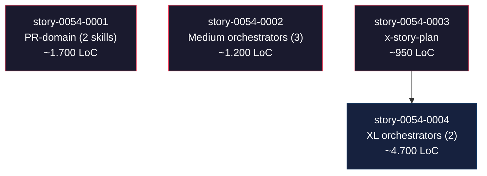
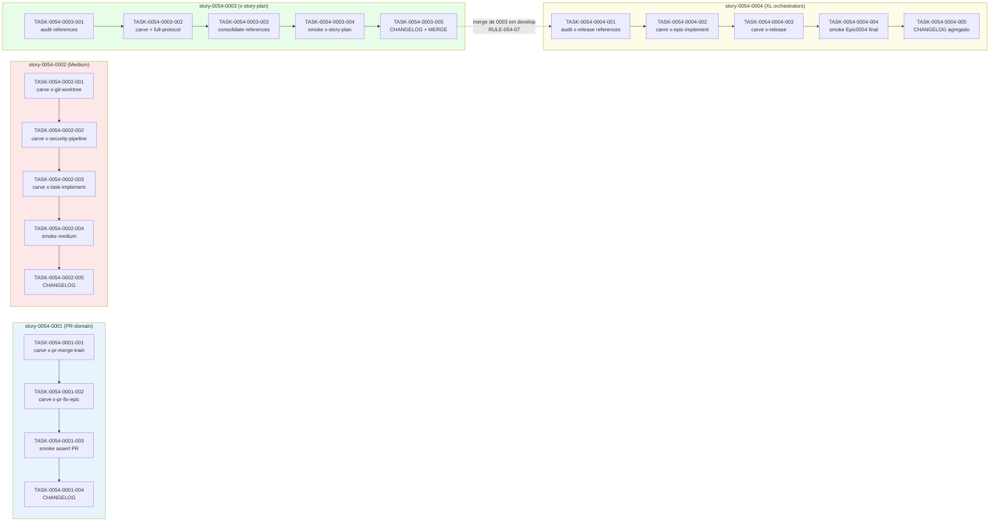

# Mapa de Implementação — EPIC-0054 Rollout ADR-0012 Slim-by-default

**Gerado a partir das dependências BlockedBy/Blocks de cada história do epic-0054.**

---

## 1. Matriz de Dependências

| Story | Título | Chave Jira | Blocked By | Blocks | Status |
| :--- | :--- | :--- | :--- | :--- | :--- |
| story-0054-0001 | Slim rewrite — PR-domain (x-pr-fix-epic + x-pr-merge-train) | — | — | — | Pendente |
| story-0054-0002 | Slim rewrite — Medium orchestrators (x-task-implement + x-security-pipeline + x-git-worktree) | — | — | — | Pendente |
| story-0054-0003 | Slim rewrite — x-story-plan (com partial-carve existente) | — | — | story-0054-0004 | Pendente |
| story-0054-0004 | Slim rewrite — High-impact orchestrators (x-epic-implement + x-release) | — | story-0054-0003 | — | Pendente |

> **Valores de Status:** `Pendente` (padrão) · `Em Andamento` · `Concluída` · `Falha` · `Bloqueada` · `Parcial`

> **Nota sobre dependências implícitas:** As 4 stories compartilham hotspots não-estruturais `audits/skill-size-baseline.txt` e `CHANGELOG.md`. RULE-054 trata estes como "soft hotspots" editáveis de forma não-colidente (append ordering alfabético para baseline; seção `[Unreleased]` por story para CHANGELOG). Não há dependência estrutural adicional a capturar. A única dependência hard é story-0054-0003 → story-0054-0004 (RULE-054-07 ordering crítico para cross-links em x-epic-implement).

---

## 2. Fases de Implementação

> As histórias são agrupadas em fases. Dentro de cada fase, as histórias podem ser implementadas **em paralelo**. Uma fase só pode iniciar quando todas as dependências das fases anteriores estiverem concluídas.

```
╔══════════════════════════════════════════════════════════════════════════╗
║                   FASE 0 — Rollout tier 1-2 (paralelo)                 ║
║                                                                        ║
║   ┌─────────────────┐  ┌─────────────────┐  ┌─────────────────┐       ║
║   │ story-0054-0001 │  │ story-0054-0002 │  │ story-0054-0003 │       ║
║   │ PR-domain (2)   │  │ Medium (3)      │  │ x-story-plan    │       ║
║   │ 1.700 LoC       │  │ 1.200 LoC       │  │ 950 LoC         │       ║
║   └────────┬────────┘  └────────┬────────┘  └────────┬────────┘       ║
╚════════════╪════════════════════╪════════════════════╪════════════════╝
                                                       │
                                                       ▼
╔══════════════════════════════════════════════════════════════════════════╗
║                   FASE 1 — Rollout tier XL (sequencial)                ║
║                                                                        ║
║   ┌──────────────────────────────────────────────────────────┐         ║
║   │  story-0054-0004  x-epic-implement + x-release           │         ║
║   │  (2 XL orchestrators, 4.700 LoC total)                   │         ║
║   │  (← bloqueada por story-0054-0003 — RULE-054-07)         │         ║
║   └──────────────────────────┬───────────────────────────────┘         ║
╚══════════════════════════════╪═════════════════════════════════════════╝
                               │
                               ▼
                          EPIC CLOSE
                          Corpus < 37.500
                          Smoke test verde
```

---

## 3. Caminho Crítico

> O caminho crítico (a sequência mais longa de dependências) determina o tempo mínimo de implementação do projeto.

```
story-0054-0001 ─┐
                 │
story-0054-0002 ─┤
                 ├──→ EPIC CLOSE
                 │
story-0054-0003 ──→ story-0054-0004 ──┘

   Fase 0 (3 paralelas)    Fase 1 (1 sequencial)
```

**2 fases no caminho crítico, 2 histórias na cadeia mais longa (story-0054-0003 → story-0054-0004).**

Impacto de atrasos no caminho crítico: atraso em story-0054-0003 desloca story-0054-0004 1:1 (RULE-054-07 é hard ordering). Stories 0054-0001 e 0054-0002 podem sofrer atraso independente sem deslocar o caminho crítico, desde que terminem antes (ou junto com) story-0054-0004 para que o smoke test final `Epic0054CompressionSmokeTest` possa asserir os 8 orchestrators. Se 0001 ou 0002 atrasarem além de 0004, o smoke final fica com asserções parciais até a story remanescente mergear — não bloqueia o épico mas trunca o fechamento formal do target de corpus.

---

## 4. Grafo de Dependências (Mermaid)



---

## 5. Resumo por Fase

| Fase | Histórias | Camada | Paralelismo | Pré-requisito |
| :--- | :--- | :--- | :--- | :--- |
| 0 | story-0054-0001, story-0054-0002, story-0054-0003 | Rollout ADR-0012 (skill bodies) | 3 paralelas | — |
| 1 | story-0054-0004 | Rollout ADR-0012 — XL orchestrators | 1 sequencial | Fase 0 concluída (especificamente story-0054-0003 — RULE-054-07) |

**Total: 4 histórias em 2 fases.**

> **Nota sobre restrições de paralelismo (EPIC-0041):** As 3 stories da Fase 0 editam arquivos disjuntos em `java/src/main/resources/targets/claude/skills/core/**` (PR-domain, dev/security/git, plan/). Os hotspots compartilhados são `audits/skill-size-baseline.txt` e `CHANGELOG.md`. RULE-054-02 trata baseline como append/remove ordenado alfabeticamente (baixo risco de merge conflict). CHANGELOG é segmentado por story (cada story adiciona seu bloco em `[Unreleased]`). Nenhum arquivo SKILL.md é editado por duas stories simultaneamente. Paralelismo 3-way aprovado sem demotion a serial.

---

## 6. Detalhamento por Fase

### Fase 0 — Rollout tier 1-2 (paralelo entre 3 stories)

| Story | Escopo Principal | Artefatos Chave |
| :--- | :--- | :--- |
| story-0054-0001 | Carve de x-pr-fix-epic (1.296 → ≤250) e x-pr-merge-train (873 → ≤250) | `.../pr/x-pr-fix-epic/SKILL.md`, `.../pr/x-pr-fix-epic/references/full-protocol.md`, `.../pr/x-pr-merge-train/SKILL.md`, `.../pr/x-pr-merge-train/references/full-protocol.md`, `audits/skill-size-baseline.txt` (2 entries removidas se presentes), goldens regenerados |
| story-0054-0002 | Carve de x-task-implement (821 → ≤250), x-security-pipeline (576 → ≤250), x-git-worktree (568 → ≤250) | `.../dev/x-task-implement/SKILL.md` + `references/full-protocol.md`, `.../security/x-security-pipeline/SKILL.md` + `references/full-protocol.md`, `.../git/x-git-worktree/SKILL.md` + `references/full-protocol.md`, baseline update, goldens |
| story-0054-0003 | Carve de x-story-plan (1.199 → ≤250) com consolidação/preservação de references/ pré-existentes | `.../plan/x-story-plan/SKILL.md`, `.../plan/x-story-plan/references/full-protocol.md` + decisões sobre references/ legacy, `plans/epic-0054/reports/x-story-plan-references-audit.md`, baseline update, goldens |

**Entregas da Fase 0:**

- 6 SKILL.md reescritas (2 PR + 3 medium + 1 x-story-plan) em ≤250 linhas body cada, com 5 seções canônicas ADR-0012
- 6 `references/full-protocol.md` criadas (algumas consolidando references/ pré-existentes de x-story-plan)
- ~3.850 linhas removidas do hot-path combinadas
- Corpus projetado pós-Fase 0: ~39.400 linhas
- Smoke test parcial (extensão de Epic0047CompressionSmokeTest OU evolução incremental de Epic0054CompressionSmokeTest) verde
- 3 PRs mergeados em develop (1 por story)
- Âncora arquitetural de x-story-plan estabelecida (pré-condição RULE-054-07 para Fase 1)

### Fase 1 — Rollout tier XL (sequencial)

| Story | Escopo Principal | Artefatos Chave |
| :--- | :--- | :--- |
| story-0054-0004 | Carve de x-epic-implement (2.377 → ≤250) e x-release (2.811 → ≤250, com partial-carve pré-existente auditado) | `.../dev/x-epic-implement/SKILL.md` + `references/full-protocol.md`, `.../ops/x-release/SKILL.md` + `references/full-protocol.md`, `plans/epic-0054/reports/x-release-references-audit.md`, `java/src/test/java/dev/iadev/smoke/Epic0054CompressionSmokeTest.java` (novo) OU extensão final de Epic0047, baseline update, goldens, CHANGELOG agregado |

**Entregas da Fase 1:**

- 2 SKILL.md XL reescritas em ≤250 linhas body cada
- 2 `references/full-protocol.md` criadas (x-release consolida/preserva references/ pré-existentes conforme auditoria)
- ~4.700 linhas removidas do hot-path combinadas (maior single-story do épico)
- Corpus projetado pós-Fase 1: < 37.500 linhas (fecha target de DoD agregada)
- `Epic0054CompressionSmokeTest` final: 8 orchestrators do épico todos em ≤500 + references; corpus < 37.500; baseline sem entries orchestrator
- CHANGELOG `[Unreleased]` agregado listando os 8 orchestrators migrados
- Bloco "In progress — EPIC-0054" migra para "Concluded — EPIC-0054" em CLAUDE.md (post-merge)

---

## 7. Observações Estratégicas

### Gargalo Principal

**story-0054-0004 é o gargalo absoluto do épico.** Três fatores combinam:
1. Maior volume de texto a carve (5.188 linhas combinadas — 49% do corpus total do épico).
2. Única story na Fase 1 (sem paralelismo possível dentro dela; as 3 sub-tasks internas são sequenciais por sizing L).
3. Partial-carve pré-existente em x-release exige auditoria prévia, adicionando overhead de TASK-0054-0004-001 antes do carve começar.

Investir mais tempo e revisor sênior nesta story compensa: bug introduzido em x-release (release orchestrator) ou x-epic-implement (epic orchestrator) tem blast radius alto — afeta todos os releases e implementações de épicos subsequentes. Qualidade do carve é não-negociável.

### Histórias Folha (sem dependentes)

- **story-0054-0001** (PR-domain): não bloqueia ninguém; candidata a start imediato.
- **story-0054-0002** (Medium): não bloqueia ninguém; candidata a start imediato.
- **story-0054-0004** (XL): termina o épico; não bloqueia ninguém downstream.

### Otimização de Tempo

- **Paralelismo máximo na Fase 0** (3 stories em simultâneo, 3 worktrees dedicados, 3 PRs independentes). Reduz duração wall-clock do épico de ~4-6 dias (serial) para ~2-3 dias (paralelo).
- **Stories 0054-0001 e 0054-0002 podem começar IMEDIATAMENTE** após DoR local ser satisfeita. Não dependem de 0003.
- **Story 0054-0003 deve começar junto com 0001/0002** para não se tornar bottleneck da Fase 1.
- **Story 0054-0004 só inicia após merge de 0003** (RULE-054-07). Operador deve priorizar review + merge de 0003 se stakeholders quiserem accelerate o closing do épico.
- **Alocação sugerida:** 1 operador/agent dedicado por story na Fase 0 (3 workers paralelos). Na Fase 1, concentrar o operador mais sênior em story-0054-0004 dado o sizing XL.

### Dependências Cruzadas

Não há dependências cruzadas entre ramos (árvore dependency é linear na Fase 1 com fan-in trivial). O ponto de convergência único é o **merge de story-0054-0003 em develop** antes de story-0054-0004 iniciar.

### Marco de Validação Arquitetural

**story-0054-0003 é o marco de validação arquitetural do épico.** Ela é a primeira skill com partial-carve pré-existente a ser tratada; sua auditoria (TASK-0054-0003-001) estabelece o padrão que story-0054-0004 reutiliza para x-release (outra skill com partial-carve). Se a auditoria de 0003 revela cross-links frágeis entre references/ pré-existentes, é o sinal de alerta para re-avaliar abordagem em 0004 antes de começar o carve grande.

Adicionalmente, story-0054-0003 valida:
- Preservação de subagent telemetry markers (5 pairs) em slim body
- Preservação de Rule 13 Pattern 2 SUBAGENT-GENERAL (5x Agent calls)
- Schema dispatch v1/v2 (EPIC-0038) cabe em slim Output Contract sem perda semântica

Se 0003 passar 45/45 Tech Lead review, confidence alta para atacar 0004 (que herda complexidades similares em x-epic-implement).

---

## 8. Dependências entre Tasks (Cross-Story)

> Esta seção é gerada automaticamente quando as histórias contêm tasks formais com IDs `TASK-XXXX-YYYY-NNN`. As 4 stories deste épico têm tasks formais (ver Section 8 de cada story).

### 8.1 Dependências Cross-Story entre Tasks

| Task | Depends On | Story Source | Story Target | Tipo |
| :--- | :--- | :--- | :--- | :--- |
| TASK-0054-0004-002 | (story merge de 0054-0003) | story-0054-0003 | story-0054-0004 | schema/cross-link (x-epic-implement → x-story-plan carved) |

> **Validação RULE-012:** Dependências entre tasks são consistentes com dependências entre stories. A única cross-story hard dependency é story-0054-0003 → story-0054-0004, refletida no bloqueio implícito de TASK-0054-0004-002 (primeira task de carve em 0004) pelo merge completo de 0003. Sem violations.

### 8.2 Ordem de Merge (Topological Sort)

| Ordem | Task ID | Story | Parallelizável Com | Fase |
| :--- | :--- | :--- | :--- | :--- |
| 1 | TASK-0054-0001-001 (carve x-pr-merge-train) | story-0054-0001 | TASK-0054-0002-001, TASK-0054-0003-001 | 0 |
| 1 | TASK-0054-0002-001 (carve x-git-worktree) | story-0054-0002 | TASK-0054-0001-001, TASK-0054-0003-001 | 0 |
| 1 | TASK-0054-0003-001 (audit x-story-plan references) | story-0054-0003 | TASK-0054-0001-001, TASK-0054-0002-001 | 0 |
| 2 | TASK-0054-0001-002 (carve x-pr-fix-epic) | story-0054-0001 | TASK-0054-0002-002, TASK-0054-0003-002 | 0 |
| 2 | TASK-0054-0002-002 (carve x-security-pipeline) | story-0054-0002 | TASK-0054-0001-002, TASK-0054-0003-002 | 0 |
| 2 | TASK-0054-0003-002 (carve x-story-plan + full-protocol) | story-0054-0003 | TASK-0054-0001-002, TASK-0054-0002-002 | 0 |
| 3 | TASK-0054-0002-003 (carve x-task-implement) | story-0054-0002 | TASK-0054-0001-003, TASK-0054-0003-003 | 0 |
| 3 | TASK-0054-0001-003 (smoke assert PR) | story-0054-0001 | TASK-0054-0002-003, TASK-0054-0003-003 | 0 |
| 3 | TASK-0054-0003-003 (consolidate x-story-plan references) | story-0054-0003 | TASK-0054-0001-003, TASK-0054-0002-003 | 0 |
| 4 | TASK-0054-0001-004 (CHANGELOG story 0001) | story-0054-0001 | TASK-0054-0002-004, TASK-0054-0003-004 | 0 |
| 4 | TASK-0054-0002-004 (smoke medium) | story-0054-0002 | TASK-0054-0001-004, TASK-0054-0003-004 | 0 |
| 4 | TASK-0054-0003-004 (smoke x-story-plan) | story-0054-0003 | TASK-0054-0001-004, TASK-0054-0002-004 | 0 |
| 5 | TASK-0054-0002-005 (CHANGELOG story 0002) | story-0054-0002 | TASK-0054-0003-005 | 0 |
| 5 | TASK-0054-0003-005 (CHANGELOG story 0003 + MERGE) | story-0054-0003 | TASK-0054-0002-005 | 0 |
| 6 | TASK-0054-0004-001 (audit x-release references) | story-0054-0004 | — | 1 |
| 7 | TASK-0054-0004-002 (carve x-epic-implement) | story-0054-0004 | — | 1 |
| 8 | TASK-0054-0004-003 (carve x-release) | story-0054-0004 | — | 1 |
| 9 | TASK-0054-0004-004 (smoke Epic0054 final) | story-0054-0004 | — | 1 |
| 10 | TASK-0054-0004-005 (CHANGELOG agregado + closing) | story-0054-0004 | — | 1 |

**Total: 19 tasks em 2 fases de execução (Fase 0: 15 tasks paralelas em 5 ondas; Fase 1: 5 tasks sequenciais em 5 ondas).**

### 8.3 Grafo de Dependências entre Tasks (Mermaid)


