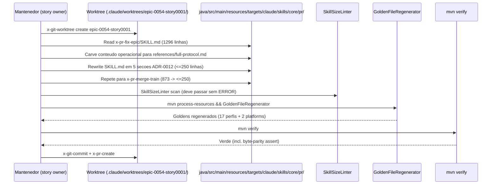

# História: Slim rewrite — PR-domain (x-pr-fix-epic + x-pr-merge-train)

**ID:** story-0054-0001
**Chave Jira:** —
**Status:** Concluída

## 1. Dependências

| Blocked By | Blocks |
| :--- | :--- |
| — | — |

## 2. Regras Transversais Aplicáveis

| ID | Título |
| :--- | :--- |
| RULE-054-01 | Contrato literal ADR-0012 (5 seções canônicas) |
| RULE-054-02 | Atualização mandatória de `audits/skill-size-baseline.txt` |
| RULE-054-03 | Rule 13 preservada em slim body |
| RULE-054-04 | Golden byte-parity preservada |
| RULE-054-05 | Rule 14 compliance (no Java code) |
| RULE-054-06 | RULE-001 source-of-truth |
| RULE-054-08 | Worktree isolation por story |

## 3. Descrição

Como **mantenedor do skill catalog**, eu quero **aplicar o contrato ADR-0012 flipped-orientation às 2 skills PR-domain** (`x-pr-fix-epic` com 1.296 linhas e `x-pr-merge-train` com 873 linhas), garantindo que o body hot-path de cada uma caia para ≤ 250 linhas e o conteúdo operacional completo migre para `references/full-protocol.md` sibling, reduzindo o re-injection cost em cada `Skill()` call.

Estas 2 skills formam a coorte PR-domain por afinidade conceitual: ambas orquestram operações de pull request (x-pr-fix-epic consolida correções cross-PR de um épico; x-pr-merge-train gerencia merge sequencial de stack). Nenhuma das duas tem `references/` pré-épico — carve é limpo, sem drift entre references/ files existentes (diferente de x-release e x-story-plan em outras stories).

Esta é a primeira das 4 stories; serve como "piloto interno" do rollout — estabelecendo o padrão de worktree isolation, prompt SCOPE LOCK para subagentes, e ciclo `mvn process-resources → GoldenFileRegenerator → mvn verify` que as demais stories reutilizarão.

### 3.1 Slim rewrite de x-pr-fix-epic

- Arquivo fonte: `java/src/main/resources/targets/claude/skills/core/pr/x-pr-fix-epic/SKILL.md`
- Linhas atuais: 1.296
- Target body: ≤ 250 linhas (hard limit 500 — WARN tier aceitável mas ideal ≤ 250 por ADR-0012)
- 5 seções canônicas ADR-0012 obrigatórias
- Frontmatter YAML (name, description, allowed-tools) preservado verbatim
- Delegações skill→skill no body (ex: x-pr-fix) convertidas para Rule 13 Pattern 1 INLINE-SKILL se já não estiverem

### 3.2 `references/full-protocol.md` de x-pr-fix-epic

- Criar `java/src/main/resources/targets/claude/skills/core/pr/x-pr-fix-epic/references/full-protocol.md`
- Conteúdo: ~1.046 linhas (body original − ~250 linhas canônicas extraídas)
- Estrutura: fases numeradas do protocolo, exemplos, error handling detalhado, integration notes, recovery playbook
- Cross-link reverso: `> Retorna ao [slim body](../SKILL.md) após leitura da fase requerida.` no topo

### 3.3 Slim rewrite de x-pr-merge-train

- Arquivo fonte: `java/src/main/resources/targets/claude/skills/core/pr/x-pr-merge-train/SKILL.md`
- Linhas atuais: 873
- Target body: ≤ 250 linhas
- 5 seções canônicas ADR-0012 obrigatórias
- Atenção especial: x-pr-merge-train referencia x-pr-watch-ci e x-git-commit — preservar sintaxe Rule 13 Pattern 1 nas delegações
- Slim body cita merge strategies (merge commit vs squash) conforme Rule 09, detalhes em references

### 3.4 `references/full-protocol.md` de x-pr-merge-train

- Criar `java/src/main/resources/targets/claude/skills/core/pr/x-pr-merge-train/references/full-protocol.md`
- Conteúdo: ~623 linhas (body original − ~250 linhas canônicas)
- Estrutura: algoritmo de ordenação topológica, conflict detection, resume logic, exit codes detalhados

### 3.5 Golden regeneration

- Executar `mvn process-resources` (pré-requisito inviolável)
- Executar `GoldenFileRegenerator` para 17 perfis + 2 platform variants (Linux/macOS)
- Verificar byte-parity nos goldens dos caminhos `.claude/skills/x-pr-fix-epic/SKILL.md` e `.claude/skills/x-pr-merge-train/SKILL.md` + novos `references/full-protocol.md`

### 3.6 Baseline update

- Editar `audits/skill-size-baseline.txt`: remover entradas de `x-pr-fix-epic` e `x-pr-merge-train` se presentes
- Verificar staleness test (`SkillSizeLinterBaselineStalenessTest` de EPIC-0046) passa

## 3.5 Entrega de Valor

> O que esta história entrega de valor mensurável para o negócio?

- **Valor Principal:** 2 orchestrators PR-domain em ≤ 250 linhas body cada, reduzindo ~1.700 linhas do hot-path de re-injection (proxy ~10.200 tokens/invocação por skill). Estabelece padrão interno de rollout que as 3 stories subsequentes reutilizam.
- **Métrica de Sucesso:** `wc -l` em `x-pr-fix-epic/SKILL.md` ≤ 250 E `wc -l` em `x-pr-merge-train/SKILL.md` ≤ 250; `SkillSizeLinter` não registra ERROR para nenhuma das 2; golden diff byte-idêntico em 17 perfis + 2 platform variants; `mvn verify` verde.
- **Impacto no Negócio:** Operadores de fluxo PR (x-pr-fix-epic é chamado em loops de correção de épico; x-pr-merge-train em releases com múltiplos PRs) experimentam reduced context overhead; mantenedor ganha confidence no padrão para aplicar às 6 skills restantes.

## 4. Definições de Qualidade Locais

### DoR Local (Definition of Ready)

- [ ] Worktree `.claude/worktrees/epic-0054-story0001/` criado via `x-git-worktree create` a partir de `origin/develop` mais recente
- [ ] Baseline re-medida: `wc -l java/src/main/resources/targets/claude/skills/core/pr/x-pr-fix-epic/SKILL.md` confirmado ~1.296 (tolerância ±50 por eventuais fixups pós-0047)
- [ ] Baseline re-medida: `wc -l java/src/main/resources/targets/claude/skills/core/pr/x-pr-merge-train/SKILL.md` confirmado ~873 (tolerância ±50)
- [ ] `_TEMPLATE-SKILL.md` + ADR-0012 + 5 exemplos piloto de EPIC-0047 (x-test-tdd, x-story-implement, x-git-commit, x-code-format, x-code-lint) lidos como referência de style
- [ ] SCOPE LOCK explícito nos prompts de subagentes de implementação (lição 0047 contra scope creep)

### DoD Local (Definition of Done)

- [ ] `SKILL.md` de x-pr-fix-epic reescrita ≤ 250 linhas body com 5 seções canônicas
- [ ] `references/full-protocol.md` de x-pr-fix-epic criada com carve verbatim do conteúdo operacional
- [ ] `SKILL.md` de x-pr-merge-train reescrita ≤ 250 linhas body com 5 seções canônicas
- [ ] `references/full-protocol.md` de x-pr-merge-train criada com carve verbatim do conteúdo operacional
- [ ] `audits/skill-size-baseline.txt` atualizado (entradas orchestrator removidas se presentes)
- [ ] Rule 13 audit `grep -rnE "^\s*/x-[a-z-]+\s"` nas 2 slim bodies retorna 0 matches
- [ ] `mvn process-resources && GoldenFileRegenerator` executado; byte-parity confirmada em 17 perfis + 2 platform variants
- [ ] `mvn verify` verde (toda a suite, incluindo `SkillSizeLinter`, `LifecycleIntegrityAuditTest`, `Epic0047CompressionSmokeTest`)
- [ ] Tech Lead review 45/45 GO
- [ ] Pelo menos 1 teste automatizado (neste caso: extensão do smoke test de EPIC-0047 ou Epic0054CompressionSmokeTest novo) validando o critério de aceite principal de que as 2 skills caíram ≤ 500 com references
- [ ] Smoke test passando (`Epic0047CompressionSmokeTest` estendido ou `Epic0054CompressionSmokeTest` novo — decidido no início da story)

### Global Definition of Done (DoD)

> Copiar do Épico. Mantido aqui para referência rápida durante code review.

- **Cobertura:** N/A (sem código Java novo)
- **Testes Automatizados:** Golden diff byte-idêntico; `mvn verify` verde; `SkillSizeLinter` OK
- **Relatório de Cobertura:** N/A
- **Documentação:** CHANGELOG `[Unreleased]` entry parcial desta story
- **Persistência:** N/A
- **Performance:** Assembly não regride > 10%

## 5. Contratos de Dados (Data Contract)

> Esta story NÃO introduz request/response/event schemas — ela refatora arquivos `.md`. Contratos abaixo descrevem **file invariants** pós-story.

### 5.1 File invariants — x-pr-fix-epic

| Arquivo | Tipo | M/O | Validações | Exemplo |
| :--- | :--- | :--- | :--- | :--- |
| `java/src/main/resources/targets/claude/skills/core/pr/x-pr-fix-epic/SKILL.md` | Markdown + YAML frontmatter | M | Body ≤ 250 linhas; contém exatamente 5 seções top-level (`## Triggers`, `## Parameters`, `## Output Contract`, `## Error Envelope`, `## Full Protocol`); frontmatter preserva `name`, `description`, `allowed-tools` inalterados | Body começa com `---\nname: x-pr-fix-epic\n...\n---\n\n## Triggers\n...` |
| `java/src/main/resources/targets/claude/skills/core/pr/x-pr-fix-epic/references/full-protocol.md` | Markdown | M | Não-vazio (> 100 linhas); cross-link reverso para SKILL.md no topo; sem frontmatter YAML (é referência, não skill) | Começa com `> Returns to [slim body](../SKILL.md) after required phase.\n\n## Phase 1 — ...` |

### 5.2 File invariants — x-pr-merge-train

| Arquivo | Tipo | M/O | Validações | Exemplo |
| :--- | :--- | :--- | :--- | :--- |
| `java/src/main/resources/targets/claude/skills/core/pr/x-pr-merge-train/SKILL.md` | Markdown + YAML frontmatter | M | Body ≤ 250 linhas; 5 seções canônicas; frontmatter preservado | Análogo a 5.1 |
| `java/src/main/resources/targets/claude/skills/core/pr/x-pr-merge-train/references/full-protocol.md` | Markdown | M | Não-vazio; cross-link reverso; sem frontmatter | Análogo a 5.1 |

### 5.3 Error Codes Mapeados

| HTTP Status | Error Code | Condição | Mensagem (RFC 7807) |
| :--- | :--- | :--- | :--- |

> N/A — story refactora `.md` files; errors surgem via `SkillSizeLinter`, `mvn verify` failures ou golden diff mismatches. Não há endpoint novo.

### 5.4 Event Schema (para event-driven)

> N/A (projeto não é event-driven; `eventDriven: false` em `01-project-identity.md`).

## 6. Diagramas

### 6.1 Fluxo de carve-out por skill



## 7. Critérios de Aceite (Gherkin)

```gherkin
Cenario: Degenerado — SKILL.md vazio ou sem 5 secoes falha a story
  DADO que o mantenedor carved x-pr-fix-epic/SKILL.md mas omitiu a secao "## Error Envelope"
  QUANDO SkillSizeLinter ou revisor Tech Lead inspeciona o body
  ENTAO o contrato RULE-054-01 e flagrado como violacao
  E o commit e revertido antes do merge

Cenario: Happy path — ambas skills slim + references criadas + goldens verdes
  DADO que x-pr-fix-epic/SKILL.md foi reescrita para 240 linhas com 5 secoes canonicas
  E x-pr-fix-epic/references/full-protocol.md contem o carve operacional completo
  E x-pr-merge-train/SKILL.md foi reescrita para 230 linhas com 5 secoes canonicas
  E x-pr-merge-train/references/full-protocol.md contem o carve operacional completo
  QUANDO o mantenedor executa mvn process-resources && GoldenFileRegenerator && mvn verify
  ENTAO todos os testes passam em 17 perfis + 2 platform variants
  E SkillSizeLinter nao registra ERROR para nenhuma das 2 skills
  E audits/skill-size-baseline.txt nao contem entradas para x-pr-fix-epic ou x-pr-merge-train
  E Rule 13 audit retorna 0 matches em ambos slim bodies

Cenario: Erro — baseline staleness test falha por entry dead-letter
  DADO que o mantenedor carved x-pr-fix-epic para 240 linhas mas esqueceu de remover a entrada do baseline
  QUANDO mvn verify executa o SkillSizeLinterBaselineStalenessTest (de EPIC-0046)
  ENTAO o test falha com "DEAD_LETTER_BASELINE_ENTRY: x-pr-fix-epic"
  E o commit e bloqueado antes do merge

Cenario: Erro — golden diff mismatch por frontmatter alterado
  DADO que o mantenedor inadvertidamente alterou o campo "description" do frontmatter de x-pr-merge-train durante o rewrite
  QUANDO GoldenFileRegenerator compara o output gerado com o golden de referencia
  ENTAO o teste falha com "GOLDEN_DIFF: x-pr-merge-train.SKILL.md frontmatter.description differs"
  E o mantenedor restaura o frontmatter original antes de prosseguir

Cenario: Erro — Rule 13 violation no slim body
  DADO que o mantenedor escreveu "Invoke /x-pr-fix" no body de x-pr-fix-epic/SKILL.md fora de ## Triggers / ## Examples
  QUANDO o audit grep de Rule 13 e executado
  ENTAO o grep retorna 1 match (violacao)
  E o Tech Lead gate bloqueia o GO ate conversao para Skill(skill: "x-pr-fix", ...)

Cenario: Boundary at-max — SKILL.md em exatamente 500 linhas passa WARN, nao ERROR
  DADO que x-pr-merge-train/SKILL.md foi reescrita para 500 linhas exatas (hard limit ADR-0012)
  E references/full-protocol.md sibling existe e e nao-vazio
  QUANDO SkillSizeLinter scan executa
  ENTAO emite WARNING (>250 <500) mas NAO ERROR
  E a story pode mergear com review explicito do Tech Lead

Cenario: Boundary past-max — SKILL.md em 501 linhas sem references falha hard
  DADO que x-pr-fix-epic/SKILL.md ficou em 501 linhas por carve incompleto
  E references/full-protocol.md nao existe ou esta vazio
  QUANDO SkillSizeLinter scan executa
  ENTAO emite ERROR (bloqueia CI) com "SIZE_EXCEEDED_NO_REFERENCES: x-pr-fix-epic"
  E o commit e revertido
```

### 7.1 Scenario Ordering (TPP)

Scenarios ordenados simples → complexo: degenerate (secao faltante) → happy path → erro (baseline staleness) → erro (golden diff) → erro (Rule 13) → boundary (at-max) → boundary (past-max).

### 7.2 Mandatory Scenario Categories

- [x] Degenerate cases (SKILL.md incompleto)
- [x] Happy path (ambas skills slim + goldens verdes)
- [x] Error paths (baseline staleness, golden diff, Rule 13 violation)
- [x] Boundary values (at-max 500, past-max 501)

### 7.3 TDD Implementation Notes

- **Outer loop (acceptance):** `Epic0047CompressionSmokeTest` estendido OU novo `Epic0054CompressionSmokeTest` asserta as 2 skills ≤ 500 linhas com `references/full-protocol.md` sibling.
- **Inner loop:** Não há código Java novo nesta story (RULE-054-05). O "Red-Green-Refactor" é substituído por ciclo `read original → carve → golden regen → verify diff`.
- **Walking skeleton:** primeiro fazer x-pr-merge-train (menor, 873 linhas) para validar pipeline, depois aplicar aprendizados a x-pr-fix-epic (1296, maior).

## 8. Tasks

> Cada task = 1 branch = 1 PR atômico. Mínimo 3, máximo 8 tasks por story. Sizing M (50-150 LOC markdown equivalente).

### Valid Testability Patterns (RULE-002 / SD-12)

Esta story não introduz código Java; usa padrão **Config + VerificationTest** (edits `.md` + golden/smoke verification).

### TASK-0054-0001-001: Carve x-pr-merge-train (walking skeleton do padrão)

- **Layer:** Config (arquivos markdown de skill)
- **Test Type:** Verification (golden diff + SkillSizeLinter)
- **Size:** M (873 linhas → ≤250 + ~623 em references)
- **Dependencies:** —
- **Branch:** `feat/task-0054-0001-001-slim-x-pr-merge-train`
- **Testability:** Config + VerificationTest (edit markdown + mvn verify valida)
- **Files:**
  - `java/src/main/resources/targets/claude/skills/core/pr/x-pr-merge-train/SKILL.md` (rewrite)
  - `java/src/main/resources/targets/claude/skills/core/pr/x-pr-merge-train/references/full-protocol.md` (new)
  - `audits/skill-size-baseline.txt` (remove entry se presente)
  - `src/test/resources/golden/**` (regenerado)
- **Acceptance Criteria:**
  - [ ] Body ≤ 250 linhas com 5 seções canônicas
  - [ ] references/full-protocol.md criado e não-vazio
  - [ ] `SkillSizeLinter` sem ERROR
  - [ ] `mvn verify` verde
  - [ ] Rule 13 audit 0 matches

### TASK-0054-0001-002: Carve x-pr-fix-epic (aplicando padrão da 001)

- **Layer:** Config
- **Test Type:** Verification
- **Size:** L (1296 linhas → ≤250 + ~1.046 em references; tamanho L aceito por causa do corpus a carved, não por complexidade de codigo)
- **Dependencies:** TASK-0054-0001-001 (aprendizado do padrão)
- **Branch:** `feat/task-0054-0001-002-slim-x-pr-fix-epic`
- **Testability:** Config + VerificationTest
- **Files:**
  - `java/src/main/resources/targets/claude/skills/core/pr/x-pr-fix-epic/SKILL.md` (rewrite)
  - `java/src/main/resources/targets/claude/skills/core/pr/x-pr-fix-epic/references/full-protocol.md` (new)
  - `audits/skill-size-baseline.txt` (remove entry se presente)
  - `src/test/resources/golden/**` (regenerado)
- **Acceptance Criteria:**
  - [ ] Body ≤ 250 linhas com 5 seções canônicas
  - [ ] references/full-protocol.md criado e não-vazio
  - [ ] `SkillSizeLinter` sem ERROR
  - [ ] `mvn verify` verde
  - [ ] Rule 13 audit 0 matches

### TASK-0054-0001-003: Smoke/E2E — estender Epic0047CompressionSmokeTest ou criar Epic0054CompressionSmokeTest

- **Layer:** Test
- **Test Type:** Smoke
- **Size:** S (~40 LOC Java — extensão de assertions existentes)
- **Dependencies:** TASK-0054-0001-001, TASK-0054-0001-002
- **Branch:** `test/task-0054-0001-003-smoke-assert-pr-domain`
- **Testability:** Config + VerificationTest (smoke test)
- **Files:**
  - `java/src/test/java/dev/iadev/smoke/Epic0047CompressionSmokeTest.java` (estender) OU `java/src/test/java/dev/iadev/smoke/Epic0054CompressionSmokeTest.java` (criar) — decidir no início da task
- **Acceptance Criteria:**
  - [ ] Asserta x-pr-fix-epic/SKILL.md ≤ 500 linhas com references/full-protocol.md sibling
  - [ ] Asserta x-pr-merge-train/SKILL.md ≤ 500 linhas com references/full-protocol.md sibling
  - [ ] Asserta audits/skill-size-baseline.txt não contém entry para nenhuma das 2
  - [ ] `mvn verify` verde com a nova assertion ativa

### TASK-0054-0001-004: CHANGELOG + PR consolidado

- **Layer:** Doc
- **Test Type:** Verification (lint CHANGELOG)
- **Size:** S (<20 LOC — entry CHANGELOG + PR body)
- **Dependencies:** TASK-0054-0001-001, 002, 003
- **Branch:** `docs/task-0054-0001-004-changelog-story0001`
- **Testability:** Doc-only; verification via manual review
- **Files:**
  - `CHANGELOG.md` (entry `[Unreleased]` parcial desta story)
- **Acceptance Criteria:**
  - [ ] Entry `[Unreleased]` lista x-pr-fix-epic + x-pr-merge-train migrados
  - [ ] PR body referencia epic-0054 e esta story
  - [ ] Tech Lead review 45/45 GO
