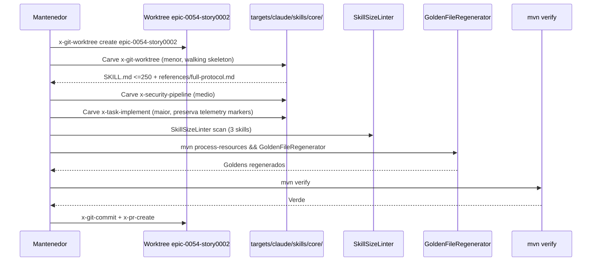

# História: Slim rewrite — Medium orchestrators (x-task-implement + x-security-pipeline + x-git-worktree)

**ID:** story-0054-0002
**Chave Jira:** —
**Status:** Pendente

## 1. Dependências

| Blocked By | Blocks |
| :--- | :--- |
| — | — |

## 2. Regras Transversais Aplicáveis

| ID | Título |
| :--- | :--- |
| RULE-054-01 | Contrato literal ADR-0012 (5 seções canônicas) |
| RULE-054-02 | Atualização mandatória de `audits/skill-size-baseline.txt` |
| RULE-054-03 | Rule 13 preservada em slim body |
| RULE-054-04 | Golden byte-parity preservada |
| RULE-054-05 | Rule 14 compliance (no Java code) |
| RULE-054-06 | RULE-001 source-of-truth |
| RULE-054-08 | Worktree isolation por story |

## 3. Descrição

Como **mantenedor do skill catalog**, eu quero **aplicar o contrato ADR-0012 flipped-orientation às 3 skills médias** (`x-task-implement` com 821 linhas, `x-security-pipeline` com 576 linhas e `x-git-worktree` com 568 linhas), garantindo que cada body hot-path caia para ≤ 250 linhas com `references/full-protocol.md` sibling, completando o tier "medium-impact" do épico antes de atacar os dois XL orchestrators.

Esta coorte agrupa as 3 skills orchestrator com: (a) tamanho 500-900 linhas (margem menor sobre hard limit 500), (b) sem `references/` pré-épico (carve limpo), e (c) baixa inter-dependência prose-level com outras skills do épico. São executáveis em paralelo com story-0054-0001 (sem arquivos compartilhados conforme RULE-054-08). x-task-implement tem singular relevância: é chamada em loop por x-story-implement (já slim desde EPIC-0047), então o ganho de token cost tem amplificação no workflow de TDD.

Esta story pode rodar em paralelo total com story-0054-0001 (nenhum arquivo compartilhado; apenas `audits/skill-size-baseline.txt` e `CHANGELOG.md` são hotspots — ambos editáveis de forma não-colidente conforme padrão de EPIC-0047).

### 3.1 Slim rewrite de x-task-implement

- Arquivo fonte: `java/src/main/resources/targets/claude/skills/core/dev/x-task-implement/SKILL.md`
- Linhas atuais: 821
- Target body: ≤ 250 linhas
- 5 seções canônicas ADR-0012
- Atenção: skill é schema-aware (v1 legado + v2 task-first EPIC-0038) — slim body preserva ambos modos no Output Contract; detalhes algorítmicos (TDD cycle invocation, `x-test-tdd` delegation) vão para references
- Preservar marcadores de telemetria `phase.start`/`phase.end` (Rule 13 telemetry markers)

### 3.2 `references/full-protocol.md` de x-task-implement

- Criar em `.../x-task-implement/references/full-protocol.md`
- ~570 linhas (body original − ~250 canônicas)
- Estrutura: schema dispatch logic (v1 vs v2), TDD Red-Green-Refactor execution detail, `x-test-tdd` + `x-git-commit` delegation sequencing, post-condition verification via grep

### 3.3 Slim rewrite de x-security-pipeline

- Arquivo fonte: `java/src/main/resources/targets/claude/skills/core/security/x-security-pipeline/SKILL.md`
- Linhas atuais: 576
- Target body: ≤ 250 linhas
- 5 seções canônicas ADR-0012
- Atenção: skill configurável por `SecurityConfig` flags (minimal vs full mode) e suporte a 3 CI platforms (GitHub Actions, GitLab CI, Azure DevOps) — slim body cita contratos, detalhes por plataforma vão para references

### 3.4 `references/full-protocol.md` de x-security-pipeline

- Criar em `.../x-security-pipeline/references/full-protocol.md`
- ~325 linhas
- Estrutura: stage composition per-platform, SARIF artifact upload, severity threshold configuration, tool mapping (Semgrep, Trivy, Syft/Grype)

### 3.5 Slim rewrite de x-git-worktree

- Arquivo fonte: `java/src/main/resources/targets/claude/skills/core/git/x-git-worktree/SKILL.md`
- Linhas atuais: 568
- Target body: ≤ 250 linhas
- 5 seções canônicas ADR-0012
- Atenção: skill é a "infraestrutura" de worktree lifecycle usada por x-story-implement, x-task-implement, x-epic-implement — slim body cita operations (`create`, `list`, `remove`, `cleanup`, `detect-context`), detalhes em references incluindo ADR-0004 §D2 cross-links

### 3.6 `references/full-protocol.md` de x-git-worktree

- Criar em `.../x-git-worktree/references/full-protocol.md`
- ~320 linhas
- Estrutura: naming convention rules (Rule 14 Worktree Lifecycle), cleanup algorithm, context detection heuristics, edge cases (uncommitted changes, stale locks)

### 3.7 Golden regeneration

- Executar `mvn process-resources` (pré-requisito inviolável)
- Executar `GoldenFileRegenerator` para 17 perfis + 2 platform variants
- Verificar byte-parity nos 3 SKILL.md + 3 novos `references/full-protocol.md`

### 3.8 Baseline update

- Editar `audits/skill-size-baseline.txt`: remover entradas dos 3 se presentes

## 3.5 Entrega de Valor

> O que esta história entrega de valor mensurável para o negócio?

- **Valor Principal:** 3 orchestrators médios em ≤ 250 linhas body cada, reduzindo ~1.200 linhas do hot-path de re-injection (proxy ~7.200 tokens/invocação agregado). x-task-implement em particular ganha amplificação de economia por ser chamada em loop pelo workflow TDD.
- **Métrica de Sucesso:** `wc -l` nas 3 SKILL.md resultantes ≤ 250 cada; `SkillSizeLinter` sem ERROR; golden diff byte-idêntico em 17 perfis + 2 platform variants; `mvn verify` verde.
- **Impacto no Negócio:** Workflow `x-story-implement → x-task-implement → x-test-tdd` (ciclo TDD padrão de EPIC-0038) reduz cost de context per task; mantenedores ganham padrão aplicável a skills médias sem partial-carves prévios.

## 4. Definições de Qualidade Locais

### DoR Local (Definition of Ready)

- [ ] Worktree `.claude/worktrees/epic-0054-story0002/` criado via `x-git-worktree create`
- [ ] Baselines re-medidas para as 3 skills (tolerância ±50)
- [ ] Decisão de paralelismo com story-0054-0001: se rodarem em paralelo, verificar que `audits/skill-size-baseline.txt` recebe append ordering (merge conflict evitado por seção alfabética)
- [ ] SCOPE LOCK explícito nos prompts de subagentes

### DoD Local (Definition of Done)

- [ ] `SKILL.md` de x-task-implement reescrita ≤ 250 linhas body com 5 seções canônicas
- [ ] `references/full-protocol.md` de x-task-implement criada
- [ ] `SKILL.md` de x-security-pipeline reescrita ≤ 250 linhas body com 5 seções canônicas
- [ ] `references/full-protocol.md` de x-security-pipeline criada
- [ ] `SKILL.md` de x-git-worktree reescrita ≤ 250 linhas body com 5 seções canônicas
- [ ] `references/full-protocol.md` de x-git-worktree criada
- [ ] `audits/skill-size-baseline.txt` atualizado
- [ ] Rule 13 audit `grep -rnE "^\s*/x-[a-z-]+\s"` nas 3 slim bodies retorna 0 matches
- [ ] Marcadores de telemetria (phase.start/phase.end) preservados em x-task-implement
- [ ] `mvn process-resources && GoldenFileRegenerator && mvn verify` verde
- [ ] Tech Lead review 45/45 GO
- [ ] Pelo menos 1 teste automatizado (extensão do smoke test) validando critério principal
- [ ] Smoke test passando

### Global Definition of Done (DoD)

> Copiar do Épico.

- **Cobertura:** N/A
- **Testes Automatizados:** Golden diff byte-idêntico; `mvn verify` verde
- **Relatório de Cobertura:** N/A
- **Documentação:** CHANGELOG `[Unreleased]` entry parcial
- **Persistência:** N/A
- **Performance:** Assembly não regride > 10%

## 5. Contratos de Dados (Data Contract)

### 5.1 File invariants — 3 skills médias

| Arquivo | Tipo | M/O | Validações | Exemplo |
| :--- | :--- | :--- | :--- | :--- |
| `.../dev/x-task-implement/SKILL.md` | Markdown + YAML | M | Body ≤ 250 linhas; 5 seções canônicas; frontmatter (name, description, allowed-tools) preservado; telemetry markers `phase.start`/`phase.end` presentes | `## Triggers\n...\n## Parameters\n...\n## Output Contract\n...\n## Error Envelope\n...\n## Full Protocol\nSee references/full-protocol.md` |
| `.../dev/x-task-implement/references/full-protocol.md` | Markdown | M | Não-vazio; cross-link reverso; detalha schema dispatch v1/v2 | — |
| `.../security/x-security-pipeline/SKILL.md` | Markdown + YAML | M | Body ≤ 250 linhas; 5 seções canônicas | — |
| `.../security/x-security-pipeline/references/full-protocol.md` | Markdown | M | Não-vazio; stage composition per-platform | — |
| `.../git/x-git-worktree/SKILL.md` | Markdown + YAML | M | Body ≤ 250 linhas; 5 seções canônicas | — |
| `.../git/x-git-worktree/references/full-protocol.md` | Markdown | M | Não-vazio; naming convention + cleanup detalhados | — |

### 5.2 Response

> N/A — story refactora `.md` files.

### 5.3 Error Codes Mapeados

> N/A — erros surgem de `SkillSizeLinter`, golden diff, `mvn verify`.

### 5.4 Event Schema

> N/A.

## 6. Diagramas

### 6.1 Fluxo de carve-out (reuso do padrão de story-0054-0001)



## 7. Critérios de Aceite (Gherkin)

```gherkin
Cenario: Degenerado — SKILL.md de x-task-implement perde telemetry markers durante carve
  DADO que o mantenedor reescreveu x-task-implement/SKILL.md removendo <!-- TELEMETRY: phase.start --> por engano
  QUANDO TelemetryMarkerLint executa em mvn verify
  ENTAO o teste falha com "UNCLOSED_START ou DANGLING_END"
  E o commit e bloqueado antes do merge

Cenario: Happy path — 3 skills medias slim + references + goldens verdes
  DADO que as 3 skills medias foram reescritas para <=250 linhas com 5 secoes canonicas
  E cada uma tem references/full-protocol.md nao-vazio
  QUANDO o mantenedor executa mvn process-resources && GoldenFileRegenerator && mvn verify
  ENTAO todos os testes passam
  E SkillSizeLinter nao registra ERROR
  E TelemetryMarkerLint passa (markers preservados em x-task-implement)
  E Rule 13 audit retorna 0 matches em todos os 3 slim bodies

Cenario: Erro — x-security-pipeline slim omite suporte a 3 platforms (GitHub/GitLab/Azure)
  DADO que o mantenedor carved x-security-pipeline/SKILL.md mas mencionou apenas GitHub Actions no slim body
  QUANDO Tech Lead review consulta a secao Parameters e Output Contract
  ENTAO o review bloqueia o GO ate o slim body referenciar as 3 platforms (detalhes em references)
  E a task e revertida

Cenario: Erro — x-git-worktree slim omite operation "detect-context"
  DADO que o mantenedor listou apenas create/list/remove/cleanup no Parameters de x-git-worktree/SKILL.md
  QUANDO skills consumidoras (x-task-implement) tentam Skill(skill: "x-git-worktree", args: "detect-context")
  ENTAO o LLM nao localiza a operation no slim body e falha o hand-off
  E a story e re-aberta para incluir detect-context no slim Parameters

Cenario: Boundary at-min — skill em exatamente 200 linhas (abaixo do target 250) e aceita
  DADO que x-git-worktree/SKILL.md foi reescrita para 198 linhas (carve agressivo)
  E references/full-protocol.md contem o conteudo operacional
  QUANDO SkillSizeLinter scan executa
  ENTAO passa sem WARN nem ERROR (< 250 ideal)
  E a story mergea sem fricao

Cenario: Boundary past-max — slim body em 501 linhas sem references bloqueia CI
  DADO que x-task-implement/SKILL.md carved ficou em 501 linhas porque as 5 secoes ficaram verbosas demais
  E references/full-protocol.md nao foi criada
  QUANDO SkillSizeLinter scan executa
  ENTAO emite ERROR "SIZE_EXCEEDED_NO_REFERENCES"
  E o commit e revertido

Cenario: Boundary at-max — slim body em 500 linhas com references passa com WARN
  DADO que x-task-implement/SKILL.md carved ficou em 500 linhas exatos
  E references/full-protocol.md existe e e nao-vazio
  QUANDO SkillSizeLinter scan executa
  ENTAO emite WARNING (>250 <500) mas NAO ERROR
  E a task pode mergear com review explicito
```

### 7.1 Scenario Ordering (TPP)

Ordenados: degenerate (telemetry markers faltantes) → happy path → erros (platform omission, operation omission) → boundaries (at-min 198, past-max 501, at-max 500).

### 7.2 Mandatory Scenario Categories

- [x] Degenerate cases (markers faltantes)
- [x] Happy path (3 skills slim verdes)
- [x] Error paths (platform omission, operation omission)
- [x] Boundary values (at-min 198, past-max 501, at-max 500)

### 7.3 TDD Implementation Notes

- **Outer loop:** `Epic0047CompressionSmokeTest` estendido / `Epic0054CompressionSmokeTest` asserta as 3 skills ≤ 500 com references.
- **Inner loop:** Para x-task-implement, `TelemetryMarkerLintTest` verifica markers; para as outras 2, golden diff é o validador.
- **Walking skeleton:** começar por x-git-worktree (568 linhas, menor) para validar padrão, depois x-security-pipeline, depois x-task-implement (maior + telemetry markers).

## 8. Tasks

### TASK-0054-0002-001: Carve x-git-worktree (walking skeleton desta coorte)

- **Layer:** Config
- **Test Type:** Verification
- **Size:** M (568 → ≤250 + ~320 em references)
- **Dependencies:** —
- **Branch:** `feat/task-0054-0002-001-slim-x-git-worktree`
- **Testability:** Config + VerificationTest
- **Files:**
  - `java/src/main/resources/targets/claude/skills/core/git/x-git-worktree/SKILL.md`
  - `java/src/main/resources/targets/claude/skills/core/git/x-git-worktree/references/full-protocol.md`
  - `audits/skill-size-baseline.txt`
  - `src/test/resources/golden/**` (regenerado)
- **Acceptance Criteria:**
  - [ ] Body ≤ 250 linhas com 5 seções canônicas
  - [ ] references/full-protocol.md criado
  - [ ] Operations `create`/`list`/`remove`/`cleanup`/`detect-context` todas listadas no slim Parameters
  - [ ] `SkillSizeLinter` sem ERROR
  - [ ] `mvn verify` verde

### TASK-0054-0002-002: Carve x-security-pipeline

- **Layer:** Config
- **Test Type:** Verification
- **Size:** M (576 → ≤250 + ~325 em references)
- **Dependencies:** TASK-0054-0002-001 (aprendizado do padrão)
- **Branch:** `feat/task-0054-0002-002-slim-x-security-pipeline`
- **Testability:** Config + VerificationTest
- **Files:**
  - `java/src/main/resources/targets/claude/skills/core/security/x-security-pipeline/SKILL.md`
  - `java/src/main/resources/targets/claude/skills/core/security/x-security-pipeline/references/full-protocol.md`
  - `audits/skill-size-baseline.txt`
  - `src/test/resources/golden/**`
- **Acceptance Criteria:**
  - [ ] Body ≤ 250 linhas com 5 seções canônicas
  - [ ] references/full-protocol.md criado (detalhes de 3 platforms)
  - [ ] Slim Parameters cita as 3 platforms (GitHub/GitLab/Azure)
  - [ ] `SkillSizeLinter` sem ERROR
  - [ ] `mvn verify` verde

### TASK-0054-0002-003: Carve x-task-implement (preserva telemetry markers)

- **Layer:** Config
- **Test Type:** Verification
- **Size:** L (821 → ≤250 + ~570 em references)
- **Dependencies:** TASK-0054-0002-001, 002
- **Branch:** `feat/task-0054-0002-003-slim-x-task-implement`
- **Testability:** Config + VerificationTest
- **Files:**
  - `java/src/main/resources/targets/claude/skills/core/dev/x-task-implement/SKILL.md`
  - `java/src/main/resources/targets/claude/skills/core/dev/x-task-implement/references/full-protocol.md`
  - `audits/skill-size-baseline.txt`
  - `src/test/resources/golden/**`
- **Acceptance Criteria:**
  - [ ] Body ≤ 250 linhas com 5 seções canônicas
  - [ ] Telemetry markers `phase.start`/`phase.end` preservados (TelemetryMarkerLint passa)
  - [ ] Schema dispatch v1/v2 mencionado no slim Output Contract
  - [ ] references/full-protocol.md criado
  - [ ] `SkillSizeLinter` sem ERROR
  - [ ] `mvn verify` verde

### TASK-0054-0002-004: Smoke/E2E — assertions para 3 skills médias

- **Layer:** Test
- **Test Type:** Smoke
- **Size:** S (~30 LOC Java)
- **Dependencies:** TASK-0054-0002-001, 002, 003
- **Branch:** `test/task-0054-0002-004-smoke-assert-medium-3`
- **Testability:** Config + VerificationTest (smoke)
- **Files:**
  - `java/src/test/java/dev/iadev/smoke/Epic0047CompressionSmokeTest.java` (estender) OU `Epic0054CompressionSmokeTest.java`
- **Acceptance Criteria:**
  - [ ] Asserta 3 SKILL.md ≤ 500 com references/full-protocol.md sibling
  - [ ] Asserta audits/skill-size-baseline.txt não contém entries para as 3
  - [ ] `mvn verify` verde

### TASK-0054-0002-005: CHANGELOG + PR consolidado

- **Layer:** Doc
- **Test Type:** Verification
- **Size:** S (<20 LOC)
- **Dependencies:** TASK-0054-0002-001, 002, 003, 004
- **Branch:** `docs/task-0054-0002-005-changelog-story0002`
- **Testability:** Doc-only
- **Files:**
  - `CHANGELOG.md`
- **Acceptance Criteria:**
  - [ ] Entry `[Unreleased]` lista x-task-implement, x-security-pipeline, x-git-worktree migrados
  - [ ] PR body referencia epic-0054 e story-0054-0002
  - [ ] Tech Lead review 45/45 GO
