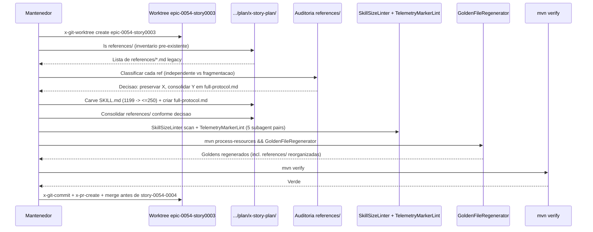

# História: Slim rewrite — x-story-plan (com partial-carve existente)

**ID:** story-0054-0003
**Chave Jira:** —
**Status:** Pendente

## 1. Dependências

| Blocked By | Blocks |
| :--- | :--- |
| — | story-0054-0004 |

## 2. Regras Transversais Aplicáveis

| ID | Título |
| :--- | :--- |
| RULE-054-01 | Contrato literal ADR-0012 (5 seções canônicas) |
| RULE-054-02 | Atualização mandatória de `audits/skill-size-baseline.txt` |
| RULE-054-03 | Rule 13 preservada em slim body |
| RULE-054-04 | Golden byte-parity preservada |
| RULE-054-05 | Rule 14 compliance (no Java code) |
| RULE-054-06 | RULE-001 source-of-truth |
| RULE-054-07 | Ordering Story C antes de Story D |
| RULE-054-08 | Worktree isolation por story |

## 3. Descrição

Como **mantenedor do skill catalog**, eu quero **aplicar o contrato ADR-0012 flipped-orientation à skill `x-story-plan` (1.199 linhas)**, garantindo que o body caia para ≤ 250 linhas com consolidação das `references/` pré-existentes (carve parcial histórico), para que `x-epic-implement` (atacada em story-0054-0004) possa referenciar x-story-plan no estado final carved sem drift posterior.

x-story-plan é uma skill com **partial-carve herdado**: antes deste épico ela já tinha algumas `references/*.md` de sweeps anteriores. Este fato cria risco diferenciado vs stories 0001 e 0002: não é um carve em green-field; é uma reorganização consolidando references/ existentes no novo contrato canônico `references/full-protocol.md`. Exige auditoria prévia de cross-links entre references/ existentes e decisão explícita: manter references/ especializadas (se semanticamente independentes) ou consolidar tudo em full-protocol.md (se fragmentação é incidental).

Esta story **bloqueia** story-0054-0004 por RULE-054-07: x-epic-implement (story 0004) delega para x-story-plan na sua prose; se 0004 rodar antes de 0003, o carve de 0004 apontaria para referências que 0003 vai reorganizar, exigindo re-trabalho. Ordering crítico documentado em IMPLEMENTATION-MAP.md.

x-story-plan é a skill que dispatcha 5 subagentes paralelos (Architect, QA, Security, Tech Lead, Product Owner) para planning de story. Os marcadores de telemetria subagent-start/subagent-end DEVEM ser preservados (EPIC-0040 contract).

### 3.1 Auditoria prévia de references/ existentes em x-story-plan

- Listar conteúdo de `java/src/main/resources/targets/claude/skills/core/plan/x-story-plan/references/` (se existir)
- Para cada `references/*.md` existente, classificar:
  - **Semanticamente independente** (ex: `references/architect-role.md` descreve um papel especifico) → manter como arquivo separado, slim body cita via link
  - **Fragmentação incidental** (ex: pedaço arbitrário de um protocolo que cabe em full-protocol.md) → consolidar em `references/full-protocol.md`
- Documentar decisão em TASK-0054-0003-001 antes de editar SKILL.md

### 3.2 Slim rewrite de x-story-plan

- Arquivo fonte: `java/src/main/resources/targets/claude/skills/core/plan/x-story-plan/SKILL.md`
- Linhas atuais: 1.199
- Target body: ≤ 250 linhas
- 5 seções canônicas ADR-0012
- Preservar subagent-start/subagent-end telemetry markers (5 papéis paralelos)
- Preservar Rule 13 Pattern 2 SUBAGENT-GENERAL delegations (5 `Agent(subagent_type: "general-purpose", ...)` calls)
- Schema-aware: skill tem v1 legado + v2 task-first (EPIC-0038 adicionou Phases 4a-4c); slim body cita ambos no Output Contract

### 3.3 `references/full-protocol.md` de x-story-plan

- Criar/reorganizar em `.../x-story-plan/references/full-protocol.md`
- ~950 linhas (body original − ~250 canônicas)
- Estrutura: 5-agent parallel wave (prompt-by-role para Architect, QA, Security, Tech Lead, PO), schema dispatch v1 vs v2, Phases 4a-4c task emission logic, DoR validation algorithm, consolidated task breakdown assembly
- Se references/ pré-existentes forem preservadas: `references/full-protocol.md` é o "master doc" que cross-links para os specializados

### 3.4 Preservação de references/ pré-existentes (decisão caso-a-caso)

- Dependendo da auditoria de 3.1, references/ existentes:
  - Ficam (semântica independente) → slim body cita via link relativo em `## Full Protocol`
  - Consolidam-se em full-protocol.md → arquivo pré-existente é deletado

### 3.5 Golden regeneration

- Executar `mvn process-resources` (pré-requisito inviolável)
- Executar `GoldenFileRegenerator` para 17 perfis + 2 platform variants
- Byte-parity especialmente cuidadosa: references/ pré-existentes podem ter sido parcialmente re-organizadas; goldens dessas references DEVEM refletir nova organização

### 3.6 Baseline update

- Editar `audits/skill-size-baseline.txt`: remover entry de x-story-plan se presente (provavelmente SIM — baseline 25-entry de EPIC-0047 pode incluir esta skill dependendo de estado pré-épico das references)

## 3.5 Entrega de Valor

> O que esta história entrega de valor mensurável para o negócio?

- **Valor Principal:** x-story-plan em ≤ 250 linhas body, reduzindo ~950 linhas do hot-path (proxy ~5.700 tokens/invocação) **e** estabelecendo âncora arquitetural estável para que story-0054-0004 reescreva x-epic-implement referenciando o estado final carved de x-story-plan (sem drift pós-merge).
- **Métrica de Sucesso:** `wc -l` em `x-story-plan/SKILL.md` ≤ 250; `references/full-protocol.md` não-vazia; subagent telemetry markers preservados; Rule 13 Pattern 2 (5x Agent calls) preservado; golden diff byte-idêntico em 17 perfis + 2 platforms; `mvn verify` verde; audit de cross-links com references/ pré-existentes documentado.
- **Impacto no Negócio:** Desbloqueio de story-0054-0004 (x-epic-implement + x-release) com âncora estável; workflow de planning de story (5-agent wave) preserva comportamento com body mais leve; mantenedores ganham padrão para skills com partial-carve histórico aplicável a futuras.

## 4. Definições de Qualidade Locais

### DoR Local (Definition of Ready)

- [ ] Worktree `.claude/worktrees/epic-0054-story0003/` criado via `x-git-worktree create`
- [ ] Baseline re-medida: `wc -l .../x-story-plan/SKILL.md` confirma ~1.199 (tolerância ±50)
- [ ] Inventário de `references/*.md` pré-existentes de x-story-plan completo (listagem + tamanho + semântica)
- [ ] Decisão de consolidação vs preservação por references/ pré-existente documentada antes de TASK-002 iniciar
- [ ] SCOPE LOCK explícito nos prompts de subagentes

### DoD Local (Definition of Done)

- [ ] `SKILL.md` de x-story-plan reescrita ≤ 250 linhas body com 5 seções canônicas
- [ ] `references/full-protocol.md` criada com conteúdo operacional consolidado
- [ ] references/ pré-existentes tratadas conforme decisão da auditoria (preservadas OU consolidadas)
- [ ] Cross-links das references/ preservadas apontam para destinos válidos
- [ ] Subagent telemetry markers preservados (5 pairs — Architect, QA, Security, Tech Lead, PO)
- [ ] Rule 13 Pattern 2 SUBAGENT-GENERAL preservado (5 `Agent(subagent_type: "general-purpose", ...)` calls) no slim body
- [ ] `audits/skill-size-baseline.txt` atualizado
- [ ] Rule 13 audit `grep -rnE "^\s*/x-[a-z-]+\s"` no slim body retorna 0 matches
- [ ] `mvn process-resources && GoldenFileRegenerator && mvn verify` verde
- [ ] Tech Lead review 45/45 GO
- [ ] Pelo menos 1 teste automatizado (extensão do smoke test) validando critério principal
- [ ] Smoke test passando
- [ ] PR mergeado em develop ANTES de story-0054-0004 iniciar (RULE-054-07)

### Global Definition of Done (DoD)

> Copiar do Épico.

- **Cobertura:** N/A
- **Testes Automatizados:** Golden diff byte-idêntico; `mvn verify` verde; TelemetryMarkerLint passa (subagent markers preservados)
- **Relatório de Cobertura:** N/A
- **Documentação:** CHANGELOG `[Unreleased]` entry parcial
- **Persistência:** N/A
- **Performance:** Assembly não regride > 10%

## 5. Contratos de Dados (Data Contract)

### 5.1 File invariants — x-story-plan

| Arquivo | Tipo | M/O | Validações | Exemplo |
| :--- | :--- | :--- | :--- | :--- |
| `.../plan/x-story-plan/SKILL.md` | Markdown + YAML | M | Body ≤ 250 linhas; 5 seções canônicas; frontmatter preservado (name, description, allowed-tools inclui `Agent`, `Skill`); subagent markers `<!-- TELEMETRY: subagent.start -->` preservados em 5 posições; Rule 13 Pattern 2 (5x Agent calls) preservado | — |
| `.../plan/x-story-plan/references/full-protocol.md` | Markdown | M | Não-vazio; ~950 linhas; cross-link reverso; detalha 5-agent wave + schema dispatch v1/v2 | — |
| `.../plan/x-story-plan/references/*.md` (pré-existentes) | Markdown | O | Se preservados pós-auditoria: cross-links válidos + cross-link reverso para SKILL.md. Se consolidados: arquivo removido; nenhuma referência dangling no slim body | — |

### 5.2 Response

> N/A — story refactora `.md` files.

### 5.3 Error Codes Mapeados

> N/A.

### 5.4 Event Schema

> N/A.

## 6. Diagramas

### 6.1 Fluxo de carve com partial-carve legado



## 7. Critérios de Aceite (Gherkin)

```gherkin
Cenario: Degenerado — slim body perde 1 dos 5 Agent calls (ex: remove Security)
  DADO que o mantenedor carved x-story-plan/SKILL.md deixando apenas 4 dispatches (Architect, QA, Tech Lead, PO)
  QUANDO Tech Lead review consulta a secao Full Protocol
  ENTAO o review bloqueia o GO porque o 5-agent wave quebra
  E a task e revertida ate incluir o dispatch de Security

Cenario: Happy path — x-story-plan slim + references consolidadas + telemetry preservada
  DADO que x-story-plan/SKILL.md foi reescrita para 245 linhas com 5 secoes canonicas
  E references/full-protocol.md tem 940 linhas consolidando conteudo operacional
  E references/*.md pre-existentes foram tratadas conforme auditoria (X preservados, Y consolidados)
  E subagent markers (5 pairs) estao presentes no slim body
  QUANDO o mantenedor executa mvn process-resources && GoldenFileRegenerator && mvn verify
  ENTAO todos os testes passam
  E TelemetryMarkerLint nao registra DUPLICATE_START nem UNCLOSED_START
  E Rule 13 audit retorna 0 matches

Cenario: Erro — cross-link dangling para references/ pre-existente deletada
  DADO que o mantenedor decidiu consolidar references/role-architect.md em full-protocol.md
  E deletou references/role-architect.md
  MAS deixou um link "[Architect role](references/role-architect.md)" no slim SKILL.md
  QUANDO mvn verify executa (link validator se existir, ou review manual)
  ENTAO o teste falha com "DANGLING_REFERENCE: references/role-architect.md"
  E o slim body e corrigido ou references/role-architect.md e restaurado

Cenario: Erro — 4 de 5 subagent markers preservados (1 par orfao)
  DADO que o mantenedor carved e inadvertidamente removeu o <!-- TELEMETRY: subagent.end --> do papel QA
  QUANDO TelemetryMarkerLint executa
  ENTAO o teste falha com "UNCLOSED_START: x-story-plan QA"
  E o commit e bloqueado

Cenario: Erro — story-0054-0004 inicia antes de story-0054-0003 mergear (RULE-054-07)
  DADO que story-0054-0003 ainda esta em review
  QUANDO o mantenedor tenta iniciar story-0054-0004 (x-epic-implement rewrite)
  ENTAO o orchestrator (x-epic-implement do proprio epic-0054) bloqueia a iniciacao com referencia a RULE-054-07
  E story-0054-0004 aguarda o merge de story-0054-0003

Cenario: Boundary at-max — slim body em 500 linhas com references passa com WARN
  DADO que x-story-plan/SKILL.md carved ficou em 500 linhas por complexidade do 5-agent wave
  E references/full-protocol.md existe
  QUANDO SkillSizeLinter scan executa
  ENTAO emite WARNING (>250 <500) mas NAO ERROR
  E a task pode mergear com review explicito

Cenario: Boundary past-max — slim body em 501 linhas sem references bloqueia
  DADO que x-story-plan/SKILL.md ficou em 501 linhas por carve incompleto
  E references/full-protocol.md nao existe
  QUANDO SkillSizeLinter scan executa
  ENTAO emite ERROR "SIZE_EXCEEDED_NO_REFERENCES"
  E o commit e revertido
```

### 7.1 Scenario Ordering (TPP)

Ordenados: degenerate (4 de 5 Agent calls) → happy path → erros (dangling ref, marker órfão, RULE-054-07 violation) → boundaries (at-max 500, past-max 501).

### 7.2 Mandatory Scenario Categories

- [x] Degenerate cases (slim body incompleto)
- [x] Happy path (x-story-plan slim + references + telemetry preservadas)
- [x] Error paths (dangling ref, marker órfão, ordering violation)
- [x] Boundary values (at-max 500, past-max 501)

### 7.3 TDD Implementation Notes

- **Outer loop:** `Epic0047CompressionSmokeTest` estendido / `Epic0054CompressionSmokeTest` asserta x-story-plan ≤ 500 + references + 5 subagent markers preservados.
- **Inner loop:** `TelemetryMarkerLintTest` verifica markers; link validator (se existir) verifica cross-refs.
- **Walking skeleton:** fazer auditoria de references/ ANTES de começar o carve — decisão arquitetural precede implementação.

## 8. Tasks

### TASK-0054-0003-001: Auditoria + decisão de references/ pré-existentes

- **Layer:** Doc (decisão arquitetural)
- **Test Type:** Verification (review-based)
- **Size:** S (<30 LOC — relatório + 1-2 edits no slim design)
- **Dependencies:** —
- **Branch:** `docs/task-0054-0003-001-audit-x-story-plan-references`
- **Testability:** Doc-only; verification via Tech Lead review
- **Files:**
  - `plans/epic-0054/reports/x-story-plan-references-audit.md` (relatório)
- **Acceptance Criteria:**
  - [ ] Listagem completa de references/ pré-existentes
  - [ ] Decisão classificada (preservar vs consolidar) por arquivo
  - [ ] Design do `references/full-protocol.md` esboçado (seções + sources)
  - [ ] Review do mantenedor aprova antes de 002 iniciar

### TASK-0054-0003-002: Carve x-story-plan SKILL.md + criar full-protocol.md

- **Layer:** Config
- **Test Type:** Verification
- **Size:** L (1199 → ≤250 + ~950 em references)
- **Dependencies:** TASK-0054-0003-001
- **Branch:** `feat/task-0054-0003-002-slim-x-story-plan`
- **Testability:** Config + VerificationTest
- **Files:**
  - `java/src/main/resources/targets/claude/skills/core/plan/x-story-plan/SKILL.md`
  - `java/src/main/resources/targets/claude/skills/core/plan/x-story-plan/references/full-protocol.md`
  - `audits/skill-size-baseline.txt`
  - `src/test/resources/golden/**`
- **Acceptance Criteria:**
  - [ ] Body ≤ 250 linhas com 5 seções canônicas
  - [ ] references/full-protocol.md criado/consolidado conforme auditoria
  - [ ] 5 subagent telemetry marker pairs preservados
  - [ ] 5 Agent SUBAGENT-GENERAL dispatches preservados (Architect, QA, Security, Tech Lead, PO)
  - [ ] Schema dispatch v1/v2 citado no slim Output Contract
  - [ ] `SkillSizeLinter` sem ERROR; `TelemetryMarkerLint` passa
  - [ ] `mvn verify` verde

### TASK-0054-0003-003: Consolidar/remover references/ pré-existentes conforme auditoria

- **Layer:** Config
- **Test Type:** Verification
- **Size:** M (depende do inventário de 001 — média estimada ~80 LOC markdown mergido/removido)
- **Dependencies:** TASK-0054-0003-002
- **Branch:** `refactor/task-0054-0003-003-consolidate-references`
- **Testability:** Config + VerificationTest
- **Files:**
  - `.../x-story-plan/references/*.md` (deletes de consolidados; preserva independentes)
  - `src/test/resources/golden/**`
- **Acceptance Criteria:**
  - [ ] references/ pré-existentes tratadas exatamente conforme auditoria
  - [ ] Nenhum cross-link dangling no slim body nem entre references/
  - [ ] Golden diff byte-idêntico para references/ preservadas; goldens de consolidadas/deletadas refletem remoção
  - [ ] `mvn verify` verde

### TASK-0054-0003-004: Smoke/E2E — assertion para x-story-plan

- **Layer:** Test
- **Test Type:** Smoke
- **Size:** S (~30 LOC Java)
- **Dependencies:** TASK-0054-0003-002, 003
- **Branch:** `test/task-0054-0003-004-smoke-assert-story-plan`
- **Testability:** Config + VerificationTest (smoke)
- **Files:**
  - `java/src/test/java/dev/iadev/smoke/Epic0047CompressionSmokeTest.java` (estender) OU `Epic0054CompressionSmokeTest.java`
- **Acceptance Criteria:**
  - [ ] Asserta x-story-plan/SKILL.md ≤ 500 com references/full-protocol.md sibling não-vazio
  - [ ] Asserta 5 subagent marker pairs presentes no slim body
  - [ ] Asserta audits/skill-size-baseline.txt não contém entry para x-story-plan
  - [ ] `mvn verify` verde

### TASK-0054-0003-005: CHANGELOG + PR + merge antes de 0004 iniciar

- **Layer:** Doc
- **Test Type:** Verification
- **Size:** S (<20 LOC)
- **Dependencies:** TASK-0054-0003-001 a 004
- **Branch:** `docs/task-0054-0003-005-changelog-story0003`
- **Testability:** Doc-only
- **Files:**
  - `CHANGELOG.md`
- **Acceptance Criteria:**
  - [ ] Entry `[Unreleased]` lista x-story-plan migrado + resumo da auditoria de references/
  - [ ] PR body referencia epic-0054, story-0054-0003 e ordering constraint com story-0054-0004
  - [ ] Tech Lead review 45/45 GO
  - [ ] PR mergeado em develop ANTES de story-0054-0004 iniciar (RULE-054-07)
