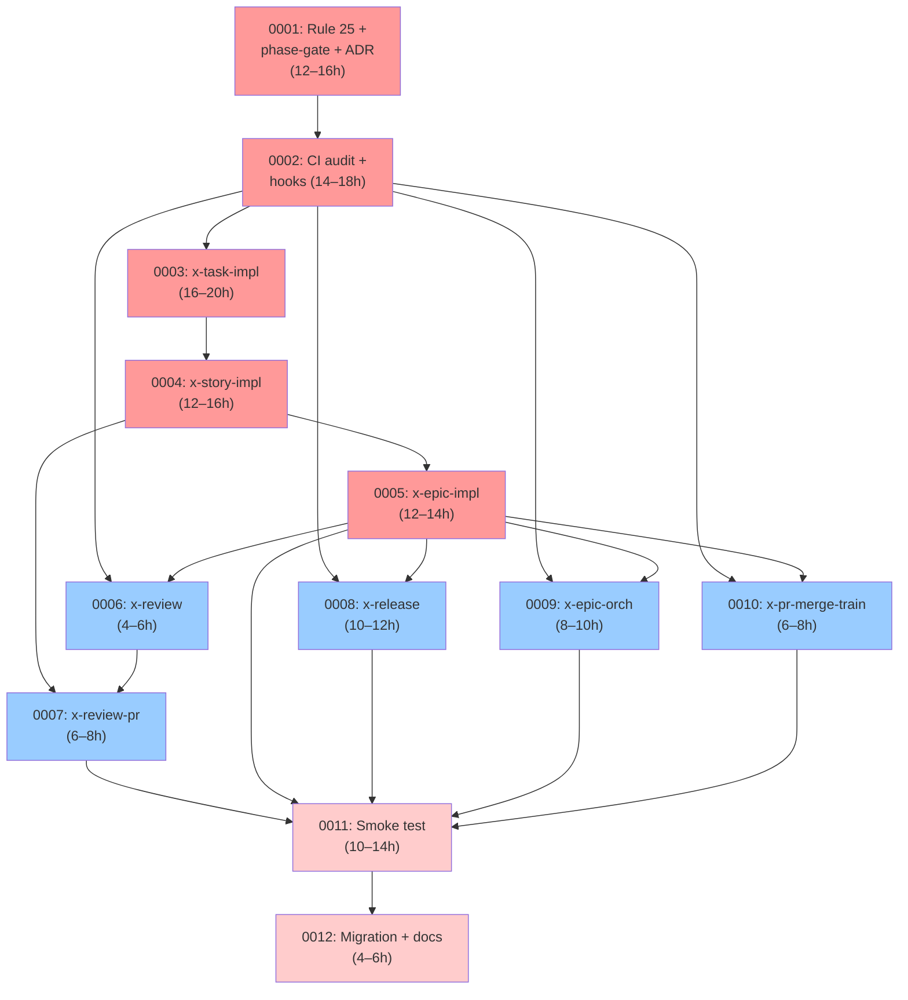

# EPIC-0055 — Implementation Map

**Epic:** Task Hierarchy & Phase Gate Enforcement  
**Total Stories:** 12  
**Total Phases:** 4 layers (Foundation, Core, Extensions, Cross-Cutting)  
**Critical Path:** 7 stories (sequential dependency chain)  
**Maximum Parallelism:** 4 stories in parallel (Phase 2 after Phase 1 complete)  
**Estimated Duration:** 4–5 weeks (sequential critical path)

---

## Dependency Matrix

| Story | Title | Layer | Bloqueada por | Bloqueia | Est. (h) | Crítico? |
| :--- | :--- | :--- | :--- | :--- | :--- | :--- |
| 0055-0001 | Rule 25 + x-internal-phase-gate + ADR | 0 | — | 0002, 0003, 0004, 0005, 0006 | 12–16 | **SIM** |
| 0055-0002 | CI audit + Stop hook + PreToolUse hook | 0 | 0001 | 0003, 0004, 0005, 0006, 0007, 0008, 0009, 0010 | 14–18 | **SIM** |
| 0055-0003 | Retrofit x-task-implement | 1 | 0002 | 0004, 0005 | 16–20 | **SIM** |
| 0055-0004 | Retrofit x-story-implement | 1 | 0003 | 0005, 0007 | 12–16 | **SIM** |
| 0055-0005 | Retrofit x-epic-implement | 1 | 0004 | 0006, 0008, 0009, 0010, 0011 | 12–14 | **SIM** |
| 0055-0006 | Retrofit x-review (standardize + POST gate) | 2 | 0005 | 0007, 0011 | 4–6 | Não |
| 0055-0007 | Retrofit x-review-pr | 2 | 0006 | 0011 | 6–8 | Não |
| 0055-0008 | Retrofit x-release | 2 | 0005 | 0011 | 10–12 | Não |
| 0055-0009 | Retrofit x-epic-orchestrate | 2 | 0005 | 0011 | 8–10 | Não |
| 0055-0010 | Retrofit x-pr-merge-train | 2 | 0005 | 0011 | 6–8 | Não |
| 0055-0011 | Integration smoke test | 3 | 0010 | 0012 | 10–14 | Não |
| 0055-0012 | Migração legado + CHANGELOG + docs | 3 | 0011 | — | 4–6 | Não |

**Legend:** Crítico? = Está no critical path (afeta duração total).

---

## Gráfico de Fases (ASCII)

```
Layer 0 — Foundation (Rules, infra)
┌────────────────────────────────────────────┐
│ 0001: Rule 25 + phase-gate skill + ADR     │ ← Start: 12–16h
└──────────────┬─────────────────────────────┘
               │ (bloqueando stories 0002–0006)
               ▼
┌────────────────────────────────────────────┐
│ 0002: CI audit + Stop hook + PreToolUse    │ 14–18h
└──────┬──────────────────────┬──────────────┘
       │                      │ (bloqueando stories 0003–0010)
       │                      │
       └──────────┬───────────┴────────────────────────────────────┐
                  │                                                │
           Layer 1 — Core Orchestrators                   Layer 2 — Extensions (Parallel)
           (Atomic implementation)                        (Can start after 0005)
                  │                                                │
       ┌──────────▼─────────────────────────┐   ┌─────────────────▼──────────────┐
       │ 0003: Retrofit x-task-implement    │   │ 0006: Retrofit x-review        │ 4–6h
       │ 16–20h (TDD cycles + steps)       │   │ (standardize + POST gate)      │
       └──────────┬──────────────────────────┘   └────────────┬──────────────────┘
                  │ (bloqueando 0004–0005)                   │ (bloqueando 0007)
                  │                                          ▼
       ┌──────────▼──────────────────────────┐   ┌──────────────────────────────────┐
       │ 0004: Retrofit x-story-implement    │   │ 0007: Retrofit x-review-pr       │ 6–8h
       │ 12–16h (4 phases + 5 planejadores) │   │ (45-point + remediation loop)    │
       └──────────┬──────────────────────────┘   └────────────┬──────────────────┘
                  │ (bloqueando 0005–0007)                   │ (bloqueando 0011)
                  │                                          │
       ┌──────────▼──────────────────────────┐   │   ┌───────────────────────────────┐
       │ 0005: Retrofit x-epic-implement     │   │   │ 0008: Retrofit x-release      │ 10–12h
       │ 12–14h (6 phases + story loop)     │   │   │ (10+ phases + approval gate)   │
       └──────────┬──────────────────────────┘   │   └──────────┬────────────────────┘
                  │ (bloqueando 0006–0010)       │            │ (bloqueando 0011)
                  │                              │            │
                  ├──────────────────────────────┤   ┌────────▼─────────────────────┐
                  │                              │   │ 0009: Retrofit x-epic-     │ 8–10h
                  │                              │   │ orchestrate (parallel       │
                  │                              │   │ planning + wave per story)  │
                  │                              │   └────────┬──────────────────┘
                  │                              │            │ (bloqueando 0011)
                  │                              │   ┌────────▼──────────────────┐
                  │                              │   │ 0010: Retrofit x-pr-      │ 6–8h
                  │                              │   │ merge-train (sequential    │
                  │                              │   │ loop + addBlocks)          │
                  │                              │   └────────┬──────────────────┘
                  │                              │            │ (bloqueando 0011)
                  │                              │            │
    Layer 3 — Cross-Cutting (Validation & Finalization)   │
                  │                                         │
       ┌──────────┴─────────────────────────────┬──────────┴──────────────────┐
       │                                        │                             │
       │ Todos os retrofits completados ✓       │  Todos os 5 retrofits      │
       │ (0003–0005 terminados)                 │  (0006–0010 terminados)    │
       │                                        │                             │
       └──────────────────┬─────────────────────┴──────────────────┬──────────┘
                          │                                        │
                ┌─────────▼────────────────────────────────────────▼──────┐
                │ 0011: Integration smoke test Epic0055HierarchySmokeTest │ 10–14h
                │ (Fixture 2 stories × 3 tasks, 4-level hierarchy, gates) │
                └──────────────────────────┬──────────────────────────────┘
                                           │ (bloqueando 0012)
                                           ▼
                ┌──────────────────────────────────────────────────────────┐
                │ 0012: Migração legado + CHANGELOG + docs                │ 4–6h
                │ (Backward compat, baseline clean, CLAUDE.md, Rule 19)   │
                └──────────────────────────────────────────────────────────┘
                                           │
                                           ▼
                                    ✓ EPIC COMPLETO
```

---

## Critical Path Analysis

### Caminho crítico (7 stories sequenciais)

```
0001 (12–16h)
  ↓ Rule 25 + phase-gate skill publicado
0002 (14–18h)
  ↓ CI audit + hooks implementados
0003 (16–20h)
  ↓ x-task-implement retrofit completo
0004 (12–16h)
  ↓ x-story-implement retrofit completo
0005 (12–14h)
  ↓ x-epic-implement retrofit completo + todos os bloqueios desbloqueados
0011 (10–14h)
  ↓ Smoke test verde (valida 0006–0010 em paralelo)
0012 (4–6h)
  ↓
TOTAL: ~78–98 horas (~2–2.5 semanas se 40h/week sequencial)
```

Se paralelizar 5 stories em Phase 2 (0006–0010 em paralelo após 0005):
- 0005 completa em ~12–14h
- 0006–0010 em paralelo: max(4–6h, 6–8h, 10–12h, 8–10h, 6–8h) = 10–12h
- 0011: 10–14h
- 0012: 4–6h
- TOTAL: ~40–46h (~1–1.2 semanas se 40h/week)

**Restrição:** Parallelism Phase 2 depende de 0005 completar (não há blocker entre 0006–0010, mas todos bloqueiam 0011).

---

## Diagrama Mermaid — Dependency Graph



**Legenda:**
- Vermelho (✓ Critical path): 0001, 0002, 0003, 0004, 0005, 0011, 0012
- Rosa (Smoke test): 0011, 0012
- Azul (Parallel Phase 2): 0006–0010

---

## Resumo por Fase

### Phase 0 — Foundation (Regras + Infraestrutura)

| Story | Título | Duração | Artefatos |
| :--- | :--- | :--- | :--- |
| 0001 | Rule 25 + x-internal-phase-gate + ADR | 12–16h | `.claude/rules/25-task-hierarchy.md`, SKILL.md (x-internal-phase-gate), `adr/ADR-0013-...md`, CLAUDE.md |
| 0002 | CI audit + hooks | 14–18h | `scripts/audit-task-hierarchy.sh`, `audit-phase-gates.sh`, `.claude/hooks/verify-phase-gates.sh`, `.claude/hooks/enforce-phase-sequence.sh`, `audits/task-hierarchy-baseline.txt` |

**Duração fase:** 26–34h  
**Outputs:** Rule 25 publicada, skill funcional, CI enforcement ativo

### Phase 1 — Core Orchestrators (Retrofits 0003–0005)

| Story | Título | Duração | Orquestrador |
| :--- | :--- | :--- | :--- |
| 0003 | Retrofit x-task-implement | 16–20h | Atômico (8 steps, TDD cycles) |
| 0004 | Retrofit x-story-implement | 12–16h | História (4 phases, 5 planejadores, 9 especialistas) |
| 0005 | Retrofit x-epic-implement | 12–14h | Épico (6 phases, story loop) |

**Duração fase (sequencial):** 40–50h  
**Duração fase (parallelismo teórico 0003||0004||0005):** 16–20h (limitado por 0003)  
**Realidade:** Sequencial esperado (0003 → 0004 → 0005), pois 0004 consome output de 0003

**Outputs:** 3 orquestradores com task tracking completo

### Phase 2 — Extensions (Retrofits 0006–0010)

| Story | Título | Duração | Orquestrador | Can Parallel? |
| :--- | :--- | :--- | :--- | :--- |
| 0006 | Retrofit x-review | 4–6h | Review (9 especialistas) | SIM |
| 0007 | Retrofit x-review-pr | 6–8h | Tech Lead review | SIM |
| 0008 | Retrofit x-release | 10–12h | Release | SIM |
| 0009 | Retrofit x-epic-orchestrate | 8–10h | Epic planning | SIM |
| 0010 | Retrofit x-pr-merge-train | 6–8h | PR merge train | SIM |

**Duração fase (sequencial):** 34–44h  
**Duração fase (parallelismo, após 0005):** max(4–6, 6–8, 10–12, 8–10, 6–8) = 10–12h  
**Recomendação:** Parallelizar 0006–0010 após 0005 completa

**Outputs:** 5 orquestradores com task tracking completo

### Phase 3 — Cross-Cutting (Validação + Finalização)

| Story | Título | Duração | Propósito |
| :--- | :--- | :--- | :--- |
| 0011 | Integration smoke test | 10–14h | Validar 4-level hierarchy, gates, artifacts, audits, performance, legacy compat |
| 0012 | Migração + CHANGELOG + docs | 4–6h | Backward compat, baseline clean, documentação final |

**Duração fase:** 14–20h  
**Bloqueador:** 0011 bloqueada por 0010 (last of Phase 2)

**Outputs:** Smoke test verde, migration complete, baseline vazio, CHANGELOG + Rule 19 updated

---

## Gargalos e Observações Estratégicas

### Gargalo Principal: Critical Path (0001 → 0002 → 0003 → 0004 → 0005)

- **Duração crítica:** ~66–78h sequencial
- **Sem folga:** Qualquer delay em 0003 (TDD cycles complexos) ou 0004 (wave + task loop) impacta todo o cronograma
- **Recomendação:** Alocação de engenheiro sênior para 0003–0005 (complexidade alta)

### Gargalo Secundário: Smoke Test (0011) depende de 0010

- **Duração:** 10–14h
- **Não pode iniciar** até Phase 2 (0006–0010) completa
- **Sem paralelismo:** É a última validação antes do épico fechar

### Paralelismo Máximo

- **Phase 2 (0006–0010):** 5 stories em paralelo após 0005
- **Potencial redução:** ~34–44h → ~10–12h (3–4× speedup)
- **Dependência cruzada:** Nenhuma (todas bloqueiam apenas 0011)
- **Recomendação:** Equipe de 5 (1 por story) durante 1–2 semanas

### Leaf Stories (Baixa Complexidade)

- **0006** (Retrofit x-review): 4–6h — Padronização apenas (3 tasks → subject regex)
- **0012** (Docs + Migration): 4–6h — Administrativo (CHANGELOG, Rule 19, baseline)

**Recomendação:** Assignar a junior engineers ou em paralelo com criticals.

### Risk Factors

1. **TDD cycle tracking (0003)** — 16–20h, maior estimativa. TPP (Transformation Priority Premise) precisa estar clara. Recomendação: pair programming.

2. **Wave integration (0004)** — Batch A/B pattern precisa estar bem documentado. Recomendação: ler x-review current pattern (único que já funciona).

3. **Smoke test (0011)** — Fixture precisa ser realista (2 stories × 3 tasks). Recomendação: usar data de EPIC-0050 ou EPIC-0051 como referência.

---

## Validações Pré-Merge (DoD Global)

- [ ] 100% dos 8 orquestradores emitem `TaskCreate` por phase (audit zero violations)
- [ ] 100% das fases têm gate PRE + POST (audit zero violations)
- [ ] Cobertura total ≥ 95% line / ≥ 90% branch (Rule 05)
- [ ] Smoke test `Epic0055HierarchySmokeTest` verde
- [ ] Backward compat: epics legados com `taskTracking.enabled=false` rodam OK
- [ ] Performance: overhead < 2% (telemetry)
- [ ] Rule 25 + ADR-0013 publicadas
- [ ] CLAUDE.md + CHANGELOG + Rule 19 updated
- [ ] Baseline imutável (vazio ou justificado)
- [ ] Tech Lead review 45/45 em **cada** story (12 × x-review-pr)

---

## Resumo Executivo

**EPIC-0055** restaura visibilidade de 4 níveis de granularidade de tasks ao operador de CI/CD, implementando phase gates formais com 4 camadas de enforcement. A execução é linear no critical path (7 stories sequenciais, ~2–2.5 semanas), com oportunidade de paralelização da Phase 2 (5 stories, ~1–1.5 semanas adicionais). O smoke test (0011) valida toda a infraestrutura end-to-end.

**Marcos principais:**
- Semana 1: Rule 25 + x-internal-phase-gate + CI audit (0001–0002)
- Semana 2–3: Core retrofits (0003–0005)
- Semana 3–4: Extensions em paralelo (0006–0010)
- Semana 4–5: Smoke test + finalização (0011–0012)

---

**Mapa criado:** 2026-04-23  
**Fonte:** `spec-task-granularity-phase-gates.md` seção 9 (dependency DAG)
