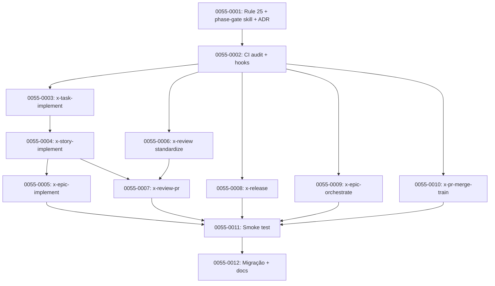

# Spec — Task Granularity & Phase Gate Enforcement

> **Proposta de Épico:** EPIC-0055
> **Target branch:** `epic/0055`
> **Worktree:** `.claude/worktrees/epic-0055/`
> **Destino:** este arquivo é o **input autoritativo** para `/x-epic-decompose`, que produzirá `epic-0055.md`, `story-0055-*.md` e `IMPLEMENTATION-MAP.md`.
> **Autor:** Eder Celeste Nunes Junior
> **Data:** 2026-04-23
> **Versão da spec:** 1.0

---

## 1. Contexto e Problema

### 1.1 Sintoma observado

Durante execução de `x-epic-implement EPIC-0053`, a CLI do Claude Code renderiza a lista de tasks em granularidade **insuficiente**:

```
Implementing story-0053-0001… (1m 51s · ↓ 4.2k tokens)
  ⎿  ◼ Execute story-0053-0001
     ◻ Execute story-0053-0002 › blocked by #1
     ◻ Run integrity gate › blocked by #2
     ◻ Create final epic PR › blocked by #3
```

O operador **não consegue ver**:

- Se a fase de planejamento da história 1 emitiu os 5 artefatos (arch/test/impl/security/compliance).
- Se os reviews de especialistas rodaram (QA, Performance, Security, Database, Observability, DevOps, Data Modeling, API, Events).
- Se o Tech Lead review foi executado.
- Se o verify gate produziu o envelope obrigatório (Rule 24).
- Se a criação do PR, o CI-watch e o auto-merge aconteceram.
- Se o TDD de cada task seguiu Red → Green → Refactor.

### 1.2 Diagnóstico técnico

Auditoria em `java/src/main/resources/targets/claude/skills/**` revela que **de 100 skills, apenas 1 (x-review) emite `TaskCreate`/`TaskUpdate` de forma estruturada**. Os 3 orquestradores principais (`x-epic-implement`, `x-story-implement`, `x-task-implement`) são **thin orchestrators** após EPIC-0049 e delegam via `Skill(...)` sem emitir `TaskCreate` por fase — o operador vê só o "shell" do nível imediatamente superior.

Tabela 1.2.1 — Emissão atual de `TaskCreate`/`TaskUpdate` por orquestrador:

| Orquestrador | Fases numeradas | Emite `TaskCreate`? | Emite `TaskUpdate`? | Hierarquia visível? |
| :--- | :--- | :--- | :--- | :--- |
| `x-epic-implement` | 6 (Phase 0–5) | **Não** | Não | Apenas via `x-internal-status-update` em `execution-state.json` (invisível à CLI) |
| `x-story-implement` | 4 principais + subfases (0.1–3.5) | **Não** | Não | Mesmo que acima |
| `x-task-implement` | 8 (Step 0–5 + 0.5 + 2.5 + 3.5 + 4.5) | **Não** | Não | Mesmo que acima |
| `x-release` | 10+ | **Não** | Não | Mesmo que acima |
| `x-epic-orchestrate` | Loop por história | **Não** | Não | Mesmo que acima |
| `x-pr-merge-train` | Loop por PR | **Não** | Não | Mesmo que acima |
| `x-review` | 4 (Phase 0–4) + 9 especialistas paralelos | **Sim** (padrão Batch A/B — RULE-013) | **Sim** | Sim |
| `x-review-pr` | 5 | **Não** | Não | Mesmo que acima |

### 1.3 Diagnóstico de gates

A infraestrutura de gates existe, mas é **fragmentada, implícita e não hierárquica**:

- **Rule 05** define thresholds de cobertura (≥95% line, ≥90% branch) — aplicados por `x-internal-story-verify` e `x-internal-epic-integrity-gate`.
- **Rule 24** enforça 4 evidências obrigatórias (verify-envelope, review-story, techlead-review, story-completion-report) via Stop hook + CI audit.
- **Rule 22** impede uso de `--skip-*` fora de `## Recovery`.
- **`x-parallel-eval`** detecta colisões de file footprint e degrada waves.

Porém **não há gate que responda "todas as sub-tarefas da Phase X foram completadas antes de entrar na Phase X+1?"** em nível de **lista de tasks visível ao operador**. Se o LLM inlining um sub-skill (violação de Rule 24), o operador só descobre no Stop hook — depois do fato. Se uma fase de planejamento pulou `x-compliance-plan`, a execução prossegue até o CI audit falhar com `EIE_EVIDENCE_MISSING` — também depois do fato.

### 1.4 Origem do problema

EPIC-0049 (Thin Orchestrators) reduziu `x-epic-implement` de ~1100 para ~434 linhas e `x-story-implement` de ~900 para ~367 linhas extraindo lógica para `x-internal-*`. Durante a extração, **a responsabilidade de emitir `TaskCreate` por fase foi perdida**: nenhum dos `x-internal-*` emite tracking (por design — são invocados por orquestradores), e os orquestradores deixaram de emitir (por redução de body).

Resultado: **a lista visível ao operador colapsou em 1 nível**, enquanto a execução real acontece em **3–4 níveis aninhados** (Epic → Story → Task → TDD cycle → Specialist review).

---

## 2. Objetivo

Produzir uma arquitetura **de primeira classe** para granularidade de tasks na CLI do Claude Code, com:

1. **Hierarquia de tasks visível** refletindo a estrutura real (Epic → Story → Phase → Sub-phase → Wave → Specialist / Cycle).
2. **Phase gates formais**: nenhuma fase N+1 inicia enquanto sub-tasks da fase N não estão todas `completed`.
3. **Enforcement em 4 camadas** (normativo, runtime hook, CI audit, observability via evidência em disco) — paralelo à Rule 24.
4. **Backward compatibility** respeitando Rule 19 (fallback matrix, legacy flow via `--legacy-flow`).
5. **Zero regressão de performance**: overhead de tracking deve ficar < 2% do wall-clock de uma história típica.

### 2.1 Exemplo do resultado esperado

Após o épico, a lista de tasks de uma invocação de `x-epic-implement EPIC-0060` com 2 histórias renderiza assim:

```
Implementing EPIC-0060 (Phase 3 › story-0060-0001 › Planning › wave of 5 experts · 8m 17s)
  ⎿  ◼ Phase 0 — Args & flow detection
     ◼ Phase 1 — Load & plan DAG
     ◼ Phase 2 — Ensure epic/0060 branch
     ◻ Phase 3 — Execute stories
        ◻ story-0060-0001
           ◼ Phase 0 — Context & resume
           ◻ Phase 1 — Planning wave
              ◼ Arch plan (x-arch-plan)
              ◼ Impl plan (x-impl-plan subagent)
              ◼ Test plan (x-test-plan)
              ◻ Task breakdown (x-internal-story-build-plan subagent) › in progress
              ◻ Security assessment (x-security-plan subagent) › in progress
              ◻ Compliance assessment (x-compliance-plan subagent) › pending
           ◻ Phase 2 — Task execution › blocked by Phase 1
           ◻ Phase 3 — Verify, review, report › blocked by Phase 2
              ◻ 3.1 Verify gate (x-internal-story-verify)
              ◻ 3.2a Specialist reviews (x-review — 9 experts)
              ◻ 3.2b Tech Lead review (x-review-pr)
              ◻ 3.3 Final report
              ◻ 3.4 Create task/story PR
              ◻ 3.5 CI watch + auto-merge
        ◻ story-0060-0002 › blocked by story-0060-0001
     ◻ Phase 4 — Integrity gate › blocked by Phase 3
     ◻ Phase 5 — Final epic PR › blocked by Phase 4
```

Se o operador interromper ou o LLM tentar pular uma sub-tarefa sem emitir `TaskUpdate(completed)`, o **phase gate** (item 2 acima) impede a transição e força remediação.

---

## 3. Inventário Completo de Skills (100 skills)

### 3.1 Classificação por responsabilidade

| Categoria | Contagem | Subfolder source-of-truth | Tratamento no épico |
| :--- | :--- | :--- | :--- |
| **ORCHESTRATOR — Epic/Story/Task** | 3 | `core/dev/` | Refatorar — emitir `TaskCreate` por fase |
| **ORCHESTRATOR — Release/Review/Merge** | 5 | `core/{ops,review,pr,plan}/` | Refatorar — emitir `TaskCreate` por fase |
| **INTERNAL (x-internal-\*)** | 11 | `core/internal/` | Não emitir `TaskCreate` próprio; emitir `TaskUpdate` do parent quando retornar |
| **LEAF — Planning** | 14 | `core/plan/` | Instrumentar quando invocado em wave paralela |
| **LEAF — Review (specialist)** | 12 | `core/review/` | Já têm `TaskCreate` via `x-review` — padronizar modelo |
| **LEAF — Test/TDD** | 8 | `core/test/` | `x-test-tdd` ganha `TaskCreate` por cycle (Red/Green/Refactor) |
| **LEAF — Git/PR** | 14 | `core/{git,pr}/` | Apenas utilities — sem `TaskCreate` próprio |
| **LEAF — Code (format/lint)** | 2 | `core/code/` | Sem tracking (RULE-023 utility tier) |
| **LEAF — Security** | 10 | `core/security/` | Instrumentar quando invocado em wave paralela (similar ao review) |
| **LEAF — Lib/Jira/Ops (misc)** | 21 | `core/{lib,jira,ops}/` | Sem tracking padrão |

Total: 100. Fonte: `find java/src/main/resources/targets/claude/skills/ -name SKILL.md | wc -l`.

### 3.2 Matriz completa — ver Anexo A

Anexo A (Seção 13) lista os 100 skills individualmente com coluna `tratamento-epic-0055`. Aqui mantemos apenas a agregação por categoria para brevidade da spec.

---

## 4. Arquitetura Proposta

### 4.1 Conceitos centrais

**Task hierárquica (Claude Code runtime):**

- `TaskCreate` cria uma entry na lista visível à CLI. Retorna um ID numérico.
- `TaskUpdate(id: <int>, ...)` atualiza uma task existente; quando a ferramenta suportar dependências, elas devem ser registradas usando o campo/nome efetivamente documentado pela API para produzir o efeito de `"blocked by #N"` na CLI. Esta spec padroniza o termo **`addBlockedBy`** como nome canônico do campo, a ser resolvido durante a implementação de story-0055-0001 (contract finalization).
- `TaskUpdate(id: <int>, status: "in_progress" | "completed")` move estado.
- A hierarquia visual **não** é nativa (não há campo `parent`). É codificada no `subject` da task via prefixo: `"STORY-0060-0001 › Planning › Arch plan"`. A CLI atual respeita esse padrão visualmente via indentação heurística.

**Phase gate:**

Um **phase gate** é uma função determinística invocada pelo orquestrador **antes de entrar na Phase N+1**. Ela inspeciona:

1. O estado (via `TaskList`) de todas as tasks criadas durante Phase N com prefixo matching.
2. A existência em disco das evidências declaradas da Phase N (arch plan, verify envelope, etc.).
3. Se todas estão `completed` E todas as evidências existem → retorna `passed=true`.
4. Caso contrário → retorna `passed=false` com lista de missing, e o orquestrador **aborta** com exit code estável (`PHASE_GATE_FAILED`, exit 12).

### 4.2 Pattern canônico — `Phase N` em um orquestrador (pós-épico)

```markdown
## Phase N — <Nome da Fase>

<!-- TELEMETRY: phase.start -->
Bash: telemetry-phase.sh start <skill-name> Phase-N-<Name>

### N.0 — Gate de entrada (PRE)

Invoke the `x-internal-phase-gate` skill (Rule 13 Pattern 1 INLINE-SKILL):

    Skill(skill: "x-internal-phase-gate",
          model: "haiku",
          args: "--mode pre --skill <skill-name> --phase N --expected-tasks <list> --expected-artifacts <list>")

On exit 12 (PHASE_GATE_FAILED) abort with exit 12.

### N.1 — Criar tracking

Emit TaskCreate for this phase and record its ID in `phaseTaskId`:

    TaskCreate(subject: "Phase N — <Name>", description: "<...>", activeForm: "<...>")
    TaskUpdate(id: phaseTaskId, status: "in_progress")

### N.2 — Executar o trabalho

... sub-skills e sub-fases conforme o design da fase ...

### N.3 — Gate de saída (POST)

    Skill(skill: "x-internal-phase-gate",
          model: "haiku",
          args: "--mode post --skill <skill-name> --phase N --parent-task-id <phaseTaskId>")

On exit 12 abort.

### N.4 — Finalizar tracking

    TaskUpdate(id: phaseTaskId, status: "completed")

<!-- TELEMETRY: phase.end -->
Bash: telemetry-phase.sh end <skill-name> Phase-N-<Name> ok
```

### 4.3 Pattern canônico — Wave paralela (sub-fases concorrentes)

Aplicável a `x-story-implement` Phase 1 (planejamento com **6 subagentes** — arch, impl, test, tasks, security, compliance), `x-review` (9 especialistas), `x-task-implement` Phase 2 (Red/Green/Refactor cycles).

Usa a Rule 13 Pattern `SUBAGENT-GENERAL` com **Batch A/B** atualmente estabelecida em `x-review`:

```markdown
**Batch A — ONE assistant message:**

    TaskCreate(subject: "<Phase.Wave> › Arch plan", ...)
    TaskCreate(subject: "<Phase.Wave> › Impl plan", ...)
    TaskCreate(subject: "<Phase.Wave> › Test plan", ...)
    TaskCreate(subject: "<Phase.Wave> › Task breakdown", ...)
    TaskCreate(subject: "<Phase.Wave> › Security assessment", ...)
    TaskCreate(subject: "<Phase.Wave> › Compliance assessment", ...)

    Skill(skill: "x-arch-plan", model: "opus", args: "...")
    Agent(subagent_type: "general-purpose", model: "opus", description: "Impl plan", prompt: "...")
    Skill(skill: "x-test-plan", model: "sonnet", args: "...")
    Skill(skill: "x-internal-story-build-plan", model: "sonnet", args: "...")
    Agent(subagent_type: "general-purpose", model: "sonnet", description: "Security", prompt: "...")
    Agent(subagent_type: "general-purpose", model: "sonnet", description: "Compliance", prompt: "...")

Record returned IDs in `planTasks` map.

**Batch B — Next assistant message (after all return):**

    TaskUpdate(id: planTasks["arch"], status: "completed")
    TaskUpdate(id: planTasks["impl"], status: "completed")
    TaskUpdate(id: planTasks["test"], status: "completed")
    TaskUpdate(id: planTasks["tasks"], status: "completed")
    TaskUpdate(id: planTasks["security"], status: "completed")
    TaskUpdate(id: planTasks["compliance"], status: "completed")
```

**Gate de wave:** após Batch B, invoca `x-internal-phase-gate --mode wave --expected-artifacts <5-files>`. Missing = abort.

### 4.4 Pattern canônico — Loop sequencial (iterações numeradas)

Aplicável a `x-epic-implement` Phase 3 (loop por história) e `x-task-implement` Phase 2 (loop de TDD cycles).

```markdown
For each item in <list>:

  1. currentId = TaskCreate(subject: "<Parent> › Item K — <desc>", activeForm: "<...>")
  2. TaskUpdate(id: previous, addBlockedBy: [currentId])  # chain as block-by (canonical field: addBlockedBy)
  3. TaskUpdate(id: currentId, status: "in_progress")
  4. Invoke sub-skill via Rule 13 Pattern 1
  5. On skill return:
     - success → TaskUpdate(id: currentId, status: "completed")
     - failure → TaskUpdate(id: currentId, status: "completed")
                  + fail-fast exit with propagation to downstream dependents
```

---

## 5. Rule 25 — Task Hierarchy & Phase Gate Contract (nova)

### 5.1 Scope

Esta regra aplica-se a **todos** os orquestradores que hoje declaram uma ou mais `Phase N` numeradas em seu `SKILL.md`. O conjunto canônico está listado no Anexo B.

### 5.2 Invariantes

1. **Todo orquestrador DEVE emitir uma `TaskCreate` ao entrar em cada Phase N** (seção 4.2, passo N.1).
2. **Toda sub-wave paralela (Batch A/B) DEVE emitir uma `TaskCreate` por membro da wave** (seção 4.3).
3. **Todo loop sequencial DEVE emitir uma `TaskCreate` por iteração** com `addBlockedBy` chaining (seção 4.4).
4. **Todo orquestrador DEVE invocar `x-internal-phase-gate --mode pre` ANTES e `--mode post` DEPOIS de cada Phase N** (seção 4.2, passos N.0 e N.3).
5. **O `subject` de toda `TaskCreate` DEVE usar o separador `›`** para indicar hierarquia: `"<Root> › <Level2> › <Level3>"`. Profundidade máxima: 4 níveis (Root / Story / Phase / Wave-item).
6. **`x-internal-*` skills NÃO emitem `TaskCreate` próprio** (são invocados; o parent é responsável pelo tracking). Exceção: `x-internal-phase-gate` pode emitir 1 task sua própria apenas em modo `--mode wave` com `--emit-tracker` ligado.
7. **Falha em qualquer gate aborta com exit 12 (`PHASE_GATE_FAILED`)**. Orquestradores propagam para o caller via o exit code já documentado (ex: `x-story-implement` → `VERIFY_FAILED` se Phase 3 gate falha; `x-epic-implement` → `INTEGRITY_GATE_FAILED` se Phase 4 gate falha). Exit 12 é reservado para o **sub-skill** `x-internal-phase-gate`.

### 5.3 Contract do `subject`

Regex canônico (aceita roots em formato uppercase legacy OU lowercase canônico para epic/story/task):

```
^(?P<root>(?:[A-Z][A-Z0-9-]+|epic-[0-9]{4}|story-[0-9]{4}-[0-9]{4}|task-[0-9]{4}-[0-9]{4}(?:-[0-9]{3})?|Phase [0-9]+))(?: › (?P<levelN>[A-Za-z0-9_\-\.:() ]+))*$
```

Exemplos válidos:

- `"EPIC-0060 › Phase 3 › story-0060-0001 › Phase 1 › Arch plan"` (5 níveis — **inválido**, profundidade máxima é 4)
- `"story-0060-0001 › Phase 1 › Arch plan"` (3 níveis — **válido**, root lowercase `story-`)
- `"task-0060-0001-003 › Red cycle › UT-2"` (3 níveis — **válido**, root lowercase `task-`)
- `"TASK-0060-0001-003 › Red cycle › UT-2"` (3 níveis — **válido**, root uppercase `TASK-`)
- `"Review: QA — Story story-0060-0001"` (pattern legado do `x-review` — **tolerado via Rule 19 fallback matrix durante janela de deprecação**)

Exemplos inválidos:

- `"QA review"` (sem root)
- `"EPIC-0060 > Phase 3 > story-0060-0001"` (usa `>` em vez de `›`)

### 5.4 `activeForm` convention

`activeForm` deve ser o gerúndio do `subject` sem o prefixo de root, abreviado para < 40 chars:

- `subject: "story-0060-0001 › Phase 1 › Arch plan"` → `activeForm: "Planning arch for story-0060-0001"`
- `subject: "TASK-0060-0001-003 › Red cycle › UT-2"` → `activeForm: "Running Red cycle UT-2"`

### 5.5 Metadata convention

Usar o campo `metadata` (suportado por `TaskCreate`) para carregar contexto estruturado consumido pelo gate:

```json
{
  "phase": "Phase 1",
  "parentSkill": "x-story-implement",
  "storyId": "story-0060-0001",
  "epicId": "EPIC-0060",
  "expectedArtifacts": [
    "plans/epic-0060/plans/arch-story-0060-0001.md",
    "plans/epic-0060/plans/plan-story-0060-0001.md",
    "plans/epic-0060/plans/tests-story-0060-0001.md",
    "plans/epic-0060/plans/tasks-story-0060-0001.md",
    "plans/epic-0060/plans/security-story-0060-0001.md",
    "plans/epic-0060/plans/compliance-story-0060-0001.md"
  ]
}
```

O gate lê `metadata.expectedArtifacts` via `TaskGet(taskId)` e valida existência em disco.

### 5.6 Audit

CI script `scripts/audit-task-hierarchy.sh` (nova) scanneia cada `SKILL.md` sob `java/src/main/resources/targets/claude/skills/` e verifica:

1. **Orquestradores listados no Anexo B contêm pelo menos uma chamada `TaskCreate(` por `## Phase N` detectada.**
2. **Cada `TaskCreate(` é acompanhada por um `TaskUpdate(.*, status: "completed")` em algum ponto posterior do mesmo SKILL.md ou documentado como seja aceitável via `<!-- audit-exempt -->`.**
3. **Cada `## Phase N` declara um gate `pre` e `post` via `Skill(skill: "x-internal-phase-gate", ...)`** — exceto fases marcadas com `<!-- phase-no-gate: <reason> -->`.
4. **O `subject:` em `TaskCreate(...)` segue o regex canônico da seção 5.3.**

Exit code `TASK_HIERARCHY_VIOLATION` (exit 25). Baseline file: `audits/task-hierarchy-baseline.txt` para grandfather legacy skills durante a janela de deprecação (seção 7).

### 5.7 Interação com `execution-state.json`

Adiciona campos opcionais (backward-compat per Rule 19):

```json
{
  "flowVersion": "2",
  "epicId": "EPIC-0060",
  "taskTracking": {
    "enabled": true,
    "rootTaskId": 42,
    "phaseGateResults": [
      { "phase": "Phase 1", "mode": "post", "passed": true, "missingArtifacts": [], "missingTasks": [] },
      { "phase": "Phase 2", "mode": "post", "passed": true, "missingArtifacts": [], "missingTasks": [] }
    ]
  }
}
```

Campo `taskTracking.enabled` ausente ou `false` → pipeline pula gates (legacy mode). Rule 19 fallback matrix cobre.

---

## 6. Contrato do skill `x-internal-phase-gate` (novo)

### 6.1 Metadata

| Campo | Valor |
| :--- | :--- |
| Nome | `x-internal-phase-gate` |
| Subfolder (source-of-truth) | `core/internal/plan/x-internal-phase-gate/` |
| Visibility | `internal` (Rule 22 — `user-invocable: false`) |
| Model | `haiku` (RULE-023 — utility tier, zero-reasoning lookup) |
| Allowed tools | `Read, Bash` |

### 6.2 Modos

| Modo | Flag | Propósito |
| :--- | :--- | :--- |
| PRE | `--mode pre` | Verifica antes de iniciar a fase: nenhuma task órfã da fase anterior está pendente; execution-state.json consistente |
| POST | `--mode post` | Verifica após a fase: todas as tasks filhas da Phase N estão `completed`; todas as expectedArtifacts existem em disco |
| WAVE | `--mode wave` | Pós-Batch-B de uma wave paralela: todas as N tasks da wave `completed` E todos os N artefatos existem |
| FINAL | `--mode final` | Gate terminal (pós-Phase-último-da-skill): usado para o integrity-gate em `x-epic-implement` Phase 4 (compõe com `x-internal-epic-integrity-gate`) |

### 6.3 Envelope JSON de saída

```json
{
  "passed": true,
  "mode": "post",
  "skill": "x-story-implement",
  "phase": "Phase 1",
  "expectedTasks": [101, 102, 103, 104, 105, 106],
  "completedTasks": [101, 102, 103, 104, 105, 106],
  "missingTasks": [],
  "expectedArtifacts": ["plans/epic-0060/plans/arch-story-0060-0001.md", "..."],
  "missingArtifacts": [],
  "wallclockMs": 47,
  "timestamp": "2026-04-23T14:22:03Z"
}
```

### 6.4 Exit codes

| Exit | Nome | Condição |
| :--- | :--- | :--- |
| 0 | OK | `passed=true` |
| 12 | `PHASE_GATE_FAILED` | `passed=false` — missing tasks e/ou missing artifacts |
| 13 | `PHASE_GATE_MALFORMED` | args inválidos (ex: `--mode wave` sem `--expected-tasks`) |
| 14 | `PHASE_GATE_TIMEOUT` | espera por resolução de task em progress por > timeout (default 10s) |

### 6.5 Integração com Rule 24 (Execution Integrity)

O `x-internal-phase-gate --mode post` da **última fase produtora-de-evidência** de cada skill DEVE incluir os 4 artefatos obrigatórios da Rule 24 em `--expected-artifacts`:

- `x-story-implement` Phase 3 POST gate: inclui `verify-envelope`, `review-story`, `techlead-review`, `story-completion-report`.

Isso promove o enforcement da Rule 24 de "stop-hook detecta depois do fato" para **gate sync antes da Phase ser considerada completa**. O stop-hook + CI audit permanecem como defesa em profundidade (camadas 2+3).

---

## 7. Mapa de Refatoração por Orquestrador

### 7.1 `x-epic-implement` (6 fases)

| Phase | Ação | `TaskCreate` emitido | Sub-waves | Gate PRE | Gate POST |
| :--- | :--- | :--- | :--- | :--- | :--- |
| 0 | Args & flow detection | 1 task por fase | — | `--mode pre --phase 0 --expected-none` | `--mode post --phase 0 --expected-artifacts execution-state.json` |
| 1 | Load epic + build DAG | 1 task | — | pre | post (`epic-execution-plan.md` exists) |
| 2 | Ensure `epic/XXXX` branch | 1 task | — | pre | post (branch exists local + origin) |
| 3 | Story execution loop | 1 task por story (N tasks, chained via `addBlockedBy`) | Cada story é um sub-flow próprio de `x-story-implement` que emite suas próprias phase tasks | pre (previous phases complete) | post (all stories `SUCCESS` + all story PRs `MERGED`) |
| 4 | Integrity gate + report | 1 task | — | pre | post (integrity-envelope + epic-execution-report) |
| 5 | Final PR `epic/XXXX → develop` | 1 task | — | pre | post (PR URL recorded) |

**GAP 6 resolved:** Phase 4 POST gate agora verifica **explicitamente** `prMergeStatus=MERGED` de todas as story PRs (hoje Phase 3 apenas checa `status=SUCCESS`).

**GAP 7 resolved:** Phase 5 emite uma task para o CI-watch do PR final; `TaskUpdate(completed)` só após `x-pr-watch-ci` retornar `SUCCESS` ou `CI_PENDING_PROCEED`.

### 7.2 `x-story-implement` (4 fases principais, 10 sub-fases)

| Phase | Sub-phase | Ação | `TaskCreate` | Sub-wave |
| :--- | :--- | :--- | :--- | :--- |
| 0 | 0.1 Args | 1 task | — |
| 0 | 0.2 Load context | 1 task | — |
| 0 | 0.3 Worktree detect | 1 task | — |
| 0 | 0.4 Resume (condicional) | 1 task (skipped se `--resume=false`) | — |
| 0 | 0.5 API-first contract (condicional) | 1 task | — |
| 1 | Arch plan | 1 task | — |
| 1 | Wave de 6 subagentes (arch/impl/test/tasks/security/compliance) | 6 tasks em Batch A | **SIM** |
| 1 | Parallelism eval | 1 task | — |
| 2 | Task loop (N tasks) | 1 task por task (N tasks, chained) | Cada task = sub-flow de `x-task-implement` |
| 2 | Story PR creation + CI-watch | 2 tasks | — |
| 3 | 3.1 Verify gate | 1 task | — |
| 3 | 3.2a Specialist reviews | 1 task (mantém atual wave de 9 do `x-review`) | **SIM** |
| 3 | 3.2b Tech Lead review | 1 task (`x-review-pr`) | — |
| 3 | 3.3 Final report | 1 task | — |
| 3 | 3.4 Status finalize | 1 task | — |
| 3 | 3.5 Worktree cleanup | 1 task (skipped em REUSE) | — |

**GAPs 8-15 resolvidos** via os gates PRE/POST em cada sub-fase.

### 7.3 `x-task-implement` (5 steps + 0.5 + 2.5 + 3.5 + 4.5)

| Step | Ação | `TaskCreate` | Sub-wave |
| :--- | :--- | :--- | :--- |
| 0 | Pre-check plan reuse | 1 task | — |
| 0.5 | Worktree context + branch | 1 task | — |
| 1 | Subagent prepare | 1 task | — |
| 2 | TDD cycles (N cycles) | 1 task por ciclo, com sub-tasks por fase TDD | **SIM** — cada cycle emite 3 tasks (Red/Green/Refactor) |
| 2.5 | Task-aware TDD (v2 only) | idem | **SIM** |
| 3 | Validate (coverage, tests) | 1 task | — |
| 3.5 | Status transition (v2) | 1 task | — |
| 4 | Atomic commit | 1 task | — |
| 4.5 | CI-watch (condicional) | 1 task | — |
| 5 | Cleanup | 1 task | — |

**GAPs 16-18 resolvidos** via tracking por TDD cycle. Exemplo de `subject` final:

- `"TASK-0060-0001-003 › Step 2 › Cycle 1 › Red — UT-1"`
- `"TASK-0060-0001-003 › Step 2 › Cycle 1 › Green — UT-1"`
- `"TASK-0060-0001-003 › Step 2 › Cycle 1 › Refactor"`

**GAP 21 resolvido:** Step 2 POST gate audita `git log` esperando ≥ N RED + N GREEN + N REFACTOR commits (heurística: trailer `(RED)`/`(GREEN)`/`(REFACTOR)` em commits de `x-git-commit`).

### 7.4 `x-release` (10+ fases)

Incluído no escopo. Refatoração análoga: cada fase de `x-release` (version bump → release branch → validation → commit → PR → approval gate → tag → back-merge → cleanup) ganha `TaskCreate`. Approval gate (EPIC-0043 interactive gate) integra naturalmente.

### 7.5 `x-epic-orchestrate` (loop por história de planejamento)

Loop paralelo de planejamento de stories. Cada história → 1 task; subagentes de planejamento de cada história → sub-wave de 6 (como `x-story-implement` Phase 1).

### 7.6 `x-review` (mantém atual + padronização)

Única skill que já emite `TaskCreate`/`TaskUpdate` corretamente. Épico padroniza o `subject` para o regex da seção 5.3 e adiciona gate POST wave.

### 7.7 `x-pr-merge-train` (loop sequencial por PR)

Cada PR do trem → 1 task, chained via `addBlockedBy`. Pattern 4.4.

### 7.8 `x-review-pr` (5 fases)

Refatoração direta — emite 5 tasks, uma por fase (checklist fetch → load PR context → 45-point review → GO/NO-GO → remediation loop).

---

## 8. Camadas de Enforcement (4 camadas, paralelo à Rule 24)

| Camada | Mecanismo | Acionado por | Ação em violação |
| :--- | :--- | :--- | :--- |
| **1 — Normativo** | Rule 25 + CLAUDE.md top-level block | Carregado em toda conversa | Guia o LLM a emitir `TaskCreate` e invocar `x-internal-phase-gate` |
| **2 — Runtime (Stop hook)** | `.claude/hooks/verify-phase-gates.sh` | Evento `Stop` (fim do turno LLM) | Lê `execution-state.json.taskTracking.phaseGateResults[]`; se qualquer gate falhou ou missing, emite WARNING stderr + exit 2 |
| **3 — Runtime (PreToolUse hook)** | `.claude/hooks/enforce-phase-sequence.sh` | Evento `PreToolUse` em `Skill(...)` quando o skill-alvo é um orquestrador | Verifica se o skill-alvo tem fase anterior em `phaseGateResults` com `passed=true`; em falso, block com exit 2 e mensagem |
| **4 — CI audit** | `scripts/audit-task-hierarchy.sh` + `scripts/audit-phase-gates.sh` | PR para `develop` e `epic/*` | Falha build com `TASK_HIERARCHY_VIOLATION` ou `PHASE_GATE_VIOLATION` |

**Camada 3 — nota:** PreToolUse hook é a defesa contra o cenário "LLM pula a Phase N e emite Skill(...) para a Phase N+1 diretamente". Hoje não há impedimento — o LLM pode decidir inlinar ou pular livremente. Com a camada 3, tentativas de chamar `Skill(skill: "x-internal-story-verify", ...)` antes da Phase 2 completar são bloqueadas no nível do runtime.

---

## 9. Histórias Propostas (para `/x-epic-decompose`)

`/x-epic-decompose` receberá este arquivo como spec e gerará o backlog abaixo. **Ordem recomendada** (validada via dependency DAG):

### Layer 0 — Foundation

**STORY-0055-0001 — Rule 25 + skill `x-internal-phase-gate` + ADR**
- Cria `.claude/rules/25-task-hierarchy.md` (fonte: `java/src/main/resources/targets/claude/rules/25-task-hierarchy.md`).
- Cria skill `x-internal-phase-gate` (implementação Bash + envelope JSON).
- Cria `adr/ADR-0013-task-hierarchy-and-phase-gates.md` documentando a decisão.
- Atualiza CLAUDE.md (bloco "EXECUTION INTEGRITY" ganha sub-bloco "TASK HIERARCHY").
- **Não modifica orquestradores.** Apenas infraestrutura.

**STORY-0055-0002 — CI audit + Stop hook + PreToolUse hook**
- Cria `scripts/audit-task-hierarchy.sh` (exit 25 — TASK_HIERARCHY_VIOLATION).
- Cria `scripts/audit-phase-gates.sh` (exit 26 — PHASE_GATE_VIOLATION).
- Cria `.claude/hooks/verify-phase-gates.sh` (Stop event).
- Cria `.claude/hooks/enforce-phase-sequence.sh` (PreToolUse event, condicional em `Skill`).
- Cria `audits/task-hierarchy-baseline.txt` (seeded com orchestrators atuais — janela de deprecação).
- Adiciona testes de regressão para os hooks (Bash unit-test pattern existente).

Blocks: 0003–0012.

### Layer 1 — Core Orchestrators

**STORY-0055-0003 — Retrofit `x-task-implement`**
- Retrofit do orquestrador atômico com TaskCreate por step e por TDD cycle (pattern 4.3).
- Integra `x-internal-phase-gate` em todos os steps.
- Mais sensível (824 linhas — biggest). Abordagem: **extract helper references**: moves TDD cycle bash into `references/tdd-cycle-protocol.md` (conforme ADR-0012 slim-by-default, já padronizado em EPIC-0047).
- Blocks: 0004, 0005 (ambos dependem de x-task-implement emitir tracking consistente para que o tracking de parent seja coerente).

**STORY-0055-0004 — Retrofit `x-story-implement`**
- Retrofit. Emite TaskCreate por phase, sub-phase, e wave (6 subagentes do planning, 9 especialistas do review).
- Phase 2 chain de tasks via `addBlockedBy`.
- Phase 3.2a mantém o padrão de `x-review` (já canônico).
- Blocks: 0005, 0006.

**STORY-0055-0005 — Retrofit `x-epic-implement`**
- Retrofit. Emite TaskCreate por phase. Phase 3 chain de tasks das stories.
- Integra com Camada 4 CI audit.
- Resolve GAPs 4, 5, 6, 7 da análise profunda.

### Layer 2 — Extensions

**STORY-0055-0006 — Retrofit `x-review` (standardize + POST gate)**
- `x-review` já emite tasks; ajustar `subject` para regex canônico.
- Adiciona `x-internal-phase-gate --mode wave` após Batch B.
- Remove o `TodoWrite(...)` legado (linhas 118-129) — redundante com TaskCreate.
- Blocks: 0007 (x-review-pr consome padrão de x-review).

**STORY-0055-0007 — Retrofit `x-review-pr`**
- Emite TaskCreate por fase do 45-point review + GO/NO-GO + remediation.

**STORY-0055-0008 — Retrofit `x-release`**
- 10+ fases; approval gate integra naturalmente com EPIC-0043 (interactive gates).

**STORY-0055-0009 — Retrofit `x-epic-orchestrate`**
- Loop paralelo por story com wave de 6 planners.

**STORY-0055-0010 — Retrofit `x-pr-merge-train`**
- Loop sequencial por PR (pattern 4.4).

### Layer 3 — Cross-Cutting

**STORY-0055-0011 — Integration smoke test `Epic0055HierarchySmokeTest`**
- Executa `x-epic-implement` em fixture de 2 stories + 3 tasks cada.
- Valida: N de tasks esperadas, hierarquia correta, todos gates `passed=true`, evidências em disco, CI audit OK.
- Blocks: 0012.

**STORY-0055-0012 — Migração legado + CHANGELOG + docs**
- Adiciona entrada no CHANGELOG agregada do épico.
- Migra execution-state.json de épicos in-flight para schema v2 com `taskTracking.enabled=false` (legacy mode).
- Documenta `--legacy-flow` semantics extended to disable task tracking.
- CLAUDE.md recebe bloco "Concluded — EPIC-0055".
- Rule 19 fallback matrix atualizada com `taskTracking` field.

### Mermaid — Dependency DAG



### Critical path

```
s1 → s2 → s3 → s4 → s5 → s11 → s12
```

7 stories, ~4–5 semanas de execução sequencial. Paralelismo máximo em Phase 3 (s6, s8, s9, s10 rodam em paralelo após s2).

---

## 10. Backward Compatibility (Rule 19 extensions)

### 10.1 Novo campo em `execution-state.json`

```json
{
  "taskTracking": { "enabled": true|false, "rootTaskId": N, "phaseGateResults": [...] }
}
```

Fallback matrix estendida:

| Condição em `taskTracking` | Comportamento | Warning? |
| :--- | :--- | :--- |
| Campo ausente | `enabled=false` (legacy — épicos criados antes do épico 0055) | **Sim** — visible warning once per run |
| `enabled=true` | Full tracking ligado | Não |
| `enabled=false` | Tracking pulado; gates não executados (usa gates legados: Rule 05, Rule 24 apenas) | Não |

### 10.2 Novo flag `--legacy-tracking`

Equivalente ao `--legacy-flow` mas específico para tracking:

- Força `taskTracking.enabled=false` mesmo em épicos novos.
- Usado durante rollout para desativar per-invocação se um bug aparecer.

### 10.3 Janela de deprecação

| Fase | Duração | Comportamento |
| :--- | :--- | :--- |
| Window open | 2 releases após EPIC-0055 mergear | Ambos modos suportados |
| Window closing | 3ª release | `taskTracking` ausente ou `enabled=false` sem `--legacy-tracking` falha fast |
| Window closed | 4ª release | `--legacy-tracking` removido |

### 10.4 Grandfather de orquestradores legados

`audits/task-hierarchy-baseline.txt` lista skills orchestrator que ainda não foram retrofittadas. CI audit falha apenas em **novas** regressões em skills fora do baseline. À medida que cada story do épico mergear, a skill retrofitada é removida do baseline.

---

## 11. Fora de Escopo Explícito

- **Refatoração de x-internal-\* existentes** além de adicionar `x-internal-phase-gate`. Nenhum `x-internal-*` ganha `TaskCreate` próprio (contraria RULE-025-06).
- **Alteração dos thresholds de cobertura da Rule 05.** Rule 25 compõe com Rule 05, não substitui.
- **UI melhorada da CLI.** A hierarquia visual depende do cliente (Claude Code CLI) renderizar o separador `›` como indentação. Esse é o comportamento atual — não estamos propondo mudanças no cliente.
- **Tracking de subagents `Agent(...)` genéricos** fora de waves documentadas. Subagents launched ad-hoc não emitem TaskCreate — apenas os estruturados em waves (pattern 4.3).
- **Knowledge packs e skills condicionais** (em `skills/conditional/`). Escopo cobre apenas `skills/core/`.
- **Renaming de skills** (reservado para future epic se necessário).

---

## 12. Critérios de Sucesso (DoD do épico)

- [ ] 100% dos orquestradores canônicos (lista Anexo B) emitem `TaskCreate` por fase — validado por `scripts/audit-task-hierarchy.sh` com zero violations.
- [ ] 100% das fases numeradas têm gate PRE e POST — validado por `scripts/audit-phase-gates.sh`.
- [ ] Skill `x-internal-phase-gate` com cobertura ≥ 95% line + ≥ 90% branch (Rule 05).
- [ ] Stop hook + PreToolUse hook funcionais + testes Bash.
- [ ] Integration smoke test `Epic0055HierarchySmokeTest` verde em fixture real.
- [ ] CHANGELOG `[Unreleased]` contém entrada agregada.
- [ ] CLAUDE.md atualizado.
- [ ] ADR-0013 publicado.
- [ ] Rule 19 fallback matrix contém entrada `taskTracking`.
- [ ] Baseline `audits/task-hierarchy-baseline.txt` vazio (todos skills refatorados) OU com justificativa escrita para cada entrada remanescente.
- [ ] Tech Lead review GO (45/45 em cada story).
- [ ] Operador valida manualmente: lista de tasks renderiza hierarquia esperada (exemplo seção 2.1).
- [ ] Zero regressão de performance: overhead de tracking < 2% do wall-clock total de uma execução típica de `x-epic-implement` com 2 stories (medido via telemetry).

---

## 13. Anexos

### Anexo A — Matriz completa dos 100 skills

> Para brevidade da spec, a matriz completa é gerada programaticamente durante Phase 1 do `/x-epic-decompose` a partir de `find java/src/main/resources/targets/claude/skills/ -name SKILL.md`. O agregado por categoria está na seção 3.

### Anexo B — Lista canônica de orquestradores (escopo da Rule 25)

Skills cujo retrofit é obrigatório para a Rule 25:

1. `x-epic-implement` (`core/dev/`)
2. `x-story-implement` (`core/dev/`)
3. `x-task-implement` (`core/dev/`)
4. `x-epic-orchestrate` (`core/plan/`)
5. `x-release` (`core/ops/`)
6. `x-review` (`core/review/`)
7. `x-review-pr` (`core/review/`)
8. `x-pr-merge-train` (`core/pr/`)

8 skills total. **`x-status-reconcile`** (core/ops/) tem `Skill` em allowed-tools mas é um diagnostic tool read-mostly — **excluído** do escopo da Rule 25.

### Anexo C — Exit codes reservados

| Exit | Skill | Nome | Condição |
| :--- | :--- | :--- | :--- |
| 12 | `x-internal-phase-gate` | `PHASE_GATE_FAILED` | `passed=false` |
| 13 | `x-internal-phase-gate` | `PHASE_GATE_MALFORMED` | args inválidos |
| 14 | `x-internal-phase-gate` | `PHASE_GATE_TIMEOUT` | timeout em task em progress |
| 25 | `scripts/audit-task-hierarchy.sh` | `TASK_HIERARCHY_VIOLATION` | skill orchestrator sem TaskCreate por phase |
| 26 | `scripts/audit-phase-gates.sh` | `PHASE_GATE_VIOLATION` | phase sem pre/post gate declarado |

Conflitos verificados em `scripts/audit-epic-branches.sh`, `scripts/audit-execution-integrity.sh`, `scripts/audit-model-selection.sh`: nenhum usa exit 12, 13, 14, 25, 26.

### Anexo D — Cruzamento com Rule 24 (Execution Integrity)

Rule 25 **compõe** com Rule 24:

| Aspecto | Rule 24 | Rule 25 |
| :--- | :--- | :--- |
| Foco | Artefatos de evidência obrigatórios (4) | Hierarquia de tasks + gates por fase |
| Detecção | Post-facto (Stop hook + CI audit) | Sync pre-facto (gate antes da próxima fase) |
| Escopo | Merged stories | Fases numeradas de orquestradores |
| Enforcement | 4 camadas (normativo, stop hook, CI audit, evidence) | 4 camadas (normativo, stop hook, pretooluse hook, CI audit) |
| Relação | Rule 25 Phase 3 POST gate do `x-story-implement` **inclui** as 4 evidências da Rule 24 em `--expected-artifacts` | Faz o enforcement da Rule 24 mais forte: em vez de detectar ausência no fim do PR, detecta no momento da transição Phase 3 → terminal |

### Anexo E — Interação com telemetry (EPIC-0040)

Os markers `phase.start` / `phase.end` emitidos pelos orquestradores (`telemetry-phase.sh`) **continuam em paralelo** com os novos `TaskCreate`/`TaskUpdate`. São observáveis independentes:

- Telemetry — para análise post-hoc de performance (`/x-telemetry-analyze`, `/x-telemetry-trend`).
- TaskCreate — para visibilidade sync ao operador durante execução.

Não há duplicação de lógica — cada sinal serve uma audiência distinta.

---

## 14. Próximos Passos

Após aprovação desta spec:

```bash
/x-epic-decompose .claude/worktrees/epic-0055/plans/epic-0055/spec-task-granularity-phase-gates.md --no-jira
```

O comando acima, executado **dentro da worktree `.claude/worktrees/epic-0055/`**, vai:

1. **Phase P1/P2:** detectar worktree + ensure `epic/0055` branch (já existe — idempotent).
2. **Phase 1:** ler esta spec + `decomposition-guide.md`.
3. **Phase 2:** gerar `epic-0055.md` (substituindo o placeholder vazio atual se houver — não há, pois a worktree foi criada de `origin/develop`).
4. **Phase 3:** gerar `story-0055-0001.md` até `story-0055-0012.md` (12 stories).
5. **Phase 4:** gerar `IMPLEMENTATION-MAP.md` com o DAG da seção 9.
6. **Phase P4:** consolidated commit.
7. **Phase P5:** push de `epic/0055` para `origin`.

Depois, execução começa com:

```bash
/x-epic-implement EPIC-0055
```

O épico EPIC-0055 é **auto-referencial**: ao executá-lo, a Rule 25 ainda não existe, então o baseline `audits/task-hierarchy-baseline.txt` lista todos os 8 orchestrators atuais como grandfathered. À medida que cada story do próprio épico mergear, a skill retrofitada é **removida do baseline por si mesma**, e a story seguinte se beneficia do tracking já instalado.
