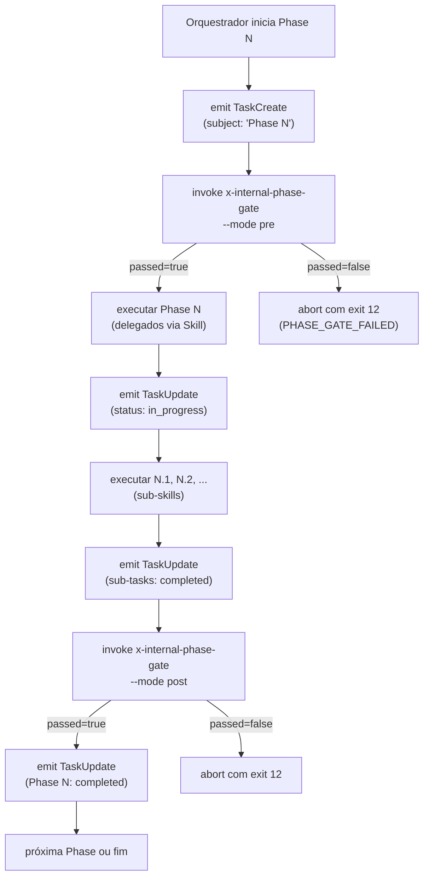

# História: Rule 25 + x-internal-phase-gate Skill + ADR

**ID:** story-0055-0001  
**Chave Jira:** —  
**Status:** Pendente

## 1. Dependências

| Blocked By | Blocks |
| :--- | :--- |
| — | story-0055-0002, story-0055-0003, story-0055-0004, story-0055-0005, story-0055-0006 |

## 2. Regras Transversais Aplicáveis

| ID | Título |
| :--- | :--- |
| REGRA-001 | Emissão obrigatória de `TaskCreate` por fase |
| REGRA-005 | Integração com Rule 24 (Execution Integrity) |

## 3. Descrição

Como **arquiteto de CI/CD**, eu quero estabelecer a infraestrutura normativa, contractual e técnica para **hierarquia de tasks com gates por fase**, garantindo que:

- Operadores vejam 4 níveis de granularidade durante execução (Epic › Story › Phase › Wave/Cycle)
- Phase gates bloqueiem transições até evidências completarem
- Enforcement funcione em 4 camadas (normativa, runtime, CI audit, observability)
- Backward compatibility seja mantida via Rule 19 durante deprecação

Esta story implementa os **alicerces** (Rule 25, skill de gate, ADR). As 11 stories subsequentes retrofit orquestradores consumindo estes alicerces.

### 3.1 Rule 25 — Task Hierarchy & Phase Gate Contract

Criar `.claude/rules/25-task-hierarchy.md` com:
- Invariantes (REGRA-001 a REGRA-005 da spec)
- Contrato de `subject` (regex hierárquico com `›` separator, máximo 4 níveis)
- Convention `activeForm` (gerúndio abreviado < 40 chars)
- Metadata convention (estrutura JSON para artefatos esperados)
- Audit contract (CI script `scripts/audit-task-hierarchy.sh`)

Especificação: seção 5 do `spec-task-granularity-phase-gates.md`.

### 3.2 `x-internal-phase-gate` Skill

Criar skill `x-internal-phase-gate` sob `java/src/main/resources/targets/claude/skills/internal/plan/x-internal-phase-gate/`:

**Metadados:**
- Visibility: `internal` (Rule 22)
- Model: `haiku` (RULE-023 utility tier)
- Allowed tools: `Read, Bash`

**Modos:**
- `--mode pre`: validação pré-fase (no orphaned tasks da fase anterior)
- `--mode post`: validação pós-fase (todas sub-tasks `completed`, artefatos em disco)
- `--mode wave`: pós-Batch-B de wave paralela (N tasks `completed`, N artefatos)
- `--mode final`: gate terminal (compõe com `x-internal-epic-integrity-gate`)

**Exit codes:**
- 0: `OK` (`passed=true`)
- 12: `PHASE_GATE_FAILED` (`passed=false`)
- 13: `PHASE_GATE_MALFORMED` (args inválidos)
- 14: `PHASE_GATE_TIMEOUT` (espera > 10s)

**Envelope JSON de saída:**
```json
{
  "passed": true|false,
  "mode": "pre|post|wave|final",
  "skill": "<skill-name>",
  "phase": "<Phase N>",
  "expectedTasks": [ids],
  "completedTasks": [ids],
  "missingTasks": [ids],
  "expectedArtifacts": ["paths"],
  "missingArtifacts": ["paths"],
  "wallclockMs": N,
  "timestamp": "ISO-8601"
}
```

Especificação: seção 6 do `spec-task-granularity-phase-gates.md`.

### 3.3 ADR-0013 — Task Hierarchy & Phase Gates

Criar `adr/ADR-0013-task-hierarchy-and-phase-gates.md` com:
- **Status:** Accepted
- **Decision:** Implementar 4 níveis de granularidade + phase gates em orquestradores
- **Context:** EPIC-0049 causou collapse em visibilidade; operador não vê fases
- **Consequences:** Maior overhead (< 2% esperado), maintenance de Rule 25 + skill novo, enforcement em 4 camadas
- **Alternatives Considered:** (a) Manter 1 nível (status quo); (b) 5+ níveis (overhead maior)
- **Related:** Rule 25, EPIC-0049, Rule 19

Especificação: seção 5 do ADR EPIC-0040 (ADR structure).

### 3.4 CLAUDE.md — Bloco "EXECUTION INTEGRITY"

Atualizar seção top-level de CLAUDE.md com sub-bloco "Task Hierarchy & Phase Gates":

```markdown
> **Concluded — EPIC-0055 (Task Hierarchy & Phase Gates Phase 1).**
> Introduz Rule 25 (hierarchical task tracking), skill x-internal-phase-gate, e 4 camadas de enforcement.
> Phase gates bloqueiam transições de fase até evidências completarem. Backward compatibility via Rule 19:
> campo `execution-state.json.taskTracking.enabled` (default false para legacy epics). Stories 0055-0003 a 0055-0010
> retrofit 8 orquestradores; stories 0055-0011 a 0055-0012 completam integration + migration.
> - Rule: `.claude/rules/25-task-hierarchy.md`
> - Skill: `/x-internal-phase-gate` (internal, haiku)
> - ADR: `adr/ADR-0013-task-hierarchy-and-phase-gates.md`
```

## 3.5 Entrega de Valor

- **Valor Principal:** Infraestrutura normativa e técnica que permite visibilidade de 4 níveis de granularidade de tasks durante execução de épicos. Operador consegue ver exatamente em qual fase (Planning, Task execution, Verify, etc) uma story travou e por quê.
- **Métrica de Sucesso:** Operador consegue ler lista de tasks em `x-epic-implement` mostrando "story-0061-0001 › Phase 1 › Arch plan (completed)" e "Phase 2 › Task execution › task-0061-0001-001 › Red cycle (in progress)".
- **Impacto no Negócio:** Reduz debugging time de epic failures de ~30min (hoje: grep logs) para < 2min (ler task list). Melhora confiabilidade ao fazer gates explícitos.

## 4. Definições de Qualidade Locais

### DoR Local

- [ ] `java/src/main/resources/targets/claude/skills/internal/plan/` existe (criado para EPIC-0036 taxonomy)
- [ ] Especificação em `spec-task-granularity-phase-gates.md` seções 5–6 está completa
- [ ] Decomposition guide confirma padrão de waves + loops (pattern 4.3/4.4 spec)

### DoD Local

- [ ] `.claude/rules/25-task-hierarchy.md` criada com 5 REGRAs completas
- [ ] `x-internal-phase-gate` SKILL.md com 4 modos, envelope JSON, exit codes documentados
- [ ] `x-internal-phase-gate` Bash implementation com cobertura ≥ 95% line / ≥ 90% branch
- [ ] `adr/ADR-0013-task-hierarchy-and-phase-gates.md` publicado
- [ ] CLAUDE.md atualizado com bloco "Concluded — EPIC-0055 Phase 1"
- [ ] 100% Gherkin scenarios passando em `x-internal-phase-gate` behavior test
- [ ] Zero compiler/linter warnings

### Global Definition of Done

- **Cobertura:** ≥ 95% line, ≥ 90% branch (Rule 05)
- **Testes Automatizados:** UT por modo (pre/post/wave/final), IT com fixture TaskList
- **Relatório:** Cobertura em `coverage/` após build
- **Documentação:** Regra + ADR + SKILL.md
- **Persistência:** Commits atômicos via Conventional Commits; atomic TDD
- **Performance:** Overhead < 2% (skill executa em < 100ms)

## 5. Contratos de Dados

### 5.1 TaskCreate Input (Rule 23 pattern)

```json
{
  "subject": "story-0055-0001 › Phase 1 › Rule 25 spec",
  "description": "Criar .claude/rules/25-task-hierarchy.md com...",
  "activeForm": "Creating Rule 25 task hierarchy specification",
  "metadata": {
    "phase": "Phase 1",
    "parentSkill": "x-epic-implement",
    "epicId": "EPIC-0055",
    "expectedArtifacts": [
      ".claude/rules/25-task-hierarchy.md",
      "adr/ADR-0013-task-hierarchy-and-phase-gates.md"
    ]
  }
}
```

### 5.2 Phase Gate POST Output (JSON Envelope)

```json
{
  "passed": true,
  "mode": "post",
  "skill": "x-epic-implement",
  "phase": "Phase 0",
  "expectedTasks": [1, 2],
  "completedTasks": [1, 2],
  "missingTasks": [],
  "expectedArtifacts": [
    ".claude/rules/25-task-hierarchy.md",
    "adr/ADR-0013-task-hierarchy-and-phase-gates.md"
  ],
  "missingArtifacts": [],
  "wallclockMs": 347,
  "timestamp": "2026-04-23T14:35:22Z"
}
```

### 5.3 Error Codes (x-internal-phase-gate)

| Exit | Nome | Condição | Mensagem |
| :--- | :--- | :--- | :--- |
| 12 | `PHASE_GATE_FAILED` | `passed=false` | "Phase gate failed: missing tasks [N] or artifacts [files]" |
| 13 | `PHASE_GATE_MALFORMED` | args inválidos | "Malformed gate invocation: --mode wave requires --expected-tasks" |
| 14 | `PHASE_GATE_TIMEOUT` | espera > timeout | "Phase gate timeout: task N still in progress after 10s" |

## 6. Diagramas

### 6.1 Phase Gate Workflow (PRE/POST/WAVE)



## 7. Critérios de Aceite (Gherkin)

```gherkin
Funcionalidade: x-internal-phase-gate

Cenário: PRE gate com fase anterior limpa
  DADO que execution-state.json.taskTracking.enabled = true
  E que Phase N-1 tem status = completed
  QUANDO invoco x-internal-phase-gate --mode pre --phase N
  ENTÃO o exit code é 0 (OK)
  E o JSON contém "passed": true

Cenário: PRE gate com fase anterior pendente
  DADO que Phase N-1 tem status = in_progress
  QUANDO invoco x-internal-phase-gate --mode pre --phase N
  ENTÃO o exit code é 12 (PHASE_GATE_FAILED)
  E o JSON contém "missingTasks": [id-da-fase-anterior]

Cenário: POST gate com todos os artefatos
  DADO que todas as N sub-tasks têm status = completed
  E que todos os artefatos em --expected-artifacts existem em disco
  QUANDO invoco x-internal-phase-gate --mode post --expected-artifacts [files]
  ENTÃO o exit code é 0
  E "passed": true

Cenário: POST gate com artefatos faltando
  DADO que faltam 2 dos 6 artefatos esperados
  QUANDO invoco x-internal-phase-gate --mode post --expected-artifacts [files]
  ENTÃO o exit code é 12
  E "missingArtifacts" contém os 2 arquivos faltando

Cenário: WAVE gate pós Batch B
  DADO que executei Batch A com 5 TaskCreate (arch, impl, test, tasks, sec)
  E que executei Batch B com 5 TaskUpdate(status: completed)
  QUANDO invoco x-internal-phase-gate --mode wave --expected-tasks [1,2,3,4,5]
  ENTÃO o exit code é 0
  E "completedTasks": [1,2,3,4,5]

Cenário: Invocação malformada
  DADO que invoco --mode wave sem --expected-tasks
  QUANDO o skill valida argumentos
  ENTÃO o exit code é 13 (PHASE_GATE_MALFORMED)
```

## 8. Subtarefas

### Subtarefa [Dev] — Rule 25 specification

- Implementar `.claude/rules/25-task-hierarchy.md` com seções:
  - Scope (8 orchestrators)
  - Invariantes (REGRA-001 a REGRA-005)
  - Contract de `subject` (regex, exemplos válidos/inválidos)
  - Convention `activeForm` e `metadata`
  - Audit contract

### Subtarefa [Dev] — x-internal-phase-gate skill implementation

- Criar SKILL.md com frontmatter + body (seção 6.2–6.4 spec)
- Implementar Bash com modos pre/post/wave/final
- Implementar JSON envelope output
- Exit codes 0, 12, 13, 14
- Integração com TaskList API (CLI-side)
- Fail-open: ausência de TaskList não aborta

### Subtarefa [Dev] — ADR-0013 publicação

- Criar `adr/ADR-0013-task-hierarchy-and-phase-gates.md`
- Decisão, contexto, consequências, alternativas

### Subtarefa [Test] — Smoke/Unit tests

- Teste por modo (4 mode tests)
- Teste com fixture TaskList JSON (simulate CLI state)
- Teste de envelope JSON shape
- Teste de exit codes
- Cobertura ≥ 95%

### Subtarefa [Doc] — CLAUDE.md atualização

- Adicionar bloco "Concluded — EPIC-0055 Phase 1"
- Referenciar Rule 25, ADR-0013, skill x-internal-phase-gate

---

**Data de criação:** 2026-04-23  
**Estimativa:** 12–16 horas (regra + skill + ADR + testes)
