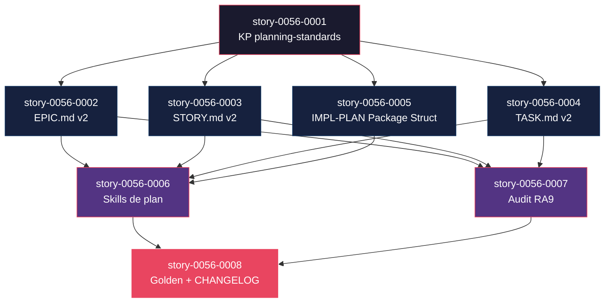

# Mapa de Implementação — EPIC-0056 · RA9 Standardized Planning Templates

**Gerado a partir das dependências BlockedBy/Blocks de cada história do epic-0056.**

---

## 1. Matriz de Dependências

| Story | Título | Chave Jira | Blocked By | Blocks | Status |
| :--- | :--- | :--- | :--- | :--- | :--- |
| story-0056-0001 | KP `planning-standards-kp` | — | — | 0002, 0003, 0004, 0005 | Pendente |
| story-0056-0002 | `_TEMPLATE-EPIC.md` v2 | — | 0001 | 0006, 0007 | Pendente |
| story-0056-0003 | `_TEMPLATE-STORY.md` v2 | — | 0001 | 0006, 0007 | Pendente |
| story-0056-0004 | `_TEMPLATE-TASK.md` v2 | — | 0001 | 0006, 0007 | Pendente |
| story-0056-0005 | `_TEMPLATE-IMPLEMENTATION-PLAN.md` ganha Package Structure | — | 0001 | 0006 | Pendente |
| story-0056-0006 | Atualizar skills de plan | — | 0002, 0003, 0004, 0005 | 0008 | Pendente |
| story-0056-0007 | Estender LifecycleIntegrityAuditTest | — | 0002, 0003, 0004 | 0008 | Pendente |
| story-0056-0008 | Regenerar golden files + CHANGELOG | — | 0006, 0007 | — | Pendente |

> **Valores de Status:** `Pendente` (padrão) · `Em Andamento` · `Concluída` · `Falha` · `Bloqueada` · `Parcial`

> **Nota:** Dependência implícita entre 0006 (skills) e 0007 (audit) existe funcionalmente (skills emitem RA9 antes do audit validar), mas o audit é independente: se 0007 mergear antes de 0006, ele valida artefatos legados via baseline sem falhar. Por isso 0008 depende de ambos (precisa skills E audit prontos).

---

## 2. Fases de Implementação

```
╔══════════════════════════════════════════════════════════════════════════╗
║                   FASE 0 — Fundação (serial)                           ║
║                                                                        ║
║   ┌────────────────────────────────────────────────────────────┐       ║
║   │  story-0056-0001  KP planning-standards-kp                 │       ║
║   │  (gargalo — bloqueia 4 stories downstream)                 │       ║
║   └──────────────────────────────┬─────────────────────────────┘       ║
╚═══════════════════════════════════╪═══════════════════════════════════════╝
                                    │
                                    ▼
╔══════════════════════════════════════════════════════════════════════════╗
║                   FASE 1 — Templates (paralelo x4)                     ║
║                                                                        ║
║   ┌─────────────┐  ┌─────────────┐  ┌─────────────┐  ┌─────────────┐  ║
║   │  0056-0002  │  │  0056-0003  │  │  0056-0004  │  │  0056-0005  │  ║
║   │ EPIC.md v2  │  │ STORY.md v2 │  │ TASK.md v2  │  │ IMPL-PLAN   │  ║
║   └──────┬──────┘  └──────┬──────┘  └──────┬──────┘  └──────┬──────┘  ║
╚══════════╪═════════════════╪═════════════════╪════════════════╪════════╝
           └─────────────────┴─────────┬───────┴────────────────┘
                                       │ (0005 não bloqueia 0007)
                                       ▼
╔══════════════════════════════════════════════════════════════════════════╗
║                   FASE 2 — Consumo (paralelo x2)                       ║
║                                                                        ║
║   ┌─────────────────────────────┐  ┌─────────────────────────────┐    ║
║   │  0056-0006  Skills de plan  │  │  0056-0007  Audit RA9       │    ║
║   │  (consome templates v2)     │  │  (valida templates v2)      │    ║
║   └──────────────┬──────────────┘  └──────────────┬──────────────┘    ║
╚══════════════════╪═════════════════════════════════╪═══════════════════╝
                   └─────────────────┬───────────────┘
                                     ▼
╔══════════════════════════════════════════════════════════════════════════╗
║                   FASE 3 — Baseline (serial)                           ║
║                                                                        ║
║   ┌────────────────────────────────────────────────────────────┐       ║
║   │  story-0056-0008  Regenerar golden + CHANGELOG             │       ║
║   └────────────────────────────────────────────────────────────┘       ║
╚══════════════════════════════════════════════════════════════════════════╝
```

---

## 3. Caminho Crítico

```
story-0056-0001 → story-0056-0002 → story-0056-0006 → story-0056-0008
    Fase 0           Fase 1            Fase 2             Fase 3
```

**4 fases no caminho crítico, 4 histórias na cadeia mais longa (0001 → 0002 → 0006 → 0008).**

Alternativas equivalentes na Fase 1: 0001 → 0003 → 0006 → 0008 ou 0001 → 0004 → 0006 → 0008 (mesma profundidade). Qualquer atraso em 0001 se propaga para todas as demais fases — 0001 é o ponto de maior impacto no cronograma.

---

## 4. Grafo de Dependências (Mermaid)



---

## 5. Resumo por Fase

| Fase | Histórias | Camada | Paralelismo | Pré-requisito |
| :--- | :--- | :--- | :--- | :--- |
| 0 | story-0056-0001 | Foundation (KP) | 1 | — |
| 1 | 0056-0002, 0056-0003, 0056-0004, 0056-0005 | Templates (Doc) | 4 paralelas | Fase 0 concluída |
| 2 | 0056-0006, 0056-0007 | Consumo (Skills + Audit) | 2 paralelas | Fase 1 concluída |
| 3 | 0056-0008 | Baseline (Golden + CHANGELOG) | 1 | Fase 2 concluída |

**Total: 8 histórias em 4 fases.**

> **Nota:** Fase 1 tem o maior paralelismo (4 stories). Como cada uma toca um template distinto, o file footprint (seção 9 de cada story) não tem colisões hard — `/x-parallel-eval` deve retornar 0 conflitos. Fase 2 tem paralelismo x2 também sem colisões.

---

## 6. Detalhamento por Fase

### Fase 0 — Fundação

| Story | Escopo Principal | Artefatos Chave |
| :--- | :--- | :--- |
| story-0056-0001 | KP fonte-da-verdade das 9 seções RA9 | `skills/plan/planning-standards-kp/SKILL.md` |

**Entregas da Fase 0:**
- KP publicado em `.claude/skills/` após `ia-dev-env generate`
- Contrato RA9 referenciável via `@planning-standards-kp`

### Fase 1 — Templates

| Story | Escopo Principal | Artefatos Chave |
| :--- | :--- | :--- |
| story-0056-0002 | `_TEMPLATE-EPIC.md` v2 | `shared/templates/_TEMPLATE-EPIC.md` |
| story-0056-0003 | `_TEMPLATE-STORY.md` v2 | `shared/templates/_TEMPLATE-STORY.md` |
| story-0056-0004 | `_TEMPLATE-TASK.md` v2 | `shared/templates/_TEMPLATE-TASK.md` |
| story-0056-0005 | `_TEMPLATE-IMPLEMENTATION-PLAN.md` + Package Structure | `shared/templates/_TEMPLATE-IMPLEMENTATION-PLAN.md` |

**Entregas da Fase 1:**
- 3 templates reescritos (substituição direta)
- 1 template estendido com seção Package Structure
- Testes estruturais validando presença das 9 seções

### Fase 2 — Consumo

| Story | Escopo Principal | Artefatos Chave |
| :--- | :--- | :--- |
| story-0056-0006 | Atualizar 4 skills de plan | `x-epic-create`, `x-epic-decompose`, `x-story-plan`, `x-task-plan` SKILL.md |
| story-0056-0007 | Extender audit CI | `LifecycleIntegrityAuditTest.java` + 3 checkers + baseline |

**Entregas da Fase 2:**
- Skills de plan emitem artefatos RA9 transparentemente
- CI bloqueia regressões via 3 novas regras de audit
- Smoke test end-to-end `/x-epic-decompose` gera 9 seções

### Fase 3 — Baseline

| Story | Escopo Principal | Artefatos Chave |
| :--- | :--- | :--- |
| story-0056-0008 | Regenerar golden + CHANGELOG | `src/test/resources/golden/**`, `CHANGELOG.md` |

**Entregas da Fase 3:**
- Golden files alinhados com templates v2
- CHANGELOG documenta a migração RA9
- `mvn test` verde

---

## 7. Observações Estratégicas

### Gargalo Principal

**story-0056-0001** (KP `planning-standards-kp`) é o maior gargalo — bloqueia 4 stories downstream (0002, 0003, 0004, 0005) e indiretamente as outras 3. Investir tempo extra garantindo que o contrato RA9 está correto antes do merge evita retrabalho em cascata. Recomendação: pair-review do KP antes do merge; evitar "quick fixes" posteriores que exigiriam atualização em todos os 4 templates.

### Histórias Folha (sem dependentes)

- **story-0056-0008** (golden + CHANGELOG) — última no caminho. Atrasos aqui não bloqueiam nada do épico (mas atrasam o merge final para develop).

### Otimização de Tempo

- **Paralelismo máximo**: Fase 1 (4 stories simultâneas) — cada uma toca template distinto, sem colisão de file footprint.
- **Começar imediatamente**: story-0056-0001 é o único ponto de entrada.
- **Alocação**: 1 dev faz 0001 (crítico), depois 2-4 devs podem paralelizar Fase 1, depois 2 devs em Fase 2.

### Dependências Cruzadas

- Stories 0002-0005 (Fase 1) convergem em 0006 (Fase 2, skills) — ponto de convergência principal.
- Stories 0002-0004 também convergem em 0007 (Fase 2, audit) — 0005 não bloqueia 0007 porque IMPL-PLAN não é validado pelas novas regras RA9 (ele é "referência técnica", não plan RA9).

### Marco de Validação Arquitetural

**story-0056-0006** (skills de plan) é o marco de validação. Quando ela mergear, o smoke test `/x-epic-decompose` sobre spec sintética deve produzir 9 seções coerentes em todos os 3 níveis. Se isso falhar, os templates v2 ou o KP têm gap — revisar Fase 1 antes de prosseguir para 0007/0008.

---

## 8. Dependências entre Tasks (Cross-Story)

### 8.1 Dependências Cross-Story entre Tasks

Principais dependências cruzadas entre tasks (task de uma story depende de task de outra):

| Task | Depends On | Story Source | Story Target | Tipo |
| :--- | :--- | :--- | :--- | :--- |
| TASK-0056-0002-002 (placeholders EPIC) | TASK-0056-0001-002 (KP conteúdo) | story-0056-0002 | story-0056-0001 | interface (contrato de placeholders) |
| TASK-0056-0003-002 (placeholders STORY) | TASK-0056-0001-002 (KP conteúdo) | story-0056-0003 | story-0056-0001 | interface |
| TASK-0056-0004-002 (regex rationale) | TASK-0056-0001-002 (KP conteúdo) | story-0056-0004 | story-0056-0001 | interface |
| TASK-0056-0006-001 (x-epic-create update) | TASK-0056-0002-002 (placeholders EPIC) | story-0056-0006 | story-0056-0002 | data (skill consome placeholders) |
| TASK-0056-0006-002 (x-epic-decompose update) | TASK-0056-0003-002 (placeholders STORY) | story-0056-0006 | story-0056-0003 | data |
| TASK-0056-0007-002 (RATIONALE checker) | TASK-0056-0004-002 (regex task rationale) | story-0056-0007 | story-0056-0004 | data (regex compartilhada) |
| TASK-0056-0008-001 (regen goldens) | TASK-0056-0006-004 (smoke decompose RA9) | story-0056-0008 | story-0056-0006 | schema (output shape dos skills) |

> **Validação RULE-012**: as 7 dependências cruzadas de tasks são consistentes com as 13 dependências declaradas entre stories. Nenhuma task depende de task de story fora do seu cone de predecessoras.

### 8.2 Ordem de Merge (Topological Sort — amostra)

| Ordem | Task ID | Story | Parallelizável Com | Fase |
| :--- | :--- | :--- | :--- | :--- |
| 1 | TASK-0056-0001-001 | 0001 | — | 0 |
| 2 | TASK-0056-0001-002 | 0001 | — | 0 |
| 3 | TASK-0056-0001-003 | 0001 | — | 0 |
| 4 | TASK-0056-0001-004 | 0001 | — | 0 |
| 5 | TASK-0056-0002-001 | 0002 | 0003-001, 0004-001, 0005-001 | 1 |
| 5 | TASK-0056-0003-001 | 0003 | 0002-001, 0004-001, 0005-001 | 1 |
| 5 | TASK-0056-0004-001 | 0004 | 0002-001, 0003-001, 0005-001 | 1 |
| 5 | TASK-0056-0005-001 | 0005 | 0002-001, 0003-001, 0004-001 | 1 |
| ... | ... | ... | ... | ... |

**Total: ~32 tasks distribuídas em 4 fases.** (amostra mostrada; ordem completa computada em runtime por `x-epic-implement`)

---

## 8.5 Restrições de Paralelismo

> Análise preliminar baseada no file footprint declarado em cada story. A análise definitiva será produzida por `/x-parallel-eval --scope=epic 0056` na fase de execução.

**Conflitos detectados (preliminar):** 0 hard, 0 regen, 0 soft

### 8.5.1 Pares Serializados Dentro da Fase

Nenhum par precisa de serialização. Cada story da Fase 1 toca um template distinto; cada story da Fase 2 toca arquivos distintos (skills vs audit).

### 8.5.2 Recomendação de Reagrupamento

Não necessário — paralelismo máximo preservado em cada fase.

---

## 9. Observações Finais

- O épico segue o padrão "foundation → extensions → integration → baseline" da Decomposição (Layer 0 a Layer 4 do decomposition-guide).
- Story 0001 é Layer 0 (foundation), 0002-0005 são Layer 2 (extensions do contrato), 0006-0007 são Layer 3 (integrations), 0008 é Layer 4 (cross-cutting / baseline).
- Ao todo: **8 histórias · 4 fases · ~32 tasks · caminho crítico de 4 stories**.
